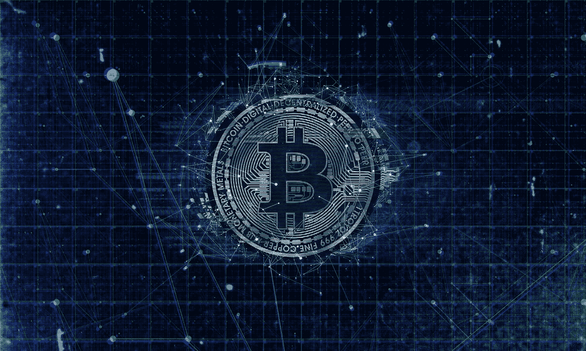

# 基于区块链的供应链背后的技术:它实际上做什么？

> 原文：<https://medium.com/hackernoon/the-technology-behind-blockchain-based-supply-chain-what-does-it-actually-do-3804f23c7387>

Image: [Pixabay](https://pixabay.com/illustrations/bitcoin-blockchain-currency-3396302/)

在 1991 年，Stuart Haber 和 W. Scott Stronetta [首次将密码](https://www.anf.es/pdf/Haber_Stornetta.pdf)描述为块的安全链。在这一领域的深入研究之后，他们希望创建一个可以给文档加时间戳且不能被篡改的系统。

第一个概念化的区块链是由一个叫中本聪的人在 2008 年推出的，他使用一种类似于 Hashcash 的方法改进了系统[，并在第二年实现了第一个加密货币比特币。](https://bitcoin.org/bitcoin.pdf)

由于没有人知道这个神秘人物的任何事情，Satoshi 身份的不确定性已经产生了一系列的[比特币阴谋](https://dailyiconews.com/category/crypto-skepticism-of-the-week/)，例如 4 个值得注意的亚洲科技巨头明确三星、东芝、中道和摩托罗拉创造了比特币，它可能是美国情报机构和许多其他机构的项目。

现在，区块链比特币背后的技术正被许多行业广泛接受，作为一个平台来增强公司各种内部和外部功能的现有运营模式。

下一代区块链技术正被用作人工智能、电子政务、预测分析、安全和物联网的平台。供应链是区块链技术被各行各业部署和接受的领域之一。

几乎所有世界领先的公司都在使用供应链管理和企业资源规划软件。尽管投资巨大，但大多数公司对其所有产品在给定时间点的位置只有有限的了解。

供应链生态系统中的模拟差距是大多数情况下的罪魁祸首。生产可能会在制造点以数字形式记录，但一旦产品移出，商品的可见性和跟踪就会受到数字工具的限制，如为跟踪商品而创建的 RFID 和 PDF 文档。

目前的系统在 30 年前非常适用，但在今天却不那么适用。在比特币和区块链技术出现之前，只有通过中间人才能创建一个真实的数据集，让大量实体能够达成一致。

区块链技术使生态系统中的大量合作伙伴公司能够共享关键信息并达成一致，而无需使用中间人。

网络上的所有数据和交易可以通过区块链同步，而不是有一个中央中介，所有参与者都可以验证其他人的计算和工作。

区块链的[逻辑应用于供应链。区块链的安全性和冗余性应用于库存等方面，用银行节点取代供应链合作伙伴，将为使用区块链的全新供应链管理方式奠定基础。](https://blockgeeks.com/guides/what-is-blockchain-technology/)

从核心上来说，区块链技术意味着，在同一给定时间点，一件库存不能有两个位置，一旦产品从中心位置转移，生态系统中每个人的货物交易状态将在几分钟内更新为“在途”，并可完全追溯到原点。

尽管这是一项新技术，但大公司已经在尝试部署由区块链支持的供应链管理系统。

星巴克将使用由 Azure 区块链服务提供支持的分布式账本技术系统，以获得关于其供应链的“数字时间可追溯性”。

食品和饮料巨头百事公司最近进行了一项名为“[项目质子](/cryptolinks/project-proton-to-conquer-digital-advertisement-on-the-zilliqa-blockchain-894701d0d1eb)的试验，以测试区块链供电的供应链管理系统如何提高他们的效率，并毫不意外地发现该系统将供应链效率提高了 28%。

**支持区块链的供应链的力量**

通过区块链，企业可以从生态系统的所有参与者那里获得跨所有节点的交易和商品流动的实时数字账本。但仅此而已——区块链的好处是变革性的，让企业从各个方面节省更多的时间、金钱和精力。

**1。采购过程中更高的可见性和更多的节约**

企业根据他们产生的总购买量协商采购折扣。在由各种供应商、子公司和内部职能推动的业务中，跟踪公司的业务量变得很困难。

区块链通过不断更新由生态系统中所有合作伙伴的数据组成的数字账本使这一点变得简单。这提供了查看总交易量的能力，而不管谁在生态系统中进行了这些购买。

如果没有区块链，公司将需要雇佣多名审计员来记录通过人工订单的采购量。

**2。更好的数据和分析**

[供应链](https://www.investopedia.com/terms/s/supplychain.asp)是一个连续的过程，包括多个数据生成节点。为了了解不同地点有多少产品或材料，在一段时间内产生了多少需求，公司必须通过部署人员和技术来解决这些问题。

在技术行业，考虑到资本成本和技术产品的快速折旧，保持每年价值 1 美元的库存的成本估计约为 20 美分至 40 美分。

通过区块链，该系统获得了在生态系统级别跟踪和管理资源的能力，提供了更好的预测，并且不需要保持更少的库存来维持相同的服务级别。

**3。数字合同和支付**

根据各种研究，在财富 100 强公司中，完成一项实地交付产品的任务后，平均需要 60 天才能获得报酬。

虽然这些付款受合同管辖，其中大多数合同明确规定付款将在服务交付后 30 天内结清，但获得付款需要两倍的时间。

合同和现实之间的差距就是因为“模拟差距”而产生的。也就是说，工作完成后，发票生成流程、通过电子邮件发送给客户、客户端支付流程(包括服务交付的验证)会花费大量不必要的时间，而使用区块链生态系统可以缩短这些时间。

**4。阻止流氓**

区块链创建了一个生态系统，所有参与者都有完全相同的账本系列，以创建一个共享的真理，而没有一个全能的中央中介。

每个[分类账](https://www.investopedia.com/terms/d/distributed-ledgers.asp)都包含了生态系统中所有交易和库存移动的信息。如果任何参与者试图通过更改分类帐中的条目来欺骗系统，那么只能用他们分类帐中的条目来操纵系统。这将使他们的账户与其他人的账户不同步，这是对不良行为的强大威慑。