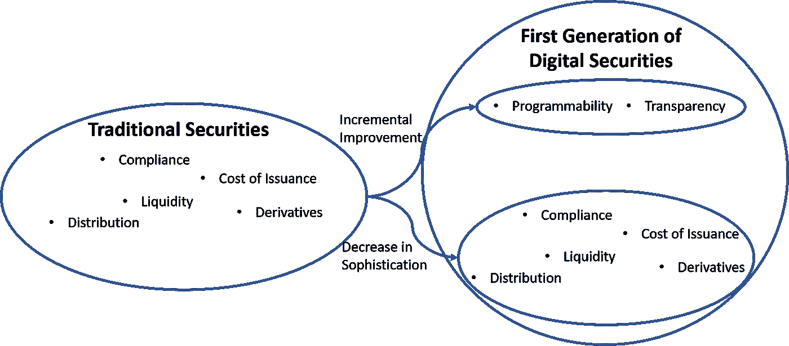

# 边际改进理论和安全令牌

> 原文：<https://medium.com/hackernoon/the-theory-of-marginal-improvements-and-security-tokens-4f61a1312491>

几周前，我花了一些时间与几位非常聪明的华尔街高管讨论区块链和安全令牌的世界。这群才华横溢的人对数字证券进行了非常彻底的研究和实验，并在短期内对该领域产生了务实的怀疑态度。虽然他们相信令牌化作为所有权程序化转移机制的承诺，但他们还看不到数字证券短期内面临的许多金融、技术和监管挑战的明确解决方案。从他们的角度来看，当前一代的数字证券并没有提供明显优于传统证券的优势。在安全令牌纯粹主义者被这种说法激怒之前，请记住，我们谈论的是超级聪明、善于分析的人的短期观点，这些人以构建通常价值数十亿美元的高度复杂的证券产品为生。

> 为了解决他们的担忧，我使用了我在技术运动中最喜欢的经济理论之一:边际改进理论。

毫无疑问，安全令牌是技术和金融市场中最有前途的趋势之一，但也面临着巨大的技术和监管挑战。在当前的监管环境下，流动性或部分所有权等许多证券承诺根本不切实际。

与传统证券相比，数字证券的发行并不便宜，维护也不简单，而且监管领域的创新步伐可能会很慢。除了少数例外，数字证券领域的大多数平台缺乏技术严谨性或金融复杂性，无法在更大的金融生态系统中占据一席之地。这些是简单的事实，而不是批评，忽略它们是您在安全令牌空间中可以找到的最明显的错觉。

通过分析最近的技术发展，可以找到应对这些挑战的可能途径。

# 将边际改进理论应用于数字证券

研究技术运动的历史是理解现在和有效预测未来的一个很好的方法，安全令牌也不例外。安全令牌面临的挑战肯定是独特的，但宏观环境肯定不是。

最近的许多变革性技术运动在某种程度上被认为比它们的前辈更糟糕。这是一个我喜欢称之为边际改进理论的现象。

技术运动边际改进理论的核心原则是，突破性技术趋势的第一阶段与之前的技术趋势相比，几乎在每个方面都更差，除了少数几个特征。对这些微小的改进进行充分的迭代最终会释放空间的价值。

为了说明边际改进的理论，让我们用一些最近技术发展的例子。在智能手机时代的早期，你可以说智能手机几乎在每个方面(电池寿命、屏幕尺寸、应用程序)都不如个人电脑，但它们在两个微小的领域改善了个人电脑:摄像头和 GPS。

这两个功能开启了移动应用经济，并创造了超过 PC 几个数量级的采用水平。在大数据运动的情况下，Hadoop 等新兴技术被认为在几乎所有方面都比关系数据库差，只有一点除外:它们能够在大型非结构化数据集上执行可扩展的计算。这个单一的特征使整个空间变得相关。同样，第一代云基础架构被认为比其内部部署的同类产品更差，除了它们的管理和弹性可扩展性能力，这是开启整个云革命的两个方面。

当前的技术趋势，如区块链、人工智能或虚拟现实，正在与自己版本的边际改进理论进行斗争。

推断安全令牌的边际改进理论，我们应该接受安全令牌将被认为比传统证券差，除了少数功能，我们应该不懈地关注这些功能，以释放空间的真正潜力。将边际改进理论应用于安全令牌的一个推论告诉我们，在不久的将来，关注除了那几个功能之外的任何东西都可能导致徒劳的努力。

但是与传统证券相比，数字证券提供的边际改进是什么。在我看来，有两个明显的赢家:

**可编程性:**嵌入可编程逻辑作为安全智能合约一部分的能力。

**透明:**利用区块链记录，实现数字证券更高级别的合规性和可见性。

认识到可编程性和透明性代表着对传统证券的关键增量改进，下一步是找出如何在下一代安全令牌平台中最大限度地发挥其潜力。

# 释放安全令牌的增量改进

可编程性和透明性似乎是激励从传统证券向数字证券过渡的关键支柱。按照数字证券边际改进的理论，可以采取一些战术步骤来最大限度地发挥这两个领域的潜力。

## 可编程序性

没有程序员就没有可编程性，因此释放可编程性价值的部分挑战依赖于最大化开发人员社区的参与。在这方面，以下几个策略步骤可能会有所帮助:

a) **开源发行版:**开源数字证券的协议和基础架构构建模块对于在该领域培养开发者社区至关重要。

b) **开发者社区:**开源协议只能到此为止。围绕这些协议培养一个开发人员社区是一项巨大的努力，但这是在这个领域中围绕可编程性进行创新所必需的。

c) **更好的工具和语言:**发行安全令牌不应该需要手写智能合同。与主流语言如 JavaScript、领域特定语言或更好的工具的集成将简化数字证券在开发人员社区中的采用。

## 透明度

透明性是数字证券的明显优势之一，不知何故，价值主张几乎隐藏在安全令牌生命周期其他方面的复杂性背后。在数字证券的背景下，透明度可以以多种不同的方式实现，有几种关键的战术策略可以用来释放其潜力。

a) **披露工具集:**鼓励披露与数字证券相关的信息是该领域透明度的最大体现之一。虽然我们可能离健壮的披露协议还很远，但是这个领域的一些基本工具可能会受到欢迎。

b) **分析:**安全令牌的每一笔交易在区块链中都有记录。这个简单的因素实现了传统证券根本不可能实现的分析水平。安全令牌的强大分析层是一个相对简单的开发，可以对该领域产生深远的影响。

c) **发行后工具:**强大的发行后工具支持诸如资本表管理、股息分配、证券再发行等功能，这是透明度的另一种简单表达，有助于降低成本并简化数字证券的采用。

与传统模式相比，这些是可以帮助最大化数字证券改进的增量领域的影响的一些元素。根据技术市场的历史，对可编程性和透明性的不懈关注可能会为最终释放该领域真正潜力的第一代安全令牌平台带来最大的红利。