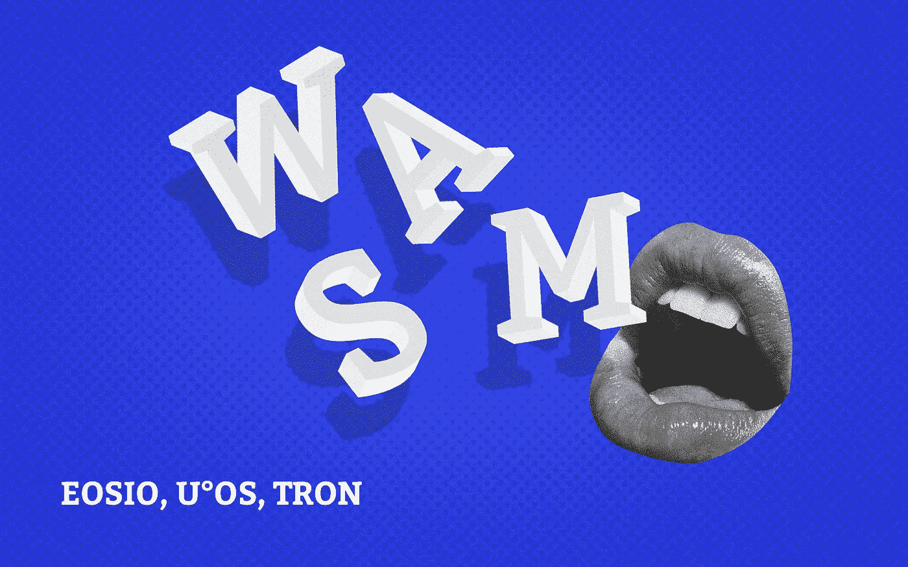

# 分布式篮子里的三个鸡蛋:Wasm、区块链和声誉

> 原文：<https://medium.com/hackernoon/the-three-eggs-in-a-distributed-basket-wasm-blockchain-and-reputation-296892cdd77c>

有暗流正在形成，在不久的将来将汇聚成一股采纳、创新和改变我们在线运营方式的洪流。这种改变会感觉很微妙，因为它会以一种自然的方式发生；但这仍然是最基本的。

用正确的眼光，你可以看到今天的暗流。分别是 WebAssembly、区块链、口碑。

**网络组装**

WebAssembly(或 Wasm)是一种标准，旨在成为编程语言的编译目标和二进制格式，目标是为 web 应用程序提供接近本机的性能。

当您认为 Wasm 是编程语言的编译目标时，可以把它想象成所有开发人员的共同聚集地。Wasm 正朝着这个方向快速前进。GitHub 上有一个[整理的编译成 Wasm 的语言列表](https://github.com/appcypher/awesome-wasm-langs)——这个进步不容小觑。

Wasm 是一种旨在为 web 应用程序提供接近本机性能的格式，这意味着无论何时您上网在您的 web 浏览器中运行应用程序，大多数应用程序都有可能在不久的将来采用 Wasm。对于在线游戏来说尤其如此，因为它需要最大数量的依赖于你的输入和表现的互动。

当你在浏览器中运行应用程序时，浏览器会从服务器下载应用程序的代码，并将其加载到浏览器的虚拟机中，这是你与应用程序进行交互的地方。这也意味着你的浏览器的虚拟机必须能够加载和运行 Wasm。

事情是这样的——Wasm 得到了 Mozilla、微软、谷歌和苹果的支持和贡献。

如前所述，许多编程语言已经编译成 Wasm，而且这个列表还在增加。开发人员社区中有很多 Wasm 支持。

**区块链**

因此，您的浏览器将 Wasm 代码加载到其虚拟机中并运行它。你知道那还有什么作用吗？以太坊这样的去中心化世界计算机。

以太坊有运行代码的以太坊虚拟机(EVM)。为了编译成 EVM 能够理解和执行的代码，开发者需要编写可靠的 dapp。还有一种叫做 LLL 的语言，它不太流行，还有维普语，但 Solidity 是最常用的语言。

这给开发人员的采用造成了瓶颈。开发人员在编码和启动 dapp 之前，需要熟悉 Solidity。

以太坊中有一项名为 eWasm 的计划，旨在用 eWasm 虚拟机取代当前的 EVM。eWasm 基本上是 Wasm，与当前的 EVM 架构相比，它提供了更好的性能。不仅如此，在以太坊中采用 Wasm 将为开发人员的采用打开闸门，因为任何开发人员都可以用他们熟悉的任何语言编写 dapp，并编译成 dapp。

引用 eWasm 核心开发人员之一 Lane Rettig 的话:

> 我有一个个人目标，让一百万或数百万开发人员构建以太坊智能合约… Wasm 是向前迈出的重要一步，它极大地增加了开发人员的可选性，他们可以使用不同的语言、不同的编译器进行开发，他们可以开发自己的语言、自己的 DSLs 特定领域语言]，这些在今天的以太坊 1.0 中都是不可能的。

虽然以太坊有一个 EVM，但其他基础设施项目——即不仅仅针对加密货币的区块链协议——也都有一个虚拟机。像 [EOS](https://eos.io/) 、 [Tron](https://tron.network/) 、 [U OS](https://uos.network/) 这样的项目。

EOS 的虚拟机原生理解 Wasm。U OS 理解 Wasm 本身。Tron 计划今年迁移到 Wasm——由于 Tron 的共识算法，到基于 Wasm 的虚拟机的网络升级将相对容易。eWasm 是否能进入以太坊主网还有待观察，但它肯定会进入以太坊主网。

所以，重申一下，考虑一下这个:

*   Wasm 得到了软件和互联网主要参与者——Mozilla、微软、谷歌和苹果的支持。
*   数百万熟悉自己语言的开发人员将能够编译成基于 Wasm 的虚拟机。
*   Wasm 正在成为大多数语言的共同交汇点。

**名声**

Wasm 正在成为人们如何在这个巨大的数字空间中开发应用程序并与之交互的技术支柱，这也将依赖于区块链。

人们在互动中使用依赖的技术，社交层——尤其是分散的声誉——必须在采用中发挥重要作用。在区块链和 Wasm 上运行的 dapp 提供了执行透明性、去中心化和信任，但是人们创建 dapp，人们使用 dapp，这是声誉最重要的地方。

网络成员必须能够基于他们对网络的贡献来使用他们的分散透明影响分数。这将使网络健康不仅在 dapp 开发者和 dapp 消费者上运行，而且在每个网络成员上运行，并使网络自治和自我管理。

随着 Wasm 的采用，像 [U OS](https://uos.network/) 和 [U Community](https://u.community/) 这样的项目正在填补这个空白。

时间会证明三股暗流——web assembly、区块链和声誉——是否会汇聚。但他们应该这样做才说得通。