# 顶级大数据咨询公司

> 原文：<https://medium.com/hackernoon/the-top-big-data-consulting-firms-ab1f25d09163>

## 得益于大数据，如今组织可以从无序的数据集中快速获取必要的信息，并有效地部署这些信息。[大数据分析的日益普及](https://www.forbes.com/sites/louiscolumbus/2018/12/23/big-data-analytics-adoption-soared-in-the-enterprise-in-2018)导致提供大数据解决方案和相关服务的公司数量大幅增加。

今天，在全球市场上有[近 1000 家大数据分析公司](https://www.goodfirms.co/big-data-analytics)，这个数字可能非常令人困惑。不同供应商的大数据技能、经验和相关技术专业知识可能会有很大差异，这可能会困扰任何寻找大数据服务提供商的人。

# 如何识别最好的大数据咨询公司

我给自己设定的目标是确定当今 IT 市场上最可靠的大数据咨询公司。为此，我调查了数百家数据提供商，研究了他们的特点。每家公司都根据一套专门设计的标准进行分析。这些标准包括大数据专业知识、主要客户、产品战略、跟踪记录和在线评论。下面你可以看到市场调查的结果。

## [**1。itransion**](https://www.itransition.com/solutions/big-data-consulting)

Itransition 成立于 1998 年，是一家提供大数据咨询和平台工程服务的定制软件开发公司。该公司还提供商业智能(BI)门户开发，并通过机器学习(ML)和其他技术来推动它们。该公司提供数据存储设计、数据迁移、性能优化和支持服务。

该公司的客户群包括 IBM、Expedia、丰田、易贝、施乐、PayPal 和阿迪达斯。该公司在全球拥有 150 多个已完成的项目和 810 个客户，被 IAOP 评为全球外包 100 强之一。

总部:科罗拉多州丹佛

核心客户: Expedia、施乐、丰田、易贝、IBM、PayPal、阿迪达斯

**每小时工资:** $25 — $49

员工人数:1000–9999 人

**网址:**[https://www.itransition.com/](https://www.itransition.com/)

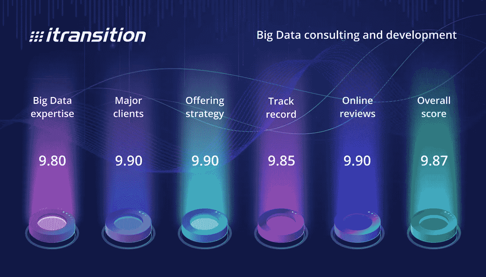

## [**2。储蓄咨询**](https://www.saviantconsulting.com/big-data-analytics-on-microsoft-cloud.aspx)

Saviant 是一家咨询公司，团队中有 120 多名专家，在不同国家有 100 多个客户，包括英国、加拿大和美国。该公司特别关注能源、物流和零售。

该公司的大数据服务包括大数据分析和管理、全周期大数据解决方案开发等。

**总部:**印度浦那

**核心客户:** JJ 食品服务公司、建筑公司、透明技术公司

**每小时工资:**未透露

员工人数:50–249 人

**网址:**[https://www.saviantconsulting.com/](https://www.saviantconsulting.com/)

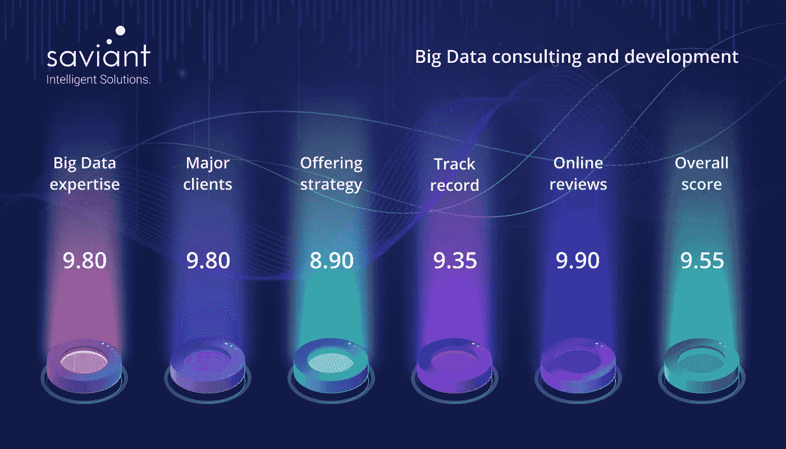

## [**3。Squadex**](https://squadex.com/big-data-analytics/)

Squadex 总部位于美国加州，是一家提供大数据服务的技术咨询和工程公司。它提供大数据分析、咨询和大数据平台工程。

Squadex 是 AWS 认证的咨询合作伙伴，与不同规模的公司合作，从小型创业公司到大型企业。

**总部:**加州帕洛阿尔托

**核心客户:**N 型、NinthDecimal、Nitrio

每小时工资:未透露

员工人数:250–999 人

**网址:**[https://squadex.com/](https://squadex.com/%20)

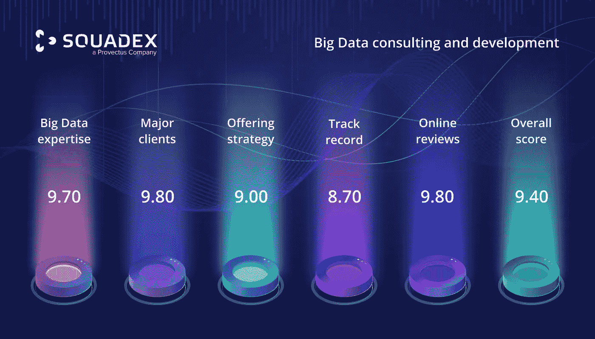

## [**4。CBIG 咨询**](https://www.cbigconsulting.com/)

CBIG 咨询公司成立于 2002 年，是一家提供商业智能和大数据分析解决方案的美国公司。除了分析和咨询，该公司还提供大数据解决方案架构。为此，CBIG Consulting 采用了 Hadoop 发行版、Hive、Sqoop 等。

该公司的产业重点是金融、医疗保健和零售。

总部:伊利诺斯州芝加哥

**核心客户:**雅培、安斯泰拉、百特、信诺、德保罗大学

每小时工资:150 到 199 美元

员工人数:50-249 人

**网址:**https://www.cbigconsulting.com/

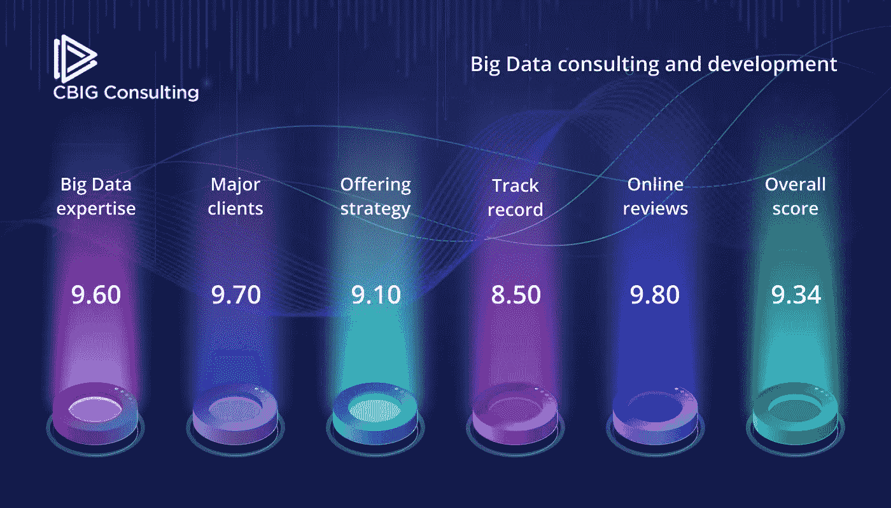

## [5**。Clavax 科技**](https://www.clavax.com/solution/big-data-consulting)

Clavax 成立于 2011 年，是一家软件开发公司，总部位于加州圣何塞。它提供大数据咨询和实施。通过采用大数据技术，该公司为数据仓库、数据处理和数据集成提供服务。

Clavax 的客户包括普华永道、Football.com、Bookfari 和霍尼韦尔。

**总部:**加利福尼亚州圣何塞

**核心客户:**普华永道、Football.com、Bookfari、霍尼韦尔、捷普

**每小时工资:** $25 — $49

员工人数:50–249 人

**网址:**[https://www.clavax.com/](https://www.clavax.com/)

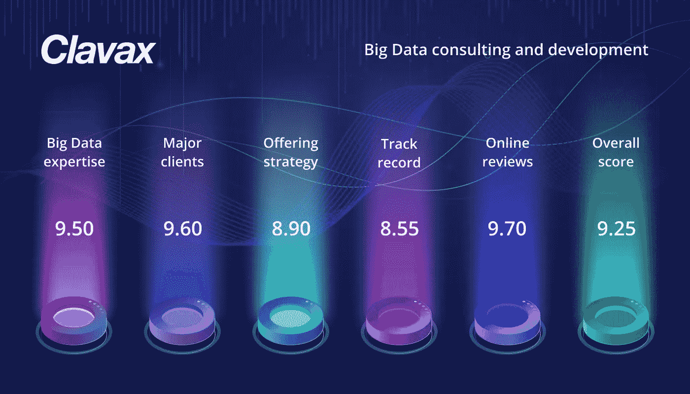

## [**6。第三叶数据**](https://thirdeyedata.io/data-sciences/)

ThirdEye Data 是一家大数据服务公司，提供大数据咨询、分析和工程，同时使用人工智能、深度学习和机器学习。

ThirdEye Data 曾为诺基亚、福特、安进、GettyImages、Actian 等公司提供服务。该公司专注于金融、政府、IT、零售和制造业。

**总部:**加州圣克拉拉

核心客户:微软、诺基亚、福特、安进、GettyImages、Actian、谷歌

每小时工资::50 美元到 99 美元

员工人数:50-249 人

**网址:**[https://thirdeyedata.io/](https://thirdeyedata.io/%20)

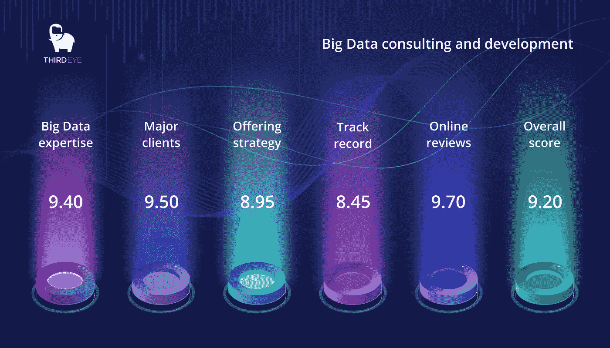

## [**7。重大解决方案**](https://www.signitysolutions.com/analytics-big-data)

Signity Solutions 成立于 2009 年，是一家提供定制软件开发和大数据解决方案的公司。该公司帮助进行大数据分析，并带来由机器学习支持的数据解决方案。

Signity 为商业、教育、媒体和其他行业工作。

**总部:**印度拉吉夫·甘地 IT 园区

**核心客户:**三星、Grupio、项目工厂

每小时工资:$ 25-$ 49

员工人数:50-249 人

**网址:**https://www.signitysolutions.com/

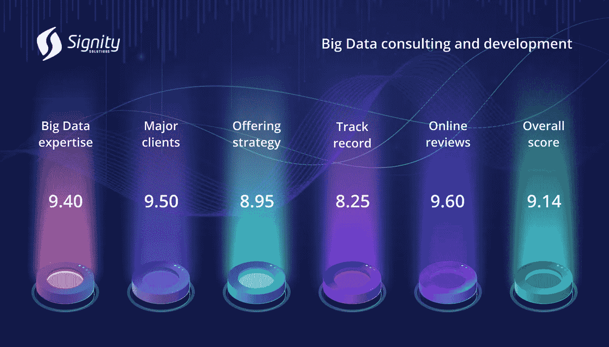

## [8**。卡塞塔**](https://caserta.com/data-analytics-consulting-firm/)

Caserta 成立于 2001 年，是一家总部位于纽约的 IT 公司，提供广泛的数据相关服务。该公司提供大数据咨询和解决方案架构/开发。Caserta 还提供数据可视化、数据仓库服务等等。

该公司曾与纽约时报、Capital One、Equinox 和 HBO 等客户合作。

总部:纽约，纽约州

**核心客户:**纽约时报、第一资本、春分、HBO

**每小时工资:**未透露

员工人数:10–49 人

**网址:**[https://caserta.com/](https://caserta.com/%20)

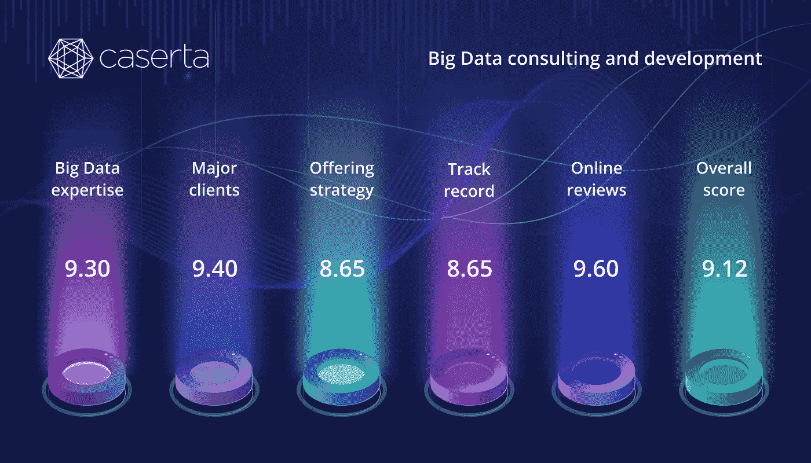

## [**9。RapidOps 公司**](https://www.rapidops.com/)

RapidOps 是一家总部位于美国的定制软件开发公司。该公司的专业知识包括大数据分析、咨询和可视化。

该公司由 60 多名专业开发人员组成的团队为制造业、零售业和 IT 行业提供服务。

总部:北卡罗来纳州夏洛特

核心客户: YoDish，Zurn Industries，DassaultSystemes

每小时工资::25 美元到 49 美元

员工人数:50-249 人

**网址:**[https://www.rapidops.com/](https://www.rapidops.com/)

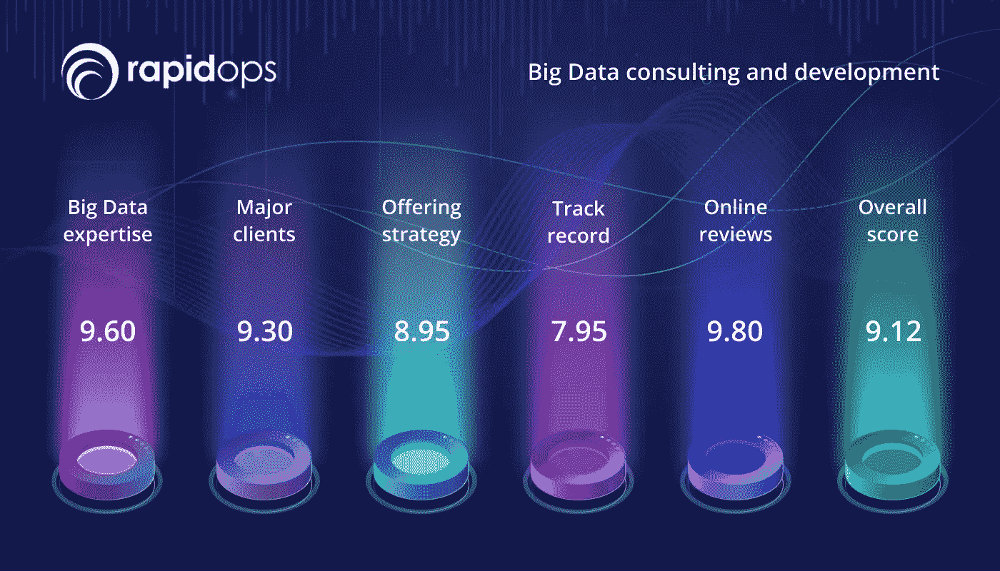

## [10**。神盾软技**](https://www.aegissofttech.com/bigdata-analytics-consulting.html)

自 2003 年以来，Aegis Soft Tech 一直为医疗保健、金融、零售、制造和其他行业提供软件开发。

Aegis 提供大数据咨询、管理和分析。其中，Aegis 有助于数据迁移过程。该公司的开发人员精通 Hadoop、Cloudera 和 Hortonworks 平台。

总部:印度拉吉科特

核心客户: Sunzinet、Zydus、PointRF、Efacec

**每小时工资:** < $25

员工人数:50-249 人

**网址:**https://www.aegissofttech.com/

## [11**。GetInData**](https://getindata.com/)

GetInData 是一家总部位于波兰的公司，联合了 30 多名专业人士。该公司已经开展了 30 多个项目。

GetInData 提供以下大数据服务:大数据基础设施开发、分析、咨询、工程和维护。GetInData 向 Spotify、Allegro、Agora 和 Freshmail 等公司提供服务。

**总部:**波兰华沙

**核心客户:** Spotify、Allegro、Agora、Freshmail、Truecaller、GoEuro

**每小时工资:** $50 — $99

员工人数:10–49 人

**网址:**[https://getindata.com/](https://getindata.com/%20)

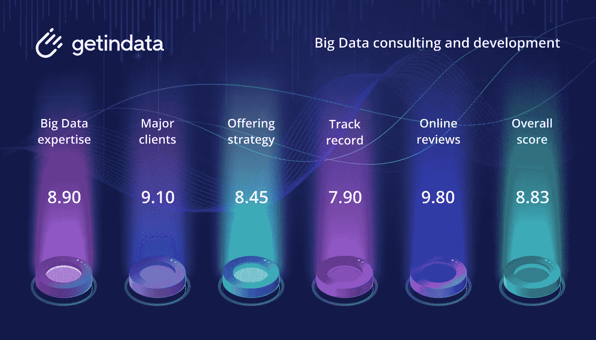

## [**12。卡维全球**](https://www.kaviglobal.com/services/implementation/data-science-services/)

Kavi Global 成立于 2008 年，是一家提供全方位大数据服务的分析公司。其中包括咨询、大数据解决方案架构和平台实施。该公司还提供数据挖掘和数据管理服务。

Kavi Global 的工业专长包括运输、制造、教育和医疗保健。

总部:伊利诺伊州巴林顿

核心客户:通用电气、TEAMHealth、汤森路透、莱德

每小时工资:150 美元到 199 美元

员工人数:10–49 人

**网址:**[https://www.kaviglobal.com/](https://www.kaviglobal.com/)

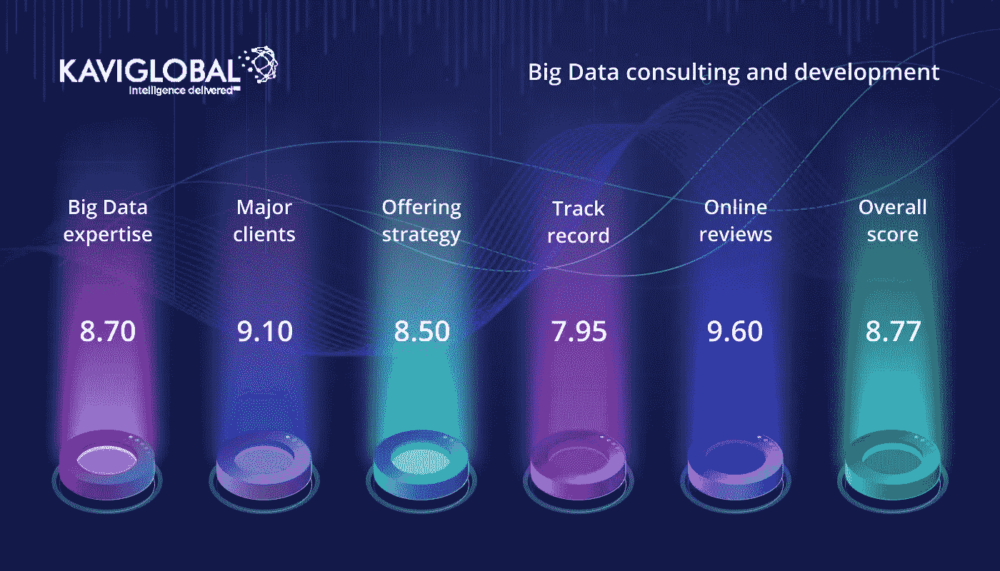

## [13**。铟软件**](https://www.indiumsoftware.com/big-data-services/)

自 1999 年以来，铟软件已经为 19 个不同的行业提供技术解决方案。该公司已经与来自世界各地的 750 家客户合作过。

Indium Software 采用 Hadoop、Spark 和 Apache Kafka 等技术，提供大数据架构和咨询服务。

总部:新泽西州普林斯顿

**核心客户:**未透露

**每小时工资:** < $25

员工数量:250–999 人

**网址:**https://www.indiumsoftware.com/

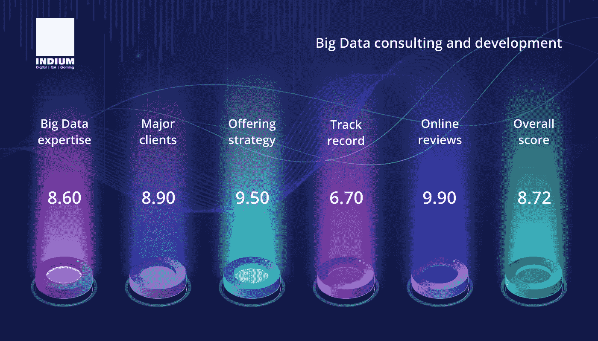

## [14**。法耶里克斯**](https://fayrix.com/bigdata)

总部位于以色列的 Fayrix 是一家定制软件开发公司和大数据服务提供商，拥有 1530 名 IT 专家。

该公司处理各种项目，从最初的数据分析和咨询到大数据基础设施设计、大数据软件开发及其在客户现有技术环境中的实施。

总部:以色列皮图阿克

**核心客户:**biosense Webster，SCR，S7 Airlines

**每小时工资:** < $25

员工人数:1000–9999 人

**网址:**[https://fayrix.com/](https://fayrix.com/%20)

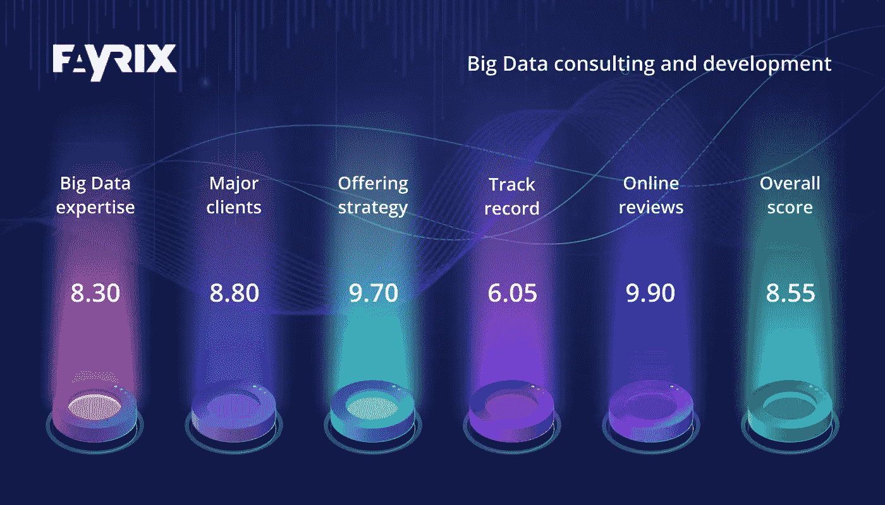

## [**15。denologix**](http://www.denologix.com/services/big-data/)

Denologix 成立于 2002 年，是一家分析和信息管理公司，提供广泛的大数据服务，包括数据分析、咨询以及大数据解决方案实施和支持。该公司部署了大量的大数据技术工具，包括 Hortonworks 数据平台、cloud eraсврHadoop 分发等。

该公司的客户包括阿迪达斯、Allstream、英杰华、加拿大邮政等。

总部:加拿大多伦多

核心客户:阿迪达斯、Allstream、英杰华、加拿大邮政、贝尔、布鲁克菲尔德

每小时工资:150 美元到 199 美元

员工人数:50-249 人

**网址:**[http://www.denologix.com/](http://www.denologix.com/%20)

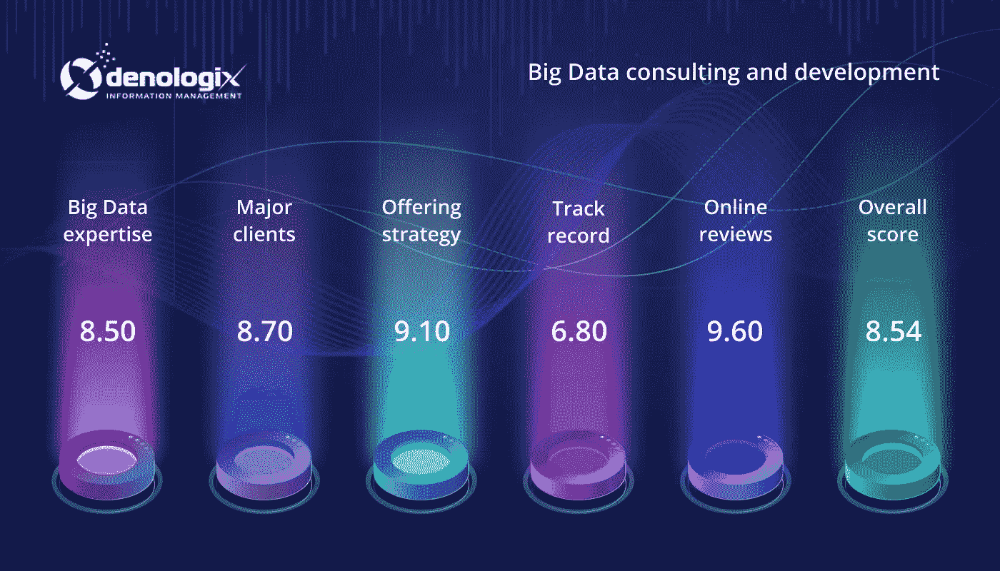

## [16**。数据回复**](https://www.datareply.co.uk/#services)

Data Reply 成立于 2015 年，是一家总部位于英国伦敦的大数据和分析咨询公司。除了大数据咨询和培训，该公司还提供数据工程和数据科学服务。

该公司专注于零售、媒体、电信和商业等行业。

总部:英国伦敦

**核心客户:**未透露

每小时工资:$ 100-$ 149

**员工人数:**10–49 人

**网址:**https://www.datareply.co.uk/

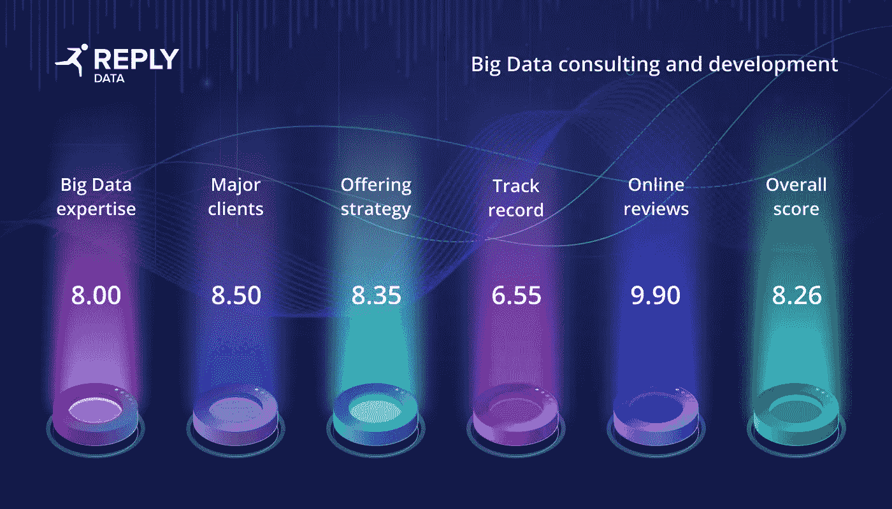

## [17**。dex lock**](http://www.dexlock.com/services/big-data-services)

Dexlock 成立于 2012 年，是一家提供大数据服务的印度公司。其中包括大型数据存储开发和深度学习/机器学习实现。该公司的技术专长包括 Hadoop、Apache Spark、Apache Kafka 等。

Dexlock 与医疗保健、零售、保险、能源和其他行业合作。

总部:印度高知

核心客户: FindCharisma，Splash of Colors，StatFuel，MyPeepz

每小时工资:<【25 美元

**员工人数:**50–249 人

【http://www.dexlock.com/】网站:

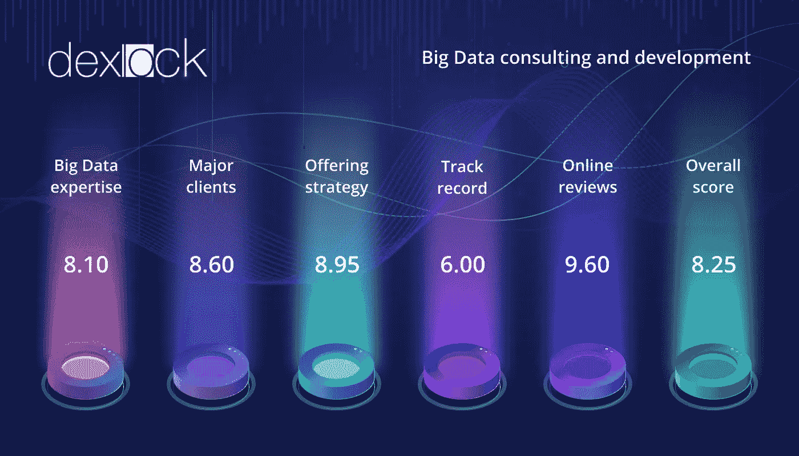

## [**18。470 亿**](https://47billion.com/#services)

470 亿美元是一家定制软件开发公司，提供移动和网络开发以及用户界面/UX 设计。除了这些服务，该公司还提供端到端的大数据分析、咨询和工程服务。

该公司的产业重点包括 IT、游戏和消费者服务。470 亿的客户包括思科、Nazara 和 Apsalar。

**总部:**印度班加罗尔

核心客户:思科、Nazara、Apsalar

**每小时工资**:25-49 美元

**员工人数:**50–249 人

**网址:【https://47billion.com/】T22**

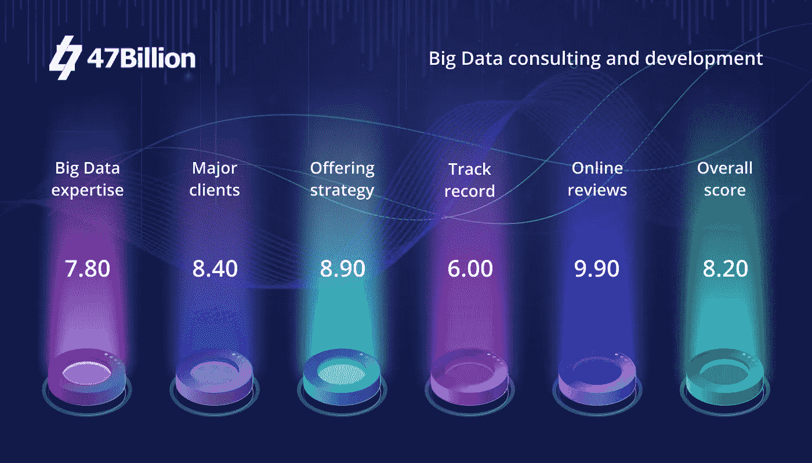

## [**19。51 零**](https://www.51zero.com/)

51zero 是一家总部位于英国的公司，专门提供大数据服务。该公司提供大数据咨询和解决方案开发，并专注于金融服务领域。

该公司的技术专家部署了 Spark、Apache Kafka、Docker 等大数据技术。

总部:英国伦敦

**核心客户:**汇丰、苏格兰皇家银行、巴克莱

每小时工资: $200 — $300

**员工人数:**2–9 人

**网址:**[https://www.51zero.com/](https://www.51zero.com/)

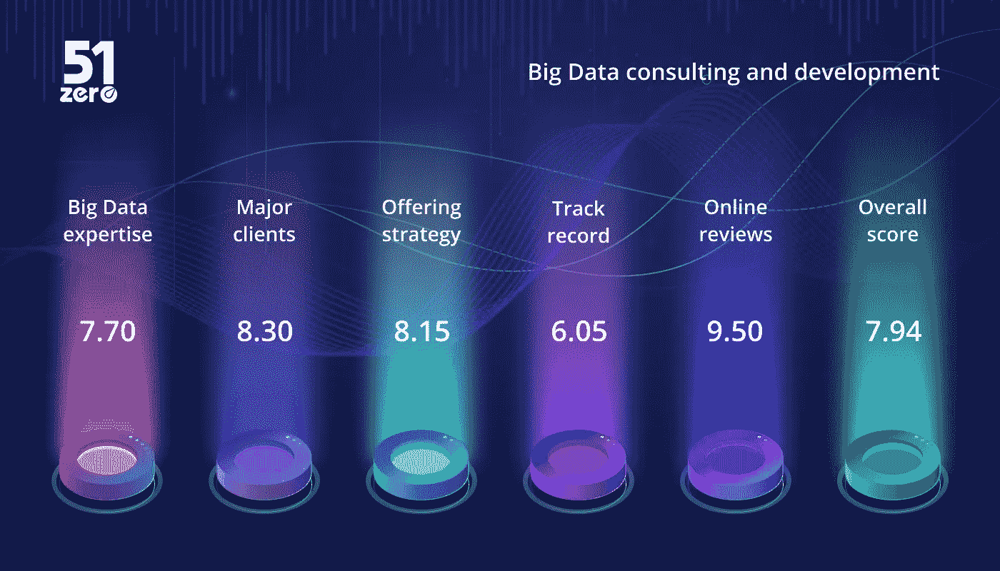

## [20**。SCI-BI**](http://sci-bi.com/big-data/)

SCI-BI 是一家总部位于印度的公司。该公司拥有超过七年的经验，擅长大数据咨询和工程。该公司还帮助制定数据整合战略。

SCI-BI 的大数据技术专长包括 Cloudera 和 Hortonworks。该公司明确专注于物流和零售。

总部:印度钦奈

**核心客户:**执行计划服务，美国 SaasByDesign Inc，美国 Caravel Logistics

**每小时工资:** < $25

员工人数:10–49 人

**网址:**[http://sci-bi.com/](http://sci-bi.com/)

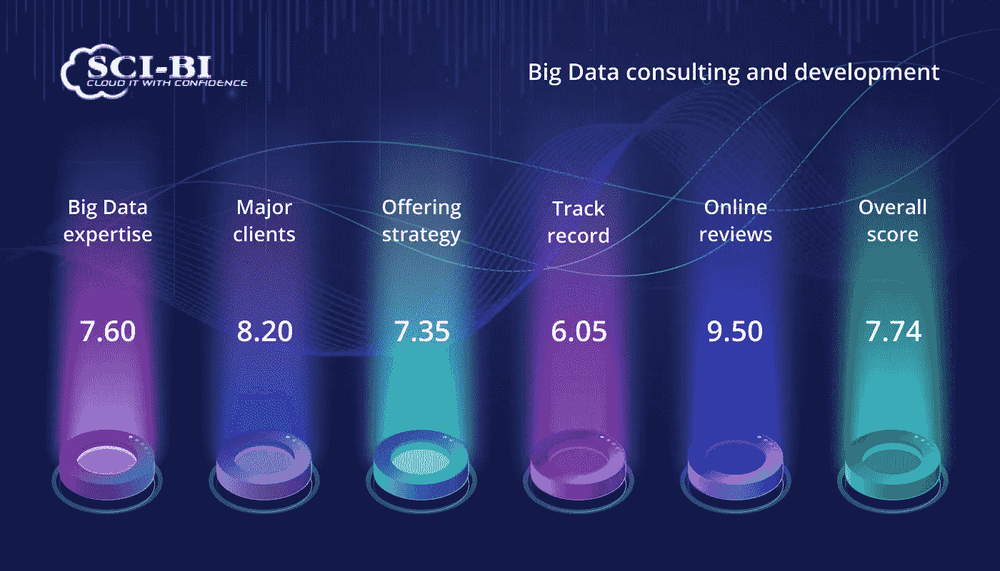