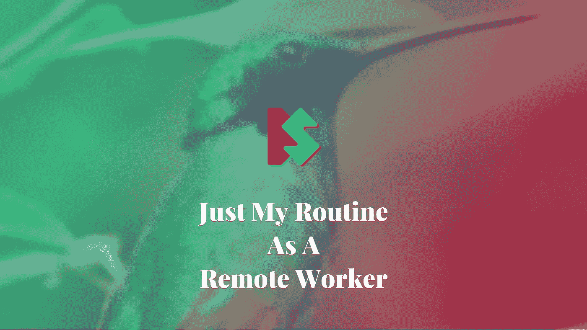
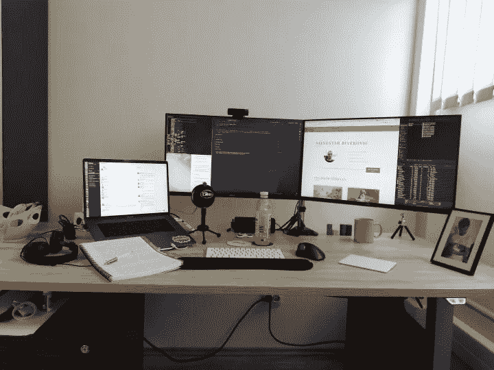
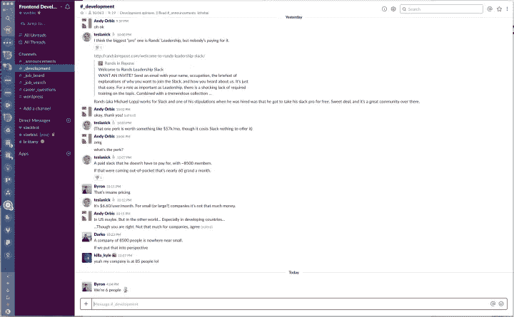
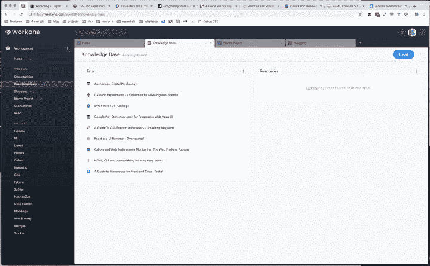
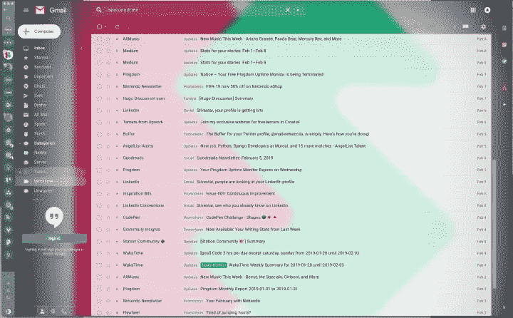

# 这位远程工作者的典型日常工作

> 原文：<https://medium.com/hackernoon/the-typical-routine-of-this-remote-worker-3a2a25f50cc5>

作为一名远程工作者，有一个常规和自律是至关重要的。与多个客户、个人项目保持同步，并不断提高自己的技能是一项具有挑战性的任务。以下是我的秘诀，告诉你如何保持理智，成为一名更成功的远程工作者。

写这篇文章的灵感来自[一篇关于远程生活的文章](https://www.invisionapp.com/inside-design/remote-life-whats-it-all-about/)和[一个关于 Gun.io Slack 频道的突出讨论](https://guniopf.slack.com/archives/C23P2CXCP/p1549776041334200)。

# 办公室

从家庭办公室搬到真正的办公室对我的日常工作改变最大。起床、穿衣、开车/骑车上班，让我觉得自己有了一份固定的工作。更不用说在办公室工作让我更有效率和专注。没有干扰，只有为交付最佳工作而设置的工作环境。

# 办公时间

作为一名远程工作者，严格的工作时间可能是一项挑战。如果你是自己的老板，你可以根据自己的喜好安排工作时间。重要的是坚持下去。我注意到，当我开始和结束工作时，有一个清晰的时间表极大地帮助了我组织我的工作日。

我是一个早起的人，我喜欢在早上尽快开始工作。我每天都在同一个时间起床，我已经习惯了，甚至不用设置闹钟，我的身体就已经知道什么时候醒来。即使在周末，我也醒得很早。当我来到办公室时，我经常从一个简单的任务开始，然后逐渐进展到最复杂的任务。几个小时后，我喜欢休息一下，包括散步，通常是去我最喜欢的咖啡店或面包店。

休息之后，我倾向于在一个单一的长序列中工作，在那里我可以集中精力解决我的大部分日常任务。我尽量避免这段时间可能出现的任何干扰。

# 娱乐

当你是自己的老板时，没有人让你工作，你可以把时间花在不相关的事情上。有严格的自律真的很难，尤其是当你在电脑上工作的时候。滚动社交媒体，阅读最新的新闻或文章可能会导致截止日期的严重情况。

我没有任何特别的方法来处理这些干扰。当我想休息一会儿去看看我的梦幻球队或者看看斯诺克世界视频时，我就停止工作，就这样。我通常不会打开两三个以上的链接/标签。

> *每周五，我都会通过阅读时事通讯和保存的文章来开始我的一天。*

但我确实有一套跟上最新技术的常规。每个星期五，我都会通过阅读时事通讯和保存的文章来开始我的一天。如果我不马上阅读最新的新闻，我会感觉很好。重要的是我最终还是读了。无论如何，新的 CSS 规范目前可能帮不了我。

# 下班时间

有些情况下我在家工作。有时候我就是不想离开家(通常是下雨的时候)。我知道我会努力完成这项工作，但这些天我没有复杂的任务。没有我的两个外接屏幕，工作也会花费更多的时间。在这段时间里，和你的家庭成员达成共识是很重要的。

也有例外，比如当我正在为我的新博客文章写草稿的时候，或者当我在玩 CodePen 演示的时候。如果情况不需要我全神贯注，我喜欢“观察和工作”有时候是我最喜欢的电视节目，有时候是我工作时背景播放的体育节目(任何体育节目，真的)。有些情况下，我喜欢一边工作一边和妻子聊天或看女儿玩耍。

# 远离电脑的时间

当我感到特别疲惫的时候，我就把我的 MacBook 放在办公室里。实际上，大多数时候我更喜欢把它放在那里。我意识到，如果我在家使用电脑，即使只是为了好玩，我也无法完全休息。我无聊的时候最放松。无聊被低估了——你应该珍惜你什么都不用做的时间。

> 无聊被低估了——你应该珍惜你什么都不用做的时间。

# 健康

远程工作时，健康是一个重要的话题。我喜欢在暖和的日子里骑自行车。我每周玩几次休闲足球。我并不在最佳状态，但我对自己的身体感觉很舒服。

心理健康也很重要，如果不是最重要的话。我认为如果你一直在奋斗，你就不可能创作出最好的作品。让我保持理智的是我古怪的家人、我超级善解人意的妻子、我欢闹的女儿和我的朋友们。

我经常和朋友去酒吧。当我和朋友一起看体育比赛、打保龄球、玩飞镖或打牌，或者只是喝啤酒和享受谈话时，我所有的工作问题都神奇地消失了。我的大多数朋友都不是开发人员，所以谈论工作很少是一个问题。

# 对抗孤独

在办公室独自工作也会导致一些问题。这就是为什么我会在工作时间中间(最好是早上)去喝咖啡，试图和朋友保持联系。我也喜欢和我的妻子和女儿视频通话，看看他们在做什么。我不喜欢任何形式的信息，但我也能看出这有什么帮助。

# 找到一个爱好

你可以通过爱好来改善你的心理健康。我喜欢在家里做些杂工。我喜欢修理和改善我的家，而我的狗让我开心。对吱吱作响的门或松动的螺丝进行简单的修理就能给我带来奇迹。我也喜欢看很多运动。我不认为这是一个真正的爱好，但它让我放松，我每天都这样做。

# 去呼吸新鲜空气

大约一个月一次，我的家人会去乡下看望家人。我经常去那里帮忙做一些家务，这通常意味着体力劳动。花时间呼吸新鲜空气是宝贵的。干了一天体力活后上床睡觉感觉很有收获。

或者，你可以步行、跑步、骑自行车、远足或爬山，只要你远离科技。你做什么并不重要，重要的是你的思想要远离项目、任务、问题或错误。当我离开电脑时，我经常会有“啊哈”的时刻。从另一个角度看问题总是一个好主意。

# 休息

充足的睡眠是常识。我已经安排我的移动设备从晚上 10 点到早上 7 点关闭通知。我无法想象有什么事情如此重要，以至于我不得不在半夜回应任何事情。我所有的客户都非常清楚我的工作日程，他们尊重我的时间，就像我欣赏他们的时间一样。为了避免不愉快的情况，在项目开始时进行这种对话是非常必要的。

在我的日常工作中，我使用几个应用程序来帮助我更快更有效地完成工作。从这个词的完整意义上来说，这些都不是生产力应用程序。

# 车站

第一个是[站](https://getstation.com/)应用。我主要在我的谷歌邮件、谷歌驱动、谷歌日历、Zoho 邮件、Trello、Asana 和 Slack 上使用它。在应用程序之间切换非常容易。另外，我没有太多打开的浏览器标签，这些标签会让我的浏览器变得混乱。我注意到的另一件事是，自从我把它放在车站里，我花在休息上的时间就少多了。看不到“未读”点让我压力更小，我不会因为没有阅读最新消息而感到内疚。如果我想分散注意力，我只需打开移动设备的音量。

# 沃克纳

第二个是我的浏览器的 [Workona](https://workona.com/) 扩展。当我可以在一个有意义的实体中分组相关的选项卡时，我的浏览器工作区变得更加整洁。例如，我的“知识库”工作区包含我希望以后阅读的文章和教程，而我的“博客”工作区包含用于跟踪和共享我的博客的链接。我也喜欢同步选项，它允许我在不同的设备上打开我的链接。

# 展开。我

[Unroll.me](https://unroll.me/) 是邮件管理的服务。我设置了大量不太重要的电子邮件，可以每天阅读。就我而言，我每天早上都会收到 Unroll.me 邮件，我可以快速浏览邮件，看到最新的精彩内容。重要的邮件不会通过 Unroll.me 发送，所以我仍然会在那个时候收到。

# 结论

我希望这些信息能帮助你成为一名快乐的远程工作者。如果你有任何建议想分享，我想听听。毕竟我的一些套路都是从之前看的文章里采纳的。

*原载于*[*www . silvestarbitrovic . from . HR*](https://www.silvestarbistrovic.from.hr/articles/remote-worker-routine/)*。*