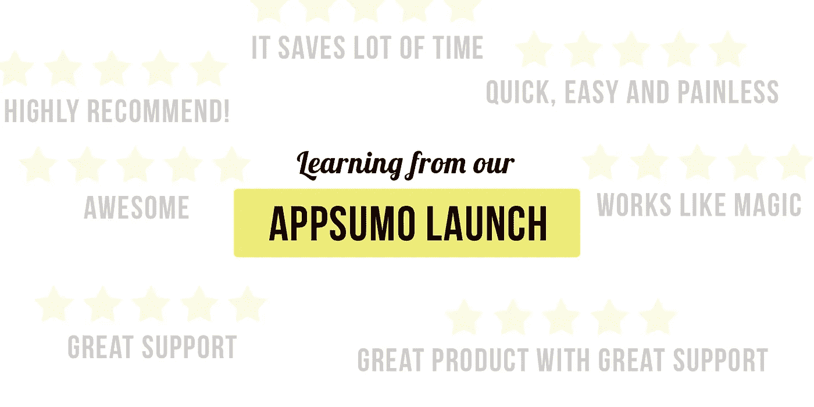
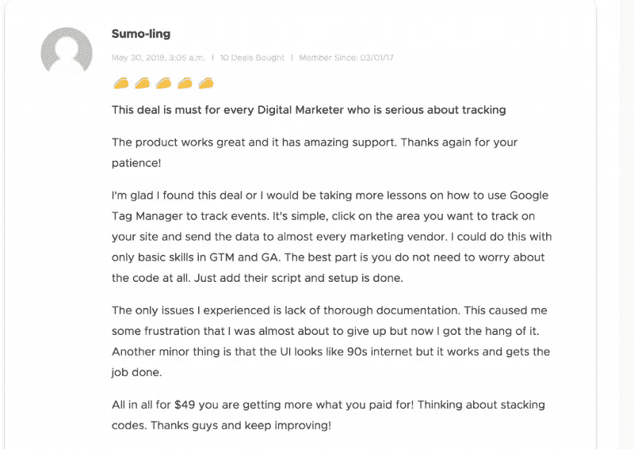

# Appsumo 发布终极指南

> 原文：<https://medium.com/hackernoon/the-ultimate-guide-to-appsumo-launch-and-progress-after-7-months-7674dfb7b957>

## 以及我们公司在接下来的 7 个月里的进展

Our Appsumo launch by [Vishnu](https://twitter.com/ArchitectUX) from [Customerlabs](http://www.customerlabs.co)

[**Appsumo**](https://hackernoon.com/tagged/appsumo)**launch**给了我们无数的朋友，全世界那些真心希望我们成功的了不起的人。这是**我们做出的最好的决定**之一，它给了我们新的视角，也为我们自己和我们的产品带来了愿景。

这篇文章将帮助你准备 Appsumo 的发布，以及 7 个月后我们从 Appsumo 发布中学到的东西。我将分享诚实的学习，而不是舒适的信息。

[Action Recorder](http://www.customerlabs.co/action-recorder) 帮助企业无需编码即可跟踪其网站，并统一整个[营销](https://hackernoon.com/tagged/marketing)堆栈中的客户数据。

我们在 2017 年年中推出了我们的产品，并努力获得最初的牵引力。Appsumo 的推出是我们做出的最大的决定，而且回报非常好。

# 决定:

2018 年初，我们决定在 Appsumo 推出我们的产品。我与一些企业家直接交谈，了解它如何在发布后改变业务。

我确实找到了很多文章提到我们如何在两周内赚了 17 万到 20 万美元。

[https://medium . com/pixel me-blog/how-we-made-170-000-in-2-weeks-with-an-unexpected-app sumo-promotion-fc 2c CB 41 ABA 0](/pixelme-blog/how-we-made-170-000-in-2-weeks-with-an-unexpected-appsumo-promotion-fc2ccb41aba0)

虽然我认为，这有点误导，因为你将支付**65-70%**作为**推广费用给 Appsumo** 。但是，我将**分享关于市场、人以及它将如何塑造你的业务的更深刻的见解**。

# Appsumo 发布准备:

提前做好 Appsumo 发布计划很重要，有两件重要的事情你应该做。

## **1。最终用户不难理解的低调营销信息。**

Appsumo 的用户范围很广，其中 75%可以归为个体创业者和小企业。他们愿意尝试新的解决方案，但他们需要了解你提供的是什么。

在我们的案例中，我们最初很难解释我们的解决方案。但是 Appsumo 人群的好处是，他们帮助我们微调我们的信息。我们在试运行期间迅速发布了我们的更新。

Momoko Price 的 conversionXL 课程对我在登录页面上的工作帮助很大。

## **2。定价策略**

在试运行期间，我们没有推出可堆叠代码。**堆叠码**帮助您提高销售额，我们 50%的销售额来自堆叠码。当你制定你的定价策略时，选择可堆叠的代码来促进你的销售。

## **3。试用**

提供试用版，让用户在购买前试用你的系统。

## **4。提供令人惊叹的全天候支持**

我们日以继夜地轮班工作，以提供惊人的支持，你会看到我们的大多数评论说出来。查看人们对我们的评价。

## **5。准备好让你的技术团队随时修正错误和问题。**

Appsumo 的推出就像你的应用程序服用了类固醇，你会看到流量突然增加。自动扩展是处理这种流量的最佳方式，重要的是，当您的客户需要时，您的系统不能停止工作。

我很自豪地说，我们在这次发射中没有遇到哪怕一个错误或技术障碍。

## **6。脸书集团**

在发布之前，您应该加入几个活跃的脸书团体。

a)明智的市场

b) Appsumo 官方团体

c)终身技术交易集团

是你应该参与的最重要的群体。

## **7。做好反馈和负面反馈的准备。**

你会收到很多反馈，准备好采取行动。Appsumo 用户喜欢看到你在发布期间的承诺。让您的技术团队在您处于发布阶段时尽快发布更新。

你会有一些用户要求更多，他们总是会要求更多。他们中的一些会在一定程度上考验你的承诺和耐心，但是要准备好保持冷静。

我只见过他们中的一小部分人走过这条路线，但用平静的心态处理它。

## **8。问题(常见问题)**

你会有很多问题，准备好回答它们。你会看到很多重复的问题，准备好回答这些问题的回答。

## **9。评论**

请你的用户评论你的产品，我们跟踪成功登录的用户，并触发自动消息要求他们评论我们的产品。我不太喜欢给评论提供奖励，但是我们确实要求他们评论我们的产品，并且没有提供奖励。最近有一些产品受到了激励，但我们没有。

Words from our customer

## **10。投资实时聊天软件**

我们投资了 Drift，它对我们及时处理支持请求帮助很大。这是我们为此次发布所做的最佳投资之一。 **&**

# Appsumo 发布 7 个月后

上线 7 个月后，我了解到科技公司还有很大一部分市场没有开发。他们想尝试新事物，像企业一样实现自动化。

> ***在我们信任的上帝中，所有其他人带来的数据***
> 
> **T5【爱德华兹】戴明 **

# 每月计划有多少次升级？

目前，MRR 计划的回报率约为 1-2%。如果你期待他们中的许多人会被转换成 MRR 计划，这要看情况，但对我们来说，这并没有实现。

# 他们是否在支持方面花费了大量时间？

不，他们不会用支持请求来消耗你的时间。所以不要担心继续交易。

# 他们中的许多人甚至不使用该产品。

诚然，他们中至少有 30%的人不使用你的工具。我认为这取决于你提供什么样的工具。

# 但是，这会给你一个新的视角。

你应该明白你要和谁打交道。solopreneuer 和小企业群体有许多问题，包括缺乏资源和资金，这迫使他们专注于当前的问题，但没有给他们探索新奇技术的机会。

在我们的案例中，3000 多个账户中的 70%仍在试图弄清楚谷歌分析和脸书像素是如何工作的。他们缺乏对事件跟踪的理解&如何通过用户行为数据的漏斗工作。

另一方面，我们的企业客户正在超越机器学习、人工智能、自动化和实时工作流。

当我与我们的客户非常密切地互动时，太多的想法、工具和公司都在试图推动新事物。客户对他们想要采取的方法感到困惑，每当一个新事物出现时，他们都希望尝试一下，希望它能扭转业务局面。

例如:a)实时聊天 b)聊天机器人 c)信使机器人他们想尝试一切，但缺乏深入的知识或执行通常会阻止他们看到结果。

# 这对我们 CustomerLabs 意味着什么？

作为一个团队，我们共同花了很多时间来处理这个问题。我们将我们的理想客户档案更改为**“普通数字营销人员”**，这意味着我们的流程、产品管理和营销信息最好开始关注教育客户。

对“普通数字营销人员”的成功真正感兴趣是我们的首要任务。这应该开始反映在我们的产品、车载技术、定价、营销信息等方面。

我们正在进行几项实验来实现这一愿景，当我们有了一些可靠的发现时，我会与大家分享结果。

有一个巨大的服务不足的市场，谁需要我们的帮助。但是，我们需要的是一种不同的方法，致力于帮助这个市场实现他们的长期目标。

要做到这一点，我们应该将大部分工作自动化，这样成本就会一直保持在较低水平。这需要一种精致的产品管理技术，毅力和比任何事情都更真实的兴趣来提升它们。

如果你不认为这是你的愿景，Appsumo 的推出将是你快速赚钱的机会，它将在 2 周内为你的帐户注入 35-60，000 美元。

我相信我们可以共同改变基层的工作方式。

*原载于 2019 年 1 月 9 日*[*【www.customerlabs.co】*](https://www.customerlabs.co/blog/ultimate-guide-to-appsumo-launch/)*。*