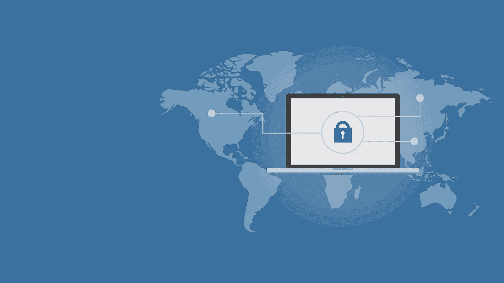

# 流式传输时绕过地理限制的终极指南

> 原文：<https://medium.com/hackernoon/the-ultimate-guide-to-bypassing-geo-restrictions-while-streaming-5d97d85f87b2>

[Image source](https://pixabay.com/photos/cyber-security-online-computer-2296269/)

众所周知，互联网是流媒体视频的金矿。除了可以通过互联网访问的其他内容，用户和服务提供商对视频流服务的兴趣正在飙升。

根据[数字电视研究](https://www.digitaltvresearch.com/products/product?id=215)的数据，2017 年至 2023 年间，全球视频流媒体订阅量将增加 4.09 亿，总数将达到 7.77 亿。

尽管有这样的增长和互联网的全球性，我们仍然是地理的受害者。

我们相信一个神话，即我们已经消除了数字世界的物理边界，互联网是一个我们可以自由分享和消费内容的地方，无论我们住在哪里。

然而，随着地理限制成为世界许多地方的普遍问题，互联网自由正在下降。

在北美和澳大利亚等地区，严格遵循地理限制。此外，在亚洲、中东、南美和非洲等地，没有围绕地理限制制定明确的法律。

目前，欧盟是唯一一个对地理封锁方法采取法律行动的地方。

2018 年 4 月，欧盟引入了[数字媒体可移植性法规](https://ec.europa.eu/digital-single-market/en/cross-border-portability-online-content-services)，要求付费在线内容提供商在欧盟范围内提供一种“漫游”(允许来自英国的用户在不同的欧盟国家观看相同的英国内容)。

**什么是地理限制，为什么会存在？**

地理限制是公司根据用户的位置来阻止用户访问其内容和服务的一种做法。

地理限制的一个很好的例子是美国网飞。如果您试图从其他地区访问该平台，您将被重定向到您所在地区的内容库，而不是美国地区。

这是可能的，因为当您访问网站内容时，网站可以看到您的位置。

每台连接到互联网的设备都有一个专用的 IP 地址。通过确定您的 IP 地址，服务提供商会透露您的一些详细信息。虽然它不能透露你的确切位置，但它可以知道你正在浏览的是哪个地区。

地理限制通常是强制性的，因为在每个国家播放内容时，都要遵守许可法规。内容提供商需要支付巨额费用从单个国家购买许可权。这个系统在电视和广播时代是有意义的，因为各国都有自己的特定频道，有自己的观众和预算。

最近的一项 Rethink Technology 研究发现，SVOD 内容的全球平均观看时间将会上升，并将很快与广播电视的观看时间持平。

虽然许多媒体消费已经转向视频流订阅，但内容许可仍遵循旧规范，这在互联网生态系统中产生了问题。

当世界如此紧密相连时，一个人没有理由不能从不同的国家访问一个网站。

幸运的是，对于在传输内容(尤其是视频内容)时面临地理限制问题的用户来说，以下是绕过这些限制的四种方法:

## **1。用 VPN 屏蔽你的 IP 地址**

虚拟专用网络(VPN)是一种网络安全措施，它通过互联网创建从设备到网络的加密连接。

它将您的网络连接到一个代理服务器，该服务器会屏蔽您的 IP 地址并隐藏您的真实位置。然后，它会为您提供一个虚拟位置。

VPN 使用[隧道](https://searchnetworking.techtarget.com/definition/tunneling-or-port-forwarding)来隐藏你的在线数据，使你的活动几乎不可追踪。

VPN 工作在浏览器层和系统层。这意味着您系统和手机上的每个应用程序都可以更改其 IP 地址。

每个 VPN 以不同的价格提供不同的服务。这意味着配备最适合您的流媒体平台的 VPN 非常重要。

每个流媒体平台都有许多值得信赖的最佳 VPN 服务列表。在将你的数据委托给虚拟专用网之前，也有关于[的指南。](https://www.zdnet.com/article/how-to-choose-the-vpn-thats-right-for-you/)

要找到适合您的流媒体平台的 VPN，只需在网上搜索关键字“流媒体平台名称的最佳 VPN”一个很好的例子是“Kodi 最佳 VPN”搜索，该搜索提供了不同的在线资源，以及由 BestVPN 提供的 2019 年名单，该名单提供了由 12 家经过良好测试的服务提供商组成的 Kodi VPNs 列表。ExpressVPN、NordVPN 和 CyberGhost 是最适合 Kodi 的三大 VPN。

搜索“网飞的最佳 VPN”、“Hulu 的最佳 VPN”、“YoutTube 的最佳 VPN”以及类似的内容，也会出现一个经过测试的 VPN 列表，这些 VPN 适用于每个流媒体平台。

**VPN 的主要缺点:**

*   它不适用于 Chromecast、Xbox 或 Apple TV 等游戏机和流媒体设备。
*   [浏览速度](https://itstillworks.com/advantages-disadvantages-virtual-private-network-8560489.html)可能会经历一些减速。然而，这完全取决于 VPN 服务的协议和加密。

## **2。使用代理服务器**

代理服务器充当客户端设备(如计算机或移动设备)和客户端向其请求服务的另一服务器之间的中介。

它使用它的一个 IP 地址来访问客户端请求的页面。

此外，它使用[本地缓存](https://docs.microsoft.com/en-us/windows/desktop/fileio/local-caching)来更快地响应缓存的网站——这意味着如果它在以前访问过的页面的本地缓存中找到请求的页面，它会将其返回给用户，而不会将请求转发给网站。

**代理服务器的主要缺点:**

*   一些服务器经常变得过度拥挤，并遭受长时间的停机。
*   通过代理网站，你无法访问登录墙后面的内容，如网飞或 Hulu。

## **3。使用智能 DNS 服务**

智能 DNS 服务的工作原理是简单地改变由您的 ISP 分配的真实 DNS 地址。

而不是改变 IP 地址，它覆盖了选定的 DNS 条目，揭示了你的地理位置。您的连接会通过专用代理服务器快速重新路由到网站所在的位置。这意味着您似乎位于允许查看受限内容的国家。

由于它只重新路由与您的地理位置相关的特定细节，您不会体验到任何速度损失。与 VPN 不同，它没有加密，因此您可以在访问受地理限制的内容时享受原始的 ISP 速度。

**智能 DNS 服务的主要缺点:**

*   预先解除阻止的网站列表不包含特定地区的所有网站。
*   您的 ISP 可以使用[透明代理](https://www.maxcdn.com/one/visual-glossary/transparent-proxy/)阻止智能 DNS。

**4。使用 Tor 浏览器**

Tor 是一项免费使用的服务，允许人们通过隐藏 IP 地址来匿名浏览互联网。

它使用[洋葱路由](https://www.onion-router.net/)的概念，其中数据首先被加密并通过多个服务器传输，称为中继。您的数据通过多个中继传输，因此它创建了多层加密，并确保您的身份是隐藏的。

每个加密层在连续的中继中被解密，剩余的数据被传输到任意随机中继，直到它到达它的最终目的地。

**TOR 的主要缺点:**

*   由于 TOR 网络上的中继数量约为 6000–7000，用户约为 200 万，这意味着您在浏览时经常会遇到网速较慢的情况。
*   TOR 也可能被政府封杀。

**结论**

由于地理限制可以应用，因为你的 IP 地址在互联网上是可见的，最好的办法是隐藏你的 IP，而流地理封锁的内容。

坚持 VPN 和智能 DNS 服务是比代理网站和 TOR 更可靠的解决方案，因为它们更安全，而且你的浏览速度不太可能受到影响。