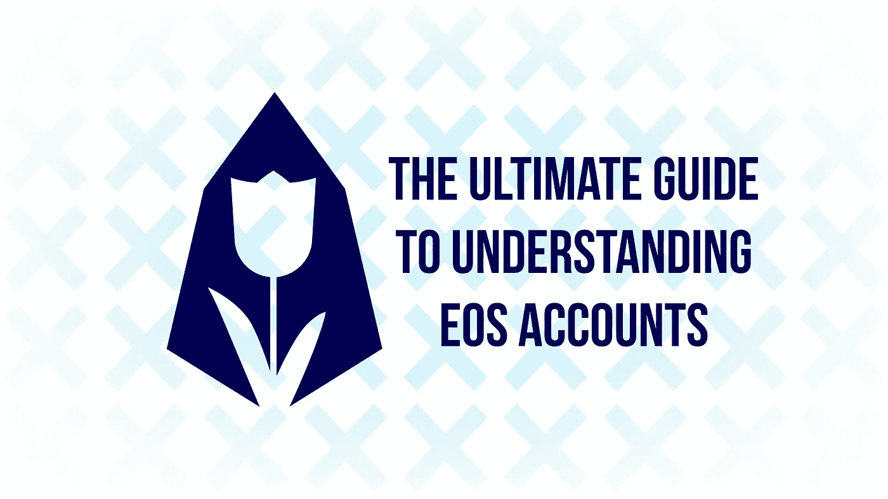
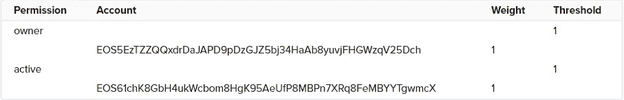
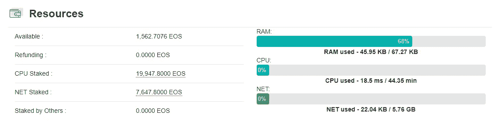

# 理解 EOS 账户的终极指南

> 原文：<https://medium.com/hackernoon/the-ultimate-guide-to-understanding-eos-accounts-a44b58ba5601>

EOS 使用的账户结构与你所知道的大多数加密货币不同。虽然一开始看起来很复杂，但是一旦你理解了基础知识，就不会那么难了，所有这些都将包含在本文中。那么，EOS 账户是如何运作的呢？

# 默认 EOS 帐户

## 账户结构

每个用户在 EOS 区块链上有一个或多个帐户。EOS 账户是存储在区块链上的人类可读标识符，需要将任何(有效)交易推送到或转移到 EOS 区块链。根据权限配置，这些帐户也可以由多人拥有。

EOS 帐户长度为 12 个字符，可以包含字母 a-z 和数字 1-5。这些帐户名称取代了大多数加密货币中使用的又长又笨拙的钱包地址。

此外，每个 EOS 帐户都有权限。许可可以被看作是为了使事务通过而需要满足的要求。默认情况下，EOS 帐户有两个本机权限:

*   *Owner* :显示账户的所有权，需要修改账户所有权。此权限的密钥最好(安全地)脱机保存，因为在 EOS 网络上做大多数事情都不需要它们。
*   *活动*:用于转账、制作人投票等高级账户变更。

除了这两个本地权限，您还可以创建新的自定义权限来满足您的需求。

每个权限都有一个或多个与之关联的密钥和/或帐户名。与权限相关联的每个键或帐户名都有某个**权重**，并且每个权限都有某个权重**阈值**，在接受要求该权限的交易之前需要满足该阈值。

Visualization of a default permissions structure. (Source: [EOSIO Developer Portal](https://developers.eos.io/eosio-nodeos/docs/accounts-and-permissions#section-__-multisig-account-authorities-__))

为了帮助您理解所有这些信息，我们提供了上面的图像，它可视化了默认 EOS 帐户的权限结构。如您所见，*所有者*权限的默认**阈值**为 1，并且有一个键的**权重**为 1。这同样适用于*活动*权限，该权限的默认**阈值**为 1，并且 1 个键的**权重**为 1。
这意味着只需要与*所有者*或*激活*权限相关联的(私有)密钥来执行任何需要*所有者*或*激活*权限的交易。

## 帐户资源

现在您已经熟悉了 EOS 帐户的结构，是时候了解帐户资源了。每个 EOS 账号有 3 个资源: **CPU** 、**网络**和 **RAM** ，这些资源都允许用户做不同的事情。我们将在下面使用 EOS Asia 的[比喻来单独解释每种资源。](/@eosasia/what-is-cpu-what-is-ram-and-how-does-the-eos-blockchain-utilize-these-resources-a7a52e158652)

How resources in an EOS account (can) look

> 如果 EOS 区块链是一列火车， **CPU** 、 **RAM** 和**网络**可以用以下方式解释:
> 
> **网络**将是离开和进入区块链的每列火车中的可用座位。你的椅子将永远被保留，如果你需要它，它将是你的。但是，如果火车上没有人，你可以跨过一堆椅子，因为它们是免费的！所以网络是一种确保火车离开时你有地方坐的方式。
> 
> CPU 是你可以乘坐火车的频率，就分配而言，它的工作方式很像网络。你可能有一张火车票，但是当然这张票只在特定的日子和时间有效。
> 
> 现在 EOS 火车相当悠闲，所以任何未使用的空间都可以免费使用 re: **CPU** 和**网络**，*直到*为空间付费的人需要使用空间。
> 
> **CPU** 和**网络**是共同的资源，合起来称为**带宽**。
> 
> **RAM** 是你在火车上的储物空间。如果你需要带一吨行李，你需要按包付费，把你的包托运上火车。如果你不需要带很多行李，你可以把你的储物空间卖给火车上的其他人。

**CPU** 和**网络**可以通过跑马圈地 EOS 获得，本质上就是锁定你的令牌一定时间。当用户想要移动他们的 EOS 时，他们可以拆下他们的令牌，实质上使交易免费。 **RAM** 不能通过下注获得，而是可以买卖，例如用于保存其他代币。

## 把所有的放在一起

现在，您已经了解了 EOS 客户的结构和资源，所以是时候将所有这些放在一起，以便全面了解 EOS 客户。

EOS accounts and permissions visualized. (Source: [Blockgenic](/coinmonks/eos-accounts-and-permissions-visualized-677fc9c144e4))

在上图中，您可以看到帐户结构如何与帐户资源相关联。浅蓝色线条表示需要 **CPU** & **NET** 来执行任何需要该权限的操作。红线表示需要 **RAM** 来保存其他令牌。这将使你对 EOS 账户的运作有一个坚实的理解。

# 多重签名账户

使用 EOS 中的权限结构，您可以做许多有趣的事情。其中之一是创建一个多重签名账户，这在 EOS 网络上相对容易。一般来说，多签名账户(在其他区块链通常称为多签名钱包)是需要一个以上签名才能进行交易的账户。

EOS 帐户更复杂，因为它们有多个权限，并且有多个操作与该权限相关联，而不是像大多数当前区块链那样只有一个可能的操作。作为这种更复杂的账户系统的结果，有可能改变早先描述的许可的**阈值**，在需要该许可的任何交易可以被执行之前需要满足该阈值。也可以将多个具有不同**权重**的键添加到权限中。

使用这些原则，您可以在执行事务(以及事务执行的操作)之前要求多个密钥对事务进行签名，实质上使您的权限成为多签名权限！

我们将在以后的文章中更深入地解释这是如何工作的，以及如何自己去做。

## 关于我们

EOS Mainnet 的基础模块生产商。欧洲连锁姐妹连锁店的合作伙伴。区块链项目的投资者。治理、跨文化合作和安全专家。你可以在这里找到我们:
[网站](https://eosamsterdam.net/)
[推特](https://twitter.com/eosamsterdam)
Youtube
[Steem](https://steemit.com/@eosamsterdam)

*作者为* [作者为*Yannick Slenter*](https://www.linkedin.com/in/yannick-slenter/)*作者为* [*EOS 阿姆斯特丹*](https://eosamsterdam.net/)