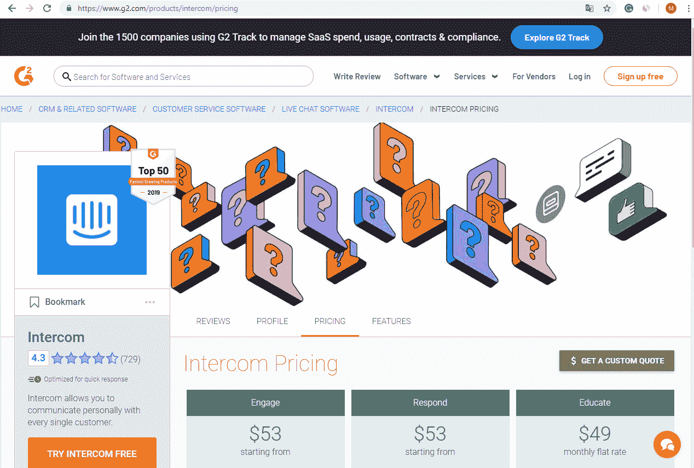
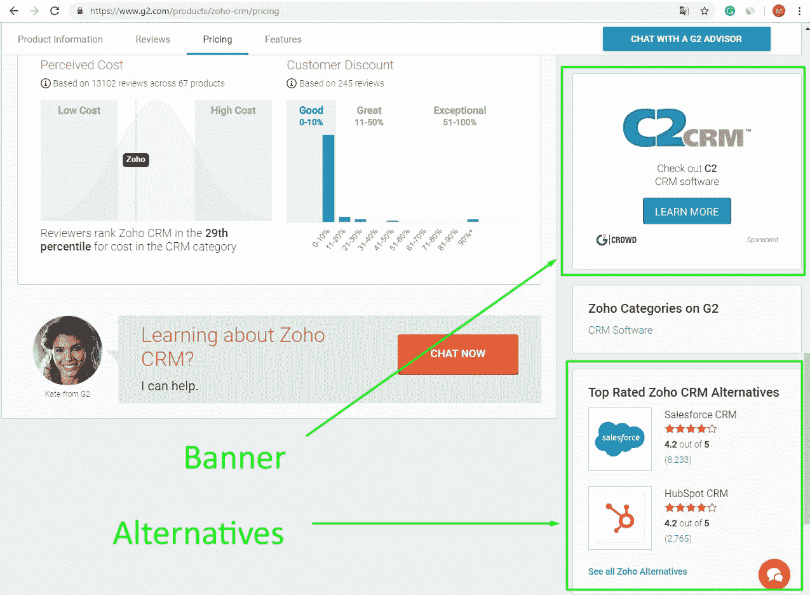
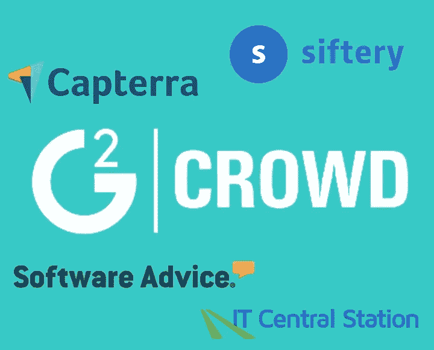
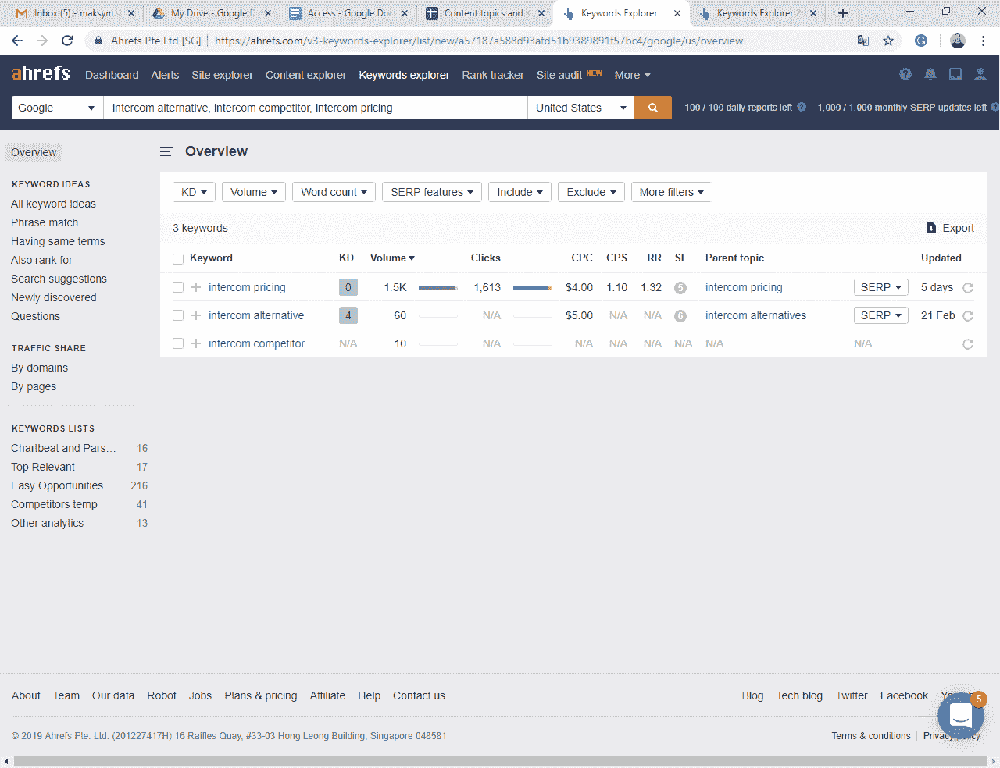
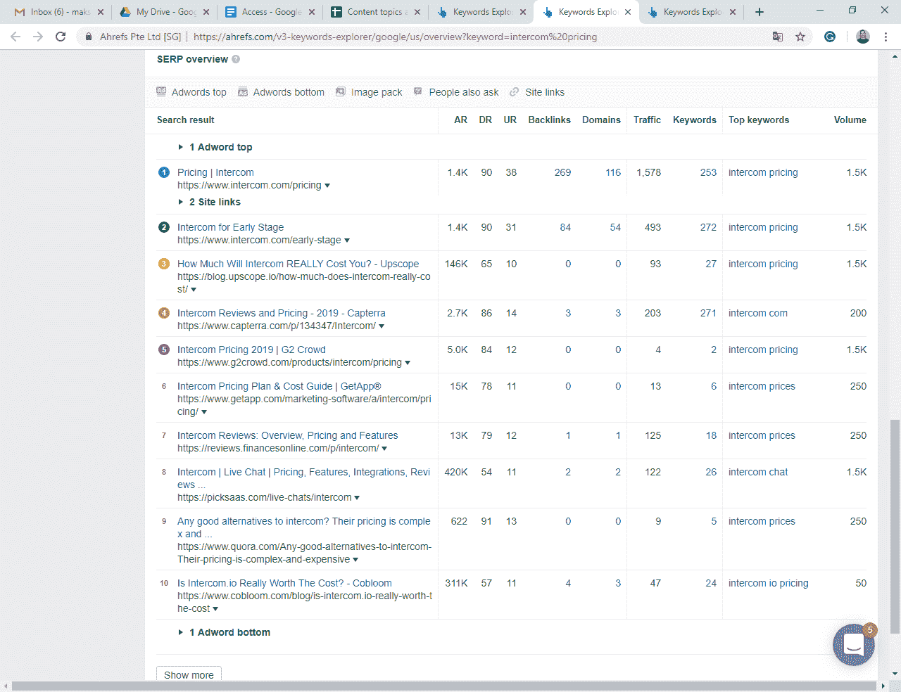
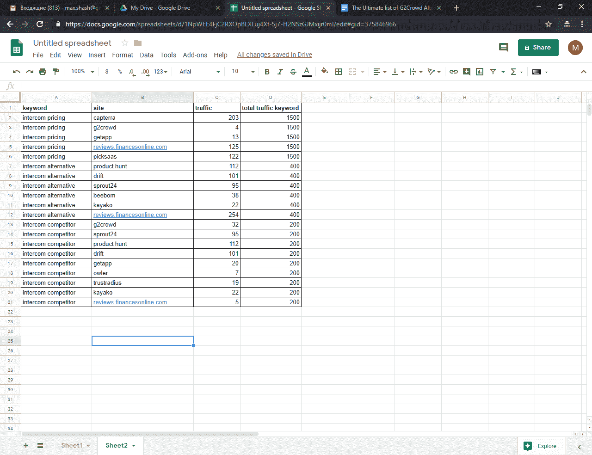
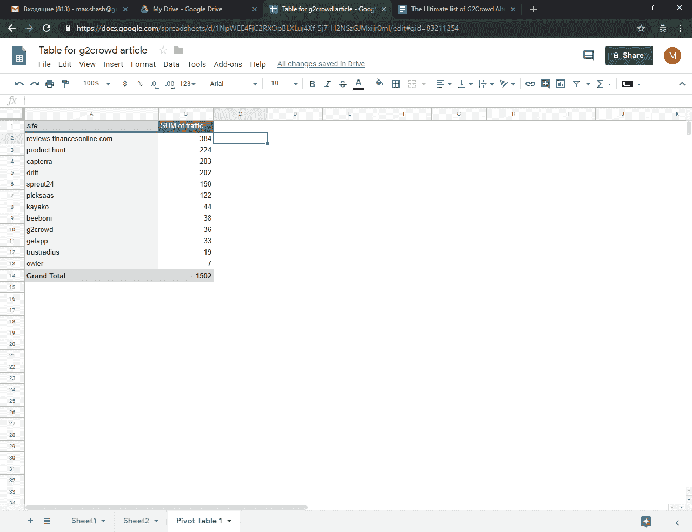

# G2 人群备选方案的最终列表，以及如何为您的 SaaS 选择正确的方案

> 原文：<https://medium.com/hackernoon/the-ultimate-list-of-g2crowd-alternatives-and-how-to-select-the-right-ones-for-your-saas-21f28b4c0207>

# **什么是 G2Crowd？**

G2Crowd 是用户评论最多的软件比较网站之一。其商业模式类似于 Indeed.com、Monster.com 等。简单来说，他们盗用了谷歌在一组小众搜索词上的搜索结果，如' {Product name} alternative '、' {Product name} pricing '和许多类似的词。只需在“{产品名称}”中键入任何软件名称，您就可以得到它。

# **你为什么要在乎？**

G2Crowd 可以成为社交证明和新线索的来源。在本文中，我将重点介绍新的销售线索部分。通过销售漏斗时，您的潜在客户通常会经历评估阶段。更准确地说，您的竞争、定价和价值主张正在这个阶段接受检查。潜在客户只需在谷歌中键入“{你的 SaaS 名字}定价”，就会立即转到 G2Crowd 页面。定价页面通常如下所示。

The pricing page typically looks like this

当您滚动到页面底部时，您肯定会注意到备选方案块和赞助块。

至少 90%的购买者在坚持使用你的服务之前会检查你的竞争对手的提议。这正是你从 G2Crowd 获得线索的方法。潜在客户只是在搜索你的竞争对手…然后他们就在你的网站上了！

我的一些来自 SaaS 公司的朋友把他们的营销放在了 G2Crowd 上，并从这个平台上获得了不错的线索。改善你的个人资料，获得评论，尽你所能在市场领先竞争对手的最佳选择中获得第一名——这是你应该执行的超越竞争对手的活动的最短列表。

A few slots where your product may appear

# **G2 人群备选方案的最终列表**

# 如何为您的 SaaS 选择合适的产品

有 20 多种可行的 G2Crowd 替代品，每天都有新的出现。

中小型企业无法承担所有 20+ G2Crowd 替代方案的费用。

这里有一个简单的数据驱动技术，告诉你如何选择正确的 G2Crowd 备选列表来关注。我向您展示了一些基于一个小而简单的数据集的原始示例。您拥有的数据越多，最终获得的价值就越大。

1.  定义谁是您搜索次数最多的竞争对手。

例如:如果我为 HelpCrunch 工作(这是最简化的内部通信系统，我的一个朋友就在这家公司工作)，我会选择 Intercom。

2.定义一组有限的你想涵盖的搜索词。

示例:内部通信替代方案、内部通信竞争对手、内部通信定价。

3.创建一个简单的 Google 工作表。

4.使用 ahrefs.com 或类似的服务，并打开关键字浏览器报告。

5.为每个关键字打开 SERP 概述。

6.导出到谷歌电子表格，并有一个三栏表:关键词，域名和流量。对列表中的每个关键词重复以上步骤。你的结局应该和我的差不多。

7.你现在所要做的就是制作一个数据透视表，并根据网站获得的总流量对其进行排序。

8.正如你所看到的，前六个网站获得了几乎 90%的流量。你应该关注它们，跳过后者。

9.瞧啊。你找到了你应该关注的网站。

有什么问题吗？