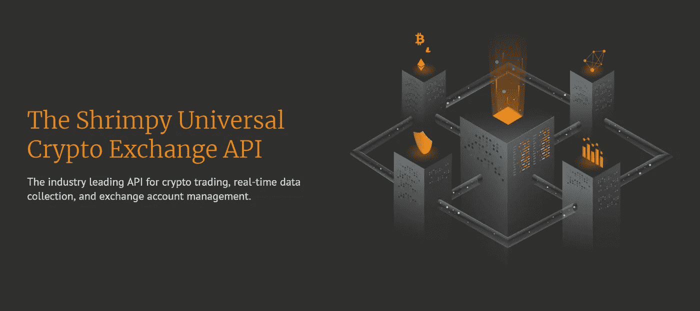
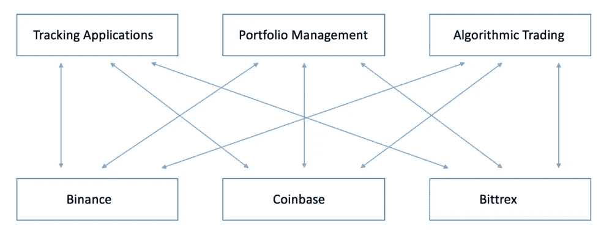
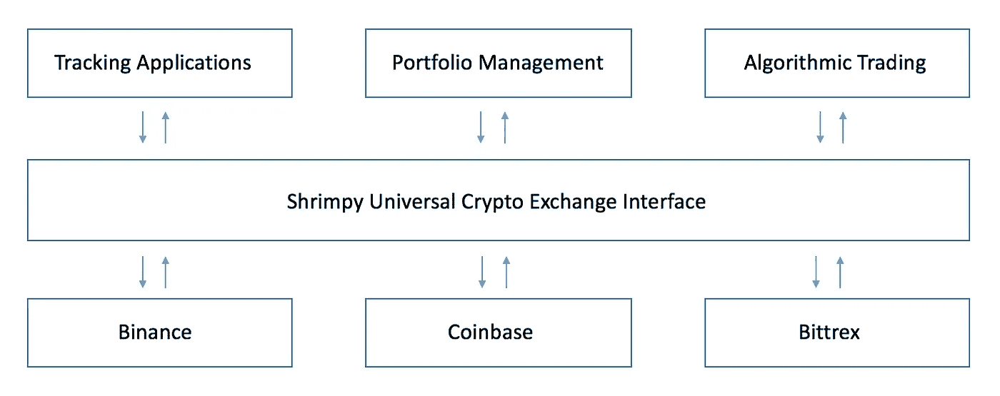

# 通用加密交换 API

> 原文：<https://medium.com/hackernoon/the-universal-crypto-exchange-apis-f67f875dd649>

> Shrimpy 发布了连接每个主要交易所的 API。免费报名[这里](https://developers.shrimpy.io/)。

加密货币社区的构建者面临的最大挑战之一是交换 API 的功能和质量的巨大不一致性。每个交换都有自己的怪癖，这对想要集成对一系列交换的支持的开发人员来说是一个不可能的挑战。每个交易所技术团队的突发奇想意味着事情可能会在没有通知的情况下发生变化，资产可能会意外变得不可用或未列出，您习惯使用的 API 调用可能会消失。没有已经建立的标准或最佳实践，因此与交易所打交道变得令人疲惫不堪。

The current way applications are built on top of exchanges is unsustainable. Even simple tasks become over complicated when dealing with the inconsistencies of exchanges. This places a significant burden on application developers.

经过几个月的开发，Shrimpy 团队发布了这个巨大问题的解决方案。我们已经厌倦了看着惊人的开发团队由于不受他们控制的安排而苦苦挣扎。密码社区应该得到更好的待遇。将加密技术带给大众需要一个统一的界面，在这个界面下我们可以访问和管理每一个交换。为开发团队提供创造不可思议的产品所必需的工具。

Our solution to this complex problem is a universal layer which sits between the application developers and exchanges. This eases the development and maintenance burden on developers and frees them up to focus on creating new and innovative products.

今天，Shrimpy 发布了[通用加密交换 API](https://developers.shrimpy.io/)。这些 API 将为下一波交易工具提供基础。Shrimpy 的通用 API v1 消除了加密交换的复杂性，提供了以下特性:

*   交易执行。
*   智能订单路由。
*   投资组合分配。
*   用户交换 API 密钥管理和安全存储。
*   Exchange 帐户数据收集。
*   市场行情数据收集。
*   实时完整的订单数据。
*   自动再平衡和战略执行。

这些特性中的每一个都被打包到 Shrimpy APIs 中，以便于第三方应用程序的访问和管理。这个通用的 API 在所有的交易所都是一样的。这意味着在不同的交易所交易就像指定交易所一样简单。将交易功能集成到您的平台从未如此简单。

# 它是如何工作的

假设您是一名开发人员，正在创建一个应用程序。你想要一个具有交易功能的产品，但你不想花时间去整合众多的交易所或管理列表、古怪的限制、数百台服务器和不断升级。相反，您可以按以下方式使用 Shrimpy。

1.  通过我们的 API 为您的每个用户创建一个 Shrimpy 帐户。
2.  允许您的用户最多连接 20 个 exchange 帐户。他们的数据由 Shrimpy 安全存储，因此您永远不需要管理这些 exchange 帐户。
3.  通过[通用加密交换 API](https://developers.shrimpy.io/)执行交易、收集数据、管理用户交换账户。

就是这样。这是开始与 Shrimpy 交易的三个简单步骤。它易于集成，无需维护。我们负责资产列表、交易所集成、交易逻辑、API 密钥安全和管理、资产分配、市场数据收集、用户数据检索，以及每天可以处理数百万笔交易的分布式系统的复杂性。我们花了一年多时间构建的东西，你可以立即集成。

# 代表团

Shrimpy 正在成为交易所的顶层，促进产品和服务的发展，从而推动加密货币的全球采用。我们的使命是通过改进开发流程以及提供设计简单、易于使用的服务，将加密货币带给每一个人。

> 使用 Shrimpy 通用加密交换 API 加速您的开发。

**今天就开始吧！免费报名** [**这里**](https://developers.shrimpy.io/) **。**

 [## Shrimpy 通用交换 API -构建未来

### 业界领先的加密交易、实时数据收集和交易账户管理 API。

developers.shrimpy.io](https://developers.shrimpy.io/) 

*最初发布于*[*blog . shrimpy . io*](https://blog.shrimpy.io/blog/the-universal-crypto-exchange-apis)*。*