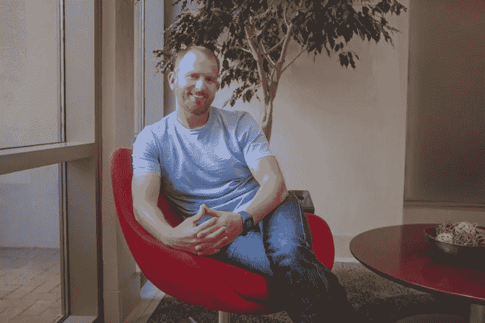

# 这位企业家在这轮融资开始前就采用了不同寻常的策略来筹集资金

> 原文：<https://medium.com/hackernoon/the-unusual-strategy-this-entrepreneur-used-to-raise-most-of-his-round-before-it-even-started-ffaa25a88509>

几年前，马修·克莱恩(Matthew Klein)和他的兄弟安德鲁(Andrew)看到零售业的格局正在发生变化，公司比以往任何时候都需要更大的灵活性。

两兄弟都曾在零售和产品设计领域工作过，他们知道设计过程是多么的笨拙和脱节。传统上，设计师、产品开发人员和制造商必须使用一系列不同的程序和沟通方法来将产品推向市场。马修知道一定有更好的方法。

他们的公司, [Backbone PLM](https://backboneplm.com/#/) ,为那些在设计过程中挣扎于灵活性的公司提供物理治疗。该软件为设计和产品开发过程建立了一个基础设施，为产品提供了一个协调的框架。

“我不是说每个品牌都必须是直接面向消费者的品牌，但这些是我们生活的赌注，”马修说。“客户比以往任何时候都希望更快地获得产品，订阅模式真正推动了供应链，从制造产品开始。”

**纽约的意外收获**

Andrew 和 Matthew 在种子期前的主要投资者是来自 [Beanstalk Ventures](https://www.crunchbase.com/organization/beanstalk-ventures) 的 Ken Seiff，他对零售业的理解帮助他们为公司制定了路线图。而且，就像许多完美的创始人和投资者组合一样，他们或多或少是偶然相遇的。

在去纽约旅行的最后一个晚上，马修碰巧在苏荷大厦遇到了一位老朋友。他们聊了起来，分享了他们正在做的事情。当那位朋友听说 Backbone 还处于非常早期的阶段时，他立即想把 Matthew 介绍给 Ken。

马修只是考虑了一会儿就取消了去开会的航班。

在整个回合中，马修以独特的坚持不懈继续追逐零售领域的投资者。肯在竞技场帮他联系上了。

“对我们来说，这在很大程度上是一个战略决策，让早期的资本表非常侧重于散户，直到我们为 A 轮带来一些更大的基金，”马修说。

当他们准备好种子期的时候，他转向了[蜘蛛资本](http://www.spidercp.com/)，这对于 Backbone 来说是完美的尺寸。

“我的策略是找一个不太大的大投资者，因为我们是一家成长中的企业，”马修说。“我真的希望有人能够亲自动手，卷起袖子，帮助我们制定适合产品市场的战略。对于资本表的其余部分，我希望由非常关注散户的投资者来完成。”

**你的人脉=你的资助人**

马修对回合的想法并不典型。

“在我们的职业生涯中，我们从来没有在资金问题上‘出局’，”马修说。“人们总是说，‘我们将在两到三个季度内融资。’我们总是找到一个投资者，他说，‘嘿，我们想把这个从桌子上拿开。’"

如何在不公开的情况下筹集一整轮资金？马修将精力集中在与他的关系网建立关系上。蜘蛛资本接手 Backbone 之后，并没有做额外的冷外联。

“我真的坚持我的观点，”他说。“我喜欢给另一个投资者一个热情的引导。我认为当你筹集资金时，这非常非常重要。如果有人把你介绍给投资者圈子里的其他人，这是一种直接的认可。”

他是这样做的:马修列出了一份大约 30 名目标投资者的名单。然后，他请求种子期和种子前期的领导帮助他缩小范围并开始对话。马修与潜在投资者会面，但他专注于建立关系，而不是寻求资金。

“我仍然会去见这些人，我真的开始与他们建立融洽的关系，”他说。

在整个过程中,“骨气”开始得到一些支持，马修将这种支持发挥到了他的优势。他们可以举出像 Stitch Fix、Warby Parker、Chubbies 和 Outdoor Voices 这样的客户作为成功案例，但马修继续阻止投资者。他告诉他们，Backbone 还没有筹集资金，但很快就会了。

“我们开始与一些令人兴奋的公司合作，”马修说。“全国各地的顶级基金开始让我们兴奋不已。”

最终，投资者开始问马修，他是否会考虑马上进行一些投资。他最终同意采取足够的早期条款清单，以抢占实际回合。

不管你有没有机会先发制人，马修给创业者的最后一条建议是，与一个愿意弄脏自己手的领投人合作。

“我在投资者身上寻找的是，特别是如果那个投资者将进入董事会，他将卷起袖子开始工作，”Matthew 说。

“你想问投资者的一件事，尤其是在你开始成长的时候，是‘糟糕的日子是什么样子的？’”他说“当我们遇到障碍时，你打算怎么办？”

“这是一个非常重要的问题，因为你希望投资者是会和你一起坚持到底的人。”

*内森·贝克德是 Foundersuite.com***的首席执行官，这是一个筹集资本和管理投资者的软件平台。自 2016 年以来，Foundersuite 已帮助企业家筹集了超过 10 亿美元的种子和风险资本。本文基于 Foundersuite 的* [*我是如何筹集到它的播客*](https://soundcloud.com/user-2586856/ep-68-how-i-raised-it-with-matthew-klein-of-backbone-plm-on-1042018) *中的一集，来看看创业公司创始人是如何筹集资本的幕后故事。**