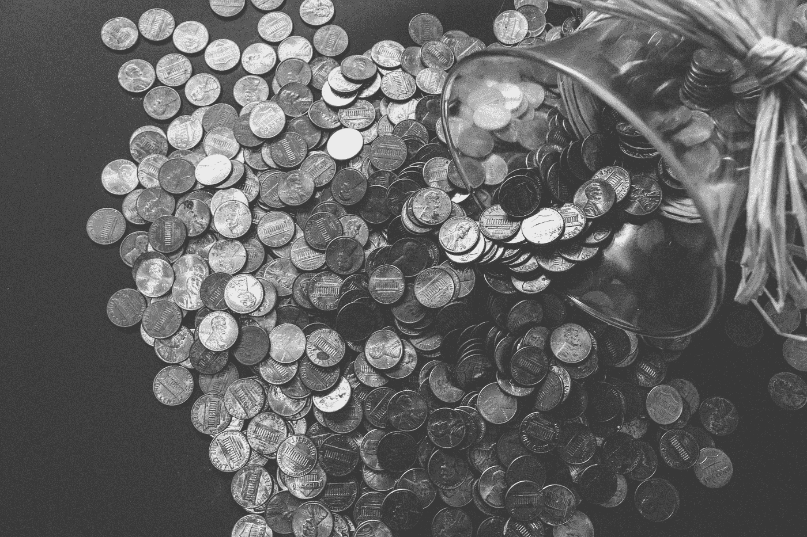

# 网络需要一种数字货币:无缝微支付的时代即将到来

> 原文：<https://medium.com/hackernoon/the-web-needs-a-digital-currency-the-time-for-seamless-micropayments-is-upon-us-64e3077ca283>

The founders of the web expected that the web will, one day, have a native currency. Some sort of digital cash or micropayment system that will be as integral to the proper operation of the space as links and passwords. Thirty years have passed, and there is no sign of the 402 error!

让我们回到 90 年代初，万维网的创始人和发明者蒂姆·伯纳斯·李正在研究人们在与网络互动时可能会遇到的错误。

他们创造的一些错误太熟悉了——404*未找到*错误已经成为一种文化轰动，以至于网站竞相拥有[最有趣的页面](https://travel.sygic.com/404)。其他的不太常见，但是你可能在某个时候见过，比如 *401 未授权*错误。但是，我敢打赌，你们中几乎没有人遇到过 *402 付款要求错误，*真是悲剧！

网络的创始人期望有一天互联网会有一种本地货币。某种形式的数字现金或小额支付系统，它将像链接和密码一样成为空间正常运行的一部分。三十年过去了，没有 402 错误的迹象，因为它是为将来使用而保留的。好了，女士们，先生们，我的同志们，是时候要求 402 付款页面了！(Shopify、MobileMe 和 Google Developer 是极少数曾使用过 402 错误的服务。)

你可能会想，既然我们可以免费获得东西，为什么我如此渴望为数字服务付费。首先，这不仅仅是为了数字服务；数字现金可以用来购买实物。此外，加密形式的支付将**允许数字小额支付**，**保护我们免受监视**(如果操作正确的话)，并且**消除我们已经习惯的在数字领域内转移资金的摩擦**。因此，有很多东西值得期待。不用说，所有的“免费东西”都破坏了互联网，损害了我们的民主制度。

 [## 数字广告:一种正在伤害我们的机构和社会的商业模式

### 众所周知，硅谷建立在线乌托邦的梦想并没有变成

medium.com](/@DAppProletariat/digital-advertising-a-business-model-that-is-hurting-our-institutions-and-our-society-787af05e7e0a) 

## 用数字货币支持内容创作者

拥有一种数字货币将允许内容的消费者通过在艺术家、作家、音乐家和摄影师每次参与他们的内容时向他们付费来支持他们。

想象一下，如果不为 NYT、Medium、Wired、Spotify、网飞等付费。每次你与出版物互动时，内容创建者会得到其中的一分或一小部分(微支付)。(比 Spotify 支付给艺人的费用高出半美分。)

这种微支付过程将允许取消付费墙，取消广告，并允许可靠的用户支持的生态系统。最重要的是，这可以通过网络浏览器(如[勇敢](https://brave.com/))或扩展(如 [MetaMask](https://metamask.io/) )自动发生。

随着 Web 3 和去中心化生态系统的出现，创作者可以直接受益并与他们的客户互动，而不需要任何中介。去中心化允许所有利润直接流向内容创作者，没有金融机构或中央生态系统从利润中提成。

最近在 [Ujo Music](https://www.ujomusic.com/) 上听了几首歌，对生态系统挺着迷的。把这个平台想象成去中心化世界的 Spotify。当粉丝购买艺术家的徽章或向他们捐款(使用数字货币 Ether)时，艺术家将从粉丝那里收到全部金额。更好的是，用户不必经历输入信用卡数据的繁琐过程；他们只需点击他们想要支付的金额，并在其 MetaMask 扩展上签署交易。

这个过程的流畅让我感觉自己生活在未来。也让我体会到了去除艺人和粉丝之间中介的力量。

**消除支付中的入职障碍和摩擦**

Y 你可能会说，支持内容创作者已经是可能的了(例如，通过他们的网站或 Patreon)。虽然我们确实可以支持我们喜欢的艺术家，但这个过程是有风险的，也是繁琐的。

每次你想支持一个平台，你必须创建一个账户，完成一堆表格，分享你的信用卡信息，等等。将您的身份数据和财务信息置于被黑客攻击或与第三方共享以获取收入的风险之中(监控资本主义)。

 [## 监控资本主义和数字广告摧毁了互联网

### 像“网络空间”这样的术语是新话，它们混淆了事实。数字领域与其他领域并无不同…

medium.com](/predict/surveillance-capitalism-and-digital-ads-have-broken-the-internet-a-better-world-is-possible-b743ff4bc2e2) 

支付和登机过程中的摩擦阻碍了许多人从小供应商那里购买，并促成了专制的生态系统——亚马逊和易贝。原生数字货币将使用户和小供应商更容易逃脱大技术的触角。

一个允许无摩擦登录(例如，通过 uPort 单点登录)和通过加密资产(例如，比特币)支付的世界将极大地提高将公民从巨型公司中解放出来的能力。

最后，要支撑的平台太多了。创建一个配置文件并支持我们使用的每个平台既费钱又耗时。更不用说，每笔交易都存储在一个数据库中，并与你的身份联系在一起，这使得公司很容易通过广告和国家监视你。

**加密资产将保护我们免受数字监控**

网络世界的生活就像 T2 这里的生活一样真实。在数字领域，公民应该有能力私下花钱，就像他们可以在实体店使用可替代现金一样，而不会被跟踪。

必要时，可以将相同的加密货币附加到一个人的自我主权身份上，这将允许所涉及的各方确认花钱者的身份。

身份验证应该是一项功能，而不是像现在这样默认设置。我怀疑你们中的许多人不想生活在一个你所做的一切都被存储的世界里，此外，当人们知道他们正在被观察时，他们的行为会有所不同。

无论是比特币还是不同的加密资产，网络最终都会有一种原生货币；一种国际通用的货币，居住在肯尼亚农村的人和居住在瑞典城市的人都可以使用。

我们越早为网络采用本地货币，我们就能越早致力于创造优先考虑用户利益的生态系统。