# 以太坊网络上的分散交换世界:概述

> 原文：<https://medium.com/hackernoon/the-world-of-decentralised-exchanges-on-the-ethereum-network-an-overview-ee25fc5f9f>

介绍无信任交易所的世界，在这里，资金不受中央实体的安全保护。它们的架构、市场概况以及与集中交易所的比较。

© Kittipong Jirasukhanont / Dreamstime

*声明披露既得利益:虽然本文旨在提供公正的概述，但作者隶属于*[*token . store*](http://token.store)*去中心化交易所*

分散式交易所是加密货币生态系统中一个有趣且有前途的部分。超过 15 亿美元的密码从中央加密货币交易所被盗。仅 Mt Gox 交易所黑客一项[就损失了当时流通中所有比特币的 6%](https://blockonomi.com/mt-gox-hack)。加密货币的主要声音都反对集中交易，Vitalik Buterin 表示，他希望[“集中交易尽可能多地在地狱燃烧”](https://techcrunch.com/2018/07/06/vitalik-buterin-i-definitely-hope-centralized-exchanges-go-burn-in-hell-as-much-as-possible/)，加密货币的先驱 Nick Szabo 称[可信的第三方为“安全漏洞”](https://nakamotoinstitute.org/trusted-third-parties/)。事实上，根据 Satoshi 的白皮书，摆脱“基于信任的模式”的意愿是比特币的一个基本原则。一种使交易和其基础区块链一样安全的解决方案最近才出现(用加密术语来说)。这种解决方案是分散交易所(dex)——为数字资产存款提供无信任流程的交易所。尽管如此，自从最初的扩散以来，近三年来，在分散交易所交易的加密货币的数量目前还不到据报道在集中交易所交易的数量的 1%。

本文简要概述了以太坊网络上分散式加密货币交易的现状。它 1)解释了什么是分散交易所，2)提供了一些历史背景，3)总结了市场上的指数期货的类型，4)展示了指数期货的市场概况，并讨论了如何对它们进行排名。随后，5)介绍了分散交易所的情况，6)说明了与集中交易所相比，分散交易所目前市场地位不高的一些简要原因。

# 1.什么是分散式交换？

加密货币爱好者和行业领袖并不完全同意“去中心化交易所”的确切定义。被广泛讨论的去中心化概念最好被视为一个范围:有许多自称为“去中心化”的交易所，事实上它们以不同的方式和不同的程度去中心化。

如果我们认为交易所的核心功能是资本存款、订单簿、订单撮合和资产交换，那么通常被认为是“去中心化”的交易所很少会分散所有这四个方面。然而，大多数“dex”分散了资本存款。

“分散式交易所”最普遍接受的定义是“**一种促进资产交换而不直接持有其用户资产的协议**”:交易所不持有存放资产的密钥，因此是“不可信的”。这可能涉及将资产存入智能合约，只有进行交易的用户才能从中提取资产。资金的无信任托管本质上赋予了交易所权利[称自己为去中心化](https://www.cryptocompare.com/exchanges/guides/what-is-a-decentralized-exchange/. Accessed)。

# 2.历史关联

© DM7 / Adobe Stock

通过非托管市场交易的第一批加密货币是通过所谓的[原子互换模型](https://blockgeeks.com/guides/atomic-swaps)执行的交易(原子互换的第一个完整账户是在 2013 年提供的)。原子互换技术之后是带订单簿的 dex 的兴起，比如 2016 年和 2017 年的全链上 Oasis 和 0x、EtherDelta 链外协议模型，比如 token.store(链外订单簿、链上订单匹配和链上结算)。到 2018 年，具有链外订单匹配的半分散模型占据了 DEX 的大部分市场份额。这些带有订单簿的 dex 以货币为中心，不能与其他区块链互操作。目前大多数代币都是建立在以太坊区块链上的(允许在 ERC20 代币之间交易——一种建立在以太坊上的代币)。也有在 Waves 上实现的 dex，2018 年下半年，EOS 和基于 Tron 的 dex 的交易量大幅增加。用户友好的跨链 dex 可能会在不久的将来开发出来。

# 3.以太网上的 dex 类型

目前至少有[40 多种不同的协议](https://github.com/distribuyed/index.)通过运营分散式交换机(全区块链)和[大约 100 种协议](https://github.com/distribuyed/index)，如果包括那些正在开发或处于早期阶段的协议。

为了比较分散式交易所的架构，有必要理解以下术语:

*   做市商:在订单簿中下单(限价单)让其他人接受的用户
*   市场接受者:接受做市商订单(通过即时订单)的用户
*   离线订单簿:用户下的限价订单不在区块链范围内
*   链上订单匹配:限价订单和即时订单在区块链上匹配
*   链上结算:代币的交换是以区块链结算的，而不是以链外的“我欠你的”为基础，后者发生在集中式交换中

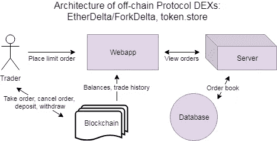

Architecture of off-chain protocol exchanges (such as EtherDelta/ForkDelta, token.store)

以太坊网络上的分散式交换可分为以下几类:

1.  链外协议/0x 协议:具有链上结算、链上订单匹配和链外订单簿的协议

*   包括 0x 协议和使用 0x 协议的继电器(如雷达继电器)
*   还包括 EtherDelta/ForkDelta 和使用类似智能合约的交易所(如 token.store)

2.完全在线:在线结算、在线订单匹配和在线订单簿

*   绿洲指数

3.半分散/混合交易所:链上结算、链外订单匹配和链外订单簿

*   IDEX，德克斯.托普，DDEX，比瑟姆.德克斯

4.流动性池:链上结算，但交易不是点对点的，而是交易者和流动性池之间的交易

*   凯伯网络公司

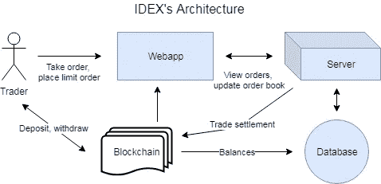

下表是利用互联网上的开源资源编制的。它概述了目前市场上的 ETH DEXs，指出了每个交易所可以归属于哪个 DEX 类别，以及每个 DEX 运行的协议。虽然提到的所有 dex 都是不可信的，因此不控制用户的私钥，但它们在不同程度上是分散的。所有 dex 都提供链上结算，但“半分散”或“混合”交易所和流动性网络(也可被视为“半分散”)具有链外订单匹配。只有流动性网络没有点对点交易(交易发生在用户和流动性池之间)。”完全去中心化的 Oasis DEX 是唯一一家拥有连锁订单簿的交易所。“中继”是拥有自己的离线订单簿的交易所，是 0x 网络的一部分。“链上协议”交换是 dex 的最早模型之一，它有类似于 EtherDelta 的智能合约。它们像 0x 网络上的中继器一样分散。

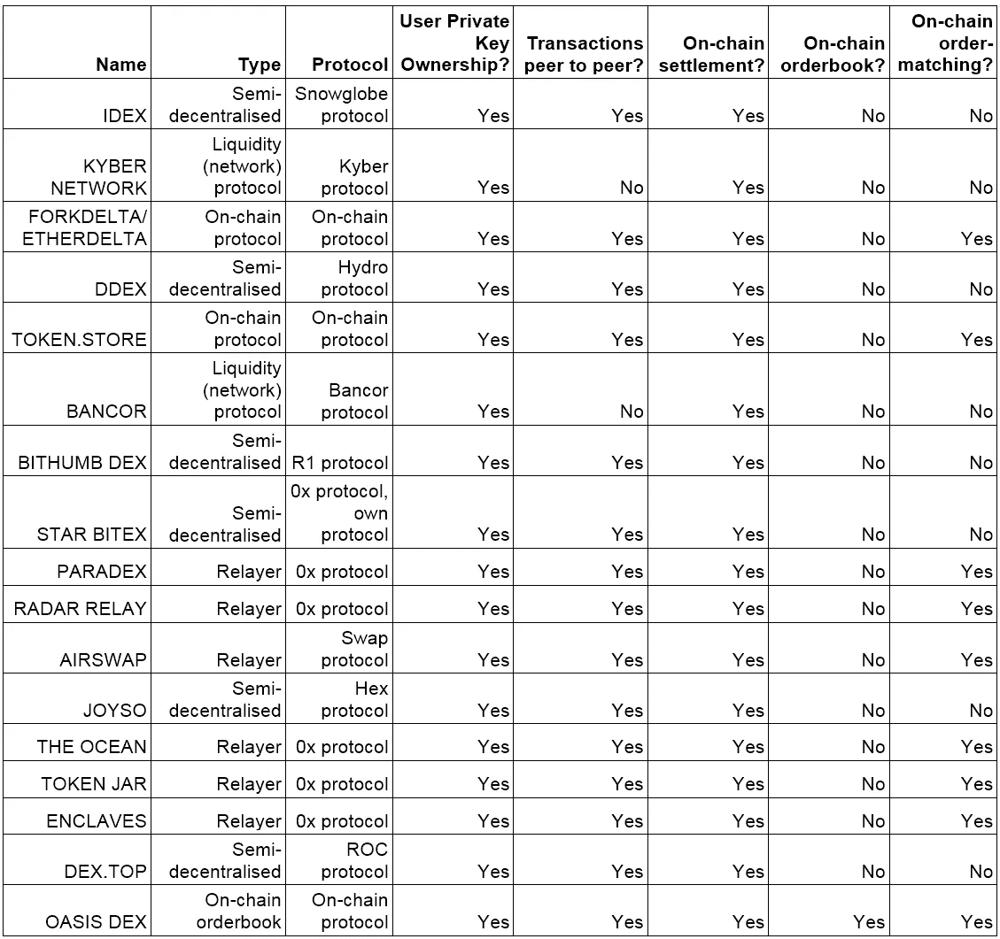

三家 dex 公司目前通过 IP 地址封锁阻止来自美国的用户访问他们的网站，原因是该国的监管不确定性([见 SEC 诉 Zachary Coburn 案](https://www.sec.gov/news/press-release/2018-258))。“需要 KYC”栏显示了 dex 对了解客户的不同要求，大多数 dex 不要求用户注册，并允许他们保持匿名。

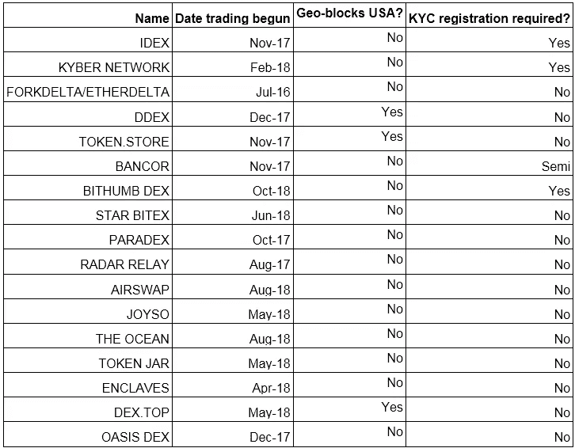

# 4.市场份额概述

有几个参数可以用来判断 DEX 的市场份额。值得注意的是，以下指标是对一个智能合约进行的交易的指示:在不同网站进行的交易，但在一个智能合约(如 etherdelta.com 和 forkdelta.app)上进行的交易计入一个智能合约的指标。以下指标可用于估计各交易所在基于 ETH 的 dex 市场中所占的份额。需要进行更仔细的检查，以确定每个交易所服务的代币的不同利基。

## a.卷

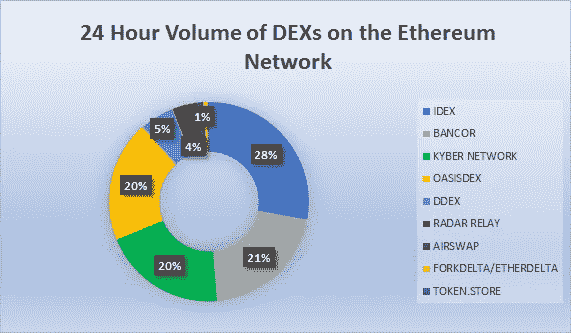

Data from [CoinMarketCap](http://coinmarketcap.com). Accessed 3-Apr-19

交易量是许多用户对交易所进行排名时首先考虑的一个因素。CoinMarketCap——crypto 中访问量最大的网站之一，使用交易量对交易所进行排名。然而，交易量很容易被与自己交易的机器人伪造。这在中央交易所尤其普遍，也很容易做到，因为在 CEXs(不像在 dex)结算交易不需要支付汽油费。区块链透明研究所(block chain Transparency Institute)的一项研究称，排名前 25 位的比特币交易对的非人为交易量[不到排名前 25 位的绝大多数集中交易所 CoinMarketCap](https://bitcoinist.com/binance-bitfinex-not-fake-volume/) 上显示的交易量的 1%。虽然必须支付汽油费才能在 dex 上创造人工交易量，但代币在所有交易所夸大其交易量是一种常见的做法。DEX 操作者对此无能为力，因为他们往往无法控制智能合约上发生的交易。

上图显示了 CoinMarketCap 上每个 DEX 的交易量。CoinMarketCap 交易量不能完全反映小型交易所的交易量，因为它不包括 CoinmarketCap 上未列出的代币交易量。以下 Etherscan 图表中描述的其他交易所不包括在内，因为它们没有在 CMC 中列出。

## b.交易数量

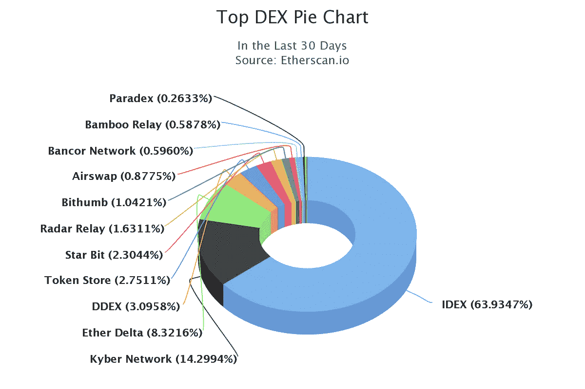

A representation of the proportion of total transactions made on each DEX on the Ethereum network in the past 30 days (accessed 3-Apr-19). Source: [Etherscan DEX Tracker](https://etherscan.io/stat/dextracker?range=30)

交易数量是另一个可以用来比较 dex 受欢迎程度的指标。以太扫描的指数跟踪器最突出的特点是比较指数。人工交易量在一定程度上影响交易数量，尽管机器人交易似乎是中高规模的，以限制支付的天然气量。与具有较少用户交易较大交易量的交易所(例如具有普遍的专业做市商的交易所)相比，具有较多用户交易较小交易量的交易所(例如列出小型空投代币的交易所)可能稍微过多。

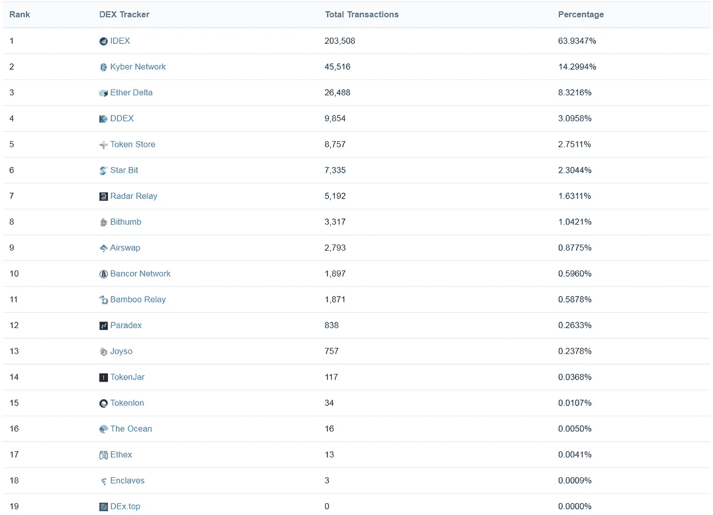

Number of transactions in the past 30 days on each DEX. Accessed 3-Apr-19\. Source: [Etherscan DEX tracker](https://etherscan.io/stat/dextracker?range=30)

## c.活跃用户数量

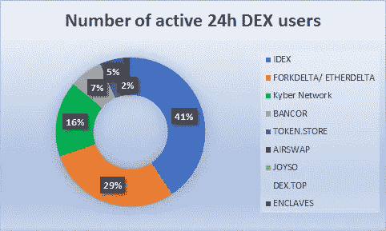

Data from [DappRadar Ethereum DEX rankings](https://dappradar.com/rankings/protocol/ethereum/category/exchanges). Accessed 3-Apr-19

一个不太为人所知的交易所排名指标是“活跃用户数量”。这是指在 24 小时的时间范围内在交易所进行交易的唯一以太坊地址的数量。这可能是交易所受欢迎的最大迹象，因为大多数创造人工交易量的机器人使用有限的地址在彼此之间进行交易，以简化管理。同样，与真实交易量相比，交易量较小的用户比例较高的交易所在这一指标中所占比例过高。

## d.每个站点的预计流量

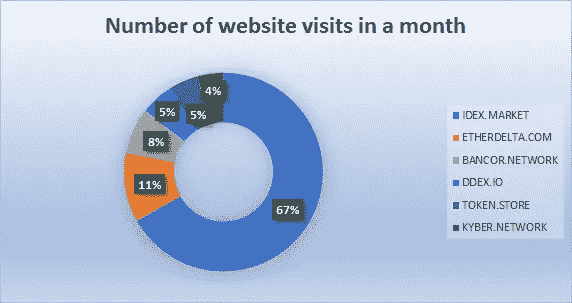

Data from [SimilarWeb](http://similarweb.com). Accessed 3-Apr-19

流量是一种相对较好地衡量交换受欢迎程度的指标，尽管对于不太受欢迎的网站(上表中未显示)无法准确估计流量。与其他指标不同，流量不太可能被操纵。与具有大量交易机器人(这种机器人通过 API 而不是通过交易所的网站/前端进行交易)的交易所相比，流量度量过度代表了具有更多交易量较小的人类用户的交易所。

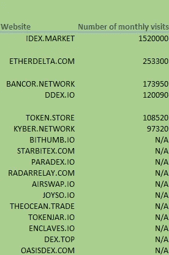

Data from [SimilarWeb](http://similarweb.com). Accessed 3-Apr-19

SimilarWeb 对大型网站的有机流量的估计尤其准确——研究表明，它对有机流量的估计精度为 1% ，对月访问量超过 100，000 次[的网站的总访问量高估了约 17%](https://www.omniconvert.com/blog/we-analyzed-1787-ecommerce-websites-similarweb-google-analytics-thats-we-learned.html) 。SimilarWeb 没有显示月访问量明显少于 100，000 的网站的流量:这就是为什么本文中通过类似网站测试的许多交流没有可用的流量数据。

## e.智能合同的平衡

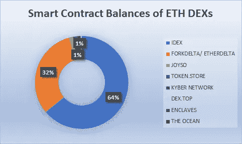

Data from [Etherscan](http://etherscan.io). Accessed 3-Apr-19

可以考虑智能合同中存放的 ETH 的数量。它不像交易量那样波动，在一定程度上显示了交易所用户的能力。与其他三种方法不同，它代表非活动或休眠用户。资金可以安全地保存在智能合约中，因此一些不活跃的“鲸鱼”可能会通过决定将他们的资产保存在智能合约中来不成比例地抬高某些交易所的排名。

# 5.为什么要分散交易？

## a.安全性

与集中式交易所相比，分散式交易所(dex)最重要的存在理由和优势是客户资金的无信任托管所提供的安全性。这一点很重要，因为从中央交易所窃取资金是客户的一个主要风险因素。2018 年，超过 10 亿美元的中央加密货币交易所被盗，截至第三季度末，损失达到 9.27 亿美元。

通过将资金委托给智能合同或协议，而不是集中的公司，人类的错误和贪婪作为风险因素在很大程度上被消除了；如果智能合约是以完全不可信的方式设计的。到目前为止，至少有一个案例，资金从一个自称为“去中心化”的交易所的智能合约中被盗:这在很大程度上是因为半去中心化交易所 Bancor 的智能合约具有很大的可塑性。

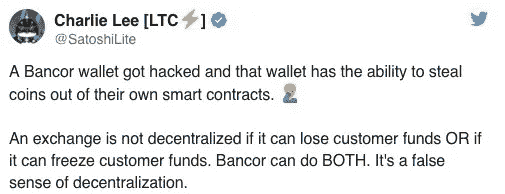

有人可能会说，Bancor 和 IDEX 等半分散化交易所不应被贴上“DEX”的标签，因为它们并非完全不可信。虽然资金保存在智能合约中，但 IDEX 和班科尔可以冻结客户的资金。

然而，完全去中心化的交易所(如 EtherDelta 和 token.store)不具备冻结资金的能力，它们的智能合约也从未遭到黑客攻击。然而，这些 dex 仍然有一些弱点。 [EtherDelta 遭受了一次网络钓鱼攻击](https://www.ccn.com/cryptocurrency-exchange-etherdelta-hacked-in-dns-hijacking-scheme/)，其网站遭到破坏(智能合约中的资金仍然安全，但一些用户被诱骗将他们的私钥输入到被攻击的网站中)

## b.匿名

绝大多数分散式交易所不需要“了解你的客户”( KYC)注册或登记:用户只需通过 MetaMask 等浏览器插件连接他们的加密货币钱包，或者导入或创建本地钱包，就可以匿名交易。大多数集中交易需要相对较长的注册过程，在这个过程中，他们需要用户的电子邮件和其他个人信息。这是由于大部分 dex 的智能合约的设计，以及在一定程度上 dex 面临的较低监管风险。

## c.法律压力

分散式交易所的监管地位在很大程度上仍不确定。但是，用户可以确定某些 dex 不会被关闭，因为某些 dex 的智能合约不能脱机。虽然 dex 的创始人可能会迫于压力关闭网站，但任何人都可以创建一个新网站，与现有的智能合约进行互动(这适用于完全分散的 dex 类别，即智能合约无法从根本上改变或暂停的 dex)。ForkDelta 就是一个与 DEX 的智能合约交互的非 DEX 所有者网站的例子。

虽然 IDEX、DDEX、DEx.top 和 token.store 等交易所由于监管压力已经从地理上阻止了一些州或整个美国的网站，但美国人可以继续使用 Etherscan 的“Write Contract”等工具与智能合约进行交互。

## d.透明度和可预测性

大多数去中心化交易所的费用和一般运作更加透明和可预测，因为它们是根据智能合约中的内容运作的。然而，如果将重大变化的可能性编码到智能合约中，某些智能合约可能是可预测的不可预测的。此外，【DAO】的崩溃已经证明了对智能合同进行更好的安全审计的必要性。

# 6.dex 面临的问题

## a.单一区块链交易

尽管 dex 提供了更高程度的安全性，但只有一小部分加密货币在 dex 上交易，这是有原因的。最明显的原因是，易于使用的 dex 仅提供一种区块链的交易:前 10 大加密货币中的大多数都在不同的区块链，因此 BTC/ETH 等加密货币对不能在用户友好的 dex 上交易。

## b.难以使用

然而，就 ERC20 代币的交易量而言，币安等集中式交易所也超过了 dex。这最终是由于交易者目前更喜欢外链交易的简单性和速度，而不是安全性。

对于初学者来说，dex 通常难以使用:一些 dex 缺乏自动订单匹配，并且具有相对复杂的存放到智能合约的方式(例如，包装 ETH)。

## c.不实用

dex 存在流动性问题，部分原因是 dex 的链上订单匹配要求用户支付汽油费来取消限价订单。Bancor 和 IDEX 等半分散的 DEX 具有链外订单匹配，并提供新颖的流动性解决方案，但由于上述原因，其交易量相对较低。

链上协议 dex 也面临订单冲突的问题:当市场参与者(A)试图接受限价订单时，另一个用户(B)也可能试图接受，而 A 的即时订单正在区块链上被确认(由于链上订单匹配)。如果 b 支付更高的油费，他也许能抢在 A 之前拿到 A 试图拿到的订单。在这种情况下，A 的交易将失败，他将不得不为失败的交易支付气费(矿工费)。

半分散的交易所不会面临这样的问题。然而，用户在 IDEX 等交易所支付的天然气费用要高于离线协议 DEX。这可能会推动用户(尤其是接受交易费回扣的做市商)在 CEXs 上交易。

## d.少数高级功能

dex 的交易功能远不如顶级中央交易所。虽然 Expo/dYdX 等 dex 提供保证金/空头令牌(杠杆化 ETH 和空头 ETH)交易，但主流分散式交易所不提供保证金交易或用于交易所内技术分析的灵活界面。通过 dYdX 协议进行的交易量也很低(截至发稿时低于 4 万美元)；这是一种比集中式杠杆交易平台更复杂的产品。

# 结论

数字货币的安全交易非常需要分散/不可信的交易所:就其本质而言，集中式交易所极易受到人为错误、贪婪和黑客风险的影响。以太坊网络有各种不同架构的 dex。然而，以太坊网络上完全不可信的交换在功能上输给了集中式交换。对于 EOS 网络上的分散式交易所来说，情况并非如此，这里的交易比传统的 cex 更加顺畅。然而，不可信交易所尚未以用户友好的方式促进跨链交易。

# 谢谢

如果你喜欢这篇文章，请按住“鼓掌”按钮 50 次，这有助于我获得曝光率:)

# 关于我的一点

我是 token.store 的 CBDO，是 UCL 和巴黎政治大学的双学位学生。对区块链和历史感兴趣。

# 参考

区块链透明研究所(2018 年 12 月)。*交流卷报告**2018 年 12 月。*详见:[https://www . block chain transparency . org/December-2018-rankings](https://www.blockchaintransparency.org/december-2018-rankings)。于 2019 年 3 月 31 日访问

街区极客。*什么是原子互换？*可在:[https://blockgeeks.com/guides/atomic-swaps/](https://blockgeeks.com/guides/atomic-swaps/)买到。于 2019 年 3 月 31 日访问

CipherTrace 加密货币情报(2018 Q3)。*加密货币反洗钱报告*。可查阅:[https://cipher trace . com/WP-content/uploads/2018/10/crypto _ AML _ report _ 2018 Q3 . pdf](https://ciphertrace.com/wp-content/uploads/2018/10/crypto_aml_report_2018q3.pdf)。于 2019 年 3 月 31 日访问

路易斯安那州库恩市(2018 年 7 月 26 日)。Waves 的分散式交易所首次亮相就获得了 600 万美元的收入。然后就被黑了。可在:[https://www.coindesk.com/waves-crypto-exchange-bitcoin](https://www.coindesk.com/waves-crypto-exchange-bitcoin)买到。于 2019 年 3 月 31 日访问

分布式和 al。地点:[https://github.com/distribuyed/index](https://github.com/distribuyed/index)。访问日期:2019 年 4 月 1 日

Langridge，P. (2016) *网站流量估算者的准确度如何？。*见:*[https://www . screamingfrog . co . uk/how-accurate-are-website-traffic-estimators/](https://www.screamingfrog.co.uk/how-accurate-are-website-traffic-estimators/)。访问日期:2019 年 4 月 1 日*

*埃里克·拉切维克(2018 年 12 月 29 日)。2018 年:密码交易所黑客攻击破纪录的一年。在 Coindesk。可在:[https://www . coin desk . com/2018-a-record-breaking-year for-crypto-exchange-hacks 获取。](https://www.coindesk.com/2018-a-record-breaking-year-for-crypto-exchange-hacks.)于 2019 年 3 月 31 日访问*

*Luu，Loi(最后更新于 2017 年 8 月 14 日)。*解决分散交易所的流动性挑战*。在 Coindesk。可在:[https://www . coin desk . com/solving-liquidity-challenge-decentralized-exchange](https://www.coindesk.com/solving-liquidity-challenge-decentralized-exchanges)查询。于 2019 年 3 月 30 日访问*

*骏利电子(2018 年 12 月 17 日)。*前 10 大交易所中，只有币安、Bitfinex 不做假量。*可用地点:[https://bitcoinist.com/binance-bitfinex-not-fake-volume](https://bitcoinist.com/binance-bitfinex-not-fake-volume/)。2019 年 3 月 31 日*

*南喀特瓦尼(2018 年 10 月 13 日)。*分散式加密交易所与币安、Bittrex 等集中式交易所。*可在:[https://coin sutra . com/decentralized-vs-centralized-crypto-exchange/](https://coinsutra.com/decentralized-vs-centralized-crypto-exchange/)获得。于 2019 年 3 月 31 日访问*

*卢佩克岛(2017 年 11 月 22 日)。*我们用 SimilarWeb 和 Google Analytics 分析了 1787 个电子商务网站，这就是我们了解到的情况。*可在:[https://www . omni convert . com/blog/we-analyzed-1787-ecommerce-websites-similar web-Google-analytics-thas-we-learned . html](https://www.omniconvert.com/blog/we-analyzed-1787-ecommerce-websites-similarweb-google-analytics-thats-we-learned.html)。访问日期:2019 年 4 月 2 日*

*安东尼奥马德拉岛(2016 年 11 月 23 日)。*什么是分散式交易所？*在 CryptoCompare。可从以下网址获得:[https://www . crypto compare . com/exchange/guides/what-is-a-decentralized-exchange/](https://www.cryptocompare.com/exchanges/guides/what-is-a-decentralized-exchange/)。于 2019 年 3 月 31 日访问*

*中本聪(2008 年 10 月 31 日)。比特币:一种点对点的电子现金系统。https://nakamotoinstitute.org/bitcoin/的有售。于 2019 年 3 月 31 日访问*

*安德鲁·诺里(2018 年 11 月 19 日)。Mt Gox 黑客的历史:比特币最大的抢劫案。在 Blockonomi。上市时间:[https://blockonomi.com/mt-gox-hack/.](https://blockonomi.com/mt-gox-hack/.)2019 年 3 月 31 日*

*西格尔博士(2016)。*悟道攻道。*在 CoinDesk。可在:[https://www.coindesk.com/understanding-dao-hack-journalists](https://www.coindesk.com/understanding-dao-hack-journalists)买到。访问日期:2019 年 4 月 1 日*

*尼克·萨博(2001 年)。*可信第三方是安全漏洞*。于 2019 年 3 月 31 日在 https://nakamotoinstitute.org/trusted-third-parties/.[可用](https://nakamotoinstitute.org/trusted-third-parties/.)*

*j .威尔莫斯(2017 年 12 月 21 日)。*加密货币交易所 EtherDelta 在 DNS 劫持方案中被黑。*可在:[https://www . ccn . com/cryptocurrency-exchange-ether delta-hacked-in-DNS-jacking-scheme](https://www.ccn.com/cryptocurrency-exchange-etherdelta-hacked-in-dns-hijacking-scheme/)获得。于 2019 年 3 月 31 日访问*