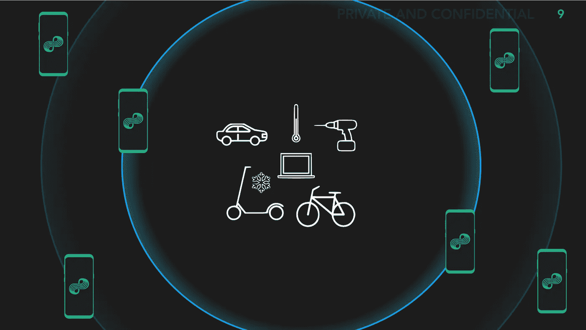

# 物联网连接的世界

> 原文：<https://medium.com/hackernoon/the-world-of-iot-connectivity-3f3867620173>

Representation of The Nodle Network, also named “The Citizen Network”

## 如何为您的物联网项目选择“足够好”的解决方案

在 [Nodle](http://nodle.io) 我们的使命是建立世界上最大的连接物联网(IoT)的无线网络。

> 我们团队的大部分成员都有移动和无线的背景:**我们用首字母缩略词说话，认为无线电很有味道。**我们知道物联网非常令人兴奋，但事实证明，它比所有人预期的都更难实现。

物联网不是一回事。它是跨越几十个行业的数千个用例。因此，最大的问题之一是找到一种简单且足够好的方法来连接所有这些设备。这确实需要一个通信网络，而且可能不止一个。

选择网络时有许多因素要考虑，每个网络都有自己的优点和缺点。

# 当公司选择他们的网络时，他们有三件事要考虑

## 1)连接到该网络所需的模块成本(资本支出)

## 2)使用网络的每月成本(Opex)

## 3)该网络的能力(特征)

## 4)启动和运行网络所需的工作量(管理难题)

前两个问题相当简单。许多公司出售用于连接的芯片和模块。世界上的每一家电信运营商都可以为他们的物联网服务向你报价。不幸的是，在许多情况下，这些费用令人望而却步。如果你想跟踪一个 50 美元的木箱，安装一个 40 美元的蜂窝模块是没有意义的。虽然电信运营商已经建立了令人印象深刻的始终在线、高度可靠的网络，但许多用例并不需要这些服务级别。每种类型的网络的特征也随着覆盖范围、漫游、数据速率和定位精度的不同而有很大的不同。

## 还有最后一个因素——让一切正常运转。

例如，一家公司的仓库中可能有一个强大的 Wi-Fi 网络，但当货物离开该网络时会发生什么呢？另一家公司可能会将蜂窝模块附加到他们的硬件上，但如果他们将它运送给另一个国家的客户，该客户将安装本地 SIM 卡并在另一家电信运营商上重新认证？另一个主要问题是，物联网网络必须与现有的硬件一起工作，为最新的无线电技术设计硬件需要太长的时间。

> 最理想的是**一个可以用现有硬件开箱即用的网络**，和**一个可以在世界任何地方使用的网络**，如果价格合理的话也不错。

好消息是，Nodle[已经完全做到了这一点。我们从蓝牙开始。我们的系统可以容纳其他无线电，但蓝牙有很多优势。首先，它是地球上部署最广泛的无线电技术。](http://nodle.io)

估计各不相同，但市场上可能已经有 1000 亿个蓝牙设备。我们发现，如今每个制造电子产品的人都在添加蓝牙技术，该行业今年将售出 40 亿台蓝牙收音机。

如果你有带蓝牙的硬件，它现在可以和 Nodle 网络通信。设置只需几分钟，不再需要六个月的配置周期。我们的服务在美国和加拿大覆盖全国，并在 80 多个国家开展业务。

然而，我们认识到每个客户都有不同的要求，物联网将依赖于各种网络。我们认为这些网络是互补的，物联网将需要多个网络协同工作来实现其全部潜力。

大致说来，我们在市场上合作的网络还有四种类型:

# 无线保真

人人喜爱的家庭和办公室网络技术。Wi-Fi 改变了我们对数据连接的看法，将我们从电缆的暴政中解放出来。然而，今天的 Wi-Fi 漫游效果并不好。每个网络都需要身份认证，这往往会将使用情形与一组预先确定的位置联系起来。

# 蜂窝:2G 到 5G

蜂窝技术仍然是卓越的移动连接解决方案。它永远在线，在地球上的大部分地方都能工作，并且有相当大的带宽。蜂窝的缺点是，许多电信运营商仍在寻找物联网的出路。他们的计费和后端系统不是为物联网中设想的连接规模而设计的。虽然价格已经大幅下降，但月费和模块成本仍高于许多替代产品。

# 低功率远程系统

近年来，几家公司倡导推出面向物联网的网络。LoRA 和 SigFox 等技术旨在提供低功耗连接。然而，这些公司很难建立生态系统。用户需要在他们的硬件中安装新的无线电设备，并且必须有人来构建到达所有这些设备所需的天线和基站。网络的房地产方面需要很多时间。因此，我们倾向于看到这些系统部署在不同的“孤岛”中，服务在城市的子集或特定的私有部署中工作。

# 其他新兴标准

还有许多其他的技术。例如，Zigbee 已经在许多家庭自动化(例如电灯开关)和工业设置(例如工厂地板传感器)中变得流行。另一家私营公司 Helium 最近也推出了自己的 Zigbee 变种，采用了另一种无线电标准。氦寻求让其他人通过购买他们的“热点”来建立自己的网络，并用他们的加密货币奖励这些人。这些标准部分受到标准的范围和数据速率的限制。但是他们也面临着一个更大的问题，那就是建立一个互联设备的生态系统。例如，虽然氦可能能够以其当前的激励机制来建立其基础设施，但很少有设备内置氦无线电。构建这些生态系统需要很多年。

> 我们鼓励任何希望制定物联网战略的人评估所有技术。有些人会找到明显的契合点，有些人则需要权衡利弊。根据我们的经验，许多物联网部署最终会使用多种技术，通常是一个主要技术和一个备份技术。您的部署的确切组合将有所不同，但现在可以连接世界上任何地方的任何电子硬件。

*由* [撰写*杰·戈德堡*](https://medium.com/u/ea79e1249ad9?source=post_page-----3f3867620173--------------------------------) *经常撰写关于技术、金融和战略方面的文章* [*位数到美元*](https://digitstodollars.com/)