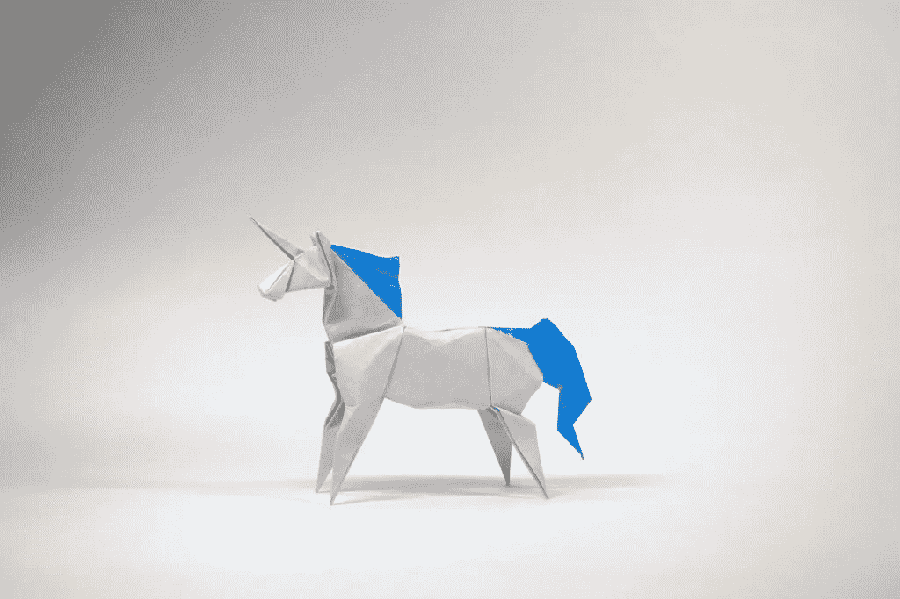
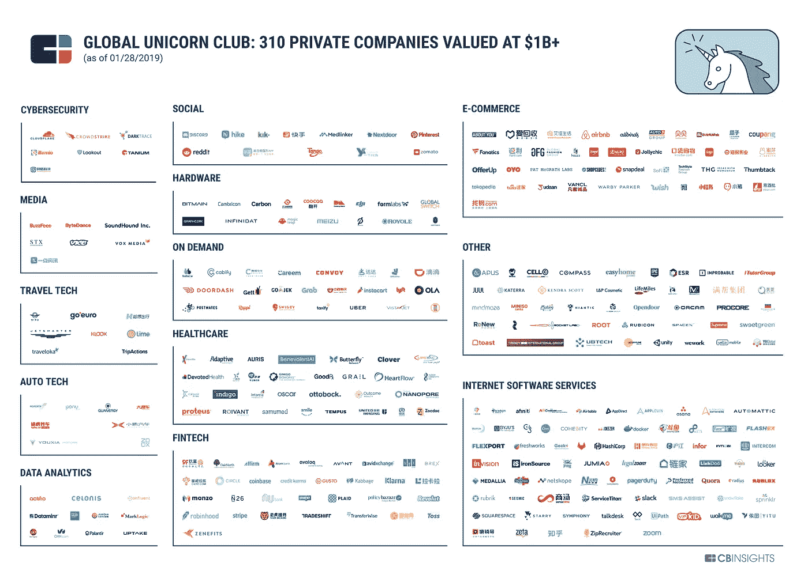

# 🦄全球 310 家独角兽企业的市值超过 1 万亿美元

> 原文：<https://medium.com/hackernoon/the-worlds-310-unicorns-are-valued-at-over-1-000-billion-3987e8a56900>

## 根据 CB Insights 的独角兽追踪器，独角兽总共筹集了近 2570 亿美元。

创业和风险投资情报公司 [CB Insights](https://medium.com/u/914088e570e?source=post_page-----3987e8a56900--------------------------------) 的数据显示，截至 2019 年 1 月，全球共有 310 家私营公司估值超过 10 亿美元。去年，112 家新公司加入了全球独角兽俱乐部，比 2017 年的 71 家新独角兽增加了 58%。

CB Insights 目前确定的所有独角兽的总价值为 10，520 亿美元，并在一份新的信息图表中公布了 13 个类别。它们总共筹集了近 2570 亿美元。

Credits: CB Insights

市值排名前十的独角兽是:

1.  字节跳动(价值 750 亿美元)
2.  [优步](https://medium.com/u/b97b1b381b5a?source=post_page-----3987e8a56900--------------------------------)(720 亿美元)
3.  滴滴出行(560 亿美元)
4.  [we work](https://medium.com/u/52d87163016d?source=post_page-----3987e8a56900--------------------------------)(470 亿美元)
5.  Airbnb(293 亿美元)
6.  太空探索技术公司(215 亿美元)
7.  帕兰蒂尔和[条纹](https://medium.com/u/3ecae35d6d66?source=post_page-----3987e8a56900--------------------------------)(200 亿美元)
8.  朱尔实验室和 Epic Games(150 亿美元)
9.  Pinterest、比特大陆科技和 samu med(120 亿美元)
10.  Lyft、GrabTaxi 和 Global Switch(110 亿美元)

就上榜国家而言，大多数独角兽来自:

*   🇺🇸美国拥有 150 家独角兽，占总数的 49%——自 2018 年 8 月以来上升了 2 个百分点；
*   中国🇨🇳(84 家，包括 1 家香港公司)，占 26%，低于去年夏天的 30%；
*   欧盟中🇪🇺 33 个(英国🇬🇧 16 个，占 6%；德国的🇩🇪9；法国的🇫🇷2；🇪🇪爱沙尼亚、🇱🇺卢森堡、🇲🇹马尔他、🇵🇹葡萄牙、🇪🇸西班牙、🇸🇪瑞典各 1 个)；
*   印度的🇮🇳 14，占 4%

每个地区估值最高的独角兽是:

*   中国的🇨🇳字节跳动(估值 750 亿美元)；
*   美国的🇺🇸 [优步](https://medium.com/u/b97b1b381b5a?source=post_page-----3987e8a56900--------------------------------)(720 亿美元)；
*   新加坡的🇸🇬·格拉塔希和英国的🇬🇧全球开关(均估值 110 亿美元)；
*   🇮🇳 One97 通讯在印度(100 亿美元)；
*   南韩的🇰🇷古邦(90 亿美元)；
*   瑞士的🇨🇭·罗万特科学公司和印度尼西亚的🇮🇩·托科普迪亚公司(均为 70 亿美元)。

十大最古老的独角兽是:

*   VANCL(中国)，2010 年 12 月以来的独角兽；
*   [Palantir](https://medium.com/u/1529195d9f13?source=post_page-----3987e8a56900--------------------------------) (美国)自 2011 年 5 月；
*   Airbnb(美国)自 2011 年 7 月；
*   [Klarna](https://medium.com/u/a214eb632ed5?source=post_page-----3987e8a56900--------------------------------) (瑞典)自 2011 年 12 月；
*   新潮集团国际(中国)自 2012 年 2 月；
*   Pinterest(美国)自 2012 年 5 月；
*   狂热分子(美国)自 2012 年 6 月；
*   [Cloudflare](https://medium.com/u/a00e599743a7?source=post_page-----3987e8a56900--------------------------------) (美国)和 SpaceX(美国)自 2012 年 12 月；
*   穆·适马(美国)自 2013 年 2 月起；
*   Automattic(美国)自 2013 年 5 月起。