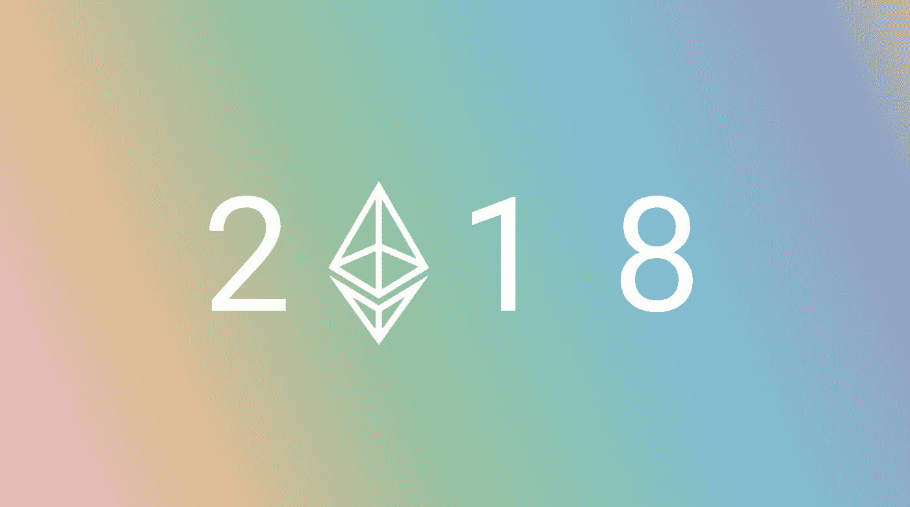
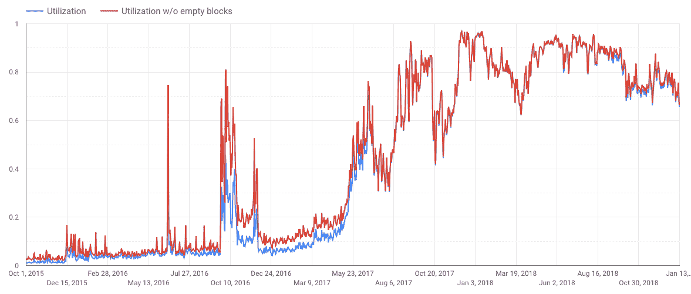
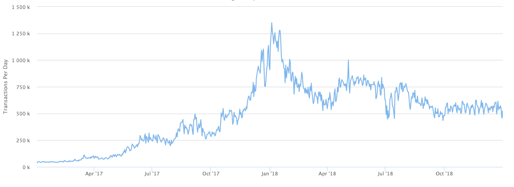
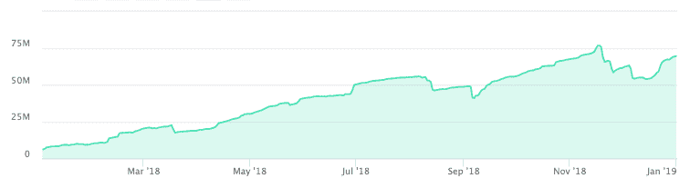
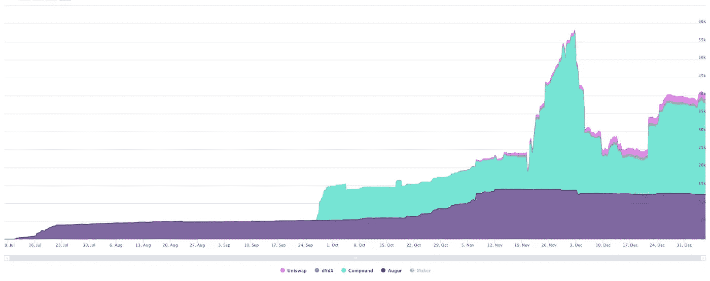
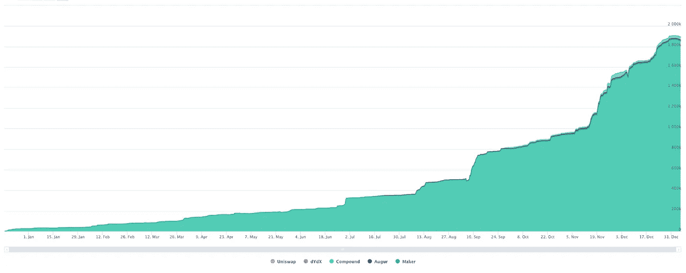
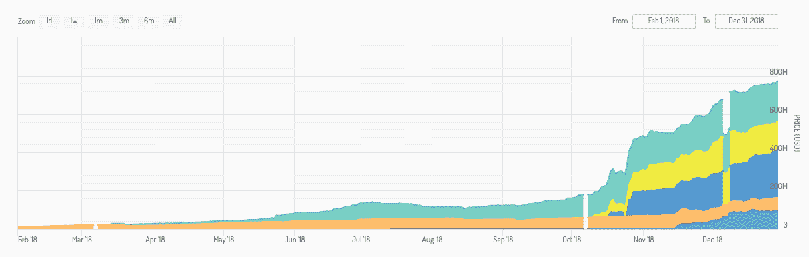
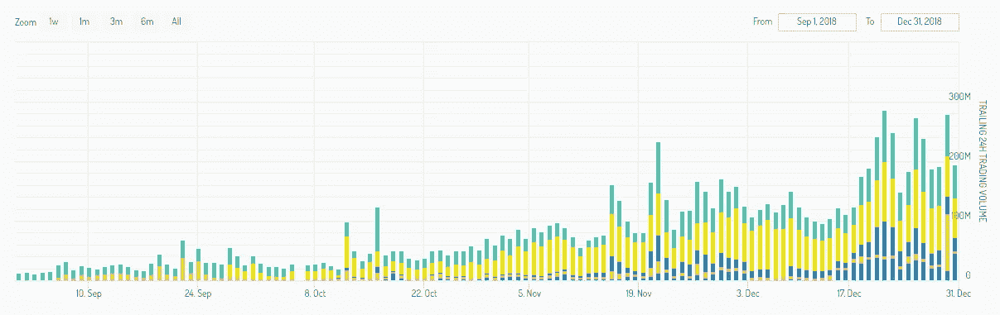
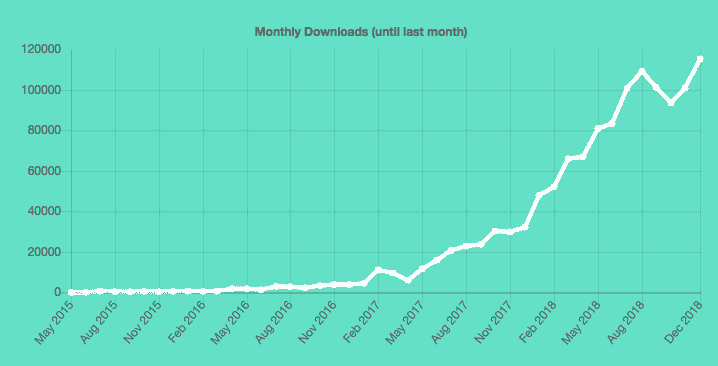
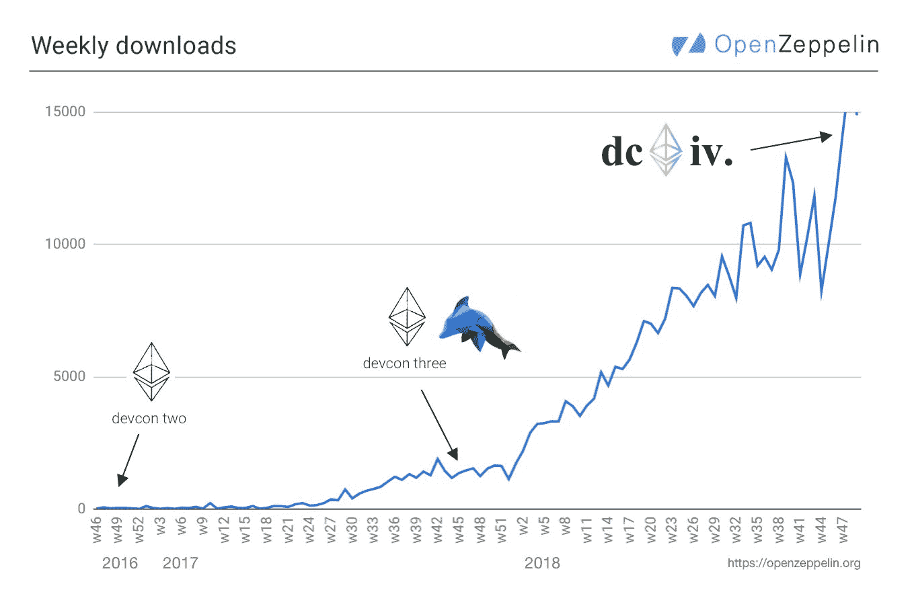

# 以太坊实验年

> 原文：<https://medium.com/hackernoon/the-year-of-the-ethereum-experiment-62e0d46c4f82>

*由* [*约什·斯塔克*](https://twitter.com/0xstark?lang=en)*[*埃文·范尼斯*](https://twitter.com/evan_van_ness?ref_src=twsrc%5Egoogle%7Ctwcamp%5Eserp%7Ctwgr%5Eauthor) *和* [*丹尼尔·扎克里森*](https://twitter.com/danielzak)*

**

***以太坊开始是一个大胆的实验。我们能为数字货币和资产、不可审查的应用程序和分散的组织建立一个通用平台吗？***

*我们从一个稍微小一点的实验开始:有可能推出一个可以执行任意程序的区块链吗？随着时间的推移，以太坊社区开始了新的实验。开发者会觉得有趣吗？有哪些实际有用的应用？社区从成功和失败中学习，并重复他们的工作。新人们加入了这个社区，并开始运行他们自己的实验。*

***2018 年，以太坊社区运行的实验比以往任何时候都多。我们学到了什么？对以太坊这一年的总结是我们试图确定最重要的发展——10 年后我们会说重要的事情。***

*这些发展发生在以太坊“栈”的每一层。这包括核心协议和实现它的客户端，通常称为“**第 1 层**”。它包括支持性的**开发者工具&基础设施**，使得以太坊上的工程成为可能。它包括“**链外**”技术，让开发人员构建快速和高性能的应用程序。并且包含以太坊 **上搭建的产品和业务 [**。**](https://twitter.com/builtoneth)***

*每周，跟踪这个生态系统中的一切变得越来越困难。许多基础设施技术都有相互竞争的实施方案，包括两个客户端，分别拥有网络的大约 50%(**)和大约 40% ( [**奇偶校验**](https://www.parity.io/ethereum/) )。有多个竞争的链外技术栈正在建立，多个 ETH 2.0 客户端正在开发中，大多数市场有多个竞争的业务。感觉又乱又乱——**以太坊生态系统是** [**一个集市，不是大教堂**](http://www.catb.org/~esr/writings/cathedral-bazaar/cathedral-bazaar/) 。虽然这可能很难遵循，但这是社区的荣誉:我们太大了，无法用简单的工具来衡量。***

*****我们的目标是帮助你理清头绪，看到更大的图景**。在我们看来，以下是 2018 年最重要的发展:***

*   ***[**1。越来越多的人开始使用以太坊，做更多的事情**](#4815)**——**但是我们离大规模采用还很远。***
*   ***[2**2。分散金融(DeFi)和 stable 加入了**](#8230) **—** 这是一个新的应用类别，见证了许多产品发布和一些突破性的成功。***
*   ***[**3。#BUIDL**](#0d3a) 年——在以太坊上构建应用程序变得非常容易。我们的开发和安全工具得到了显著的改进，我们在分享最佳实践方面做得更好了，黑客马拉松也成为了一种趋势。***
*   ***[**4。第 2 层扩展**](#7188) —推出了多个“第 2 层”应用，我们在使这些扩展解决方案易于开发人员使用方面取得了重大进展。***
*   ***[**5。零知识技术**](#5cf8)——今年感觉以太坊的每一次技术对话都是“我们现在可以这样做，但是当然一旦我们有了好的 zkSTARKs……”***
*   ***[6**。ETH 2.0 / Serenity**](#acc1)***

******

# ***1.以太坊的采用在 2018 年有增长吗？***

*****从 2015 年到 2017 年，以太坊是否会有*任何*需求是一个悬而未决的问题。**如今，答案似乎已经确定:自 2017 年末以来，以太坊[区块链](https://hackernoon.com/tagged/blockchain)一直在接近最大容量的情况下使用:***

******

****Source: Google Bigquery Ethereum public dataset****

*****该图显示了以太坊区块链在不同时间点的利用率。**具体来说，[它是用气体总量除以气体极限](https://twitter.com/nicksdjohnson/status/1084382703951130624)的一种度量。当这条线接近 1 时，意味着以太坊区块链正在以接近 100%的容量被使用。***

***是的，上图令人鼓舞——人们开始付费使用以太坊区块链。但这意味着我们开始问更难的问题:即使用户基数如此之小，我们也接近 100%的容量？在网络总容量如此之低的情况下，如果我们接纳数百万用户，费用会有什么变化？有多少*人*实际使用以太坊？他们用它做什么？衡量增长的正确指标是什么？***

***衡量以太坊的“使用”并不容易。例如，我们可以使用原始的链上统计数据得到一个基本的图像，比如网络上的[事务数量](https://etherscan.io/chart/tx):***

******

***Source: [*https://etherscan.io/chart/tx*](https://etherscan.io/chart/tx)***

***但这并不能说明全部。如果以太坊已经接近满负荷运转，交易数量怎么会下降呢？以太坊上的交易构成从大量简单交易转变为少量复杂交易。例如，令牌传输(约 50K gas)或开放 MakerDAO CDP(高达 900K gas)都比简单的 ETH 传输(21K gas)“占用”更多的网络容量。***

***随着以太坊的应用程序层继续增长，我们应该预计交易数量会下降，而连锁店会满负荷运营。随着越来越多的活动转移到侧链、国家渠道或等离子链(见[第二层](#7188))，衡量链上交易越来越只能说明部分问题。***

## ***人们使用网络的目的是什么？***

***许多重要的和期待已久的应用程序在 2018 年上线，似乎正在吸引用户。***

***[戴](https://makerdao.com/dai/)由[马克尔道](https://makerdao.com/)推出的 stablecoin 自 2017 年末上线，截至 2018 年 12 月 31 日，戴总供应量增长至 6900 万。***

******

***Source: mkr.tools***

***MakerDAO 的用户已经将超过 1.7%的乙醚锁定为智能合约，作为戴稳定币的抵押品。截至 12 月 31 日，乙醚的价值超过 2.75 亿美元。我们将讨论 MakerDAO 和其他“分散金融”的应用，在[的下一节](#8230)中详细介绍。***

***[**August**](https://www.augur.net/)，一个自 2015 年以来一直在发展的分散式预测市场，于 2018 年 7 月推出，并于 2018 年 11 月看到未平仓合约(目前“押注”在该系统上的价值金额)增长至超过 296 万美元的高位。然而，用户总数仍然很低。***

***[**Spankchain**](https://spankchain.com) ，一项针对成人娱乐业的支付渠道服务，于 2018 年 4 月推出，[在 2018 年 4 月至 12 月期间向表演者处理了 7 万美元的支付](https://www.coindesk.com/spankchain-eth-crypto-porn-camgirl)。***

***2018 年推出了更多应用，包括许多“分散金融”类别的应用(见[下一节](#8230))。其他许多是像**(2018 年 11 月测试版)这样的游戏，或者像[**fun fair**](https://funfair.io/)(mainnet，2018 年 9 月)这样的赌博服务。还有数百个其他应用使用以太坊区块链，你可以在这里找到列出的[这里](https://www.stateofthedapps.com/rankings/platform/ethereum)或者[这里](https://dappradar.com/dapps)。*****

*****总的来说，消费者对以太坊应用程序的使用仍然很低。当我们使用像在区块链与 dapp 智能合约互动的每日活跃用户这样的衡量标准时，我们看到在 2018 年的任何一天，平均有 10，000-15，000 个用户。*****

*****然而，请注意，这是对*链上交易*的测量，不包括，例如，某人打开应用程序并浏览他们的收藏品，或打开 [**面纱**](https://veil.market) (alpha，2018 年 9 月，mainnet 年 1 月 15 日)以查看他们在 Augur 上的公开预测。*****

*****用户采用新技术是分阶段进行的。用户来到应用程序，创造对更好的基础设施的需求，然后应用程序在该基础设施上构建，以满足用户的期望。我们可以从 web 开发中类比出，在应用程序和基础设施开发中有一个强化的[循环](https://www.usv.com/blog/the-myth-of-the-infrastructure-phase)。*****

*****到 2017 年底，我们已经了解到，有想在以太坊上构建应用的人的需求。2018 年，该社区发布了无需升级即可使用的应用，并建立了基础设施，使下一波应用能够在更大规模上工作。*****

## *****不管怎样，我们应该测量什么？*****

*****“每日活跃链上交易”是量化用户采用的正确衡量标准吗？今年，人们开始思考(和[发推文](https://twitter.com/sassal0x/status/1058322555315019777))我们应该用什么标准来衡量以太坊的成功。*****

*****答案当然是，这取决于什么才算成功。一些企业需要大量用户(如消费应用或游戏)，而另一些企业则寻求高价值(如一些金融服务)。*****

*****随着第 2 层扩展技术的采用，更多的用户活动将转移到更难衡量的“链外”位置。**这已经影响了用于衡量以太坊采用情况的数据。例如， [DappRadar](https://dappradar.com) 目前不包括使用 [Loom](https://loomx.io/) 的 Dappchains 的游戏统计数据，也不列出[spank chain](https://spankchain.com)的支付渠道中的活动。*******

*****但是这不是一个 bug，而是一个特性。我们想要建立一个尊重用户隐私而不是监视他们的互联网。这意味着给用户选择保持他们自己的业务，链外，在那里不容易衡量和纳入统计。*****

**********

# *****2.DeFi 年*****

*****今年，我们讨论了以太坊应用程序中的一个新故事。推出了许多项目，这些项目明显是*金融—* 应用程序或协议，为用户提供了管理和使用基于以太坊的货币或资产的新工具。作为一个群体，这些被称为“分散金融”或“**”。*******

*******现在，一些公司正在构建一堆金融原语——金融系统的基本构建模块。虽然这些工具还处于非常早期的阶段，但今天已经有可能使用基于以太坊的协议来获得贷款，借出资金并获得回报，购买资产包，对冲风险，无信任地交易资产，以及零费用支付。因为这些系统在很大程度上是开放的和可互操作的，所以将它们以有用的方式结合起来成为可能，只需调用 API 就可以构建可以借入、借出和投资的应用程序。*******

*******这一类别内有 stablecoins ( [**戴**](https://makerdao.com)、mainnet 2017 年 12 月)、借贷工具( [**达摩**](https://blog.dharma.io/dharma-community-update-29-may-2018-3fe21f3c93c6) 、mainnet 2018 年 5 月、 [**弹珠**](https://marble.org/) **、**mainnet 2018 年 7 月测试版)、保证金交易及衍生产品( [**【大侠**](https://www.daxia.us/) 、mainnet 2018 年 1 月、 [**dYdX testnet 2018 年 11 月、**](https://dydx.exchange/) **[**UMA**](/uma-project/uma-enabling-universal-market-access-266eb9e5fd90?s) ，开发中)、捆绑投资产品( [**Set 协议**](https://www.setprotocol.com/) ，mainnet 2018 年 6 月)、货币市场协议( [**Compound**](https://compound.finance/) ，mainnet 2018 年 9 月)、信用违约互换( [**CDx**](https://cdxproject.com/) ，开发中)、代币互换服务( [**Kyber 网** 支付渠道枢纽(](http://kyber.network) [**Connext**](https://connext.network/) ，mainnet 2018 年 9 月)，预测市场([**August**](https://www.augur.net/)，mainnet 2018 年 7 月， [**Gnosis PM**](https://gnosis.pm) ，alpha 年 12 月)。*********

***去年，在一些 DeFi 申请的智能合同中，ETH“锁定”(例如用作抵押品)的份额有所增加:***

******

***Source: [https://mikemcdonald.github.io/eth-defi/](https://mikemcdonald.github.io/eth-defi/)***

***上图默认隐藏了 MakerDAO，为了让我们看到其他应用。如果我们包括 MakerDAO，图表看起来像这样:***

******

*****2018 年**以太坊上最成功的 DeFi 协议——**和最成功的应用——是** [**马克尔道。**](https://makerdao.com)***

***在过去的一年里，戴经受住了其基础抵押品价值下跌 94%的考验。该系统在投放市场的头几个月经过了实战测试，看起来功能符合预期。它已经迅速成为许多以太坊应用的基础设施的核心部分。***

***在经常使用以太坊应用的人群中，很难夸大拥有一个易于使用、分散的稳定币的影响。如果你在这个生态系统中工作，你会记得 12 个月前，你可能有时会在 ETH 中付款或收款。今天，每个人都用戴来支付合同款项、活动赞助和零用现金。***

*****马克尔道不只是戴，虽然那是最外向的产品。**它还包括一个“[抵押债务头寸](https://cdp.makerdao.com/)”(CDPs)系统，允许任何人锁定 ETH 作为抵押品，并以 DAI 获得“贷款”。这一系统有助于抵押支持，使戴成为可能，同时它本身也是一种贷款产品，可用于杠杆交易等。***

***戴并不是唯一一个建立在以太坊基础上的稳定货币——尽管它是唯一一个规模相当大的“去中心化”货币，因为它是由自动化抵押系统中的数字资产支持的，而不是像菲亚特银行账户中持有的美元这样的链外资产。其他基于以太坊的 stablecoins 还有[**true USD**](https://www.trusttoken.com/trueusd/)(mainnet 2018 年 3 月)[**Pax OS**](https://www.paxos.com/)(mainnet 2018 年 10 月) [**双子星美元**](https://gemini.com/dollar/)(mainnet 2018 年 10 月) [**美元硬币**](https://www.coinbase.com/usdc)(mainnet 2018 年 10 月) [**sUSD**](https://www.synthetix.io/)***

***总的来说，所有建立在 Ehereum 上的 stablecoins 在年底时的市值约为 7 . 7 亿英镑，足以在 12 月 31 日成为第 14 大加密货币****。*******

**********

*****[*https://stablecoinindex.com*](https://stablecoinindex.com)*****

*****在 2018 年的最后 10 天，这些 stablecoins 的日均交易量约为 2 亿美元。*****

**********

*****[*https://stablecoinindex.com*](https://stablecoinindex.com)*****

*******虽然这一交易量很大并且还在增长，但与同期日均交易量约 50 亿美元的******相比，这一交易量仍然相形见绌。*********

*********在更广泛的 DeFi 类别中，分散交易所(dex)是下一个最重要的类别。**2018 年，这个生态系统成长成熟。不仅有多种相互竞争的 dex，而且有多种*类型*的 dex 正在生产中。然而，与任何集中交易相比，交易量仍然很低。*******

*****现在有几个 dex 使用 [**0x 协议**](https://0x.org/) 。 [**雷达中继**](https://radarrelay.com/)2017 年 8 月推出了他们的 beta，2018 年 7 月募集了 A 轮，9 月份发布了几个月前他们产品的 v2。[**Paradex**](https://paradex.io/)2017 年 10 月上线，2018 年 5 月被比特币基地收购[。](https://blog.coinbase.com/welcome-paradex-to-coinbase-62f16cc9bd74) [**DDEX**](https://ddex.io/) 于 2018 年 1 月 9 日推出了他们的开放测试版，成为了销量领先的 0x relayer，最近宣布他们正在分叉 0x 协议，以创建[一个名为 **Hydro**](https://hydroprotocol.io/) 的竞争协议。*****

*****今年见证了基于以太坊的*型*dex 的扩张。 [**Kyber**](http://kyber.network) **，**于 2018 年 3 月推出，取消了订单簿，只是让用户接收报价，并立即将一项资产换成另一项资产。2018 年 4 月推出的 [**Airswap**](https://www.airswap.io/) **，**同样提供简单的“代币互换”服务。 [**Uniswap**](https://uniswap.io/) ，实现了一个新颖的自动化做市功能[，灵感来自几年前](https://www.reddit.com/r/ethereum/comments/55m04x/lets_run_onchain_decentralized_exchanges_the_way/)的一篇 reddit 帖子，于 2018 年 11 月推出。它完全在链上运行，并且[使用确定性算法](/@cyrus.younessi/uniswap-a-unique-exchange-f4ef44f807bf)使市场*自身*。Gnosis 的 DutchX 协议于 2018 年 10 月在 mainnet 上上线，该协议的用户界面名为 [**slow.trade** ，于 12 月上线。](https://blog.gnosis.pm/slow-trade-is-live-on-ethereum-mainnet-cb4e11a17a63)[**stark ware**](https://www.starkware.co/)[开始研究](/@StarkWare/the-road-ahead-in-2019-8589fedfbc7a)零知识技术，这将有助于扩展 dex，预计将于 2019 年在 Q1 的 testnet 上推出。*****

*******2018 年德菲为什么腾飞？**一个原因是，这些应用中的许多在今天*都是有用的，甚至在关键的缩放技术到位之前。借贷等基本金融用例不需要很高的交易吞吐量，只需要一个安全的可编程基础层区块链。**以太坊最简单的用例是创建、交换和使用像 ETH** 这样的数字资产。看待 DeFi 的一种方式是，它只是建立基本的金融基础设施，以使用这些数字资产。******

************

# ******3.更好的工具，更好的框架，更多的黑客******

********2018 年是#建筑年**。这一年，在以太坊上开始构建应用程序变得非常容易。******

******开发者工具得到了改进，新的安全工具发布了，关键框架发布了，黑客马拉松成为了社区中的一种固定形式。2018 年，普通开发者能够在以太坊上构建一些有用的东西的愿景成为现实，在生产中使用智能合约所必需的工具也有所改善。******

********随着技术进步，我们甚至获得了一个新的迷因:BUIDL。**虽然这个术语——比特币迷因 [HODL](https://twitter.com/coindesk/status/1083567269953839104) 的倒置——多年来一直被不同的[人](https://twitter.com/owocki/status/930940008478978050)使用，但它从未获得任何真正的吸引力，直到 2018 年 2 月 [**比特币**](https://ethdenver.com) 。在接下来的几周里，这成了以太坊社区的一个非官方口号——这是对整个加密行业普遍存在的对价格和投机的不健康关注的一种反应。******

## ******开发者工具和框架******

******2018 年，开发者工具不断改进。在以太坊上构建仍然不容易，还有很长的路要走——但这比 2017 年 12 月好得多。******

******一个值得注意的趋势是，我们看到流行工具的替代品和竞争对手开始出现。在 2018 年[**ethers . js**](https://github.com/ethers-io/ethers.js/)**看到了更广泛的采用作为 [**web3.js**](https://github.com/ethereum/web3.js/) 替代，[**block scout**](https://blockscout.com/eth/mainnet/)**作为开源替代 [**etherscan**](https://etherscan.io) ，新的[**Goerli testnet**](https://www.ethnews.com/the-goerli-testnet-has-arrived)推出，以及几款 [**松露**](https://truffleframework.com/blog/truffle-v5-has-arrived)**********

************

******Truffle monthly downloads since 2015 ([https://www.truffleframework.com/dashboard](https://www.truffleframework.com/dashboard))******

******[**【Vyper】**](https://github.com/ethereum/vyper)——作为 [**solidity**](https://solidity.readthedocs.io/en/v0.4.24/) 替代的面向安全的开发语言——在 2018 年取得了重大进展。2017 年[还没有做好生产准备](https://github.com/ethereum/vyper/issues/279)和[仍然没有那么容易上手](https://ethereum.stackexchange.com/questions/31011/solidity-vs-viper)。今天它正被**Uniswap**用于生产。******

******我们还在智能合约的重要模式和开发框架方面取得了进展，如由 [**Open Zeppelin**](https://openzeppelin.org/) 维护的 [**代理升级**](https://docs.zeppelinos.org/docs/pattern.html?utm_source=zos&utm_medium=blog&utm_campaign=proxy-pattern) **模式，该模式在整个生态系统中广泛使用。今年在 mainnet 上发布的 [**Aragon**](https://aragon.org) ，一个创建去中心化自治组织(DAOs) [的框架。](https://blog.aragon.org/aragon-core-v0-5-the-architect-release-327c7163b89c/)********

********

****Open Zeppelin weekly downloads since 2016****

## ****安全工具****

******2017 年底，安全工具&最佳实践在每个人的脑海中浮现。**多起高调的黑客攻击和[安全失败](/cybermiles/i-accidentally-killed-it-and-evaporated-300-million-6b975dc1f76b)迫使以太坊社区改进最佳实践，并在安全审计和工具方面投入更多资源。****

****2018 年以太坊安全社区完善。新的安全工具出现了，使得构建安全的应用程序变得更加容易。[**Trail of Bits**](https://www.trailofbits.com)[在 2018 年 3 月发布了几款工具](https://blog.trailofbits.com/2018/03/23/use-our-suite-of-ethereum-security-tools/)(此处谁还维护了一个有用的资源列表[)，包括静态分析工具、模糊化工具等等。](https://github.com/trailofbits/awesome-ethereum-security) [**以太坊智能合约自动化安全扫描器 Securify**](https://securify.chainsecurity.com/) 于 2018 年 7 月[发布](/chainsecurity/researchers-release-a-free-state-of-the-art-security-scanner-for-ethereum-smart-contracts-b58b57ce0e38)。**2017 年最初发布的安全分析工具 Mythril** 成为平台，重新品牌化为 [**MythX**](https://twitter.com/mythx_platform) 。****

******以太坊安全社区在“最佳实践”方面取得了进展**，尽管该社区并不总是对所有这些都达成一致。像 [**智能契约缺陷注册中心**](https://smartcontractsecurity.github.io/SWC-registry/) 这样有价值的资源帮助行业分享最佳实践和常见的反模式。著名的“传统”安全研究人员开始在以太坊领域工作，包括 [**Trail of Bits**](https://www.trailofbits.com/) 和 [**适马 Prime**](https://sigmaprime.io) ，增加了已经在该领域工作的高质量审计事务所的稳定性。****

****尽管取得了这些进展，但仍有大量工作需要完成。特别是[更好的正式验证框架和工具](https://media.consensys.net/how-formal-verification-can-ensure-flawless-smart-contracts-cbda8ad99bd1)，这是构建以太坊的开发人员的一致抱怨。****

## ****基础设施****

****以太坊的主要客户——[**Geth**](https://github.com/ethereum/go-ethereum)和[**Parity**](https://github.com/paritytech/parity-ethereum)——继续得到改进和完善，这要归功于他们的开发团队所做的重要工作。新的客户端发布了，像 Java 中的 [**万神殿**](https://github.com/PegaSysEng/pantheon) 和虚空中的**。网芯。******

********长期以来，人们一直认为以太坊需要为应用开发者提供多样化的节点基础设施**。这个市场长期以来一直由 [**Infura**](https://infura.io/) 主导，但在 2018 年[许多团队开始致力于替代品](https://www.coindesk.com/the-race-is-on-to-replace-ethereums-most-centralized-layer)。******

******[**Dappnode**](https://dappnode.io/) ，一个让它变得便宜的项目&轻松运行一个个人以太坊节点，[7 月推出](/@DAppNode/dappnode-the-infrastructure-for-the-decentralized-world-85983b16db14)(你甚至可以[买一个预配置的](https://ava.do/))。**VIP 节点，一种允许用户“订阅”节点访问从而为更多完整节点创造激励的服务，[于今年上线](/vipnode/an-economic-incentive-for-running-ethereum-full-nodes-ecc0c9ebe22)。Denode ，一个同样寻求为更分散的节点基础设施提供市场激励的项目，在 9 月份获得了以太坊基金会的拨款。其他项目——像奇偶校验的 [**LightJS**](https://github.com/paritytech/js-libs) ，11 月发布的——让开发者更容易构建不需要依赖完整节点的 dapps。********

******像 [**IPFS**](https://blog.ipfs.io/) 和 [**蜂群**](https://blog.ethereum.org/2018/06/21/announcing-swarm-proof-of-concept-release-3/) 这样的分散存储解决方案继续取得进展。Swarm POC3 于 6 月发布，现在包括一个消息层。以太坊名称服务****(ENS)，一种分散式服务，让人们使用人类可读的名称(如 alice.eth)来代替以太坊地址，[推出了与。xyz 域名注册管理机构(2018 年 9 月)，](https://easydns.com/blog/2018/09/02/ethereum-name-service-ens-integration-now-live-on-mainnet/)[宣布](/the-ethereum-name-service/luxe-launch-looms-a70c950ffd43)计划与. luxe 整合**********

## ********整个生态系统中的开发者协作得到改善********

********以太坊研究人员的全球社区&开发者在 2018 年更好地相互合作。以太坊密码经济研究初级论坛——[**ethreseear . ch**](https://ethresear.ch)——2017 年 8 月才上线，直到 2018 年初才被广泛使用。今天，它是以太坊事实上的研发中心，也是从等离子到切割等一切技术的重要资源。********

******第一个等离子研究人员的电话直到 2018 年 1 月才发生，第一个国家[渠道研究人员的电话](https://www.youtube.com/watch?v=czb9Zh8P1y4)直到 2018 年 8 月才发生。**现在有许多** [**公共调用**](https://docs.google.com/spreadsheets/d/1Wg_eX-mYopvWT3LeHe4-FEHOtJoG28h8YcHl4PFTX5k/edit#gid=0) **与以太坊开发**相关，范围从协议的核心开发，到第二层技术，再到个别领域如监管市场或产品管理。******

******[**安全社区**](/coinmonks/learnings-from-the-ethsecurity-community-57431ae0ed5e) 成立于 2018 年年中，旨在尝试分享最佳实践和共同学习。以太坊魔术师协会(fellowship of ether eum magicians)——一个旨在生产更好的 EIP 和改善以太坊技术维护的以太坊开发者社区——于 2018 年初推出。******

******[**Gitcoin**](https://gitcoin.co) ，一个促进开源开发奖金的项目，在 2017 年 11 月启动了他们的试点。2018 年，他们的平台被用于向 700 多名开发人员支付约 50 万美元的奖金和赠款。******

## ******黑客马拉松成了一件大事******

******2017 年 10 月 [**ETHWaterloo**](http://ethwaterloo.com) 创下有史以来最大的以太坊黑客马拉松纪录，很快被 2018 年 2 月 [**ETHDenver**](http://2018.ethdenver.com/) 击败。在这一年的剩余时间里，又有 6 场 [**ETHGlobal**](http://ethglobal.co) 黑客马拉松为超过 5800 名开发者提供服务，此外还有其他活动，如 [ETHMemphis](https://ethmemphis.com/) 和两个由 [Status](https://dev.status.im/) 举办的黑客马拉松。******

********2018 年，举办以太坊黑客马拉松**终于*可行了——有足够多的开发人员想要学习如何在这项技术上进行构建，生态系统足够多样，他们有许多有趣的项目可以进行，工具足够成熟，在 36 小时内构建一个工作演示实际上是可行的。上面提到的许多单个项目，包括[**Goerli testnet**](https://www.ethnews.com/the-goerli-testnet-has-arrived)、 [**Set 协议**](https://www.setprotocol.com) 、[**node**](https://github.com/ChainSafeSystems/denode)和[**Cryptokitties**](https://www.cryptokitties.co/)都是在 ETHGlobal events 上构思或推出的。*******

************

# ******4.第 2 层:在 mainnet 上研究、开发和生存******

********关于 2018 年的早期说法之一是** [**以太坊的第二层可扩展性解决方案**](/l4-media/making-sense-of-ethereums-layer-2-scaling-solutions-state-channels-plasma-and-truebit-22cb40dcc2f4) **之年。********

******第二层可伸缩性背后的想法是将计算从以太坊卸载到“非链”系统上，同时仍然保留区块链特有的安全保证。这些链外系统可以比以太坊主链更快更有效地处理交易，从而带来更具可扩展性的支付或智能合同。******

******2017 年，mainnet 上没有任何重要的国家频道或等离子链项目，很少有人了解这项技术或其潜力。2018 年发生了什么？******

## ******国家和支付渠道******

******[**状态通道**](https://www.jeffcoleman.ca/state-channels/) **是最基本的 2 层手法。**2018 年初，有几个定制的渠道应用程序仍在开发中。**如今，这些项目中的许多已经进入主链**，关键基础设施已经建成，将很快从根本上缩短通道化解决方案的开发周期。******

******Spankchain (通过支付渠道进行微支付)在 4 月份推出了他们的测试版，并从那时起一直投入生产。 [**Funfair**](https://funfair.io) (在国家频道运行的赌场游戏)于 9 月在 mainnet 上推出。9 月份，Connext (小额支付的支付渠道中心)与 Spankchain 合作，在 mainnet 上推出了他们的第一个非托管中心[。](/connext/our-first-hub-is-live-on-mainnet-b5660486635e) [**策勒网**](https://celer.network) (某国频道网&流动性解决方案)在 10 月推出了他们的 [testnet &演示应用。期待已久的 ERC20 支付渠道网络](/celer-network/lighting-up-the-centauri-celer-network-sdk-and-testnet-launch-at-sfbw-7e257062b7af) [**Raiden**](http://raiden.network) 于 12 月在 mainnet 上发布了他们的 [alpha 版本。](/raiden-network/red-eyes-mainnet-release-announcement-d48235bbef3c)******

******随着技术变得更易于开发人员使用，使用通道的实时项目的数量只会增加。 [**反事实**](https://counterfactual.com) (一个更容易构建通道化应用的框架)于 6 月在广义状态通道上发表了他们的工作，[于 11 月开源了他们的所有代码](/statechannels/development-update-0-11-12-2018-b7002de5282e)，并于 2019 年 1 月推出完整的演示环境。 [**Magmo**](https://magmo.com/) ，一个使用状态通道的可通道化应用( [force move games](/magmo/an-overview-of-the-force-move-games-framework-for-state-channels-ff28f0962b07) )特定子集的框架，[在 DevconIV](/magmo/we-launched-an-example-state-channel-app-17246bd98b05) 发布了一个演示应用。******

## ******血浆******

******[**等离子**](http://plasma.io) 是一种扩展技术，其中操作被移至链外的*二级*区块链，在那里它们可以更快地执行并且成本更低。******

******这个想法基于“侧链”,最初是 2014 年提出的扩大比特币规模的提议。 **Plasma 引入了一项新颖的改进:**与侧链不同，Plasma 链的用户将始终得到保证，他们可以将资产撤回到主链，即使该 Plasma 链的操作员试图审查或窃取他们的资产。******

********自 2017 年 8 月论文发布以来，等离子研究取得了长足的进步，尽管该技术距离生产仍比国家渠道更远。这一年开始时，只有几个团队在积极研究等离子体，因为研究社区开始在原始论文衍生的一系列相关技术中探索各种权衡和设计选择。********

******这些设计中的大多数都集中在最简单的用例上:支付。这些设计包括**等离子 MVP**(2018 年 1 月维塔利克推出的)和**等离子现金**(3 月维塔利克&卡尔推出的，以及[继续正式工作的主题](https://github.com/loomnetwork/plasma-paper/blob/master/plasma_cash.pdf))。最近，研究人员已经开始探索基于零知识证明的类等离子体设计，如“**roll up**”([由巴里·怀特哈特](https://github.com/barryWhiteHat/roll_up)于 9 月推出)。******

********每一个都可以被增强以减轻它们的缺点，同时最小化折衷。不幸的是，这导致了一个“命名迷因”，在现有设计上的每一个新调整都被赋予了一个独特的名称，这给没有深入参与研究社区的人带来了巨大的困惑。划分设计空间的有用分类法是一项正在进行的工作。********

********与此同时，研究继续将血浆扩展到支付之外**。虽然这项工作仍在继续，但研究人员目前的共识是，优化的“全 EVM”等离子体(可以运行任何智能合同)是一个复杂的挑战。******

******这种对大设计空间的广泛探索对研究人员来说是富有成效的，但实际的实现仍然主要是理论上的或处于早期阶段。一个例外是由 Loom 构建的等离子现金实现，[于 2018 年 6 月](/loom-network/plasma-cash-initial-release-plasma-backed-nfts-now-available-on-loom-network-sidechains-37976d0cfccd)发布。******

************

# ******5.零知识来了******

******在过去的一年中，以太坊开发者社区开始意识到新的零知识技术将对区块链科技产生重大影响。在过去的 12 个月里，感觉以太坊社区中的每一次技术对话都采取了“*好吧，我们现在可以这样做，但当然一旦我们有了好的 zkSTARKs，它就会变成这样……*”。******

******密码行业的大多数人都会听说过[零知识技术](https://blog.cryptographyengineering.com/2014/11/27/zero-knowledge-proofs-illustrated-primer/)，最著名的是在隐私加密货币 Zcash 中的使用。**但是零知识技术不会仅仅用于隐私。**它对许多*可伸缩性*技术也有重要意义。最近对这项技术的研究和开发(具体来说，一种称为 **zkSTARKs** 的零知识技术)可能会大大降低在生产中使用它们所需的计算成本，为将它们与以太坊等可编程区块链集成开辟了新的机会。******

********简而言之，** [**零知识证明**](https://crypto.stackexchange.com/questions/12433/zero-knowledge-proof-protocol-example) **让我们证明一些运算发生了，而不必共享底层数据。如果能够以足够低的成本验证这一证据，那么以太坊智能合约就可以验证某项操作是否发生在链外。这意味着，举例来说，我们可以进行[大量的离线操作，然后廉价地验证它们的发生](https://ethresear.ch/t/on-chain-scaling-to-potentially-500-tx-sec-through-mass-tx-validation/3477)。或者，我们可以离线进行密集的计算，并且仍然在线进行验证。********

********2018 年是零知识技术的全部潜力开始下沉的一年。一月份，Eli Ben-Sasson 和他的合著者发表了他们期待已久的关于 zkSTARKs 的论文。以太坊社区开始研究如何将这项技术用于缩放以及与其他技术[如等离子](https://ethresear.ch/t/plasma-is-plasma/2195)结合使用。在第 1 层方面，开发人员制定了计划，以确保 ETH 2.0 对 zkSTARKs 有必要的支持，如 STARK [友好的哈希函数](https://ethresear.ch/t/hash-based-vdfs-mimc-and-starks/2337)。********

******发布了新的 zkSNARK 库，如 iden3 的 [**snarkjs**](https://github.com/iden3/snarkjs) 和 [**circom**](https://github.com/iden3/circom) ，增加了现有的库，如 [**Zokrates**](https://github.com/Zokrates/ZoKrates) 。2018 年 12 月， [ETHSingapore 的一个团队建立了一个 zkSNARK“roll up”](https://devpost.com/software/plasma-winter)缩放概念验证，后来在 testnet 上发布为([技术上不是等离子体](https://twitter.com/VitalikButerin/status/1082054495956291584) ) [**等离子体伊格尼丝**](https://twitter.com/TheMatter_io/status/1081959506454695936) )。巴里怀特哈特[为](https://www.youtube.com/watch?v=lv6iK9qezBY)在以太坊上使用 zkSNARKs 做出了重要贡献。而本-萨松&等人推出了 [**Starkware**](https://www.starkware.co) 一家针对 zkSTARKs 商业应用的公司，并获得了以太坊基金会[400 万美元的资助](https://blog.ethereum.org/2018/08/17/ethereum-foundation-grants-update-wave-3/)。******

************

# ******6.通往 ETH 2.0 之路******

******ETH 2.0 是以太坊平台长期研究和开发的名称，包含了基本的基础层升级，如[利益证明](https://github.com/ethereum/wiki/wiki/Proof-of-Stake-FAQs)和[分片](https://github.com/ethereum/wiki/wiki/Sharding-FAQs)。******

******ETH 2.0 的历史，又名 Serenity，有过错误的开始，死胡同和更多的错误开始。**但在 2018 年，长期以太坊路线图开始固化。********

******2018 年 1 月， [**FFG 测试网**推出了](https://hackmd.io/s/Hk6UiFU7z)，尽管它遭遇了网络问题，使其难以使用。然而，几个月后，研究方向离开了 FFG，转向了一个将 Casper 和 Sharding 一起实现的计划。在 Q2，围绕现在的计划开始形成共识。******

******解释 ETH 2.0 超出了本文的范围。如果你想赶上，我们推荐 **EthHub** 的总结[这里](https://docs.ethhub.io/ethereum-roadmap/serenity-phases)，[维塔利克的来自 DevconIV](https://youtu.be/kCVpDrlVesA) 的谈话，或者 [**詹姆斯·普雷斯威奇的**近期指南](https://hackernoon.com/what-to-expect-when-eths-expecting-80cb4951afcd) **。********

********一旦研究愿景明确，就有可能** [**为所谓的“ETH 2.0”创建一个规范**](https://github.com/ethereum/eth2.0-specs) **。**这使得[许多不同的工程团队](https://www.coindesk.com/next-gen-buidlers-the-8-teams-working-on-ethereum-2-0)开始在客户端软件中实现该规范。2018 年底，至少有 8 个团队在为 ETH 2.0 构建客户端。最近，Ben Edgington 还开始了一份[每周简讯，密切跟踪 ETH 2.0](https://notes.ethereum.org/c/Sk8Zs--CQ) 的研究和实施。******

******虽然所有路线图都可能发生变化，预测也不确定，但信标链预计将于 2019 年上线，信标链测试网计划在未来几个月内上线。信标链将允许 ETH 持有者选择将其 ETH 转移到信标链，以便作为验证者获得奖励。然而，ETH 不能转移回“ETH 1”链。******

******下一阶段将包括由信标链管理的碎片。也有可能[信标链将被用于完成](https://ethresear.ch/t/using-the-beacon-chain-to-pos-finalize-the-ethereum-1-0-chain/4521)当前的工作证明链，有点类似于一年前 FFG 曾经计划用于完成的方式。******

********虽然路线图已经相当稳固，但区块链切分** **仍有** [**未解决的问题。**虽然前几个阶段相对清晰，并且没有](/nearprotocol/unsolved-problems-in-blockchain-sharding-2327d6517f43)[未解决的重大理论问题](https://www.youtube.com/watch?v=BkMZdbzKZ9k)，但未来阶段仍有大量有趣的研究和实现问题，因此我们可以实现真正可扩展的以太坊第 1 层。******

************

# ******这一切意味着什么？******

******我们警告过你这篇文章会很长。但还是不全面。今年以太坊生态系统中发生了很多事情，包括一些值得在此快速提及的发展:******

*   ********以太坊核心开发者** [**对当前以太坊协议(《以太坊 1。x”)，而 ETH 2.0 正在开发中**](https://ethereum-magicians.org/c/working-groups/ethereum-1-x-ring)******
*   ********全世界的监管者** [**开始关注加密货币**](https://www.cnbc.com/2018/06/14/bitcoin-and-ethereum-are-not-securities-but-some-cryptocurrencies-may-be-sec-official-says.html) ，包括证券监管者。许多司法管辖区现在正在决定如何依法处理数字资产，比如可以在以太坊上创建的那种。******
*   ********非等离子侧链技术**，如 [**POA 网**](https://poa.network/) 和 [**宇称桥**](https://www.parity.io/bridging-the-dapp-scaling-now-with-parity-bridge/) ，投产******
*   ********UX 取得了进展**，比如[通用登录](/@avsa/universal-logins-first-demo-1dc8b17a8de7)和[元事务](/@austin_48503/ethereum-meta-transactions-90ccf0859e84)******
*   ********以太坊基金会** [**启动了一个资助项目**](https://blog.ethereum.org/2018/03/07/announcing-beneficiaries-ethereum-foundation-grants/) 来资助整个社区的关键工作。******

******我们应该将这一年视为成功，还是挫折？******

******以太坊历史上这个时刻的一件奇怪的事情是，根据某人的参考框架，你会收到非常不同的答案。******

********如果你的基线是 2015–2016**，你应该记得以太坊仍然*坚定地*是一个实验，几乎没有用户、开发者工具，甚至应用。与 2018 年的对比令人吃惊。现在有真正的应用程序，生活在 mainnet 上，为他们的用户提供真正的实用程序——即使这些用户群仍然很小。**我们认为可能发生的事情，可能曾经看起来不可能的，正在一点一点地开始发生。********

******但是如果你的参照系是 ICO 白皮书和光鲜的主题会议卖给你的大肆宣传的故事，那么它一定会令人失望。大规模采用不仅还没有到来，而且仍然遥遥无期。还有一些棘手的问题有待解决，技术进步曲折多变，而不是沿着令人欣慰的整齐的信息图路线图直线前进。******

******欢迎来到真实世界。有实验要做，有经验要学，有难题要解决。拿把铲子，明年见。******

*******感谢圣乔治·孔斯坦托普洛斯、杰夫·科尔曼、斯潘塞·诺恩、亚历克斯·韦德、玄寂·李、丹尼·瑞安、希瑟·戴维森、格雷戈尔·扎弗瑟、迈克·麦克唐纳、科里·佩蒂、阿梅恩·索莱马尼、延斯·弗里德以及其他花时间回答问题并对本文的创作做出贡献的人。*******