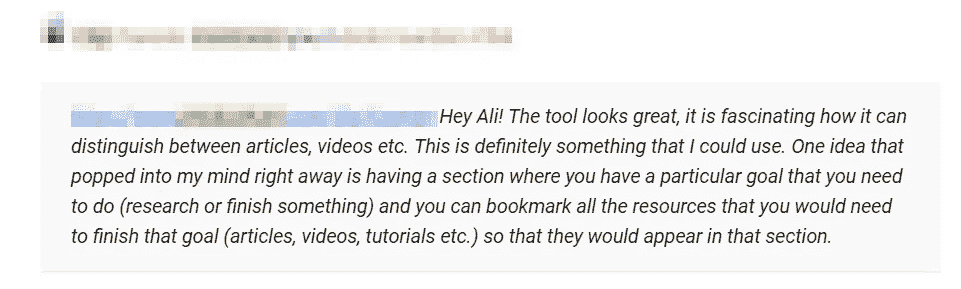
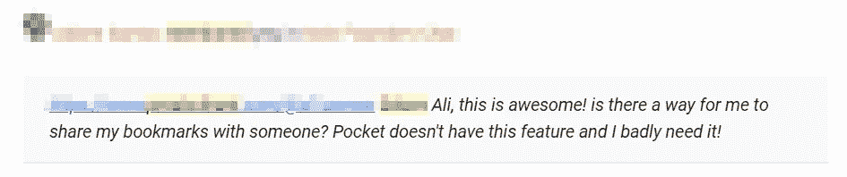
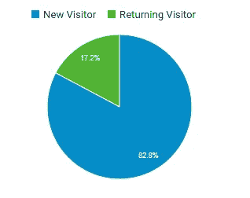
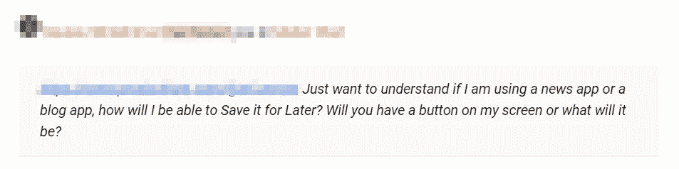
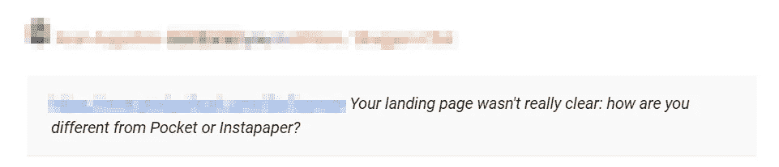
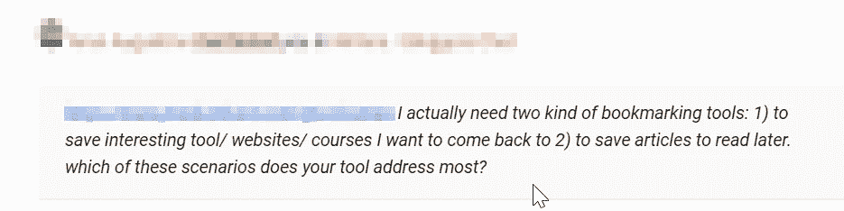
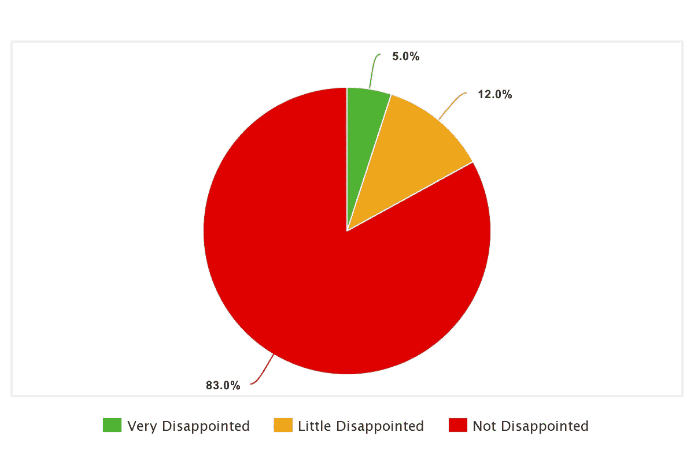

# 在创业世界里，没有“失败”这回事

> 原文：<https://medium.com/hackernoon/there-is-no-such-thing-called-failure-6553e3ab918b>

## 页面“失败”的教训

Photo by [Samuel Zeller](https://unsplash.com/photos/rk_Zz3b7G2Y?utm_source=unsplash&utm_medium=referral&utm_content=creditCopyText) on [Unsplash](https://unsplash.com/search/photos/success?utm_source=unsplash&utm_medium=referral&utm_content=creditCopyText)

我听说了很多关于“失败的创业公司”的事情，但是什么才算是创业公司的失败呢？如果我们谈论失败(成功)的反义词，记住[马克·安德森的博客](https://pmarchive.com/guide_to_startups_part4.html)中的这些句子是很有用的:

> “产品使用量的增长速度与您添加更多服务器的速度一样快。客户的钱在你公司的支票账户上堆积如山。你正在尽可能快地招聘销售和客户支持人员。记者打电话来是因为他们听说了你的热门新东西，他们想和你谈谈。你开始获得哈佛商学院颁发的年度企业家奖。投资银行家正在监视你的房子。你可以在巴克餐厅免费吃一年

但是说实话，这些都没有发生在你身上，事实上，你的产品得到了平均的响应和几百个用户。口碑没有传播开来。你无法吸引顾客，因此无法从中获利。你“认为”你有一个伟大的产品和一个伟大的商业计划，但在进入市场后，整个计划都失败了——哦，太可怕了，你的创业失败了，但这是真的吗？如果我告诉你它没有失败，相反，它教会了你以前不知道的东西。正如托马斯·A·爱迪生所说:

> “我没有失败。我刚刚发现了一万种行不通的方法。”

我*期待*写关于我最近的产品“ [**Pages**](https://mypages.app/) ”的文章，让用户知道市场反应有多好，展示大量的用户注册和流量图表，并宣布该应用的一系列新功能。相反，我决定关闭这个应用程序，并把它卖给潜在的买家。最重要的是，我写了一篇文章，讲述为什么“我的方式”对我的初创公司不起作用，为什么它没有达到我的预期，最终像纸牌搭的房子一样倒塌。更重要的是，我想写的是为什么创业可能没有像预期的那样成功，但从来没有失败过，事实上，它让我离“完美的成功场景”更近了一步。

> “失败是成功过程的一部分。逃避失败的人也逃避成功”——罗伯特·清崎(书)

***什么是*** [***页面***](https://mypages.app/) ***你问？如果你不知道，我不怪你，因为这是一个上市的产品，像许多其他 SaaS 项目一样没有引起注意。Pages 是一个人工智能支持的书签和稍后阅读工具，具有附加功能，如 RSS 阅读器，干净阅读，离线阅读，文本到语音等。我预计佩奇会成为独角兽，然而，它得到的回应一般，这不是因为我向人们推销一种糟糕的产品，而是因为我将这种产品推向市场的方法功能失调，完全脱离现实。***

尽管用户有一些积极的反馈，例如:

这是我在构建产品之前应该做的事情。我将长话短说，我发现我的初创公司存在多个问题，但我们将讨论几个主要问题:

*   组
*   产品
*   市场

我不会就哪一个更重要展开辩论，因为答案最终会很清楚，我也让你自己决定。

# **果断+灵活的组合**

[保罗·格拉厄姆( *Y Combinator* )写道](http://paulgraham.com/founders.html)创业者最重要的品质是**决心**——“*这已被证明是创业创业者最重要的品质*”，紧接着保罗谈到了**灵活性**——“*我发现，把你需要的决心和灵活性结合起来的最佳比喻是跑锋。他决心要到前场，但在任何时候，他都可能需要侧身甚至倒退才能到达那里。*

这几行总结了关于创业你需要知道的一切。我很有决心，但我灵活吗？如果是，那么作为创始人，灵活性对我来说意味着什么？如果需要的话，我的计划是什么？嗯，我对此没有任何计划，决心和动机是如此强烈，以至于它实际上克服了灵活性(坏主意)。

This shows the returning visitors to the Pages app ( not too many)

# 产品/市场契合度+早期验证

如今，产品/市场匹配是新公司的困扰，原因是，每当我们看到一个成功的创业公司，我们就会看到一个已经达到产品/市场匹配的公司。我可能已经成功地为一个问题提供了一个*改进的解决方案*，但是我没有遵循非常基本的步骤，例如:

*   在我开发产品之前，弄清楚人们是否会使用(购买)我的产品；
*   了解哪些研究方法最适合早期验证；

我没有花时间去验证我的关键假设，也没有花时间去了解我的产品目前的市场。我应该回答的问题是:

*   我的产品市场是什么？
*   为什么用户会想从 Feedly/Pocket/Instapaper 等其他非常成功的类似应用转向我的应用？
*   我如何为我的产品创造一个全新的市场，我需要做什么改变来实现它(横向/反向)？

我后来意识到，我的产品无法吸引用户，因为我对它没有清晰的愿景，也没有提供足够的信息来有效地使用该应用程序。我期望用户自己解决所有问题，却忽略了这样一个事实:我需要更清楚、更准确地了解我的产品所提供的最佳特性。

以下是用户的一些反馈，描述了该应用程序如何未能给人留下良好的第一印象:

正如你所注意到的，出现了一个大问题。为该产品提供的信息令人困惑，用户无法理解其存在的目的。

我将提到麦当劳，因为我在这里学到了宝贵的一课——我们中有多少人同意麦当劳没有做出最好的汉堡，而是让它们受欢迎的是低成本快速生产的理念？

同样，为了成功，我需要围绕更便宜更好的产品的承诺来设计业务。这个想法是让许多用户使用这个应用程序，如果他们喜欢它，他们会清楚地看到使用它的优势。我没有做的是在第一时间提供足够的如何使用应用程序的信息，我让用户自己探索并弄清楚一切是如何工作的(糟糕的想法)。

*当我问 100 多名用户(每周至少登录该应用 2 次)如果我关闭该应用他们会有什么感觉时，他们的回答是这样的:*

# 你的团队和联合创始人的重要性

独自承担这样一个大项目并不理想。即使我“下定决心”，该产品仍然需要一个 Web 应用程序、Android 应用程序和 iOS 应用程序、浏览器扩展、API 来提供与其他应用程序的集成等。，所以构建和测试这种规模的东西所需的工作量是相当大的。特别是当我也是添加所有功能以匹配当前可用的类似应用程序，然后在上面添加更多功能以确保与其他应用程序区分开来并提供更好更便宜的解决方案的人时。我的竞争对手已经进入市场多年，他们知道如何慢慢解决这个问题。一个 5-10 人的团队花几年时间开发一个产品，而一个人花几个月时间将一个应用程序提升到一个新的水平，这并不是一个理想的情况。这可能吗？当然，这是可能的，但这可能不是一个好主意。原因很明显，正如蒂姆·沙佩所说:“在市场和产品相同的情况下，伟大的团队总是能击败平庸的团队”。

我不认为 Pages 是一个失败的创业，因为没有所谓的“失败”。这家初创公司给了我一个从错误中学习的机会，并为我的下一个产品找到了正确的方向。这让我变得更聪明，并向我展示了建立我的团队的正确方法，正如史蒂夫·乔布斯所说，“下一件大事”。尝试和冒险是伟大企业家的众多品质之一。

一天结束时，从学习的角度看待一切，对于新创业者来说，**欢迎来到创业的过山车世界**

如果你已经读到这里，非常感谢你——我会在接下来的几个月里让你了解我的新产品。你可以在[推特](https://twitter.com/a1iusman)上关注我，或者给我留言 [@a1iusman](https://twitter.com/a1iusman) ，我可以回答你可能有的任何问题。