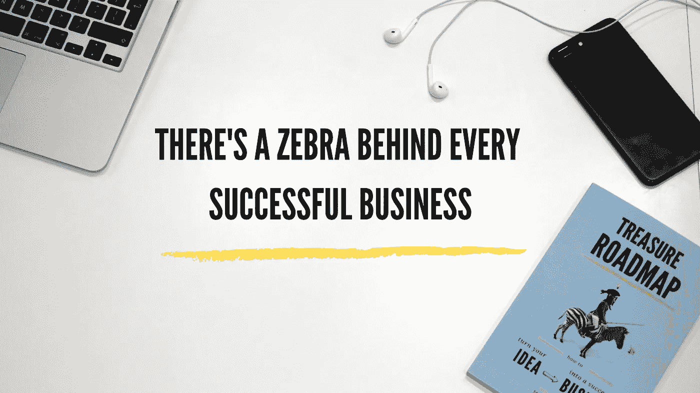
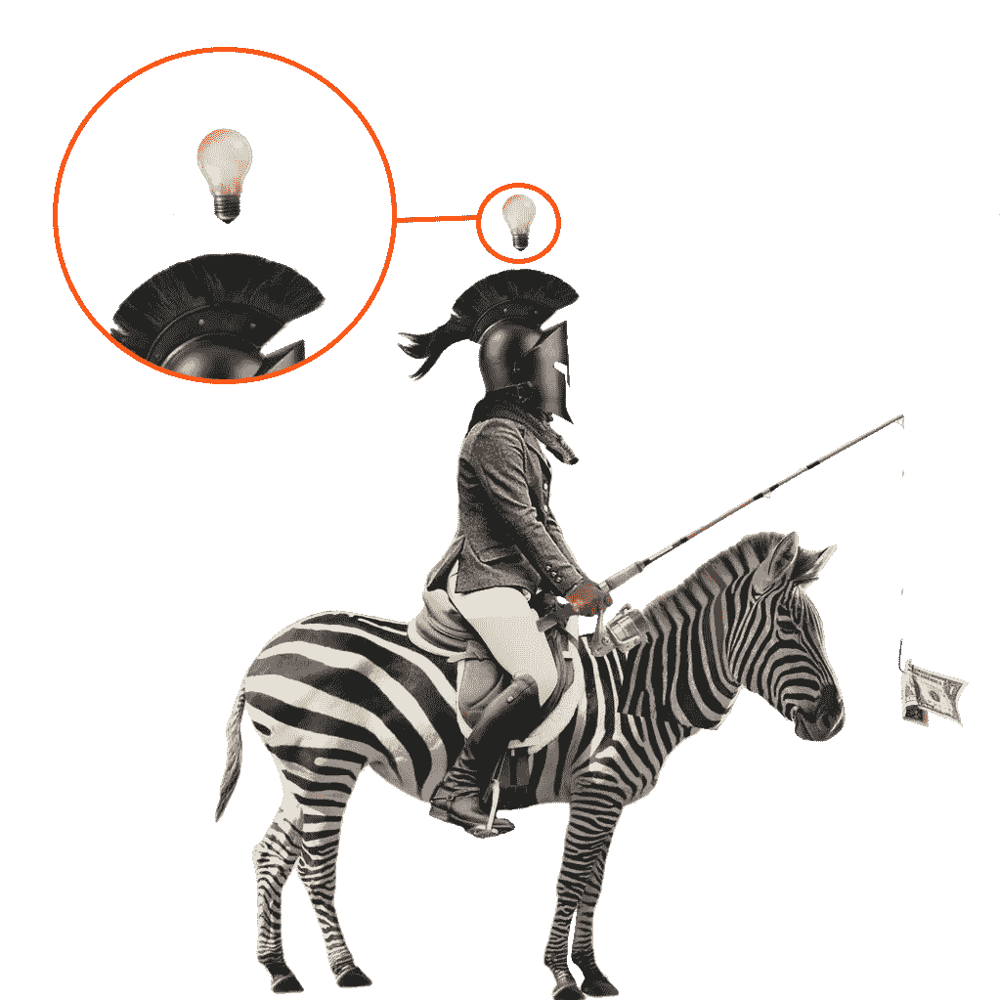
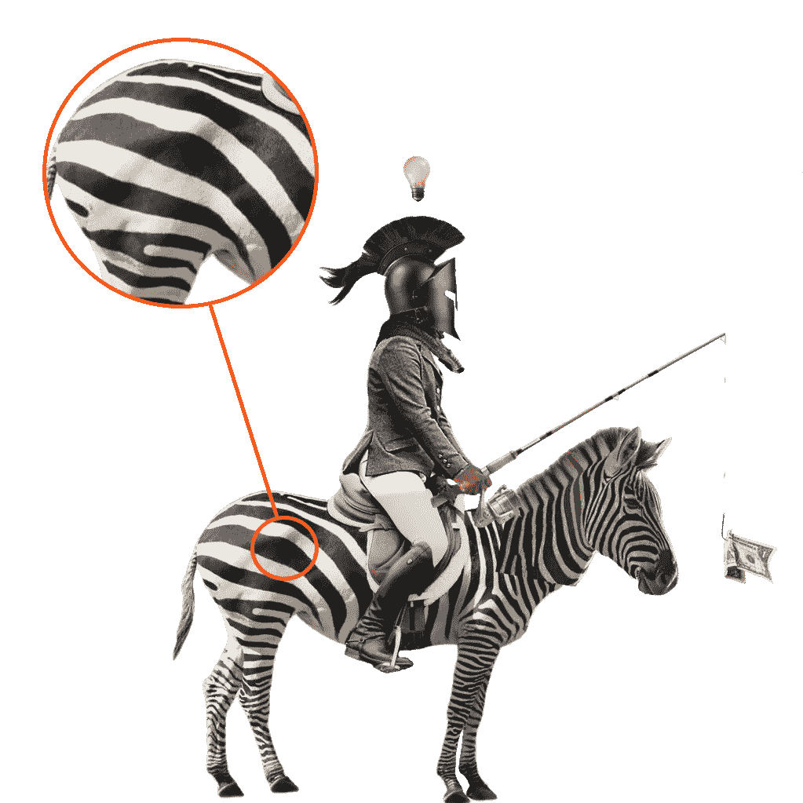
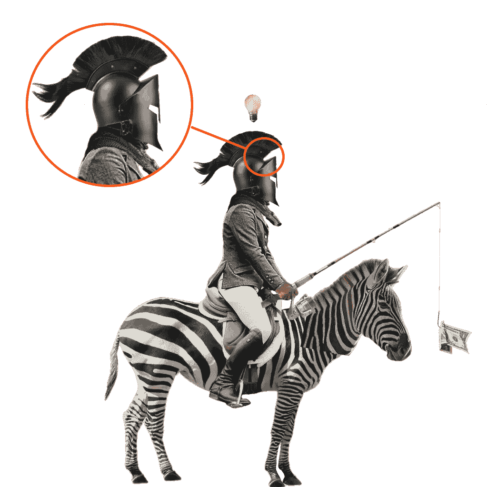
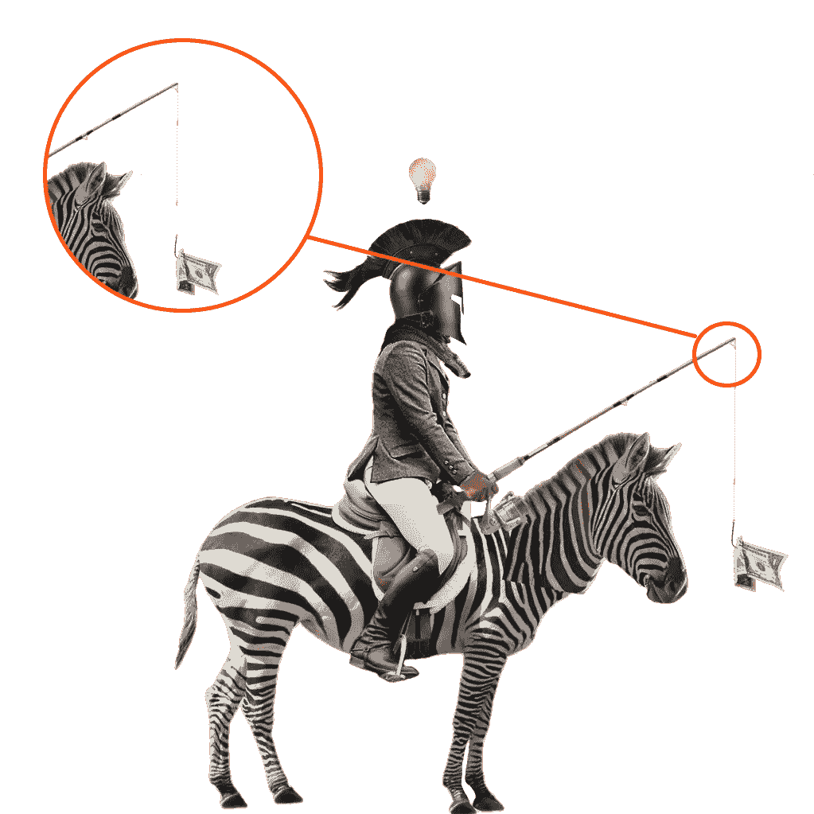
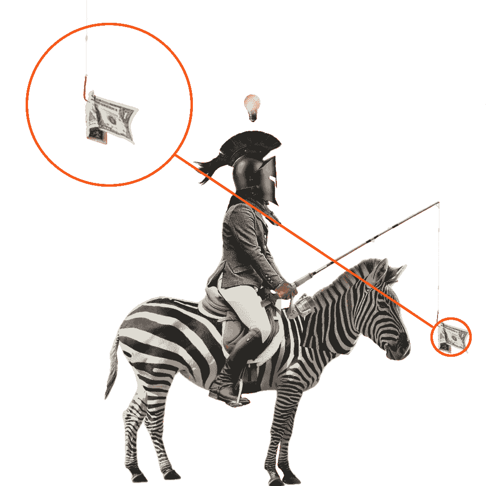
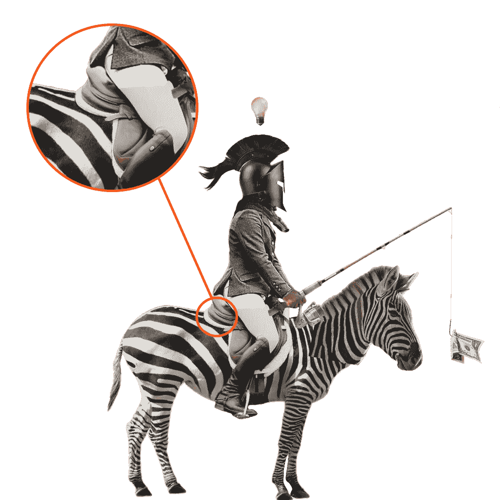
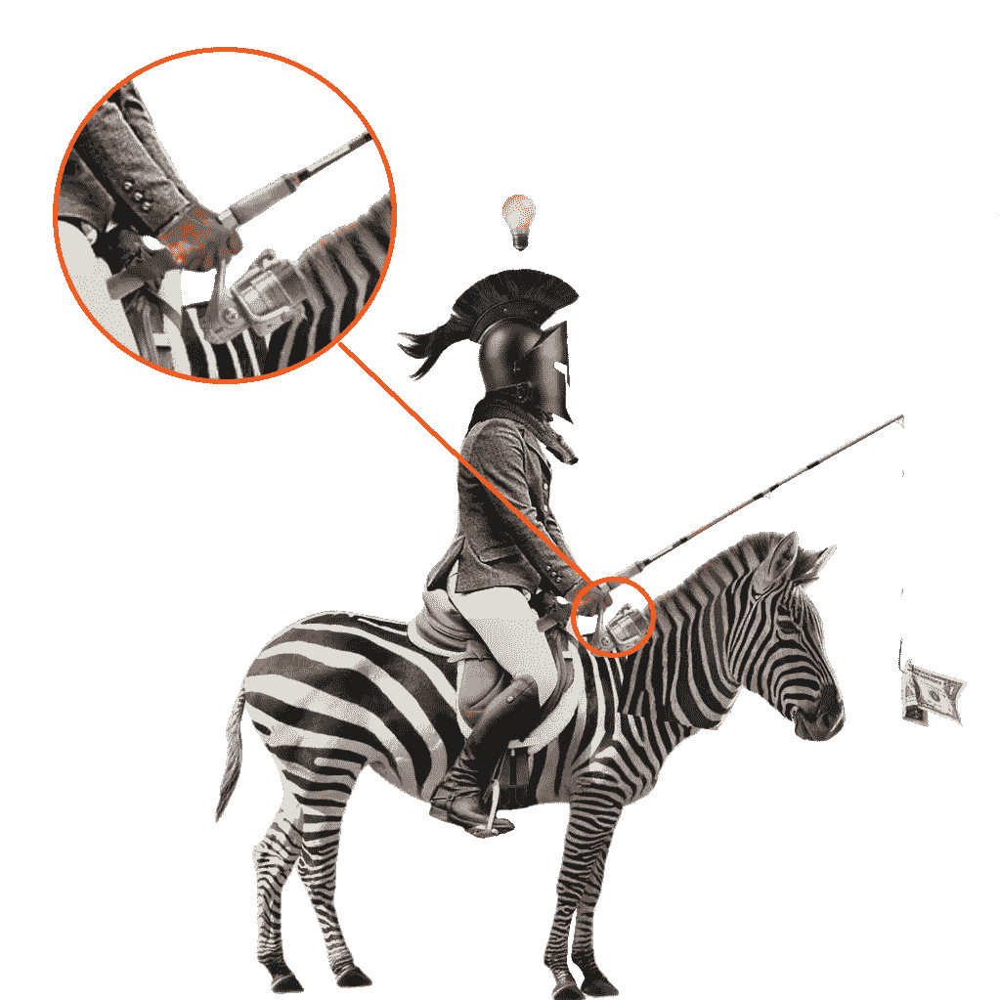
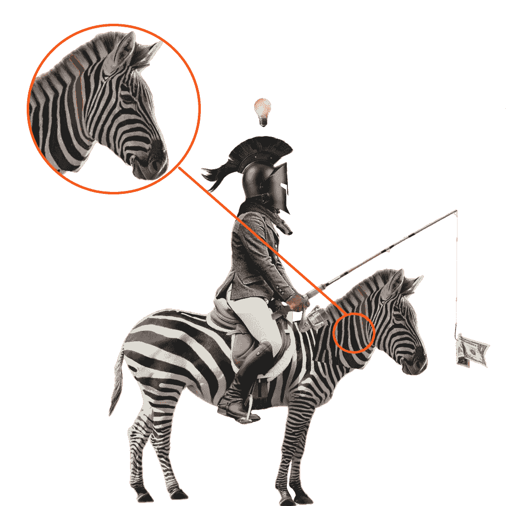
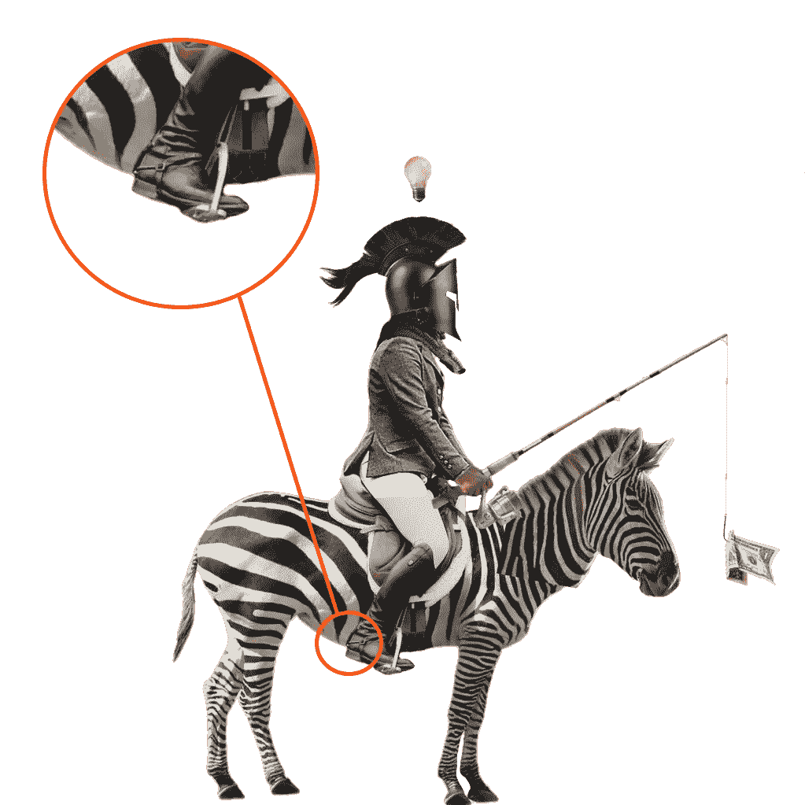

# 每个成功的企业背后都有一只斑马

> 原文：<https://medium.com/hackernoon/theres-a-zebra-behind-every-successful-business-a3a28e264af1>

怎样才能让一个新产品起步？

# 斑马背后有什么故事？

如何[让你的产品起飞](https://www.amazon.com/Treasure-Roadmap-turn-successful-business/dp/179441228X)？我已经阐明了每一个成功的[企业](https://hackernoon.com/tagged/business)的核心。恰好是一个骑着斑马的人。什么？

[艺术品](https://hackernoon.com/tagged/artwork)背后的故事比人们最初所能提取的有更多的意义。艺术作品描述了新想法是如何被创造、提炼和推向市场的。所以，让我们从图解分解开始…

# 1.灯泡

每个企业都是从一个想法开始的。《重大突破》通常被称为“灵光一现”，因为故事中有某种叙事上的刺激。你脑袋里的开关打开了，灯亮了。这个想法诞生了。尽管人们普遍认为，想法不会凭空出现。在想法变成现实之前，必须有一个深入解决问题的过程。必须花一些时间在解决方案空间中，考虑各种可能性。在投入一些时间思考这个问题之后，这个想法就会冒出来。最重要的是你要如何对待这个新生的想法。

# 2.斑马

有一个想法只是给你成功的潜力。你必须为之努力，才能让它不仅仅是你头脑中的一个神经元集合体。我选择了斑马来说明你的业务的第一步。斑马线或人行横道是把你引向马路另一边的东西。为了跨越到另一边(你个人的成功)，你必须对你要去的地方有一个强烈的愿景。你必须想象对方带给你生活的丰富多彩。如果你喜欢你刚刚想象的东西，并且对此有良好的感觉，改变的自然意图会把你带到另一边。成功的意愿和对财富的清晰愿景会指引你穿过马路，穿过斑马。

# 3.斯巴达头盔

艺术品的这一部分是你的企业中战略思维和纪律的象征。我们都知道斯巴达人有有效的作战策略。这种战略方法使他们即使在寡不敌众的情况下也能取得胜利。为你的企业制定一个清晰的战略将使你达到同样的目标。然而，仅有一个好的策略往往是不够的。你必须遵守纪律，随时遵循你的策略。策略和纪律将为你的企业提供诚信。完整性使得斯巴达方阵如此强大，几乎坚不可摧。

# 4.胡萝卜加大棒

“胡萝卜加大棒”这个短语是一个隐喻，指使用奖励和惩罚的组合来诱导想要的行为。如果你想让你的企业可持续发展，你必须为所有的利益相关者提供奖励——顾客、员工、品牌倡导者等等。如果你精心策划了一场游戏，让每个玩家都能赢，你就能留下来。然而，一件重要的事情是尽可能长时间地延迟游戏结束。让它成为一个无限的游戏。给予奖励，但让每个人要求更多。无限游戏的美妙之处在于玩家一直都是赢家，游戏结束时也没有失望。

# 5.金钱

不管喜欢与否，钱是我们生活中不可或缺的一部分。它是我们财富的一部分，伴随着爱、健康和智慧。钱是燃料，如果你想让你的生意运转起来，你必须把注意力放在钱上。在开始任何业务之前，应该通过调查商业模式的货币可行性来验证这个想法。珍惜金钱的人才能拥有金钱。因此，确保在你的财务评估、现金流规划和价格决定上投入时间。

# 6.舒适

如果你想骑很长时间，你必须让自己舒服。因此，高品质的皮革马鞍。这里的想法是先给自己发工资。你应该优先考虑自己。如果你照顾好自己，只有这样，你才能照顾好你的无限游戏中的其他玩家。把自己放在一个舒适的位置会让你感觉良好，成功和强大。并且这种感觉会以积极的方式影响你周围的人，传递同样的情绪。

# 7.钓鱼竿

如果你曾经去钓鱼，你知道它需要耐心。业务发展也是如此。你必须有耐心，眼睛盯着奖品，并准备好抓住机会。澄清一下，我不是说坐在那里等。不。如果你想吃鱼，你必须做好准备。哪一个是正确的地点，一天和一年中的正确时间，使用哪种鱼饵，你应该把鱼钩放下多深，等等。了解你的市场动态，你的客户，他们的愿望和痛点。制定正确的战略，耐心观察你的业务如何增长，因为你已经建立在正确的假设上。

# 8.颜色；色彩；色调

我用了一些颜色来说明事物并不全是黑白的。你应该有自己的组织，有明确的规则、角色和职责。秩序和可预测的结果是使企业成功的因素。但并不是所有的都是黑白的。你必须灵活，随时准备做出妥协。要变通，不要宽容。是的，这两者是有区别的。给你的组织增添色彩将会使创造力蓬勃发展。只要确保将创意向正确的方向流动。

# 9.引导

一个人骑着斑马的整个想法是一次旅行的象征。商业发展是一段跌宕起伏的旅程。重要的是你知道你要去哪里。你的伙伴也应该知道目的地。如果你在马鞍上睡着了，他们会指引商队到正确的方向，给你急需的睡眠。你是这次旅程的领导者，你应该驾驶这艘船。在这种情况下是斑马。设定目的地，设定速度，然后去拿你的奖品。

几周前，我发布了我的第一本书。叫做[宝藏路线图](https://treasureroadmap.com)。这本书提供了一套从精益创业、设计思维和敏捷软件开发中涌现出来的工具，这些工具正在彻底改变新想法的产生、提炼和推向市场的方式。

[书籍封面设计](https://treasureroadmap.com/book-cover-design/)背后有一个[的伟大故事](https://treasureroadmap.com/book-cover-story-zebra-and-business-development/)，我想和你分享一下。在艺术品背后有一个特定的叙述，它指出了在你的使命中成功需要什么。

如果你遵循我在这本书里揭示的公式，很有可能你可以通过把一个[想法变成一个成功的生意](https://www.amazon.com/Treasure-Roadmap-turn-successful-business/dp/179441228X)来谋生。

## 立即获取您的副本，推动您的业务向前发展👇👀📚

 [## 产品管理书籍-创意到商业-宝藏路线图

### 如果你选择遵循我在这本书里揭示的公式，很有可能你可以通过转行谋生…

treasureroadmap.com](https://treasureroadmap.com/)