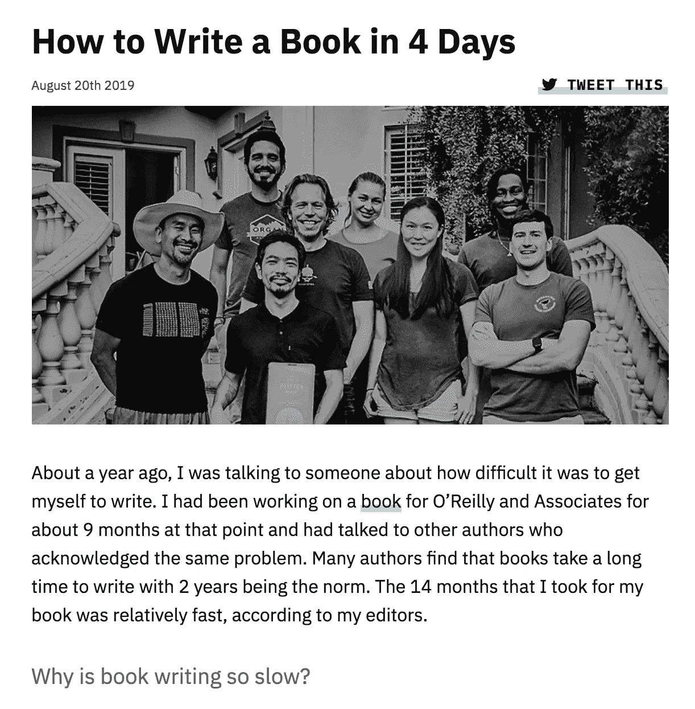
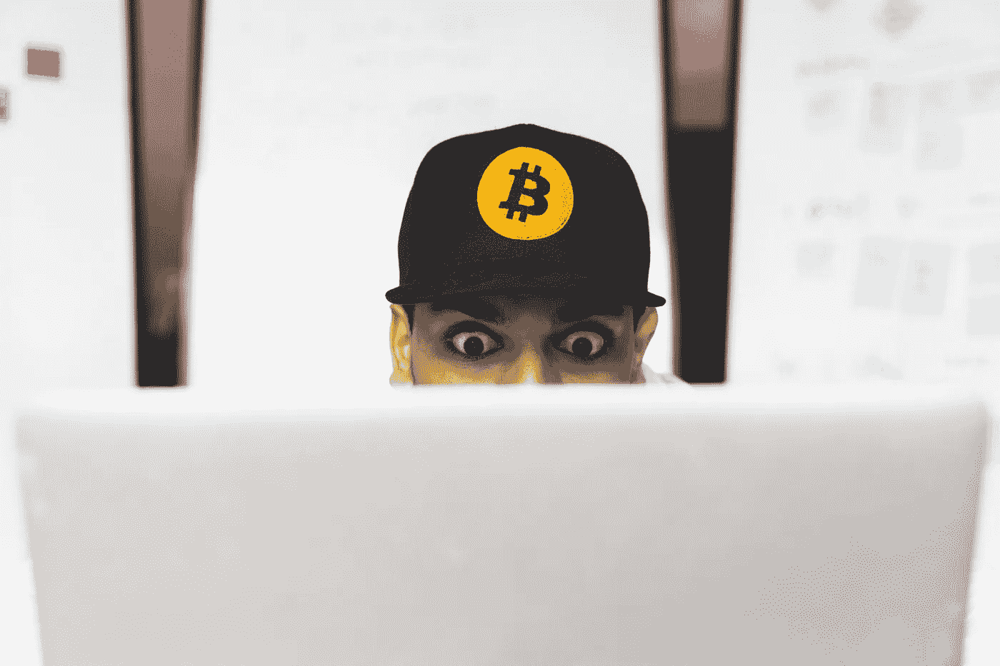

# 他们用 4 天时间写了《编程比特币》这本书

> 原文：<https://medium.com/hackernoon/they-wrote-the-programming-bitcoin-book-in-4-days-27c59625d624>

## [阅读全文](https://hackernoon.com/how-to-write-a-book-in-4-days-g3tq3rne)由[吉米·宋](https://hackernoon.com/@jimmysong)在【HackerNoon.com】上

## 更多来自[比特币聚焦](https://hackernoon.com/tagged/bitcoin-spotlight):

*   [**比特币的安全预算充足**](https://hackernoon.com/how-much-should-bitcoin-miners-earn-in-the-future-undy3vih) **由** [**氪约瑟夫**](https://hackernoon.com/@josef.tetek)
*   [**一个古老的统计技巧可能有助于更好地解释比特币和黄金**](https://hackernoon.com/this-old-statistical-trick-might-help-to-better-explain-the-apparent-correlation-between-bitcoin-and-nt8i3457)**[**耶稣罗德里格斯**](https://hackernoon.com/@jrodthoughts)**
*   **[**比特币/政府之战是由**](https://hackernoon.com/the-bitcoingovernment-battle-is-vaporware-lipz3r54) [**杰西·劳勒**](https://hackernoon.com/@lawlerpalooza) 制作的**
*   ****[**黑客正午的比特币宣言**](https://hackernoon.com/hacker-noons-bitcoin-manifesto-w32cb30s0)**by**[**ut sav Jaiswal**](https://hackernoon.com/@Hackerhodl)**和** [**海盗海滩流浪汉**](https://hackernoon.com/@piratebeachbum)****

********

****[*照片 via 免费比特币领取被爆&黑客中午*](https://hackernoon.com/free-bitcoin-image-collection-by-burst-hacker-noon-4e292524ff47)****

# ****附言:想定制你从我们这里收到什么样的邮件？[管理您的主题偏好](https://hackernoon.us19.list-manage.com/profile?u=b48b0ec2173fecf2586c00e80&id=fa796741e6&e=[UNIQID])。****

# ****另外，你可以访问 HackerNoon.com 的，点击[开始](http://auth.hackernoon.com/)，让你的科技故事得到评论并发表。****