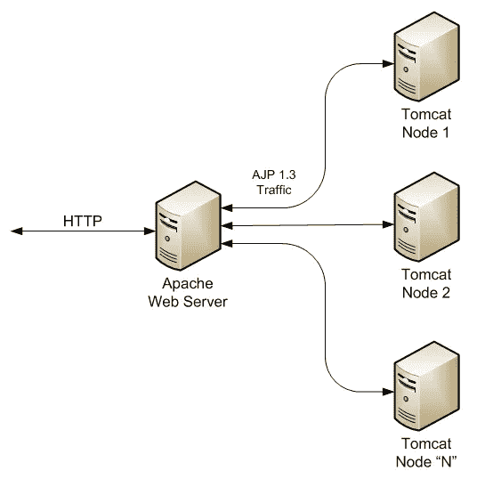
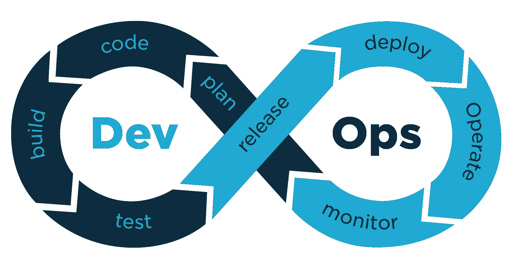

# 没人告诉你的关于云迁移项目的事情

> 原文：<https://medium.com/hackernoon/things-no-one-tells-you-about-cloud-migration-projects-b7c2e4b880a3>

## 从各种云迁移项目的惊险和刺激中获得的经验教训列表。

“This was an environment built, not for man, but for man’s absence.” [J.G Ballard](https://www.goodreads.com/author/show/7010931.J_G_Ballard)

在我的职业生涯中，我有幸参与了几个云迁移项目。这里是我收集的一些见解，希望能够帮助其他人开始他们自己的云迁移之旅。

# 这是艰苦的工作。

这项工作不容易。需要克服的挑战数量惊人，当然不仅仅是技术挑战，例如:

*   **组织策略**s——例如，如果交付工作需要很长时间，而在此期间没有任何切实的成果，项目的利益相关者可能会对团队失去信心。
*   **资源** —例如，有些人可能比其他人更适合做这个项目，但是他们在其他项目上太忙了。还需要大量的测试资源，但是测试什么并不总是很清楚。
*   **财务** —例如，测试服务器供应的成本、咨询顾问的时间成本。

# 纯粹的“提升和转移”很少奏效。

在这种情况下，提升和转移意味着将运行在托管/数据中心的当前软件平台以其准确的当前状态转移到基于云的环境中。

这与重新构建和采用 [**云原生**](https://container-solutions.com/what-is-cloud-native/) 解决方案以及充分利用云提供商平台的优势截然相反。

当你将一个庞大、沉重、复杂到令人恐惧的平台迁移到云中时，尽可能少地做一些改变无疑是有意义的。

> 但是有些你在托管中心做的事情，*应该留在托管中心* **。**

不仅如此，你做的一些事情和你做的方式**只会在托管中心起作用**。

## 多播难题

在一次迁移中，我们做了一个基本假设，这个假设最终被证明是错误的，即多播在云中是可用的。这导致在接近项目截止日期时进行大量的返工，以便在我们的 tomcat 应用服务器集群中重新实现会话管理。

我们最终转向了[会话持久化机制，而不是通过多播进行会话复制](https://tomcat.apache.org/tomcat-8.5-doc/cluster-howto.html)，并使用了[基于云的 Redis 缓存](https://aws.amazon.com/elasticache/)实现。

最终结果是更具弹性，意味着发布可以更快地执行，而不会对客户产生影响*(不需要等待节点变得可用，因为会话是通过多播复制到节点的，节点可以立即使用持久化的会话)。*

诀窍似乎是采用一种折中的方法——从*最小变化*的原则开始，但尝试尽早验证任何假设。

当技术障碍不可避免地出现时，首先探索云原生解决方案，而不是对抗云和在你的数据中心解决方案的**闪光覆盖的**版本中推销。

# 绝对恐怖。

我记得在一次迁移中的一个关键点，我们不可避免地不得不发起一次全面停机，以切换到新的基于云的平台。

曾经有一段时间，这是一条不归路——失败不再是一个选项。

我必须按下让它发生的按钮😱。

“Looks good, ship it.”

在完成所有工作后的某个时间点，您构建的平台最终将不得不被潜在的所有真实客户/顾客使用，并且必须以与以前完全相同的方式运行—这确实是一个可怕的想法…

…但那是真的吗？

*   你完成了以前可能出错的工作。
*   你生产的东西已经摆在顾客面前。

唯一让你感到害怕的可能是规模感。

认识到到底是什么让你担心这种情况，并做一些有成效的事情。

# 不是每个人都会“明白”的。

尽管云迁移项目很复杂，涉及的资源数量和前期费用也很高，但您组织中的一些人就是不明白。

> “对，所以你只是在移动服务器？”

云迁移的[优势](/intuz/9-benefits-of-migrating-your-business-to-the-cloud-fe53e7de648d)是清晰而众多的，但是对于那些没有直接参与项目并且不知道您正在解决的问题的复杂性的人来说:很难清楚地说明迁移最终将如何为最终用户增加价值。

这里的禁忌是，云迁移项目可能会因为领导或执行团队对项目失去信心，或者未能看到和理解好处而被取消。

“This cloud thing is probably a fad anyway, don’t worry about it.”

可以理解的是，他们宁愿将有限的资源用于增加收入和构建新功能，而不是支持一个花费大量金钱和时间的项目，但向相同的客户交付相同的软件，同时可能给他们带来问题。

这就是我提议我们作为云计算的支持者成为云的真正倡导者的地方。让我们弄清楚这些好处是什么，并用简单明了的语言解释它们。

# 有各种隐藏的好处。

在云中重建平台的一个很好的副产品是使用基础设施和自动化技术，如果你以前不使用，你几乎会被迫使用这些技术。

在我之前参与的一个迁移项目中，几乎没有任何基于数据中心的环境的脚本或自动化。

除此之外，还有一个共享的现场测试服务器，组织中的每个人都使用并知道*的私有 IP(当它最终死去时，我们为它举行了纪念仪式)。*

如果你充分利用云计算，你的服务器应该变得像牛一样，*而不是被特别照顾的小猫；随时可能被无情屠杀的牛…🔪🔪🔪*

“AWWW! you’re such a cutey 10.0.1.221”

为了能够做到这一点(就像在云中一样),而不会让客户对中断感到愤怒，您需要确保您的服务的新实例可以在没有任何人工干预的情况下运行——这就是为什么您要自动构建基础架构和配置服务器。

## 测试环境

我和我的同事使用基础设施和供应技术的简单模式是我们构建新的基于云的平台的基础。这最终意味着我们可以在 30 分钟内建立起一个完整的功能平台。

这是我们从未有过的不可思议的力量。

我们最终用它来解决测试环境的问题。作为迁移工作的结果，我们可以启动尽可能多的测试环境，精确地镜像生产，为尽可能多的团队服务，唯一的硬性限制是成本。

# …以及各种隐藏的缺点。

你可能会很快发现，在切换到新的、闪亮的平台后不久，你最终会感到非常头痛。

## 跟踪它

您可能会突然发现，有大量的业务流程和影子 IT 围绕连接到私有 IP 地址的能力和特别关注的*特殊雪花*服务器❄️而成长，而这一点根本没有被考虑在内。

现在，迁移的结果是，组织中的许多人突然无法工作了；当你不得不在项目的后期适应大量的变化时，你对工作出色的温暖模糊的感觉很快就被沮丧和冷漠吞噬了😩。

没有简单的方法来解决这个问题，除了做你自己的研究，并在山顶上大声呼喊，迁移即将发生；您和您的团队需要了解组织中可能会受到迁移影响的系统和流程中所有奇怪和奇妙的配置。

# 记住简单的事情，不要筋疲力尽。

我记得有这样一种情况，前一天晚上，我们要向 CTO 演示我们在项目里程碑上的进展，我们真的想给他留下深刻印象。

我和一个同事仍然在平台上工作到凌晨 3 点(根据我们自己的选择)。我们快累垮了，但我们希望完成每一件事，超越自己。云迁移项目确实令人兴奋，并且跨越了许多学科，所以如果你喜欢解决问题，很容易被吸引进去。

我们遇到了一个问题，即一定比例的请求到达平台时会失败，我们不知道原因。

最终，我的同事找到了一个相当简单的问题，即某个应用程序负载平衡器的配置问题。我们添加了一些手动更改，并测试了结果。

## 成功！😁…

它起作用了，我们可以愉快地睡觉了*(4 小时)*。

…然而我们犯了一个**致命错误**😔。

第二天，我们试图演示这个平台，但是问题又出现了。一夜之间，平台使用我们编写的脚本进行了自我重建——错误的配置被重新应用，我们的手动更改被删除……😩。

这是一个尴尬和紧张的局面，本可以很容易避免。

如果我们休息一下，后退一步，评估一下我们所面临的问题，并制定一个计划——然而，结局就在眼前，所以我们匆忙地犯了简单的错误。

另一个需要指出的教训是，如果不明显的话:如果你手工修改，**总是在你理解它们的时候自动执行。*不要等待。***

# 云迁移项目永远不应该“完成”。

当平台打开并且用户正在使用它的时候，这个项目不应该被认为是“完成”了。

> 会有问题，可能会有*中断。*

这种类型的项目可能在您的组织中从未完成过，因此不可避免地会出现无法预见的情况和问题。

参与项目的所有各方都应该接受这种不可避免性，当事情出错时不要感到惊讶。

## DevOps 心态

拥抱 [DevOps](/tech-tajawal/devops-in-a-scaling-environment-9d5416ecb928) 心态，继续在你新部署的平台上迭代。

虽然采用这种心态并将其融入到您的工作中有很多好处*(例如，降低成本，减少服务问题期间对客户的影响)*，但我最强烈感受到的好处是团队的福祉以及一个适当激励和健康的团队所能带来的好处。

## 心理安全

当生产问题出现时——团队最终必须解决问题——你会采取哪种方式呢？

你愿意团队在压力下，在一个有*责备* … * **咳嗽** *…我是说“*问责*”文化的环境中解决这个问题吗？…

…或者在一个让他们感到心理安全的环境中，他们能够犯错(并从中吸取教训),他们觉得自己有能力主动解决未来的问题？

拥抱 DevOps 心态，收获回报。

# 团队才是最重要的。

在我参与的迁移项目中，我很幸运地加入了由真正有才华和敬业的人组成的团队，没有他们，项目将会彻底失败。

该团队需要各种各样的人才和技能，因为云迁移项目本质上是跨领域的。我见过云迁移项目最初失败的情况，因为人们认为一个人在某个特定领域拥有一整套技能，就可以独自解决其他所有问题。

在迁移团队中，一项被忽视但很重要的技能是领导力。领导者可以是任何人，他们不需要成为经理。领导者的工作是清除团队前进道路上的障碍，保持士气和信心，总体上为团队服务，并履行团队专注于做的角色。

无论团队需要什么，领导者都应该是团队的仆人并去做*。
在以前的迁移中，我见过领导者在迁移之夜承担处理通信的角色，甚至只是做熏肉三明治*🐷*。*

云迁移项目需要一个多元化、高技能和专注的团队——最重要的是，要有良好的幽默感，以度过艰难时期*(我想念你团队光辉* ✨ *)。*

# …谢谢您！

感谢大家的阅读——我真的希望它有用。请给我关于你希望我多写(或少写)的内容的反馈，我会很感激🙂。

*另外，感谢我的朋友*[***Sam Tulip***](https://medium.com/u/159e53810356?source=post_page-----b7c2e4b880a3--------------------------------)*(技术架构师)，感谢我们就此进行的多次谈话，并为我撰写本文提供了一点灵感——还要感谢* [***多姆·加拉格尔***](https://www.linkedin.com/in/tyrall/)*——一位了不起的 DevOps 工程师，他在我们的迁移过程中让我保持理智，并教会我所有关于网络的细节，比如子网。*

# 还有一件事。

如果您是第一次接触这种关于云的说辞，并希望了解更多信息，或者您即将在您的组织中开始您的云迁移之旅，并希望获得一些有经验的帮助，您应该联系我在[BlackCat Technology Solutions](https://blackcatsolutions.co.uk/)的非常明智的同事，他们在云咨询方面拥有数十年的丰富经验。