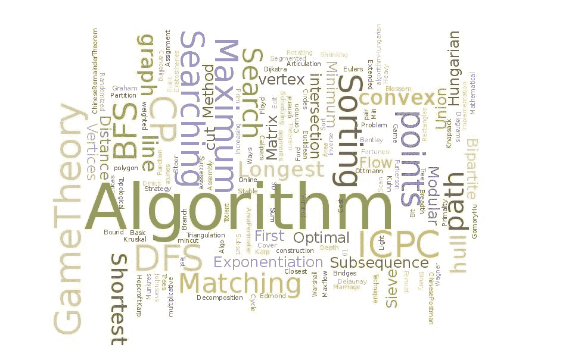

# 汇编中的思维算法

> 原文：<https://medium.com/hackernoon/thinking-algorithmic-in-assembly-775e768c03e2>

数据结构和算法是计算机科学的基础。是的，大多数软件工程师并没有每天都实现它们，这是事实。然而，我坚信良好的数据结构和算法基础可以帮助你成为一名更好的整体工程师。

今天我将在[汇编](https://hackernoon.com/tagged/assembly)中演示冒泡排序的实现。对大多数人来说，这种想法可能听起来很疯狂。你可能在想，“你到底为什么要在汇编中实现一个[算法](https://hackernoon.com/tagged/alrorithm)首先，我可能永远不会用汇编语言编写生产应用程序。编译器比我更擅长写汇编。但是，我确实认为理解汇编很重要。我们大多数人运行命令来编译我们的代码，我认为很容易把编译器为我们做的工作视为理所当然。我们每天都在使用循环、条件和函数。你曾经花时间去理解这些是如何在汇编级实现的吗？如果你主修计算机科学，你可能会探索汇编。然而，如果没有，继续读下去！

你可能会问的第二个问题是“为什么要冒泡排序？”对于那些不熟悉算法的人来说，冒泡排序通常被认为是最慢的排序算法之一。我选择冒泡排序的唯一主要原因是因为它很容易实现，而且用汇编语言写出这些算法可能相当棘手。

**下面的实现并不完美。如我所说，编译器比我更擅长编写汇编。这里的目标不是用汇编写一个完美优化的算法。如果你是像我一样的计算机科学极客，这只是一个演示和一个有趣的周末项目。我选择 MIPS 是因为我在为该架构编写汇编方面最有经验。相对于 x86 和 ARM，MIPS 并没有被广泛使用，但是今天它仍然被广泛教授。**

好了，现在说得够多了。代码如下:

你怎么想呢?下面评论。

*在 Twitter 上关注我:*[*@ maxekaplan*](https://twitter.com/maxekaplan)