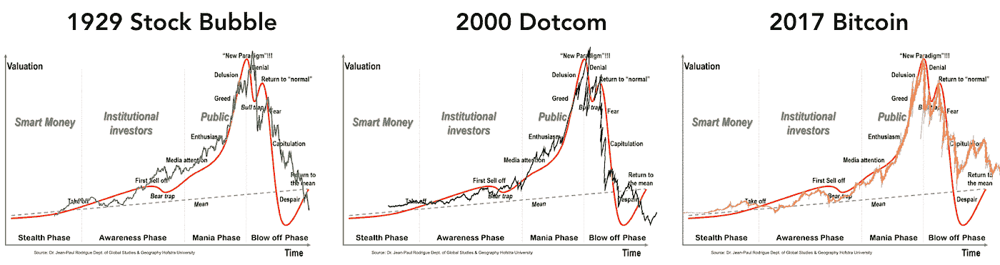
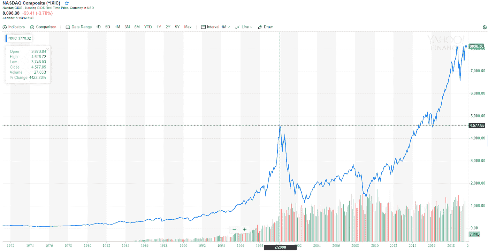
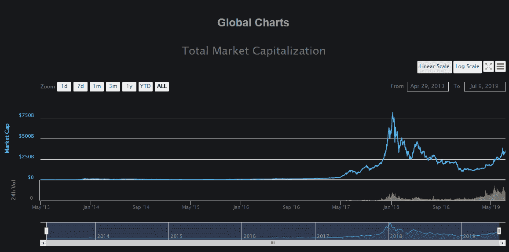
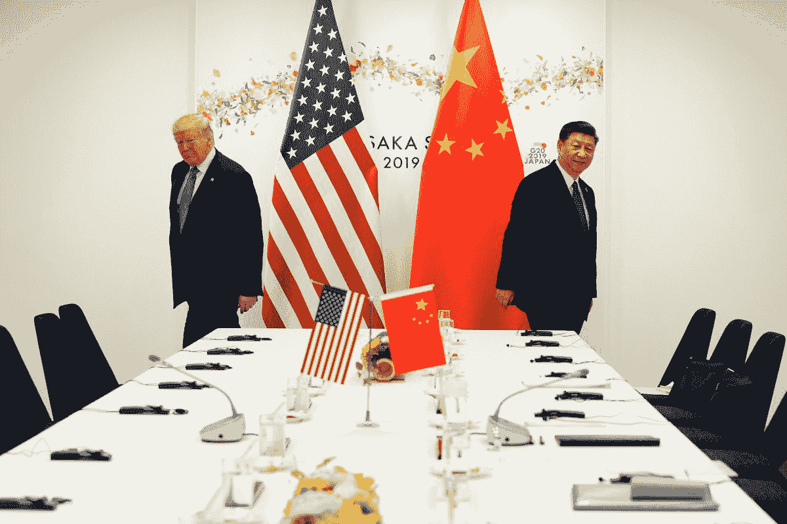
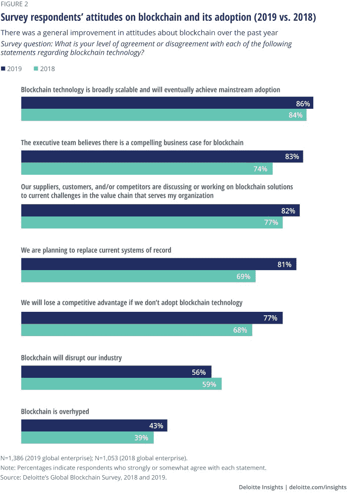
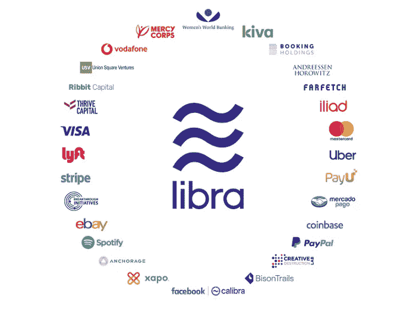
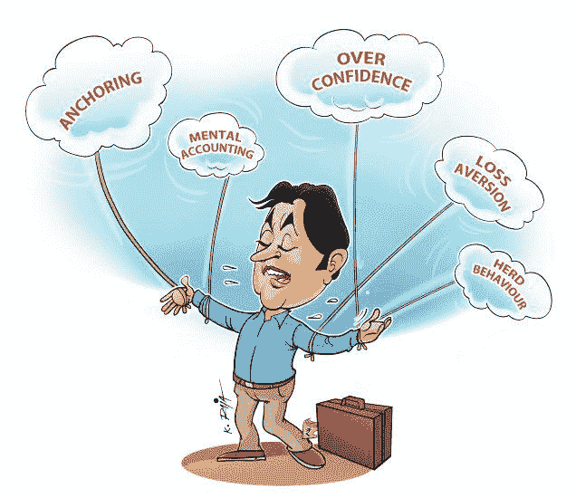
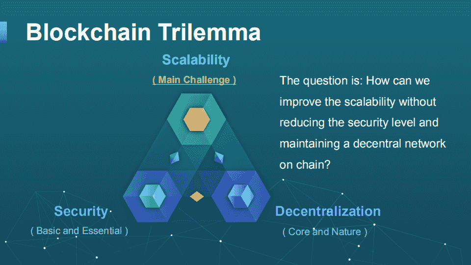

# 这一轮牛市与上一轮有着本质的不同。原因如下。

> 原文：<https://medium.com/hackernoon/this-bull-run-is-fundamentally-different-than-the-previous-one-heres-why-45fbdd407d0d>

每个人都知道 2017 年和 2018 年初的时候，比特币达到了 20，000 美元以上，以太坊也达到了 1，300 美元以上。事实上，在 CoinMarketCap 上上市的硬币和代币的总市值刚刚超过 8000 亿美元。每个人都将成为百万富翁。

> 但是仅仅用了短短的 90 天，一切都崩溃了，不到一年的时间，市场已经修正了近 800%的历史高点。

哪里出了问题？没什么。是不是时间不对？我认为是时候了。任何正在建立的市场都需要突破它的边界，从某种意义上来说，在它变得足够强大和成熟之前，它需要突破这个边界，并建立一个新的边界。我经常把这些疯狂的市场推动所造成的混乱，比作一场战争所造成的混乱，这场战争导致了技术创新的绝对加速。

如果你回顾过去，对技术进步最有效的是战争，尽管听起来很残酷。

上次牛市带来了很多东西。我们看到了首次硬币发行(ICO)的兴衰，就像不受监管的首次公开募股一样，这过渡到了安全令牌发行(STO)的创建，以及最新的首次交易所发行(IEO)。

我们看到政府机构和当局试图就如何对待加密货币提供监管澄清。我们看到了一个艰难但非常必要的教训，即来自不受监管和分散的网络的诈骗、风险和苦难。

> 可以说，最近这波牛市带来的最大好处是，现在每个人都知道加密货币是什么。

然后，我们经历了 12 个月的隐性干旱，唯一能看到的是区块链的发展和企业悄悄进行自己的研发。每个人都几乎羞于提及加密货币这个词，这是一个禁忌，只有冒险家或犯罪世界才会与之相关。

至少世界上的其他人是这样认为的，而事实上，成千上万的开发者在这个静默期日以继夜地工作在他们各自的项目上，最终不受媒体、炒作、家人和朋友的影响。

**这波牛市**

我们今天站在这里，经历了战火；比以往任何时候都更精致、更强大、更稳定。但在许多人的脑海中有一个问题，“这只是前一轮牛市和后来的泡沫破灭的重演吗？”

我可以毫不含糊、毫无疑问地说，不。这与 12-18 个月前发生的事情完全不同。

让我解释一下。

**1。** **历史重演**

这种牛市后熊市的市场周期是有史以来金融市场中最容易识别的周期之一。

首先，让我们看一个以前的例子，这个例子可以让我们大致了解世界对一个新市场的反应。让我们看看纳斯达克的历史，它是众所周知的最大的股票交易所之一。现在，证券交易所和加密货币市场最大的区别就是一个受监管，一个不受监管。

我认为，除了减缓任何可能出现的模式，监管实际上不会产生太大影响。看看下面显示的历史，然后看看我从加密货币市场的总市值中得出的对比。这些图片是未经编辑的截图，但它们都讲述了同一个故事。

首先，我们需要牛市和熊市，在完全突破它们之前检查边界。因此，如果传统市场被忽略，那么我们将迎来一轮牛市，加密货币的总市值将达到 1-2 万亿美元。

**2)传统全球市场的现状**

现在每个人都知道，几乎任何有影响力的市场都受到美国金融市场的束缚，或者至少是受其影响。也许不像 10 年或 20 年前那么多，但毫无疑问，如果美国市场发生什么事情，我们将看到世界各地的涟漪。但美国金融市场的状况如何？

不稳定是个恰当的说法。不用说太多细节，我可以有把握地说，随着时间的推移，美国和世界各地的传统金融市场正在失去人们的信心。

有很多人担心美国和中国之间的贸易战，T4 的全球经济前景也远不乐观。

现在，想象一个新兴市场，让人们完全控制自己的财务，不受任何政府或公司的约束。这个市场正在进入另一轮牛市，就像传统市场变得不稳定并失去消费者信心一样。你会把钱放在哪里？

**3)企业和政府情绪**

下一个观点可能与我之前的观点相违背。但这是至关重要的，而且确实以一种非常有影响力的方式影响着当前的局势。

> 2017 年底，如果你试图赚钱或投资区块链行业，那么你要么是骗子，要么正在被骗。

许多企业都在谨慎地研究这项技术，但如果不冒“真正的”公关风险，绝不会让它公之于众。快进到现在，我想不出有哪家大型企业没有以某种方式宣布他们正在研究或已经实施了区块链解决方案。

两个月前我[为一篇文章](https://hackernoon.com/a-comprehensive-list-of-enterprises-partnering-with-blockchain-in-2019-57486ad2b07c)做研究，哪些企业参与了这个行业，我不得不在差不多 1000 家的时候停止写名单。人们不再认为它与一个不稳定的、以犯罪为重点的行业“有关联”，而是认为它具有“前瞻性思维”和创新性，走在了游戏的前面。

即使是一直被视为这项新技术最大输家的银行，也无法向区块链研发投入足够的资源。企业和全球领域最新和最重要的运动是脸书 Libra 区块链的[宣布，Visa、PayPal、万事达卡、易贝、Stripe 和其他许多价值数十亿美元的科技巨头都参与了合作。](https://hackernoon.com/facebooks-libra-coin-bank-killer-or-crypto-saviour-74e61b9e72af)

所以让我来说明这是如何影响我们新一轮牛市的。简单地说，上一轮牛市只由冒险者和个人投资者组成，被视为粗略的投资。这种牛市得到了世界上几乎所有行业、大多数银行和政府的支持，被视为一种明智的投资。

看看现在有多少钱可以在区块链投资，因为企业已经加入了！

**4)我们更聪明**

上一轮牛市充斥着骗局，任何想获得一些免费资金的人都只是创建或复制一份白皮书，付给某人 20 美元来制作一个网站，然后一旦他们从无辜和受骗的投资者那里收到足够的钱，就消失了。

甚至合法的项目也不能幸免。在许多案例中，ICO 钱包地址被交换到骗子的钱包中，或者被外部第三方清除。

我经常把过去的 12 个月称为我们行业的提炼之火。它不仅为我们中的许多人提供了了解和防范之前存在的许多骗局的时间，而且还删除了许多薄弱的项目。许多项目已经死亡，事实上，[一些数字估计](https://cointelegraph.com/news/deloitte-reports-more-than-26000-blockchain-projects-launched-in-2016)2017 年运行 ICO 的项目中高达 80%以上已经崩溃。

许多投资加密货币的人没有太多投资商业的经验。要了解一个特定项目的潜力，需要寻找许多指标。回顾过去，有很多成功和失败的例子，我们现在有一个可以借鉴的过去。

就我个人而言，我对投资对象非常谨慎。2017 年，我在许多项目上投入了少量资金，现在我只在少数项目上投入了大量资金。

如果一个项目想要运行一个 ICO，他们不仅有更广泛的社区的监督，而且还有许多监管机构密切关注他们。在许多情况下，项目被迫归还在 ICO 中筹集的所有资金。

> 人们现在在试图融资前会三思，从而降低投资者和整个行业的潜在风险。

**5)从情感社区到知识社区**

在古代，收割小麦后，采集者会扬谷。这就把谷壳从谷物中分离出来，或者把没有价值的从有价值的中剔除。我们在 2018 年经历的干旱期基本上是在筛选加密货币社区。从短期到中期投资中几乎没有钱可赚，许多投资者亏损了。

弱小的手已经被抖了出来，那些为了快钱和不相信技术的人已经离开了。这一点非常重要，因为这些投资者被情绪所左右，不了解这个行业赖以建立的基本面。

当一个社区的很大一部分被他们的情绪所引导时，许多负面的情况就会出现。波动性将会增加，关于次要目标的不适当的压力将会施加在项目上，导致主要目标的妥协。

例如，由于来自社区的压力，一个项目可能太专注于满足他们的 mainnet 发布日期，以至于他们可能按时发布一个质量差的产品，而不是推迟发布一个高质量的产品。如果他们决定忽略社区的情绪，那么这可能会损害他们的令牌的价格，这反过来又会给项目带来不同的压力。

对这些情绪主导的社区的另一个担忧是，这些投资者天生容易受骗。

他们没有正确理解技术，因此看不透精心制作的演示文稿或白皮书。他们没有采用“好得难以置信”的测试。

他们就像被带到屠宰场的绵羊。在传统的投资场景中，如果没有向财务顾问或投资公司寻求建议，大多数人不会投资。

是什么让加密货币行业如此基础，以至于人们认为他们不需要做同样的研究？如果说有什么不同的话，那就是它更加复杂，因为这是一个新行业，几乎没有先例，波动性高，技术复杂，具有突破性。

所以现在我们有了一个更严肃、更基础、更有见识的投资者和开发者群体。

**6)我还没有谈到技术**

最后，我想谈谈技术。所有人都会同意，2017 年的行业技术已经突飞猛进地发展到我们现在的水平。这种兴奋传遍了世界，最终推动了 2017 年的牛市，这种兴奋来自于 DLT 理论用例的实现。

我们知道它将改变我们做生意的方式，但这都是理论，都在白皮书中，而不是在应用中。一旦我们明白了如何将区块链应用于现实世界，我们就需要开发技术来迎头赶上。在可伸缩性、法规和前端应用程序开发之间，很明显，任何主要的采用都需要认真的开发。

可伸缩性三难困境表明，任何应用程序都无法提供去中心化、可伸缩性和安全性的解决方案。要成为两个人的解决方案，第三个人必须受苦。

快进到今天，在 aelf 和 Cosmos 这样的项目中，我们已经有了三难问题的解决方案。政府不仅争相提供监管指导，还公开支持并在自己的生态系统中测试这项技术。

我们拥有设计完整且活跃的应用程序，在供应链、金融、零售、游戏、市场、公用事业和社交媒体等行业中利用区块链。我们已经从理论用例转向实际应用。

这才是真正的价值所在。

我甚至没有提到以太坊已经宣布了他们的路线图，从工作证明转变为股份证明，性能提高了约 1000 倍，我也没有提到比特币即将达到矿工奖励的一半，这将减少新比特币对市场的投入。这两个市场几乎占加密货币总市值的 75%。

**我们要去哪里？**

如果我知道这个问题的答案，我就是上帝。事实是，没有人 100%知道未来会发生什么，但我可以说的是，在这个积极的市场中，我们目前面临的情况与 18 个月前完全不同。我不会猜测比特币的价格或加密货币市场将再次稳定下来，但我会说，我们处于一个更好的主要增长的基础位置。从经济到社区，从技术到更广泛的行业情绪，所有方面都指向强劲的增长。

归根结底，这些市场是由供需驱动的，对于大多数项目来说，供应是固定的，但随着采用的普及，需求将继续增长。