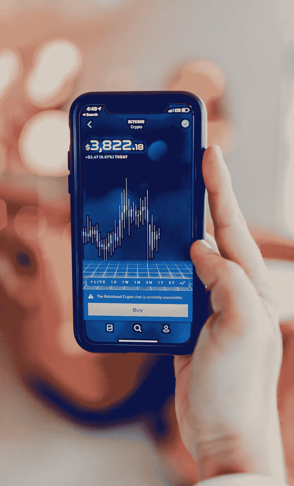

# 这一新的区块链平台旨在构建比第一代平台更高的可扩展性

> 原文：<https://medium.com/hackernoon/this-new-blockchain-platform-looks-to-build-higher-scalability-than-first-gen-platforms-22d86e9dbe07>

在过去的几年里，科技巨头和企业已经接受了金融行业最大的挑战——建立一个由人工智能(A.I .)和区块链技术驱动的全新金融系统。

区块链技术为该行业带来的优势是一种分散的机制，它提供了一种安全和加密的方式来直接和即时地与各方进行交易，而不需要中介。

像 IBM、HP Enterprises、Walmart 和许多其他公司已经公开宣布参与和利用这项技术，并开始将它集成到他们的核心业务模型中。

然而，为什么市场上似乎已经充斥着这些平台？答案是，其中许多还没有准备好投入实际使用。毫无疑问，我们的金融部门需要去中心化和可扩展性。

但是，我们如何让这些金融玩家和消费者相信我们已经准备好信任这样的平台呢？

我们仍在了解网络安全威胁和黑客事件，这使得这些平台似乎还没有为大规模采用做好准备。

# 我们的第一代平台有什么问题？

我们仍然处于区块链技术的非常早期的阶段，被称为“第一代”工作证明(PoW)和利益证明(PoS)协议等系统的现有实现需要过多的计算资源或挖掘。

在之前的一次采访中，两位企业家 Sid 和 Alicia Belzberg 发明了 Belzberg 系统并获得专利，这是有史以来第一个电子 ETF，他们讨论了他们的公司 Infinigon Group 如何将人工智能和区块链技术注入“下一代”区块链平台 Ig17，该平台旨在填补这些“第一代”平台留下的许多空白。

(1)区块链背后的技术必须真正是分散的、健壮的、安全的、快速的、可扩展的和平等的；

(2)智能合约仍然会受到人为错误的影响，因此容易受到攻击；和

(3)数字货币，无论其目的如何，都必须由现实世界的资产支持并与之挂钩，以维持其价值。

为了满足这三个要求，第二代区块链平台必须是分散的、安全的和高度可伸缩的。

但是为什么这些平台还没有缺失这样的基本素质呢？好问题。

由于 PoW 和 PoS 协议的工作方式，大多数区块链平台虽然提倡分散式系统，但仍然朝着集中化方向发展。

此外，只有那些除了支付高额电费之外，还能负担得起大量计算资源的人，才能进行采矿和打桩。

出于这些原因，平台仍然缺乏可扩展性，这使得智能合约被视为易受攻击，加密货币交易所仍然容易受到网络安全攻击。

以币安的密码交易所为例。在成为上周大规模数据泄露的受害者后，它刚刚恢复了交易活动，黑客偷走了超过 4000 万美元的比特币。黑客窃取了 API 密钥、双因子代码和其他信息，使他们能够将 7000 多枚比特币转移到自己的钱包中。不幸的是，币安用自己的资金掩盖了被盗的比特币。

在大多数情况下，攻击者通常会控制网络的计算能力，为他们提供“重写”交易历史的能力，这是区块链引以为豪的不允许发生的事情。

# iG17 区块链

在我们与 Alicia Belzberg 的对话中，她告诉我们他们公司创建了 Ig17 区块链，这是一个第二代平台，可以做第一代平台应该已经在做的事情。

**Grit Daily:这项技术将如何帮助改变股票市场？**

**艾丽西娅·贝尔茨伯格:**我们的 iG17 区块链平台基于双区块链架构，并在每个节点上的可信执行环境中涉及芯片级、基于人工智能的无懈可击的安全性，从而使其不受流氓节点管理员的影响——它是防篡改的。

我们的中立性证明(PoN)协议不像 PoW 协议那样依赖于计算资源，也不像 PoW 和 PoS 协议那样依赖于大多数节点是诚实的假设。

对于那些熟悉区块链平台的人来说，协议 PoW(工作证明)和 PoS(利益证明)应该有所启发。

在 iG17 中，所有节点都被平等对待。无论计算能力、受欢迎程度或在平台数字货币中的股份如何，所有节点都有平等的机会参与验证收入。这意味着它阻止了**矿业财团**的形成和货币所有权的集中化，同时降低了 **51%攻击**等网络安全攻击的风险。

此外，其独特的块验证协议，PoN，或中立性证明，使该平台比其他系统具有巨大的速度优势。根据该公司的白皮书，该平台每秒可以处理数千笔交易，而无需诉诸集中式共识证明或混合解决方案。

**智能合约**

关于智能合约技术，重要的是要明白，即使它们是计算机代码，无论采取了多少预防措施，它们仍然会有缺陷。为什么？人为错误。

有了这个新的区块链平台，遏制此类问题至关重要。如果在智能合约中发现问题，受影响的唯一个人或实体应该是拥有该帐户的实体，而不是其他人。

如果发现与特定类型的合同相关的问题，可以停止将计划模板链接到其他帐户持有人，直到问题得到解决。本质上，把其他人拒之门外是为了防止潜在的伤害。

**数字货币**

为了避免未来发生类似币安最近遭遇的情况，建立数字货币的长期、可持续价值是必须的。

几乎所有数字货币的问题在于，它们中的绝大多数并不代表任何商品或服务的权益，也没有任何储备资产的支持。幸运的是，币安能够支付他们自己的费用，把被拿走的东西还给那些受影响的人。

像 iG17 这样只发行由真实资产支持的代币的系统是与众不同的。通过与能够用可赎回的产品、资源或服务来支持其 STO 代币的大小可信企业合作，以资产支持数字代币的形式将其资产令牌化。