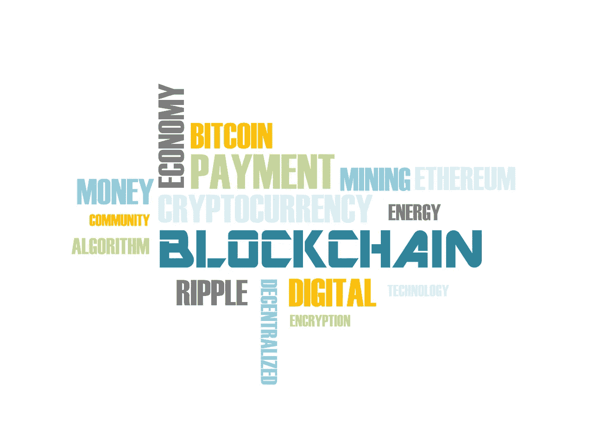
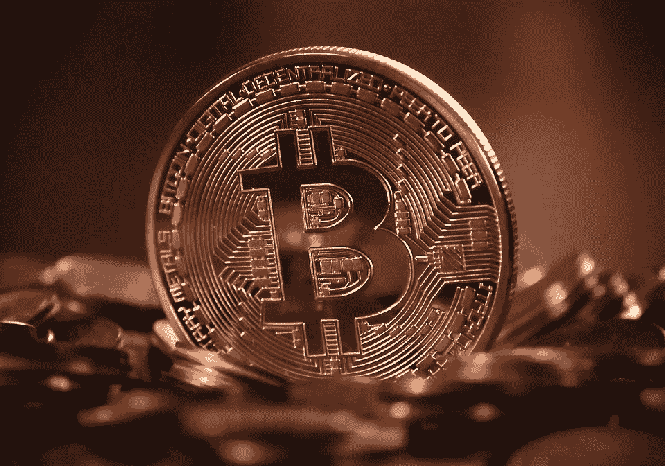

# 成为区块链作家的三个半理由

> 原文：<https://medium.com/hackernoon/three-and-a-half-reasons-to-be-a-blockchain-writer-ac95733375b2>

[Unsplash](https://unsplash.com/photos/npxXWgQ33ZQ)

有这么多的利基/领域可以让自己进入，为什么一个技术内容作家会特别选择成为区块链作家？这是你一直在问自己的问题吗？

好吧，看来你要有答案了。跟着读。

大约 12 个月前，我第一次有机会写关于区块链和加密货币的内容。这也是我进入主流内容写作的突破口。我以前也写过内容，但从来不是为了谋生。

这是我如此倾向于在区块链和加密领域写作的一个原因。

然而，远不止如此。

当我作为一名区块链内容作家起步时，我对这项技术以及围绕它的宣传几乎没有任何概念。我唯一知道的是加密货币，以及它们的价格最近是如何飙升的。就是这样。

在偶然发现我的第一个“严肃的”内容写作机会来写与即将到来或正在进行的 ico 相关的文章和评论后，我发现剩下的都是历史了。我想深入研究。我看到了机会的海洋，我相信你很快也会意识到这一点。

我已经写了超过 250 篇文章、新闻、副本、网络内容等等，都围绕着区块链和 crypto，我可以说 sky 是这个领域作家的极限。

区块链和密码世界因炫耀系统内流动的所有资金而闻名。是的，这是事实。但作为一名区块链作家，这不仅仅是你的收入，还有许多其他有利于你职业发展的因素。

以下是三个半理由，证明为什么成为区块链内容作家是可怕的。

# 1.适应环境总是一个好主意

[Unsplash](https://pixabay.com/en/doors-choices-choose-open-decision-1767563/)

去找任何一个专业的自由撰稿人，她会告诉你的第一件事就是选择一个合适的位置。

对许多人来说，选择利基听起来像是减少机会，但如果你观察，这就像过滤噪音。

> 通过选择一个利基市场，你指定了一个范围，在这个范围内你将寻找机会。

这有助于你设定一个更具体的目标，而不是到处射击。此外，当你作为一个特定领域的作家接近客户时(意味着你在那个领域有特殊的专长)，你把工作带回家的机会比你作为一般的、*我写一切*类型的内容作家要多得多。

总的来说，这是你选择成为区块链作家的一个重要原因。

还有更多的来了…

# 2.与大多数国家不同，区块链是一条人迹罕至的道路

[Pixabay](https://pixabay.com/en/woodland-road-falling-leaf-natural-656969/)

尝试进入任何一个最广为人知、高收入的利基市场，你肯定会面临来自已经在那里扎根多年的作家的激烈竞争。

在区块链和加密的情况下，它仍然是原始的。在区块链和密码领域写作的作家市场还没有饱和。

可以说，这个领域今天享有的曝光率和知名度主要是因为 2017 年的比特币热潮。所以，离每个人都认真投入其中只有一年半的时间了。

> 考虑到商业世界的广阔，18 个月的写作生涯似乎没什么了不起。

如果你在 LinkedIn 上上网，你肯定会发现很多作家已经在他们的个人资料中标记了术语*区块链作家*或*加密货币作家*。但是不要认为已经有这么多的作家就意味着他们足够了，你只是这个领域的另一个作家。你不会的。因为根据区块链产业发展的速度和这个领域的增长速度，人们对高质量内容的需求在不断增长。

而你，我的朋友，将会有很大的空间在行业中创造自己的印记。

# 3.区块链不仅仅是区块链的事情

[Pixabay](https://cdn.pixabay.com/photo/2018/03/07/19/41/blockchain-3206918_1280.png)

区块链，简单来说，就是一个不可改变的账本。但是它的使用案例远远超出想象。我坚决支持区块链是继互联网之后的下一个大事件的想法。

当你作为一名区块链作家工作时，你不仅会了解区块链技术，还会了解数百种正在颠覆世界的新兴技术。在区块链项目上工作的人，在区块链创办公司的人都专注于通过使用区块链来破坏世界各地的各种产业。

因此，成为一名区块链作家绝不意味着你会局限于你对区块链的知识空间。其实正好相反。你将有机会理解和写作各种各样的主题。如果你在其他领域写作，你会发现这几乎是不可能的。

作为一名区块链作家，我写过一些区块链公司试图颠覆货运、零售、批发、人工智能、机器学习、虚拟和增强现实、博彩等行业。

作为一名区块链内容作家，能够专注于某个特定的领域，同时又能写这么多不同的主题，这是一种非常奇妙的体验。

> 你准备好迎接刺激了吗？

# 3.5.区块链就是钱

[Unsplash](https://pixabay.com/en/bitcoin-cryptocurrency-digital-2007769/)

嗯，作为区块链的特殊技术，有很多关于它的炒作，它正在呈指数级增长。正因为如此，整个行业有大量资金在流动。

> 所以，如果你有潜力，有天赋，有人们想要的技能，你会得到不错的报酬。

虽然我经常听说一些作家拿着很低的薪水工作，但这在区块链的小众领域*非常少见(当然你需要知道如何推销自己)。*

鉴于你获得了一些炫耀的经验，并知道如何推销自己，区块链和加密可能是你收入最高的利基之一。

听起来不错？准备好了吗？太好了。打开你的努力工作模式。