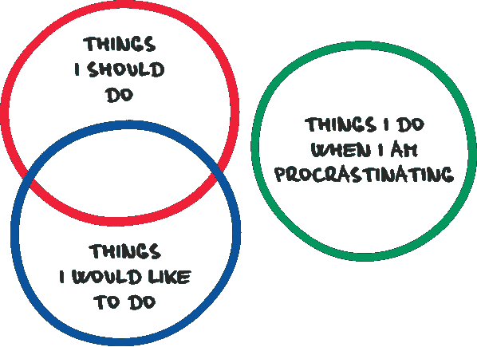

# 你的外包伙伴欺骗你的三个迹象

> 原文：<https://medium.com/hackernoon/three-steps-to-detect-that-your-outsourcing-partner-is-cheating-you-9cf938115935>

[https://procrastination.com/assets/img/procrastination.png](https://procrastination.com/assets/img/procrastination.png)

你花了几个月的时间选择承诺为你提供最高质量产品的最佳供应商。你讨论你的[业务](https://hackernoon.com/tagged/business)目标、任务的截止日期和里程碑。但是出了问题，你认为这不是正确的方法。你可能有一个更长的期限来完成任务，或者预算可能会膨胀。

我们挑选了三个步骤，将帮助你[发现骗子](https://diceus.com/top-10-tips-check-outsourcing-company-cheating/)并防止未来任何有害的合作。

# 1.你看不到他们的脸

这可能看起来很奇怪，但是你可能会和几十个不同的人一起工作，他们告诉你同一个名字。如果你工作的[外包](https://hackernoon.com/tagged/outsourcing)公司的开发人员工资太低，你可能会面临这种情况。如果你让不同的人来为项目编码，结果可能会有很多错误和代码不一致。

你应该确保和同一个人一起工作。您可以通过视频电话与团队保持联系，也可以组织个人会议。这取决于你和外包商之间的距离。

# 2.虚假评论

阅读评论是不够的。检查他们很好。最好的方法是联系已经离开评论的人。你可能会在 LinkedIn 或脸书这样的社交网络中找到他们。你可以在 GitHub 等各种主题网站上找到它们。你可以阅读关于某个特定地点的顶级外包供应商的评论，并检查你的供应商是否在名单上。

如果你找不到这些人，很有可能你的供应商没有提供开发服务的经验。这并不意味着他们将交付低质量的产品，但这一事实的风险很高。当他们不能计算完成任务所需的时间时，你也可能会遇到这种情况。

# 3.拖延

你可能会问一些关于员工如何克服拖延症以及他们如何提高工作效率的问题。这个问题应该有好的解决方案，因为你不能袖手旁观人，并检查他们的工作每一秒钟。你甚至不能一天看一两次团队的工作流程。

出路是什么？对于团队如何解决问题，得到一个清晰的答案是很好的。下一步将是定义监控团队工作的工具。你可以截图，但我们认为这种方式不是很有效。你可以找一个第三方审计员或者雇佣一个项目经理来管理这项工作。

# 底线

作弊的方法有一百万种。如果你 100%确定你应该外包任何任务，甚至整个项目，最好仔细检查供应商的可靠性。但是监控过程，不让任何人骗你也是好的。