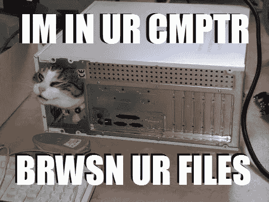
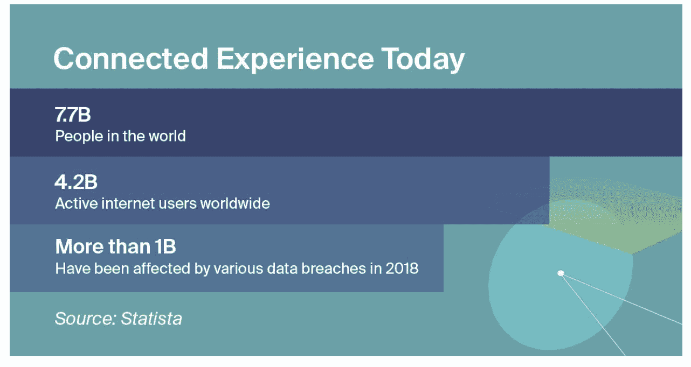

# 是时候采用新的加密安全模型了

> 原文：<https://medium.com/hackernoon/time-for-new-security-models-in-crypto-ce7f579d84f2>

Shyft 网络首席科学家克里斯·科沃德

分散式系统天生就容易受到 51%的攻击吗？最近对以太坊经典(ETC)网络成功的 51%攻击展示了当前保护数字资产的过程中分散化的限制和缺陷，并暗示了可以减轻这些风险的方法。

## 以太坊经典 51%攻击(及其含义)

也被称为“加密冬天”的市场状况对该行业产生了寒蝉效应。除了压低价格和侵蚀利润，市场还影响了挖掘更安全的 POW 令牌所需的散列率。由于以太坊采矿基础设施也可以用于采矿等，它最终成为潜在攻击者特别有吸引力的目标。所以它受到了攻击。

因为 ETC 是因为 DAO hack 而存在的，所以对它被作为目标有某种诗意的讽刺。DAO(“去中心化自治组织”)是开创性的，但最终是一个有缺陷的尝试，试图建立一个完全去中心化治理的全新模型，它是建立在以太坊之上的。当黑客因安全缺陷成功攻破 DAO 时，以太坊社区有一个选择:回滚链条让投资者再次完整，或者接受盗窃发生并尊重账本的神圣性。ETC 是后一阵营分叉的结果。

> 我们现在已经看到两个相当前沿的网络至少部分被同样的原则拖垮了:“技术越分散，就越好，越自由。”最终，这种自由伴随着一系列昂贵的风险，可能不值入场费。

## 互联网是一个危险的地方——每个人都知道这一点

同样的原理适用于*任何*传统的基于工作证明的加密货币；ETC 也不例外。成功执行“51%攻击”不需要提高 51%的散列功率。相关的攻击已经被证明使用少至 25%的 POW 网络的集体散列能力来成功地破坏足够的块以确认无效的块(注意，虽然这些攻击在技术上是可行的，但是它们通常被认为在经济上是不可行的)。相对而言，最近通过 NiceHash 等服务租赁计算能力的出现使得 51%攻击更加容易——不再需要在家里或办公室安装昂贵的欺诈引擎。

这里有一个完美风暴效应在起作用:越来越多的用户要么不知道如何保护他们的在线数据，要么对他们所掌握的工具没有信心；恶意行为者以越来越复杂和廉价的手段在线颠覆甚至复杂的网络，在一个越来越网络化的世界中，越来越多的服务在线。

## 信息安全是一个严重的问题

对于加密世界和更广泛的在线生态系统来说，当前的解决方案根本不够好。安全机构和公约没有跟上步伐。

数据安全和隐私的重要性意味着我们需要超越“分散一切”的思维，并提出足够灵活的解决方案来解决许多不同的使用案例。就在最近，世界经济论坛发布的研究[显示](https://www.weforum.org/agenda/2019/01/who-should-take-charge-of-our-cybersecurity/)采取积极措施在网上保护自己的用户比例令人沮丧，尽管绝大多数人承认信息安全是一个严重的问题。

> 很明显，人们需要更好的工具来保护和管理他们的数据。

我们已经看到了更多的重大数据泄露，包括基本上属于整个德国政治阶层[的个人数据泄露。去年三月，印度身份数据库的漏洞暴露了超过](https://www.telegraph.co.uk/news/2019/01/04/hundreds-german-politicians-hacked-massive-data-leak/)[11 亿公民的生物特征信息。由于万豪酒店松懈的安全基础设施，另外 5 亿人的个人信息被黑客窃取。这只是三个主要事件。新的头条新闻不断出现，令人不安。](https://www.zdnet.com/article/another-data-leak-hits-india-aadhaar-biometric-database/)

## 需要一定的集中化

对于加密用户和普通互联网用户来说，更全面的解决方案必须是集中和分散之间的某种折衷点。在区块链环境中，这意味着网络拥有某种权威元素(无论是单一的还是联合的)，例如，能够有效地回滚受攻击影响的块，或者至少提高块确认阈值。

例如，通过利用可信实体的证明流，区块链网络将允许用户*证明*他们的令牌所有权，而不会将他们的特定身份暴露给区块链并引入进一步的风险。在被盗或无法访问私钥的情况下，用户可以向网络发出“停止”命令，以确保在他们确定安全之前不会转移任何资金。

仅仅依靠现有的路线图和改进协议是不够的。我们需要确保加密技术和利用它的技术，比如区块链，可以为每个人服务。

## 可用性问题:如何让每个人都能使用加密技术

为了让区块链技术发挥其潜力，它应该能够再现人们期望从技术中获得的一些基本可用性元素和便利性，同时仍然利用加密密钥对体系结构和分布式系统提供的优势。换句话说，丢失钥匙不应该导致恐慌和永远失去资金；网络上的证明应该具有可撤销性元素，并且需要一个更集中的中间层来管理密钥和证明。换句话说，我们不能指望用户是他们自己的银行，也许不是所有的事情都需要一直去中心化。

让普通人轻松管理和保护其数据的安全机制和系统可能是大规模采用的关键。

========================================

***克里斯·科沃德*** *是 Shyft 网络的首席科学家。他的旅程始于 20 世纪 90 年代，当时他还是一名十几岁的黑客，随后在学术界和企业界积累了丰富的经验。在 Shyft，他将自己的技术技能与对密码学、安全性和隐私的浓厚兴趣结合起来。*

*在* [*Shyft 了解更多信息。网络*](https://www.shyft.network/) *或者给我们讲讲* [*电报*](https://t.me/shyftnetwork) *。*