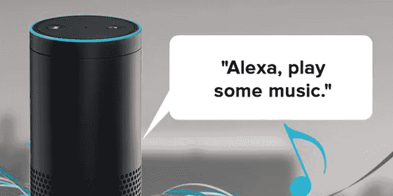
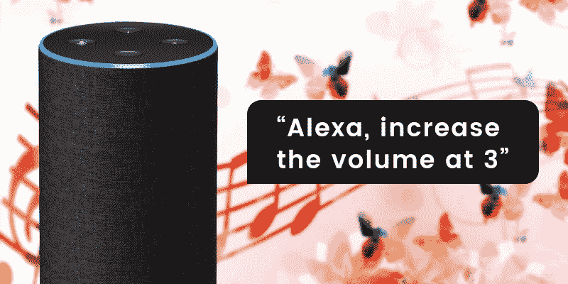
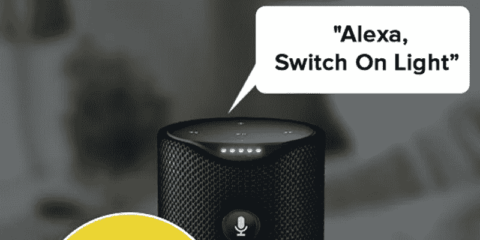
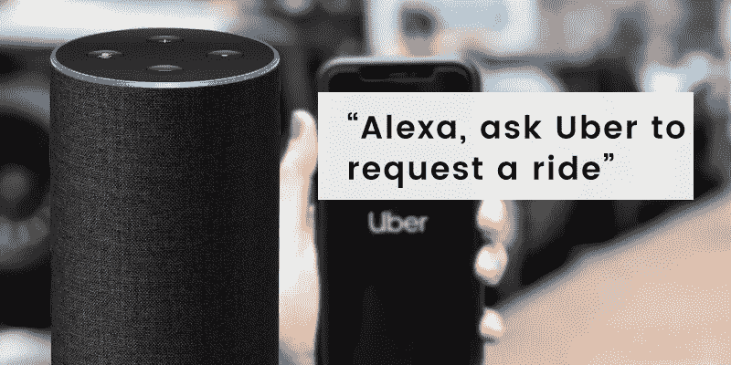

# 通过最好的 Alexa 命令和技能让 Alexa 更聪明的提示和技巧

> 原文：<https://medium.com/hackernoon/tips-and-tricks-to-make-alexa-smarter-by-the-best-alexa-commands-and-skills-eaa8b42403a0>

像亚马逊 Alexa 和谷歌 T1 助手这样的语音助手已经席卷了 T2 T3 技术。就连企业也对颠覆性技术越来越感兴趣，并利用这些优势为自己谋利。

与 Google home 相比，亚马逊 Alexa 的市场份额很高。无论你是从亚马逊还是第三方设备购买 Echo 产品，越来越多的设备都内置了 Alexa。

因此，你需要知道 Alexa 的顶级命令，通过服从你的命令使你的生活变得容易。我们一直在关注你需要知道的 [**最佳 Alexa 技能**](https://www.excellentwebworld.com/best-alexa-skills-commands/) ，这里是 Alexa 顶级命令列表。

# 1.收音机和音乐

Alexa 最常用的技能和命令之一是播放音乐和广播。

如果你想立即播放一些东西，那么使用 Alexa 的顶级命令会容易得多。不需要打开搜索栏，输入你选择的歌曲，错了就重写，播放；相反，你只需要简单地命令 Alexa 播放你最喜欢的歌曲。

不仅仅是歌曲，如果你想听最新的 Ted 演讲和播客，你可以试试专门制作的 Alexa 技能听你指挥。

此外，还有一些专门为平静你的心灵而开发的技能，比如:自然声音、雨声和白噪音。因此，你可以挑选适合你的，增加你的心情。

**这里有一些你可以使用的顶级媒体命令**

**“Alexa，放点音乐。”**

**“Alexa，按艺术家姓名播放音乐”**

**“Alexa，恢复我的播放列表”**

**“Alexa，30 分钟后停止播放音乐”**

**“Alexa，播放下一首歌”**

# 2.最好的 Alexa 技能:电视流媒体

Alexa 允许用户通过使用 Echo 设备来控制电视设备。它可以让你打开一个特定的流媒体应用程序，或者通过搜索标题、演员或流派来播放任何内容。

这些命令可以在任何内置亚马逊 fire TV 软件的电视上运行。

最近，索尼电视也获得了 Alexa 集成:使用亚马逊 Alexa 你可以打开和关闭电视，更换任何频道。除了使用最好的 Alexa 命令，你也可以控制音量。

由于 Alexa 的智能家居技能 API，电视制造商将在他们的设备中集成 Alexa。

## **一些顶级的 Alexa 电视指挥**

**“Alexa，把音量调到 3”**

**“Alexa，换个频道’**

**“Alexa，将电视静音/取消静音”**

**“阿列克谢，设定计时器”**

# **3。Alexa 的顶级技能:新闻、天气和交通**

有数不清的渠道提供这种或那种形式的 flash 简报，但有些比其他的效果更好。

通过使用 Alexa 技能，你可以在早上播放你的 flash 简报，上面会读出标题。

你可以通过 Alexa skills 了解外面的天气来计划你的一天。

如果你是开车上班的不幸者之一。Alexa 交通技能可以来帮助你。通过列出交通预测和更新，您可以相应地规划您的路线。

**用于新闻、天气和交通的 Alexa 顶级技能**

**“Alexa，”有什么最新消息？”**

**“Alexa，我的快速简报是什么？”**

**“Alexa，外面天气如何”**

“Alexa，交通怎么样？”

# 4.智能家居的最佳 Alexa 技能

没有什么比通过改变智能灯泡的色调来改变房间氛围更酷的了。与菲利普休亚马逊 Alexa 技能启用，你可以安装你的家。Philip hue 最棒的一点是，你可以控制特定的灯光或某个房间的灯光。

你知道 Alexa skills 可以成为你的虚拟安全卫士吗？美国的一些公司，如 OBE、Honeywell、ring 和 ADT，已经签署协议，让新的 Alexa 安全面板控制器框架与他们的系统接口。因此，它将允许用户用他们的声音控制安全属性。

## **智能家居的顶级 Alexa 命令:**

**“亚历克莎，把灯光调暗 30%”**

**“Alexa，锁上我的前门”**

**“Alexa 将温度设置在 25 度”**

**“Alexa，让 TrackR 找我的手机”**

# 5.优步·阿列克谢技能:

如果你住在优步覆盖范围内的某个地方，你可以快速使用 Alexa 技能，预订一辆车开到你的位置并取车。

为此，你必须在你的亚马逊设备上安装优步 Alexa 技能，一旦配置好，你就可以说出预订应用程序的命令。

**Alexa 预订出租车的命令:**

**“阿列克谢，让优步请求搭车”
“阿列克谢，问优步，我的车呢？”**

# 结论

不仅是私人使用，亚马逊 Alexa 也将其触角伸向了商业领域。酒店业也在整合 Alexa，以实现更好的增长和繁荣的客户体验。如今，智能办公室和智能家居一样变得越来越普遍。

诚然，我们可以把这个 ***【完整列表】*** 但是每天都有那么多的 Alexa 命令被添加进来。

你知道什么独特的 Alexa 技能命令吗？欢迎建议。