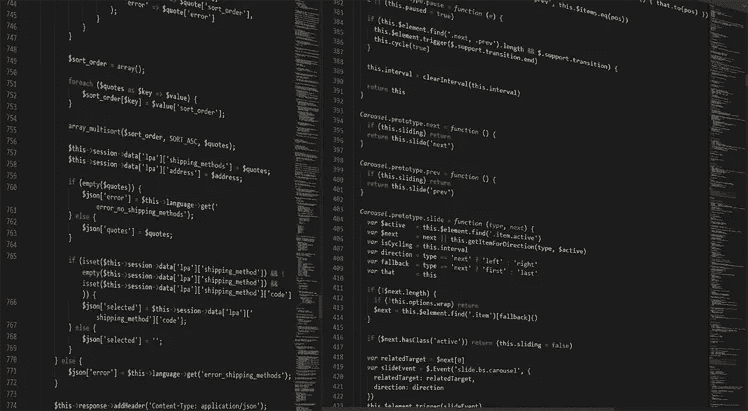

# 通过适当优化提高网站加载速度的技巧

> 原文：<https://medium.com/hackernoon/tips-for-enhancing-website-loading-speed-by-proper-optimization-a0e27ad13da9>

Website Loading Time

用户在日常工作中出于各种原因使用网站。如果用户使用任何数字助理(无论是电话还是桌面)搜索查询，他们希望得到快速和相关的答案。

**例如，**如果用户正在编写一个查询**“网站加载速度”**在第一个实例中，用户主要点击显示的第一个结果，但是在某些情况下，如果页面的加载速度远远高于预期时间，那么用户可能会导航到另一个网站。

仅仅为你的企业设计一个的[网站现在是行不通的。提升网站加载速度也是必不可少的过程。根据谷歌的指导方针，一个网站的加载时间应该不到 3 秒。此外，在 2017-2018 年的调查中发现，如果加载时间超过 2.5 秒，用户就会离开网站。这表明缓慢的网站加载速度会导致网站流量的减少，也会导致网站排名的降低。](https://hackernoon.com/where-web-designing-is-going-in-2019-a12c6ac59441)

网站加载速度慢会在以下方面影响在线业务:

转换

可见性

**转化—** 网站加载速度的优化直接或有时间接影响在线业务。一个网站加载速度慢，影响了特定网站的转化率。根据 Hub Spot 的一份报告，即使页面加载延迟 1 秒钟，也会导致企业转化率下降 7-8%。如果一个网站加载时间太长，有时会令人非常沮丧。

大约 40-45%的流量会离开那个页面，转到另一个网站。这意味着 1-2 秒钟的延迟可能会将所有业务转移到其他竞争网站，并且特定业务的收入将会有很大损失。

**可见性—** 加载速度慢也影响网站的跳出率。对于那些不知道什么是跳出率的人来说，跳出率是用户在访问一个页面后离开网站并导航到另一个网站的百分比。也导致有机搜索结果排名不佳。跳出率越小，排名就越高。

此外，表现不佳的网站无法获得顾客的忠诚，而顾客的忠诚是企业的关键动机。你的网站做得越好，顾客就会越满意。企业的主要作用是让顾客满意。但是如果一个网页加载时间太长，那么用户很快就会感到沮丧。

根据谷歌的最新公告，移动页面将首先被索引。这意味着谷歌没有低性能网站的空间。如果一个人愿意在有机搜索结果上对其网站进行排名，那么他们必须优化其网站，包括桌面和移动版本。据报道，在手机版上加载一个网页大约需要 3 秒钟。因此，如果一个人优化其网页，使其加载量低于这个水平，用户将获得比许多其他网站更大的竞争优势，网站将很容易在谷歌的有机搜索结果中排名。对于在移动版本上加载更快的网页，称为[**【AMP】**](https://www.ampproject.org/)。现在[通过适当的优化来提高网站加载速度](https://www.hackerminded.com/improve-site-speed-performance.html)已经变得非常重要。

(Image Source: Pixabay)

# 这种优化可以通过以下方式实现:

1.将你的网站转移到更好的主机上

2.缩短服务器响应时间

3.尽量减少 CSS 和 JavaScript 文件的数量

4.尝试缩小和合并文件

5.推迟 JavaScript 加载

6.优化图像尺寸

7.减少插件和小部件的数量

8.使用内容传递网络

9.带宽降低加载速度

10.启用浏览器缓存

11.减少重定向

12.减少外部脚本

13.开始监控你的速度

14.监控您的手机页面速度

## 1.**将你的网站转移到更好的主机上**

共享托管

虚拟专用服务器(VPS)托管

专用服务器

**共享主机**–这是最便宜的主机类型，因为它共享 CPU 和 RAM，与虚拟专用主机和专用服务器相比，这反过来会降低其速度。这是世界上最受欢迎的虚拟主机类型，它能让你的网站以一种廉价的方式快速上线。

**虚拟专用服务器(VPS)托管** -与共享托管相比，这是更快的方式。在这种情况下，服务器是共享的，但它也有自己的 VPS 部分，没有其他客户端可以访问信息。这对于像电子商务这样的网站来说是件好事，因为这些网站只能在有限的一段时间内提高流量。

**专用服务器** -这是最昂贵的服务器类型。这有点像获得自己的物理服务器。在这种情况下，您租用一台服务器，并让一名特定的管理员来维护它。

(Image Source: Pixabay)

## 2.**缩短服务器响应时间**

您的 DNS 查找会影响网页的加载时间。DNS 是指域名系统。它基本上将 URL 转换成 IP 地址，而 DNS 查找在数据库中找到特定的 DNS 记录。

**例如，**假设你输入一个网站的网址，【www.facebook.com】T2DNS 会把它转换成 IP 地址，当然 IP 地址很长，用户很难记住。这个时间取决于你的 DNS 服务器有多快，反过来它也决定了网站的加载速度。

## 3.**尽量减少 CSS 和 JavaScript 文件的数量**

如果您的站点包含 JavaScript 和 CSS 档案的合理安排，那么一旦您的站点访问者获得了过于明确的记录，它就会提示大量的 HTTP 请求。这些请求是由访问者程序自动管理的，并降低了网站的工作强度。如果你减少 JavaScript 和 CSS 记录的数量，这将不会加速你的网站。努力把所有的 JavaScript 都集成到一个文件中，更重要的是，对所有的 CSS 文件都做固有的处理。这可以减少 HTTP 查询的一般分类。有大量的工具可以快速缩小 HTML、CSS 和 JavaScript 文档。例如，你可以利用 WillPeavy，脚本迷你，或咕哝设备。

(Image Source: Pixabay)

## 4.**尝试缩小和合并文件**

如你所知，即使很小的代码也会增加文件的大小，从而降低网站的加载速度。因此有时有必要减小文件的大小。执行这项任务的最佳方式是从 HTML 和 JavaScript 开始，因为它们负责网站的外观。此外，尽量减少和合并不必要增加文件大小的小文件。这里缩小是指删除不必要的格式和空白。

## **5。推迟 JavaScript 加载**

推迟 JavaScript 意味着只有在页面内容加载后才开始加载或解析 JavaScript。这反过来不会影响页面的基本呈现。

当页面完成解析时，脚本开始执行。其中一个建议是你应该在页面的底部加载你的 JavaScript，直接在 end

## 6.**优化图像尺寸**

图片是网站非常重要的一部分，因为它使网站看起来引人注目，吸引越来越多的用户与网站互动。没有图片而只有一些内容的网站是用户最不喜欢的。特别是对于像电子商务这样的网站，图片是网站不可忽视的一部分，因为它让用户更加清楚地了解产品，也导致网站业务的增长。

让你的转换率达到这个维度的最理想的方法之一是包括大量的物品图片。在一次评论中，66%的买家说他们在购买前需要看到至少三张商品照片。这意味着，要运行一个有效的电子商务网站，图片是完全必要的。

但同时，值得注意的是，这些图片也降低了网站的加载速度。在这种情况下，应该使用 HTML 响应图像来设置网站的响应。另一种方法是通过压缩来降低图像质量。虽然这种方法不是网站的首选，但这不能影响图像的质量。

## 7.**减少插件和小工具的数量**

插件现在已经成为网站的重要组成部分。它们通过添加特定的功能作为网站的附件。这使得网站在功能数量上非常丰富。但需要注意的是，这些插件也减缓了网站的加载速度，反过来影响网站的性能。

我们应该做的第一件事是检查哪个插件真正降低了网站的速度。一个人应该努力保持插件越少越好，否则它的加载速度会逐渐下降。

(Image Source: Pixabay)

## 8.**使用内容交付网络**

这些是一组分布在不同地理位置的 web 服务器，为用户提供来自网站的内容。如果您将它托管在一台服务器上，则所有请求都在同一硬件上发送，这又会分别响应每个请求，从而导致每个请求的响应速度变慢。

在 CDN 的帮助下，用户的请求被发送到最近的服务器，从而加快了网站的加载速度。这是一个有点昂贵，但非常有效的方法来提高网站的速度。

## 9.**带宽降低加载速度**

有时，对网站的[设计的任何更改都会导致在网站中获取分配给用户的带宽。这有时会降低网站的加载速度](https://dev.to/sandeepsinghmehta/5-ways-to-have-a-more-appealing-website-design-2a5h)

## 10.**启用浏览器缓存**

假设你昨天访问了名为[medium.com](/)的网站，如果你再次访问同一个网站，那么该网站的加载速度比以前快得多。你观察过这个吗？

每当您访问一个网站时，都会有一些数据存储在您的硬盘和高速缓存中。下次你访问同一个网站时，它会加载得更快，因为它会将该特定网站的数据存储在你的磁盘上。

因此，通过启用缓存，网站将加载更快。

## 11.**减少重定向**

断开的链接带来的问题通常可以通过重定向技术来消除。如果我们移动或删除页面，经常会发生重定向。但是根据谷歌的说法，重定向应该从网站上完全删除。尽管如此，因为这不是所有的意图和目的可以想象的。

因此有必要将其最小化。市场上有许多工具可以找到网站的所有重定向，因为这些工具可以识别网站的所有重定向。在分析了所有的重定向之后，尝试将它们最小化。您还可以查看通过不同网站链接到您的网站的页面。

## 12.**减少外部脚本**

如上所述，JavaScript 和 CSS 是页面加载缓慢的原因。但是除了它们之外，还有其他外部脚本影响了网站的加载速度。这些可以通过在 Chrome 的开发者工具中重新打开网络标签找到。

当一个网站是开放的，例如任何人打开脸书，这些外部脚本被附加到代码。这表明 JavaScript 和 CSS 并不是影响脚本和降低网站速度的唯一元凶。其他第三方脚本也在影响网站的性能。

## 13.**开始随着时间监控你的速度**

优化你的网站后，间隔一段时间后开始监控你的速度。你只需要打开你的网站，注意网站的加载时间。你也可以使用市场上不同的工具来监控你网站的速度。

## 14.**监控您的手机页面速度**

如上所述，谷歌也已经开始在网站上索引移动网页，因此它也成为测试和监控你的移动网站速度的一个重要因素。从最近的报告来看，很明显，在一段时间内，互联网用户也逐渐从桌面转向移动，因此监控移动页面速度已成为一项必要的任务。如果一个网站在桌面上加载很快，但它的移动页面却没有那么快，那么这个网站在自然搜索结果中的排名就会下降。

为此，你可以从使用[谷歌的工具测试我的网站](https://developers.google.com/speed/pagespeed/insights/)开始。

(Image Source: Pixabay)

## **结论**

这项任务不会那么容易，也不期望用户自己实现今天的所有方式。一个人应该花更多的时间在网站上，试着分析每一步。

注意每一步的效果，然后继续下一步。这将有助于理解网站的行为，以及前端或插件或编码或样式表或服务器托管或任何其他因素的微小变化如何影响网站的性能。然而，更重要的是，其中一些可能看起来很小，即使是在减少负担方面迈出的一小步也会产生任何影响。当你考虑到哪怕是一瞬间对你的变化和成就产生的影响时，尽管有这么多麻烦，它们也是完全有道理的。

**作者简介**

由 **Sandeep Mehta** 热情的专家[德里的自由网站设计师](https://www.sandeepmehta.co.in/services/freelance-website-designer-delhi/)和 SEO 专家撰写，上面的文章快速展示了他的遭遇和通过他的航行所获得的重要才能，以理解在所述专业中网站规划的深度。由于他的自信和对网站结构观点的热情，以及他在满足客户需求方面的利他主义，他的业务已经达到了一个新的台阶。