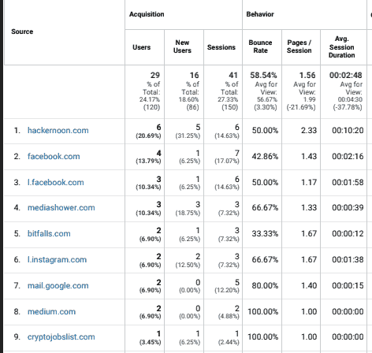
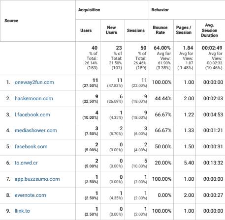
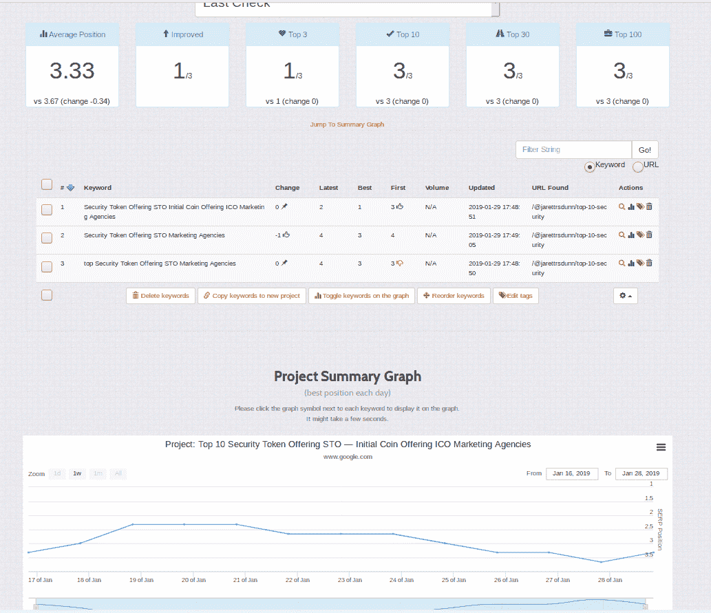
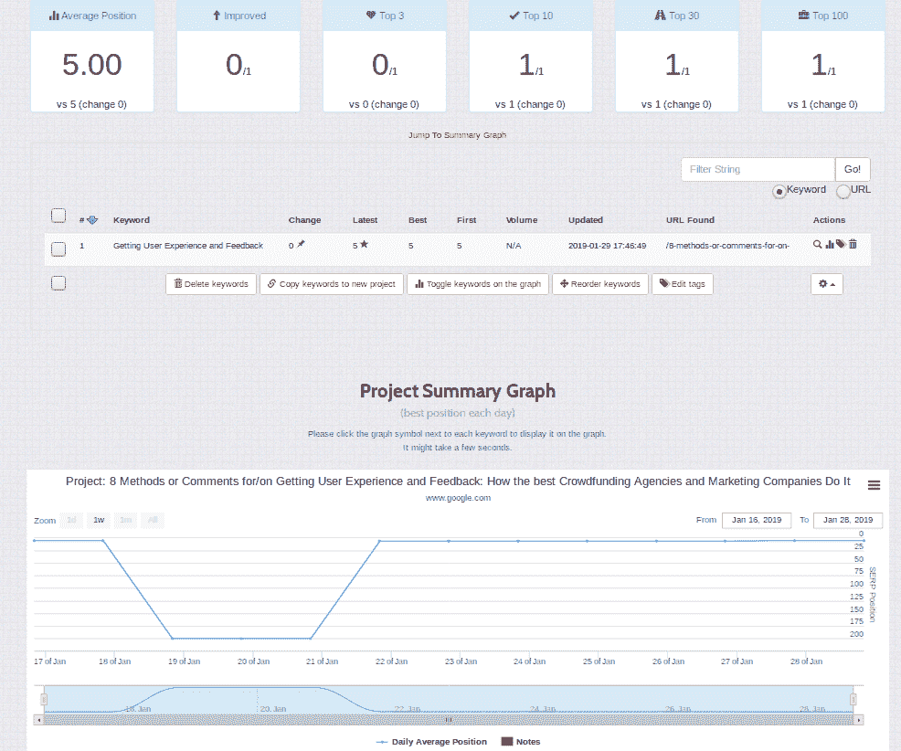
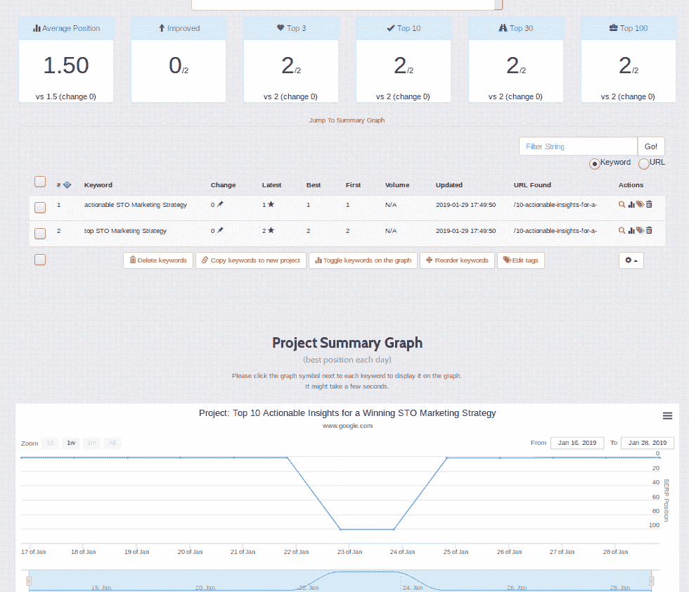

# 提示常青树和有机交通产生的文章

> 原文：<https://medium.com/hackernoon/tips-for-evergreen-organic-traffic-generating-articles-9d08de5a24ba>

# 介绍

在我代表我的第一个客户发表最后一篇文章 12 天后，他们网站上的推荐流量增加了 86%，其中 27.5%的推荐流量来自我的[Medium.com](/@jarettrsdunn)和[HackerNoon.com](https://hackernoon.com/@jarettrsdunn)的文章——在他们所有的推荐中排名第一，页面数/会话数最高。

昨天，22.5%的流量来自我的 HackerNoon 文章，在整体推荐中排名第二，但如果你仔细观察，排名第一的条目有 100%的跳出率和 00:00:00 的平均会话持续时间，而列表中最高的平均会话持续时间是 00:13:12，第二高的是 00:04:53，他们的“新用户”比率合计为 6 个用户中的 16.67%，我的 HackerNoon 流量是 66.67%的净新用户。我获得了吸引人们回来的有机流量的粘性——这些访问中有 33.33%是回头客——以及真正感兴趣的独特流量。

我是如何推动这种有机增长的？这篇文章将总结我的策略，这样你就可以重现这些结果。

# 一个骗子

如果你把这篇文章看做一个寻求排名的新技术组织、个人或品牌，你应该访问 [http://techvoices.club，我在那里提供服务](http://techvoices.club)！

# 进一步的推诿

如果你是作为内容创建者或影响者阅读本文，你也应该前往 [http://techvoices.club，在那里你可以注册成为我们社区市场的供应商](http://techvoices.club)并提供你的服务！

# 根据相关和流行的关键词选择标题

你的文章标题将是搜索引擎关键词排名的主要来源。

在下图中检查这种随时间推移的粘性！已经过去 12 天了，我们仍然有一个关键词排在前 3 名，另外两个排在前 10 名——并且排名的最佳值与现值计算出来是相等的，证明我们已经实现了粘性！

下一张图中这是什么？另一篇文章中的更多证据？虽然不像第一张图片那样令人印象深刻，我们甚至一度跌出了关键词的前 10 名..我们回来了，我们正以一种复仇的姿态紧紧抓住第五名——又一个 12 天粘性的胜利！

但是正当你可能对排名第五感到失望的时候…

请看下一张图片！虽然我们再次从排名下降了整整两天，我们的营销努力证明了他们的有效性，因为我们上升到#1 和#2 的关键字结果！事实证明，你在搜索引擎上的排名越高，你就能获得越多的有机和常青的流量——看起来我们已经掌握了这门艺术！

好了好了，够无耻的自堵了…虽然我的 shill 游戏强！

你可以使用像谷歌的关键字规划器这样的工具来估计搜索量，或者根据现有的关键字、登陆页面等获得关键字建议。有一些优秀的[免费长尾关键词建议工具](https://www.google.com/search?q=longtail+keyword+planner+free)，你可以用它们来找到特定的搜索词，这些词可能会有更高的搜索量，你可以加以利用。

# 顶级列表

“热门榜单”被搜索的次数远远超过一般的搜索引擎关键词，为了证明自己更成功，你的标题应该遵循这种互联网趋势。为我现有的客户查看这些标题，并确定趋势:

基本社区管理介绍课程的前 5 名概述

推动参与度的 7 大典型步骤

关于激励的 6 大现成评论(适用于 xyz 行业！)

在竞争中生存和发展的 5 大要点(在 xyz 行业！)

前 6 个基石基金会 re:赏金给我，赏金给你，赏金给每个人！

从专业、个人和精神上学习和成长的五大建议

# 约 1000 字

你的读者的平均注意力持续时间并不是很长，所以尽你最大的努力用有用的内容吸引他们，尽量不要用垃圾邮件、废话或其他低质量的词汇。

这里真正的关键是尽你所能增加价值。使用数据来创造洞察力和有用的建议，可操作的信息，你的观众可以从中学习和成长。如果你在 1000 个单词中什么也没说，它不会吸引任何人，也不会得到任何赞赏——如果你在 2000 个单词中填充了太多可操作的信息，你会失去普通读者的兴趣——或者他们甚至可能不会开始！

# 反向链接高质量内容

这是因果报应——你反向链接高质量的内容，人们就会反向链接你！所有搜索引擎功能的基础是索引和排名反向链接。你的读者有时也会关注你的链接——如果你的内容得到了赞助，那会很有帮助！这里的教训是，如果你直接引用成功和著名的来源，你会更快地被索引，并产生更大的影响。

# 使用高质量的内容平台

当我在自己的网站上写博客的时候，任何事情的排名都需要花费数周的努力和手动从高 DA 和 PA(域名权威和页面权威——相当于一个谷歌)网站反向链接。现在我在 HackerNoon.com 上，我的排名几乎是即时的，而且通常是不精确关键词的第一页结果！

# 结论

这是合理的，每个有话要说的人都可以在搜索引擎上清晰、简洁、有创意地表达自己的观点。往前走，释放自由的力量(或者在被赞助的情况下，你可以说‘常青树！有机的！不是免费的，因为它花了很多钱！)为你、你的客户、你所爱的人甚至你的猫带来流量——任何值得拥有全新的、回头客和回头客的人！