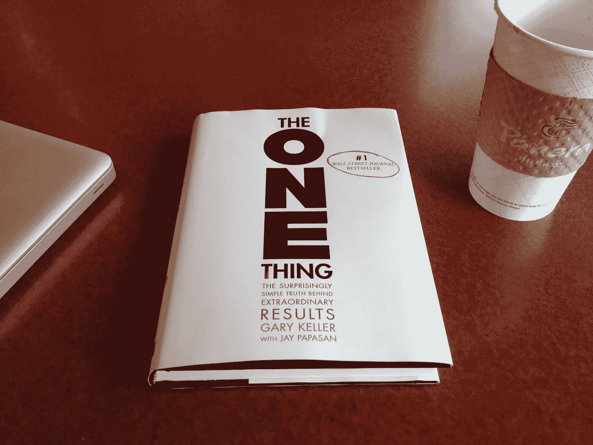

# 要体验非凡的结果，早上做创造者，下午做管理者

> 原文：<https://medium.com/hackernoon/to-experience-extraordinary-results-be-a-maker-in-the-morning-and-a-manager-in-the-afternoon-80b0d80bb4e2>

## 我的意思是:

我刚刚读完加里·凯勒的《同一件事》，这是这本书的关键要点。

> *“上午做制造者，下午做管理者。”*

在他的书中，加里·凯勒谈到了对你的一件事——你最重要的任务——进行时间划分，并在早上第一件事就完成它是多么重要。

事实上，最富有成效的人，那些取得非凡成就的人，遵循这条道路。

他们每天最重要的约会是和自己在一起。他们从来没有错过。

例如，斯蒂芬·金做了完全相同的事情。

在他的书*《论写作》*中，他这样描述他的日常安排——

> 早晨属于新的或当前的草稿。下午是小睡和写信的时间。晚上是阅读、家庭时间和任何不能等待的复习时间。

基本上早上是他写作的黄金时间。每天早上四个小时。

现在每天四个小时可能比他的小说更让你害怕，但你也不能否认这个结果。

今天，斯蒂芬·金是最成功的作家之一。

但问题是，每当我分享这个故事时，我经常会收到类似*的回应:“这对斯蒂芬·金来说很容易——他就是斯蒂芬·金！”*

同意。

但是他这样做是因为他是斯蒂芬·金，还是因为他这样做他就是斯蒂芬·金？

这个问题总是在那一刻结束讨论。

事实是，在他职业生涯的早期，斯蒂芬·金不得不尽可能地寻找时间块——早上、下午、午休，甚至深夜，因为他的全职工作不允许他利用早上的时间写小说。

但是一旦他的副业(他的写作)开始产生非凡的结果，一旦他最终能够从他的一件事情中谋生，他就能够将他的时间块移动到一个更可持续的时间。

Y Combinator 的创始人之一保罗·格拉厄姆也建议做同样的事情。

在他的文章《制造者的时间表，管理者的时间表》中，他强调了大时间段的必要性。

创客的时间表基本上就是做或者创造东西的意思。这些事情包括写文章，发展想法，生产产品，执行项目计划，以及类似的事情。

由于这些事情需要大量的时间，所以 Maker 的时间表是以半天为增量来查看的。—至少 4 小时。

另一方面，经理的时间表可以分成几个小时。所有无人值守的电子邮件、语音邮件、会议和日常杂务都属于这一类。

这正是你需要做的，以达到非凡的效果。

> *上午做创客，下午做管理者。*

# 但生活没那么简单，兄弟。

我知道。

特别是在一份朝九晚五的工作中，我知道总有其他事情让我们去做。

当我把这个应用到我自己的时间表中时，一开始真的很有压力。

我不断被打断。

同事来访、电子邮件提醒和来自团队成员的 Skype 消息源源不断地发送请求。

这些甚至不是分心。这是我的工作。

但是为了解决这个问题，我想到了一个办法。

我只是重新安置了我的办公桌，以避免随机路过和不紧急的请求。不到一个月，几乎每个人都习惯了这样一个事实:在上午 10 点到下午 2 点之间，我是不可接近的。

虽然我仍然不断地收到 Skype 的请求，但大多数请求并不紧急。所以我只是把它们写在任务清单上，然后继续做我应该做的事情。—我的一件事。

# 结果呢？

我现在正经历着生产力的巨大飞跃。

我还在一个月内在我们的网站上吸引了比我们之前一整年都多的眼球。

好消息是，你也可以体验到类似的结果。

你现在知道该怎么做了！😉

*原载于 2019 年 2 月 14 日*[*【www.screwedupengineer.com】*](http://www.screwedupengineer.com/how-to-achieve-extraordinary-results/)*。*

## 感谢您的阅读。

## 如果你觉得这篇文章有用，请使劲按“拍手”按钮，让其他人也能看到。

## 关于作者:

贾伊明经营着一家独角戏内容代理公司——*[*搞砸了工程师*](https://goo.gl/fL8gv1)——该公司以博客起家，但现在他通过自己的 [*博客内容营销服务*](https://goo.gl/ey7yzb) & [*客座博客服务*](https://goo.gl/vWaM8h) 帮助跨国品牌增加网站流量和销售额。*