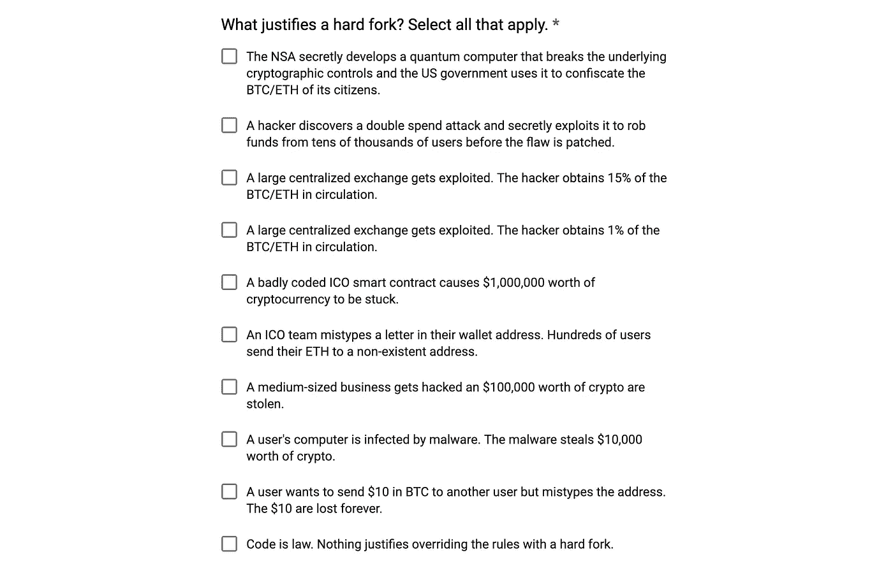
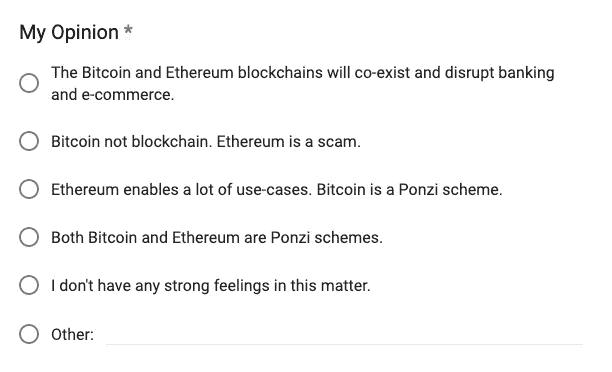
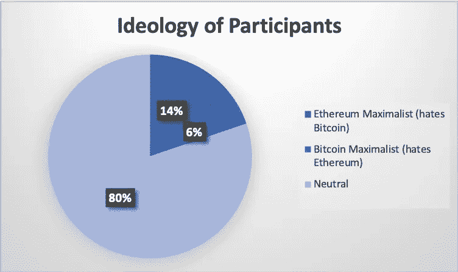
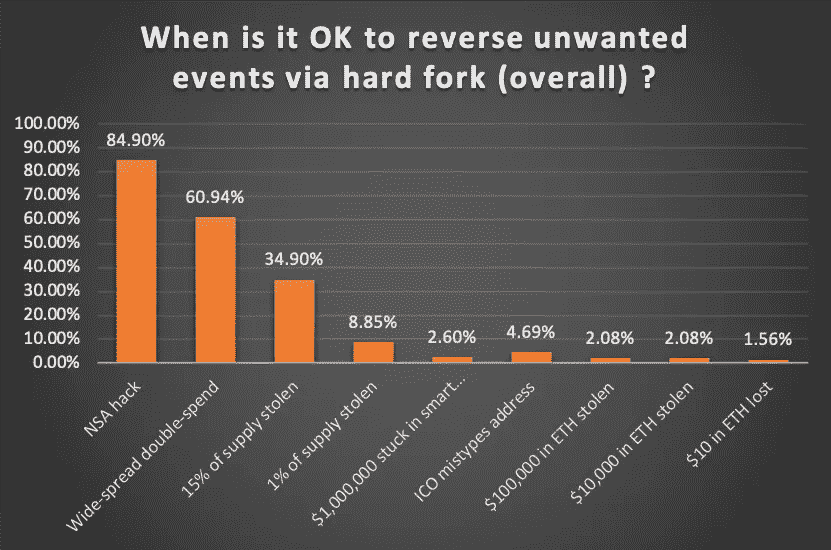
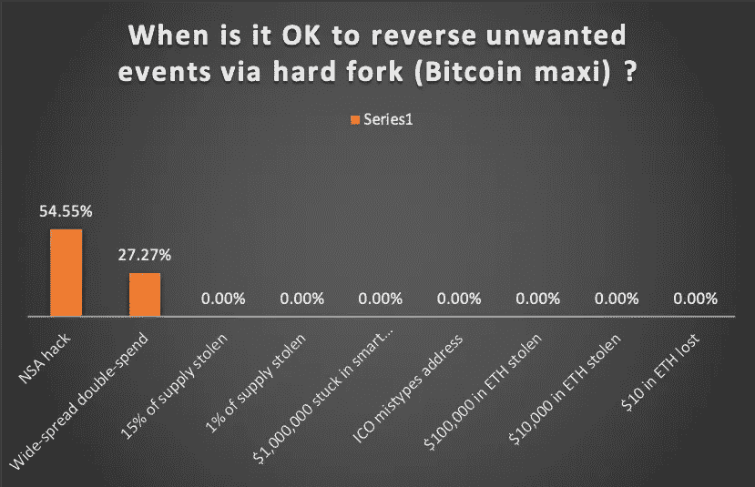
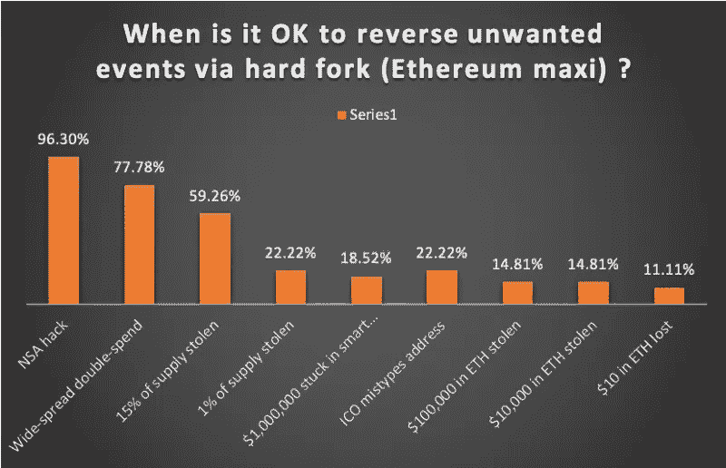

# 叉还是不叉？比特币和以太坊社区调查的结果。

> 原文：<https://medium.com/hackernoon/to-fork-or-not-to-fork-results-of-a-bitcoin-and-ethereum-community-survey-d46abe1d15dc>

“硬叉子”是一个煽动激烈争论的术语。一些社区[明确支持链上治理](https://github.com/EOSIO/Documentation/blob/master/TechnicalWhitePaper.md#governance)，例如冻结账户和动态更改智能合同代码，而其他一些社区则被认为深深植根于“永远不要硬分叉”的阵营。

比特币社区以严格反对使用叉子而闻名。协议层面的重大变化通常不会进入主流比特币核心客户端(即，硬分叉总是有争议的，并导致从主 BTC 链分裂)。虽然这使得实施有意义的协议更新变得困难，但它也让人们对比特币的可靠性和比特币交易的终结性产生了信心。

以太坊社区定期通过协调的硬分叉实现协议更新，并且通常被认为更加务实。众所周知，[在](/swlh/the-story-of-the-dao-its-history-and-consequences-71e6a8a551ee)之前曾经使用过一次硬叉子来逆转一次大攻击的效果。EIP 提出了恢复损失资金的[过程(EIP-999)](https://github.com/ethereum/EIPs/blob/master/EIPS/eip-999.md) 和救助编程错误受害者的[(EIP-867)](https://github.com/ethereum/EIPs/blob/master/EIPS/eip-867.md)。

我做这个调查的动机是评估社区对硬分叉的看法。像 EIP-867 和 EIP-999 这样的提案实际上达成共识的可能性有多大？比特币和以太坊社区的观点到底有多大差异？这是我发现的。

# 受众和方法

我创建了一个标题为[的 Google 表单](https://docs.google.com/forms/d/e/1FAIpQLScRkDR5s34DFy4rmUmbI2Sdvg9eAQ09uERZsHXqYSvIi1PJzg/viewform?usp=sf_link):

**“在什么情况下你会同意一个硬分叉来逆转区块链上不必要事件的影响？”**

该表单包含一个多项选择问题，列出了九种可能的硬分叉方案以及一个“代码即法律”选项。

此外，我要求人们通过询问他们的总体世界观来确定自己是比特币最大主义者、以太坊最大主义者还是中立者。

*   响应者检查了“比特币不是区块链。以太坊是个骗局。”被认为是比特币最大化主义者。
*   勾选“以太坊”的回复者支持很多用例。比特币是庞氏骗局。”被认为是以太坊最大主义者。

我在我的推特上发布了这个链接，同时也在[比特币](https://www.reddit.com/r/bitcoin/)和[以太坊](https://www.reddit.com/r/ethereum/)子页面上发布了链接。不幸的是，我的帖子在几分钟后因为“推广 altcoins”而被从/r/bitcoin 删除。然而，它确实在/r/以太坊的顶端停留了一段时间。在导出结果时，我总共收到了 [192 条回复](https://docs.google.com/spreadsheets/d/183GkzyrKwiLyXgo46z9QANc5Wfyg8gBZ52vI326SWlE/edit#gid=1544201373)。

# 结果

第一个有趣的观察是，80%的受访者认为自己是中立的(即不是比特币或以太坊最大化者)。对我来说，这是一个受欢迎的惊喜:尽管最大化主义者非常直言不讳，但他们似乎是少数。但是请注意，这些数字偏向以太坊社区，因为调查帖子很快就从/r/bitcoin 中删除了。

一般人群(所有调查参与者)的总体结果:

一般来说，有一个广泛的共识，即硬分叉应该只在存在威胁和关键协议级漏洞的情况下使用。一位受访者提交了以下评论，很好地总结了大多数受访者表达的观点:

*“代码应该被尊重。除非犯了严重的错误；开发商没有负担硬叉提供退款。事情应该尽可能地保持现状，除非底层加密货币代码中的编程错误导致巨额资金流失。(这不包括 ico 和智能合约世卫组织自己写代码自己负责)代码就是法律；除非发现该代码有重大缺陷。所有风险由加密货币的使用者承担；而不是更广泛的社区。交易所确实应该得到一些宽容；如果可以的话，你和法律也会为被抢的银行做同样的事。责备和责任落在罪犯身上；只要交易所没有被发现有刑事过失，我们应该能够很容易地收回资金，并使不良交易无效，如果我们能够证明交易所是安全的。然而，我们可能要求首先对罪犯采取所有法律措施。”*

作为奖励，我研究了比特币最大化者和以太坊最大化者之间的区别。毫不奇怪，比特币最大化主义者更坚决地拒绝硬分叉。然而，如果美国政府秘密开发量子计算机并没收用户的资金，大多数比特币最大主义者会支持硬分叉(54%)。大约四分之一的人支持逆转广泛的协议级攻击的影响。其他方案没有得到任何支持。

以太坊最大主义者比一般人更宽容地支持硬分叉。在这种情况下，在一家交易所 15%的 ETH 供应被盗后，纾困该交易所得到了大多数人的支持。但是剩下的提议几乎没有得到以太坊最高纲领主义者的支持。

# TL；速度三角形定位法(dead reckoning)

在张贴到比特币和以太坊社区的一项调查中，只有 20%的人被认为是这两个链中的最大主义者。主要发现:

*   大多数受访者支持硬分叉来逆转关键协议级攻击的影响。
*   如果 15%的货币供应量从交易所被盗，大约 1/3 的受访者会支持硬分叉。
*   所有其他提议都得到了少数人的支持。
*   “评论、咆哮和人身侮辱”部分最喜欢的引言

以下是用户在“评论、咆哮和人身侮辱”部分提交的回复。我在这里引用他们没有归属，因为我没有收集电子邮件地址(PM 我，如果你想添加你的名字)。

# *“我假设“这证明了一个硬分叉”列表中的前两个选项(NSA 和双重花费利用)代表了协议中被发现和利用的缺陷，而不是仅仅找到一些更好的挖掘或诸如此类的聪明方法。我怀疑，在第一种情况下(革命性的新计算技术打破了广泛使用的基本密码学)，以太坊的状态在更广泛的计算机网络崩溃中不会是一个主要问题，但当然，如果可以制作一个紧急补丁来拯救以太坊，这似乎很好。不过，我应该指出的是，已经有人在抢先进行量子验证以太坊的工作了。”
—匿名*

*“政治上的强硬手段对生态系统来说是非常健康的，嗯？”
—匿名*

*   “如果国家安全局建造了量子计算机，硬叉子不会阻止他们只使用它两次。”
    —匿名
*   *《HODL·BTC》
    —佚名*
*   “EIP-999 可以去他妈的自己。”
    —匿名
*   *“HODL BTC”
    — Anon*
*   *“EIP-999 can go fuck itself.”
    — Anon*