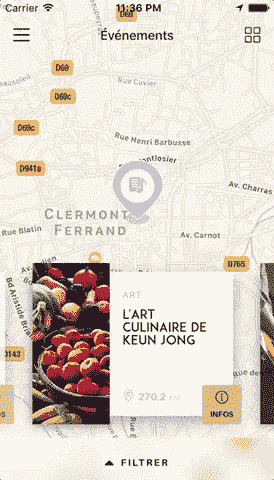
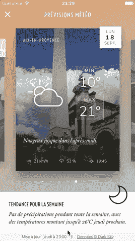
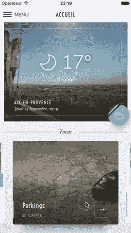

# 去(或不去)以当地人的方式反应

> 原文：<https://medium.com/hackernoon/to-go-or-not-to-go-react-native-way-70513ca5e871>

> 你在这里找不到任何关于像脸书、网飞和 Airbnb 这样的酷家伙如何受益于 React Native 的东西。

取而代之的是，JavaScript 框架的优点和缺点(和其他技术一样)以及需要考虑的一些用例。我们在这里告诉你:)

[*Purrweb*](https://www.purrweb.com/) *打造稳定的产品和 MVP，让商业爱好者验证创意。要开始，去写我们在*[*hello@purrweb.com*](mailto:hello@purrweb.com)*！*

# 额外津贴

**一个共享代码库**。实际上，有了 React Native，你就在构建两个独立的应用版本(IOS 和 Android)。是的，这两个应用程序版本共享 65–70%的 JavaScript 代码。相同的代码库使您更容易维护，需要担心的错误更少(因为代码总量几乎减少了两倍)。它节省了您可以花在新功能上的额外的几天和几周时间。

**非常接近原生性能**。与其他跨平台选项不同，如 Cordova、Ionic 或 Titanium 模拟浏览器应用程序(就像在应用程序市场中有一个模拟的响应 web 应用程序)，React Native 运行原生 API。没有点击和滚动的问题，UI 感觉像一个原生应用程序，而不是基于浏览器的。

*So, Swipe in React Native would be completely the same as if you had implemented it in Swift or Java* — [Source](https://github.com/archriss/react-native-snap-carousel)

有大量其他 UI 工具包和库可以帮助您处理开发阶段的性能挑战，就像在任何其他成熟的框架中一样。和往常一样，你只需要确保你将要使用的库包经常更新+不要忘记为他们研究现有问题的积压。

**快速人才搜索**。没有必要浪费整个周末坐在笔记本电脑前搜索 Swift 和 Java 大师。简单地找一个 JavaScript 的吸盘(在处理最流行的语言时，这不是一个大问题)就可以了。找到一个知道反应的人已经很好了。只要确保你知道如何从候选名单中选择“好的”就行了。

**庞大的社区**。都是为了开发者的幸福。当一个开发人员无法通过 googling 处理 bug 时，社区会提供帮助。这意味着任何人都可以在 Github 上打开一个问题——神奇的事情发生了——有一个现成的解决方案，来自以前已经面临同样问题的人。开发人员越开心，项目开发的 e̶a̶s̶i̶e̶r̶̶y̶o̶u̶r̶̶l̶i̶f̶e̶̶i̶s̶就越顺利。

这很好，如果只关注超能力，我们就像挨家挨户推销的推销员。卖狗屎并试图让你相信它是甜的推销员。

> 你最好从各个角度看问题。React Native 一点也不完美

Hi there! Wanna find the best app-building tool?

# 逮到你了

**框架不成熟**。现在还不是 1.0.0 版本，所以有很多缺失的组件和不断的更新。对于一个开发者来说，这意味着花费大量的时间和精力去寻找已经制定好的解决方案并整合新的版本。至于定制的东西(超级独特的功能)，他将不得不自己构建它们，可能需要 Swift 和 Java 经验。

**对复杂的动画效果不佳**。在这里，开发人员很可能需要深入研究本机代码。不过，我怀疑这是否是 MVP 的主要关注点。

**不适合 3D 游戏。或者一些需要物理和大量图形的东西，所以在这里你也必须依赖原生移动应用程序开发者。**

# 伙计们，结论是什么？

选择实际上取决于你未来应用的细节。综上所述，在以下情况下，您可以选择 React Native:

你需要一个 MVP。比方说，你想从一个奇特的原型开始，让你测试两个平台的概念并收集初始反馈。既便宜又快捷。

**你需要一个社交 app。**该框架适用于摄像头接入、指纹、地理定位和地图等功能。

**没有关于动画密集型应用的内容**。我的意思是，在这种情况下，React Native 并不是最明智的选择。它给了你实现漂亮的 UX 动画的能力，但是当涉及到一些令人愤怒的事情，比如在单个屏幕上放大/缩小 10000 个对象的动画，你最好坚持真正的本地方式。另一方面，如果你的应用程序只有 UX 交互和屏幕之间的转换，这个框架是一个可靠的选择。

如果我们没有涵盖您对 React Native 的痛苦，请随时联系我们的首席运营官 Sergey，讨论您的新应用程序想法，并一起了解该框架是否合适。

 [## 首席运营官谢尔盖·尼科年科

### 在全球最大的职业社区 LinkedIn 上查看谢尔盖·尼科年科的个人资料。Sergey 有一份工作列在…

www.linkedin.com](https://www.linkedin.com/in/sergey-nikonenko-7a1084ab/) 

*在*[*insta gram*](https://www.instagram.com/purrweb/)*上关注 purr web |在* [*上喜欢我们脸书*](https://www.facebook.com/purrweb.agency/) *或* [*推特*](https://twitter.com/purrweb)

拥抱和喵喵叫♥