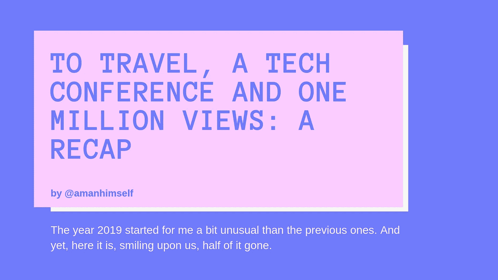
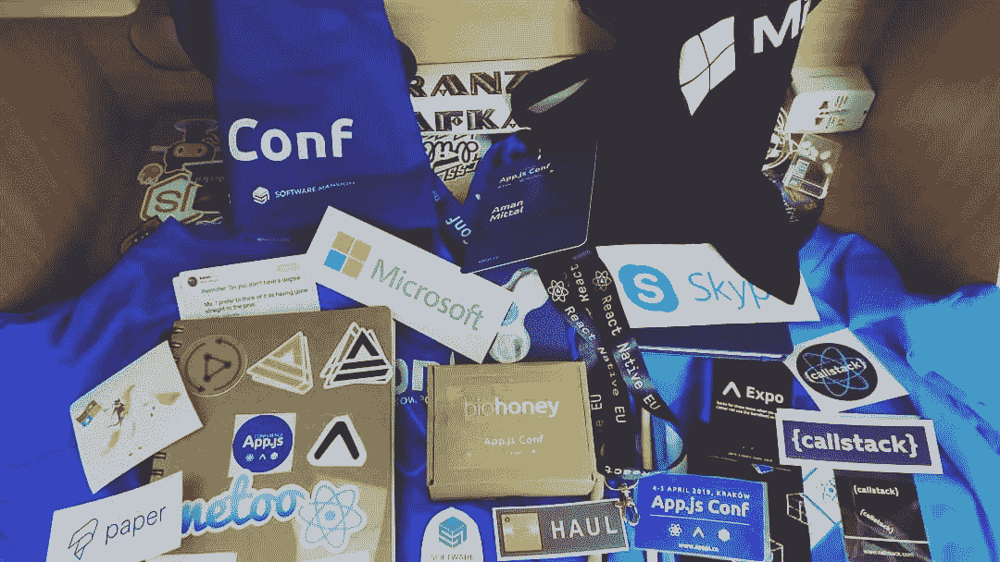

# 旅行，一个技术会议和一百万次浏览:一个回顾

> 原文：<https://medium.com/hackernoon/to-travel-a-tech-conference-and-one-million-views-a-recap-22e135a598c3>

对我来说，2019 年的开始有点不同寻常。我从没想到我的博客帖子会受到如此多的关注，这些帖子大多发表在这里。只计划了一次旅行，结果去了两次。最后也参加了一个科技会议。当我开始我的开发职业生涯时，我从来没有想过。

六个月已经过去了，因此，如果你在 Twitter 上，你可能每天至少会看到下面这条推文。

今年到目前为止一直是过山车。类似于我在一月的一次，但是有点慢。

# 成就🎉

今年，我设定了一些要实现的个人目标。一路上有些意外或惊喜。对某些人来说，我的确出了很多汗。有些人喝了比平常多的咖啡杯。

下面是我在 2019 年到来时想到的一系列目标，到目前为止我已经实现了这些目标，其中一些仍在进行中，很少是真正的惊喜。

✅每周简讯订阅量达到 500 次

🚧在 Twitter 上拥有 5000 名粉丝

✅改造个人网站

Patreon.com*(惊喜)*✅[接待一位赞助人](https://patreon.com/amanhimself)

✅100 万博客帖子浏览量

✅在 30 天之内，收到超过 100k 的博文浏览量*(惊喜)*

✅在 Instagram 上拥有 1000 名粉丝

✅出国旅行去了至少一个国家，结果旅行去了 5 个

🚧写 50 篇关于 React Native 的文章/教程*(目前已发表 19 篇)*

这些目标中的大部分将在 6 个月内实现，只有少数仍在进行中。对我来说，拥有这样的个人目标，有助于朝着我雄心勃勃的方向前进，也就是说，花大量的时间创建开发内容，在需要的时候教其他开发人员，使用我熟悉和使用的一套技术或框架。

一路走来，我做了一些错误的决定。也有一些好的。接受我还没有准备好的机会确实让我从不同的角度看待事物，并帮助我成长为一个人。

# 参加一个技术会议👩‍💻

如果你的世界围绕着软件开发，我的建议是在你的一生中至少参加一次科技会议。见鬼，如果你想参加 10 个！

我陈述的原因同样来自于一个最近的亲身经历。2019 年 4 月份参加了[**app . js Conf**](https://appjs.co/)**。**独一无二的。Expo 和 React 本地开发者技术会议首次在波兰克拉科夫举行。那是我的第一次。

Twitter 在开发界相当有名。许多人热衷于建立联系，许多人也做到了这一点。你可以了解几乎所有正在发布的新框架，也可以通过 Twitter 来学习。你也可以建立良好的人际关系。长时间从无条件的角度去认识人。开一个新的网站或企业。在我看来，所有这些都是好的。

但是亲自参加一个技术会议有点刻意。它将帮助你在个人层面上接触到人们。我会说，如果你足够幸运，在你居住的地区或城市有很棒的聚会或会议，试着参加一些。你永远不知道那扇门后藏着什么。

当我谈到我参加的会议时。我个人遇到了一些令人敬畏的人，他们让我意识到这个星球上有善良和谦虚的人，他们愿意帮助一个完全陌生的人，或者给他们陪伴和分享时刻。我遇到了我在开发世界里崇拜的人，并学到了很多新东西。此外，我从没想过有人会从我的 Twitter 账号上认出我。我仍然不相信，但它确实发生了。

😱

那是我的反应。

我计划在今年下半年或明年年初再参加一次。

# 写作✍️

在去年的大部分时间里，我停止了写作。我开了五年的博客，写书评，采访一些知名作家，并两次获得 T2 最佳图书博客奖。但最终，我失去了很多兴趣，因为我觉得没有什么可做的了。我慢慢地将我的写作热情转移到科技世界，男孩为我打开了我从来不知道存在的大门。

一路走来，我确实学到了一两件事，如何利用互联网在不伤害任何人的感情的情况下推广内容。我从未想过在一个只有两年多一点的平台上达到 100 万的浏览量。

我为各种博客、杂志、媒体出版物写过文章。为了在一个地方管理和保存它们，我开始维护一个 Github 库。你会发现所有的链接👇

 [## amandeepmittal/技术写作

### 📝我写的所有关于网络/移动技术的文章的列表

github.com](https://github.com/amandeepmittal/tech-writing) 

我从中得到的教训是，如果你对某件事充满热情，不能暂时远离它，并且在那个领域持续采取行动，你将达到*高度*。激情确实能帮助你走过漫长的道路。

# 旅游✈️

*为什么？为什么不保存所有的💲为了未来的自己？为什么要旅行？*

我的许多熟人并不知道这一点，但从我十几岁的时候起，我就渴望旅行。我一直被关闭，直到我不得不强迫自己一点点，让它发生。

现在，我爱上了它。

我们都有自己与“旅行”这个词相关的理由。我的是学习新的东西，认识新的人，和少数人有短暂的片刻，或者建立一些联系，参观我认为令人惊叹的地方，管理从计划到费用，饮食，住宿等等的一切，做我自己。最后，我设法去了五个国家，包括中东最奢华的城市之一和四个美丽的欧洲国家，我仍然对它们的美丽和平静感到惊讶。

去不同的地方旅行确实对我有很深的影响。关于我自己，我学到了一些重要的东西，尤其是我想如何在我的职业生涯和生活中采取这种方法。以及其他对我去过的地方或沿途遇到的人来说必不可少的东西。

我确实有一些未来旅行的计划。这次我想尝试一下，不只是去度假，而是试着在一个地方呆更长时间。这可能会成为你在今年年底听到的一个实现的个人目标。

## 到目前为止我就知道这些。度过有趣的六个月。今年年初以来你都在忙些什么？让我知道。

我现在不在🐦 [**Twitter**](https://twitter.com/amanhimself) 经营一份每周简讯(已经有 600 多名开发者加入),在那里我分享我在 Nodejs、Reactjs、GraphQL 和 React Native 等框架上的所有帖子。

✉️ [**加入每周简讯**](https://tinyletter.com/amanhimself) **。**