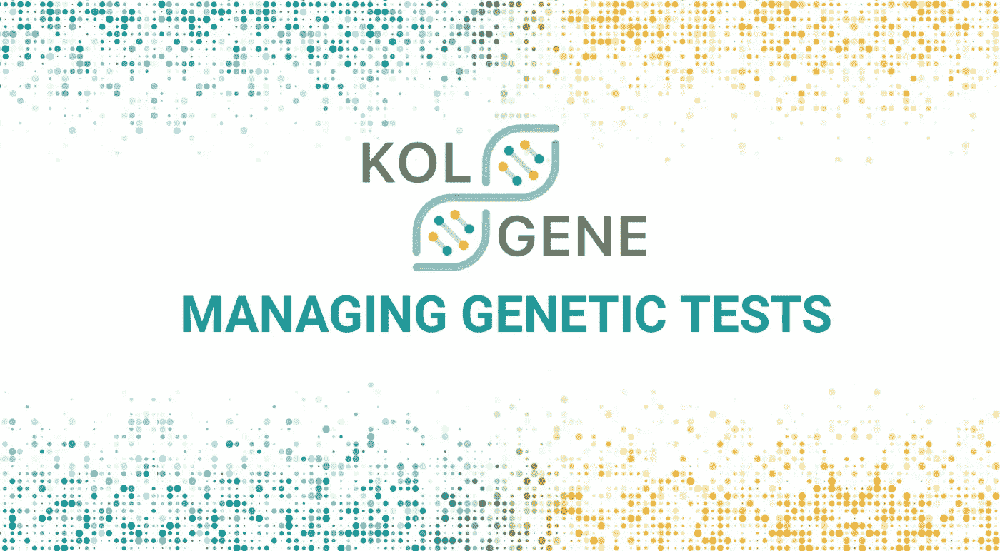
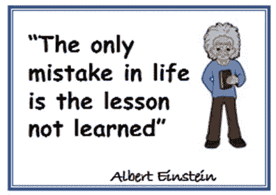
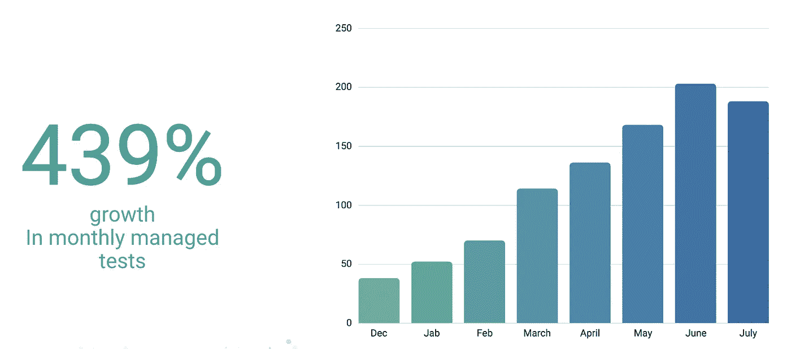
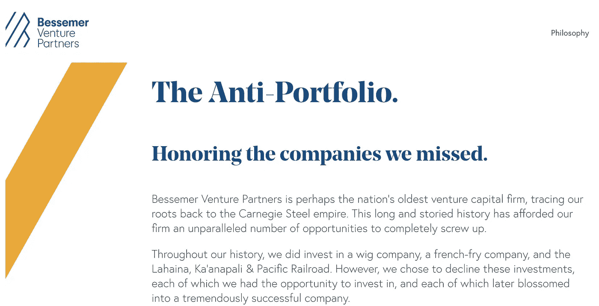
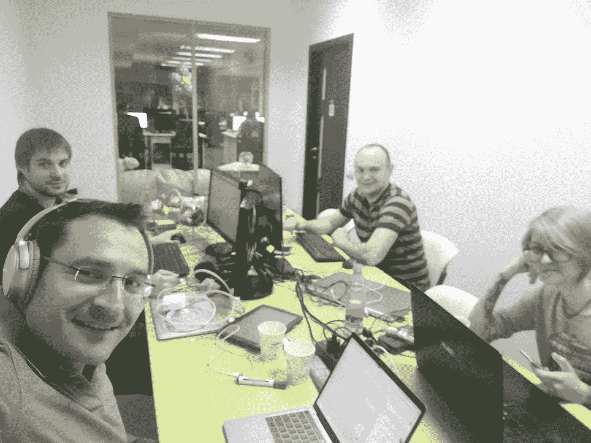
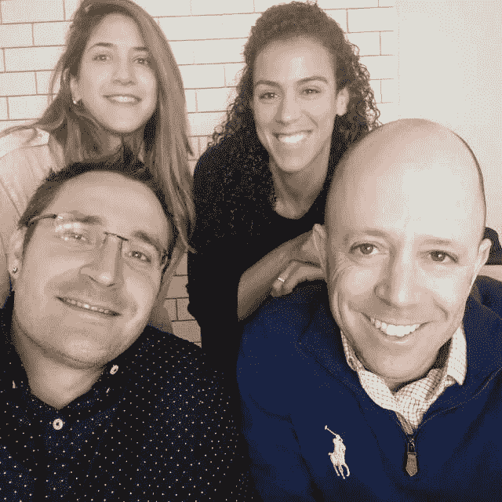
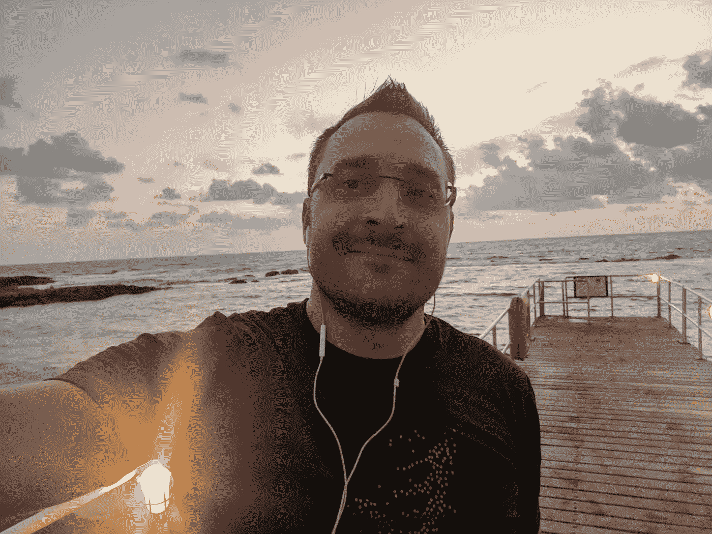

# 今天我关闭了我们的服务器

> 原文：<https://medium.com/hackernoon/today-i-shut-down-our-servers-d2de9dfed5ac>

## 初创公司 CTO 洞察

## 我从 3 年的旅程和 150 万美元的投资中学到的最重要的经验

今天我关闭了我们的服务器。单击了菜单->操作->终止实例。名为 [KolGene](https://finder.startupnationcentral.org/company_page/kolgene) 的三年之旅已经到达终点……这是一次让我受益匪浅的情感之旅。我在这里收集了我学到的无价的教训——比以前更聪明，不要走上那条路。

2016 年 1 月 20 日—我收到了 [Eyal Gura](https://www.linkedin.com/in/eyalgura) 发来的消息，他是以色列有史以来最优秀的企业家和投资者之一。他告诉我这项技术必将颠覆遗传学领域，并问我是否有兴趣加入这家初创公司，担任联合创始人& CTO。当然，我是！这是一个不容错过的机会。事实上，我对参加这个项目太兴奋了，以至于忽略了一些重要的问题。我没有把之前学到的所有关于组建团队和寻找合适的合作伙伴的知识都用上。这是我开始犯错的地方。

嗯，犯过的错误——吸取的教训。

## 第一课:啤酒测试

有一个合适的伴侣，一个在你能力不足的地方补充你的人，是至关重要的。但更重要的是——在某些时候，你非常需要有人帮你度过难关。如果你们中的一个人情绪“低落”，第二个人会带头带回来热情和快乐。我和我的合作伙伴丹担任首席执行官和销售的角色，马上进入正题。我知道他擅长销售，但我从未想过我们是否是一起创业的“完美组合”。在我们的旅途中，这给了我们很大的打击，尤其是当糟糕的事情开始发生的时候。

**我的观点:**啤酒测试是绝对必须的！投资建立一种关系，破译信号，你的伙伴关系将如何工作时，狗屎击中风扇。不要害怕问尖锐的问题。你所进入的不仅仅是婚姻——你与你的伴侣紧密相连，你们两人都有复杂的感情，而你周围的每个人都告诉你“不，你会失败的！”。这是这项事业最关键的部分。当乌云密布的时候(相信我，他们会的)，和能够拯救世界的人合作。

## 第二课:走出去和你的顾客交谈

创业的整个想法依赖于我们的“直觉”。我们只在非常基础的层面上验证了我们的商业案例。我们还没有真正深入研究这个问题、市场规模、机会以及时机是否正确。我们的市场调查缩小到我们当地的以色列经验。我们根据以色列市场、以色列临床医生的反馈和我们当地的法规开发了第一个版本。难怪它在以色列非常成功。然而，我们的经历与我们的目标市场——美国——毫无关系。在美国上市一个月后，我们意识到我们所有的假设都是错误的。市场表现不同，一个不同的基因方面更令人感兴趣，法规更严格。我们付出的代价很高。我们设法恢复并转移了解决方案，但我们失去了大约 9 个月的失控。

我的观点:超越你的小世界，尽快与你的客户，你真正的客户交谈。今天。昨天。把这个提出来作为你整个团队的主要努力。从首席执行官&到首席技术官，再到每个开发者和设计师，每个人都应该参与进来。无论这种“实地工作”的结果是什么(MVP、原型、模型)，你都将获得许多真知灼见。相信我——你会大吃一惊的！

幸运的是，我们成功地快速转向，并通过改进的解决方案进入了美国市场。最初的反馈非常好。我们在短时间内让几十名临床医生使用了我们的产品。看到图表逐月攀升令人兴奋:

Number of genetic tests managed on our platform

我们获得了动力，但我们最初的 120 万美元投资正在耗尽，我们决定这是开始筹资的正确时间。

## 第三课:无畏的筹款

筹款是一个极具破坏性的过程。它将你的注意力从实际经营公司转移到听别人为什么不相信它。每一次会面，你都在说服别人，你的疯狂想法并不是真的疯狂，你的团队有能力让它成为现实。99%的会议都会以“不”结束。有时，你会得到诚实(或不太诚实)但非常主观的反馈。更多的时候——这与你无关。它关乎其他一切——基金的阶段、投资组合、风险投资合伙人的可用性或基金合伙人之间的关系，有时甚至是情绪。但是“不”也是同样的不，也没关系。

我们有一个强大的产品，我们有初步的牵引力，我们在一个非常艰难但快速增长的市场中运营。但是我们对所有的“不”和怀疑都没有弹性。结果，我们压力太大，接受了第一份风险投资意向书。我们忽视了投资者的建议，他们建议我们不要急于求成，并把它作为与其他基金进行谈判的杠杆。我的合伙人说:“我们手里有一份投资意向书。为什么要在其他潜在的不确定机会上冒险呢？”。我同意了他的观点，最后后悔了。风险投资在资金应该进入银行账户的前一天撤销了条款清单——原因不明/出于个人原因。这发生在领先的以色列律师事务所向所有投资者确认尽职调查程序已经完成并授权所有人签署合同之后。

我的观点:慢慢来。把筹款当作艺术和一系列必需的(并且经常重复的)行动**。**建立你的公司，就像你不需要外部投资者一样。投资者拥有和你一样的 FOMO。你害怕拿不到钱，而他们害怕错过另一个谷歌。如果一个投资者真的想和你一起踏上这段旅程，相信我，他们会找到说服你的方法。

一位我尊敬的投资者说:“我做的最好的投资是在不需要我的钱的创业公司。”我真的很赞同这个想法。

Top VC has a list of missed opportunities including Facebook & Google

## 第四课:创始人的韧性

当大便碰到风扇的时候，到处都是。在律师核实并确认交易后，我们的投资者退出了，从而扼杀了我们所有的其他投资机会。提供的条款清单要求“无店铺”，因此我们立即通知所有其他基金，我们停止与他们讨论我们的交易。当我们回到他们身边时，他们问的第一个问题是“发生了什么？”。最糟糕的是，我们不再相信自己，相信自己有能力带领公司走向成功。我们已经合作过的投资者介入进来，成为我们可以依靠的肩膀。在此，我想向全能的 [Eyal Gura](https://www.linkedin.com/in/eyalgura) 和 [Allen Kamer](https://www.linkedin.com/in/allen-kamer-6628b11b/) 表达我深深的敬意和感谢，他们是拥有一颗伟大的心的了不起的投资者。然而，我们不得不做出艰难的决定——减薪、解雇员工——这让我们更加沮丧和沮丧。我和我的搭档之间的差距越来越大。我在寻找失败的罪魁祸首。(我选择我的伴侣成为那个人。)仍然困扰我的是，我把精力浪费在了这些情绪上，而不是走出我的技术领域，参与商业事务(寻找客户，为监管机构完成文档，无论什么)。当我最终意识到我能做到的时候，已经太晚了。

**我的观点:**当你是一名首席技术官，而你的领域是技术时，这不是你唯一的职责范围。你必须要有弹性，处理好当前最重要的事情。头衔和关系并不重要——主要目标是让公司继续前进。如果你需要更多的客户——做销售，去美国，与临床医生交谈，参加会议，与潜在的合作者交谈。假装只有你一个人。每天问问自己——我还能做些什么来帮助我的公司？还有——动手吧。招募周围的每个人来帮助这项任务。

An elephant’s skin is generally very tough, at 2.5 cm (1 in) thick on the back and parts of the head.

## 第五课:照顾好自己

作为一名企业家是艰难的。你总是生活在边缘。每天你都要面对新的和未知的事物，你每天、每小时都要做出决定。你总是听到“不”,你必须照顾你的员工，永远支持他们，支持你的合作伙伴和投资者。它只在你身上。我花了一段时间才意识到自己的情绪状态有多糟糕。我一直很沮丧，很生气，我缺乏耐心，我的身体状况很糟糕——我增加了 13 公斤不健康的体重，每周至少要努力锻炼。最糟糕的是——当我休假时——我折磨自己，因为我浪费了时间，因为我把时间花在了次要的事情上。在我创业的时候没有。

哦，孩子，我错了。

**我的建议:**照顾好自己。如果你是一个无能为力的超级英雄，你对你的创业没有任何帮助。你的团队每天都需要你的微笑和力量。每天投资于你的身体和精神健康。它将保持你的理智，它将帮助你发展适应力，在艰难的日子里，它将帮助你即使在外面有暴风雨时也有一个好心情。你的身体和健康永远不会完全恢复。好好照顾它。你是你的创业公司最重要的东西。投资自己，因为这是投资创业的一部分。

不仅要从错误中吸取教训，也要从好的方面吸取教训。在我们的企业中，有许多事情做得非常好:

## **第 6 课国际开发团队在内部合作**

The development team in Kiev

从第一天起，我们就从以色列以外招募开发人员。幸运的是，我会说俄语，所以我们开始与来自乌克兰的开发人员合作，这给了我们很多优势。价格是我们付给以色列开发商的三分之一。我们在不到两个月的时间里高质量地得到了第一个版本。后来，我们创建了由乌克兰和以色列开发人员组成的联合团队，这给了我们很大的动力，让我们在保持低开发成本的同时保持很高的速度。

## 第七课:富有成效的辩论

尽管我和我的合作伙伴之间有一些分歧，但我们成功地促进了高速交付，并保持了允许我们向前发展的业务关系。这是非常艰苦的工作——管理期望、语调、包容、健康对话和继续前进的日常工作。我们设法克服了许多“障碍”,事实上，我们成功地制造了一种产品，被美国和以色列的大型医院使用。

## 第八课:不要认为你的团队是理所当然的

Our Israeli team on early days

我认为我们拥有有史以来最好的球队之一。直到最后一分钟，我们的父母都帮了我们很多。想象一下，你和你的团队讨论一些潜在的特性，第二天你来到办公室，一个开发人员走过来对你说:“想看一些很酷的东西吗？”并向您展示了它的实现。客户成功人员在全球范围内旅行，或在晚上与临床医生进行预定的通话，只是为了听取他们的反馈，并帮助他们使用该系统。这就是我的团队。

我们相信，我们通过开发这个项目做了一件大事，并愿意将我们的个人资源投入其中。在种子期，我们的工作没有报酬，我们在这个行业投入了大量的个人时间，有时忽略了家庭的需求(Dani 有三个孩子！)我们疯狂轮班——一周你在以色列，下一周你在美国。(这不是一个建议——它本来就是这样的。)

初创公司都是由创建它的人组成的，我们有幸拥有团队中最优秀的人。

## 关闭

以我今天所知道的一切，我仍然会同意 Eyal 加入 KolGene 的提议。我获得的经验是无价的。在世界上任何一个“教育”项目中，你都不会学到这样的东西。我学到了很多:关于我自己，伙伴关系，我周围的人，生态系统，经营一家公司，处理各种各样的事情。

那么接下来是什么？

我的下一次演出会在合适的时间和机会到来时找到我。很明显会的。迟早的事。

就像邱吉尔说的，我对此深信不疑:“成功是从**失败**到**失败**的磕磕绊绊，但热情不减。”

Back to running