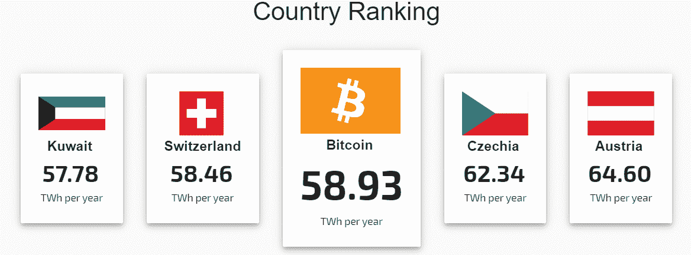
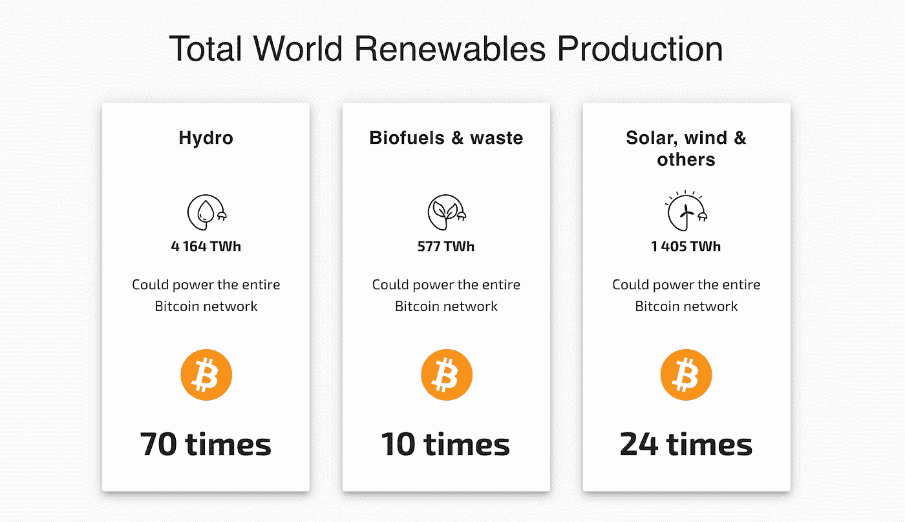
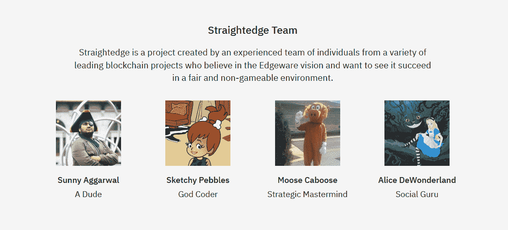
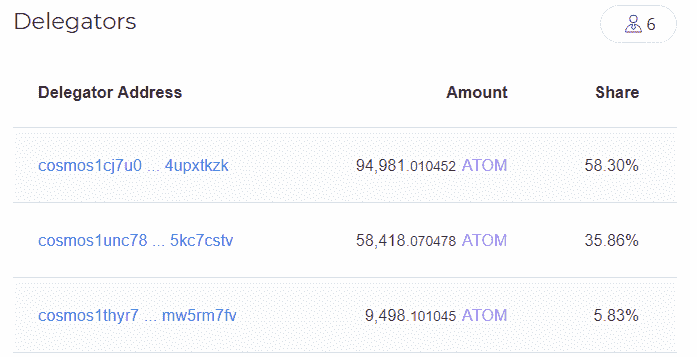

# Token 每日资本简讯#3

> 原文：<https://medium.com/hackernoon/token-daily-capital-newsletter-3-b090fe9407e4>

2019 年 7 月 4 日

## **今日推文**

“专业提示:不要学习任何核心互联网协议。连基本概念都没有。互联网很可怕&完全不安全！”

[Leigh](https://twitter.com/La__Cuen/status/1145805885622673408) 完美地总结了每个人在得知 BGP 后的反应。

## **比特币**

⚡️ **剑桥比特币用电指数**

围绕比特币有很多争论，这些争论可能或可能不总是与比特币直接相关:块大小、肉类的单一营养饮食以及人群的最爱——能量消耗。

为了提供更多关于电力使用的透明度，剑桥替代金融中心推出了[剑桥比特币电力消耗](https://www.cbeci.org/)指数，以提供对比特币网络能源消耗的估计。该方法使用比特币网络散列率和商业挖掘硬件效率(焦耳/生长激素)等参数来获得整个比特币网络的自下而上的估计。在撰写本文时，该指数显示比特币消费占全球能源消费的 0.27%。

指数比较部分提供了与其他国家的有趣比较。该指数显示比特币比瑞士消耗更多的能源，但也显示它仍然占美国所有家庭设备能耗的 25%左右(如果这些设备处于打开状态但不活动的话)。

此外，该指数为我们提供了比特币网络可以由可再生能源供电多少次的角度。

## **在以太坊**

🔹**冻结以太坊 2.0 阶段 0 规格**

信标链规格冻结是本周最有新闻价值的事件。为了充分理解它需要什么，解释以太坊 2.0 阶段 0 开发过程过去是如何工作的是很重要的。为了使开发过程更加高效，以太坊基金会研究团队(负责构思和制定以太坊 2.0 如何工作的团队)和实现团队(将规范转换为工作代码的团队)，例如 Prysmatic Labs 和 Lighthouse，一直在并行工作。

虽然并行工作通常有助于提高速度，但它也造成了一些困难的情况，实现团队完成了特定功能的实现和测试，却惊讶于研究团队在更新的规范中对该功能进行了重大更改。

随着规范的冻结，这种情况将不复存在。开发团队现在可以专注于使不同的以太坊 2.0 客户端兼容，启动多客户端测试网，并让不同的客户端实现得到审计，为 2020 年 1 月 3 日的阶段 0 mainnet 启动做准备。

🔹**直尺(Edgeware lockdrop 的 0 日叉)**

在对 Edgeware lockdrop 规则的喜剧性反弹中，Cosmos 开发商 [Sunny Aggarwal](https://twitter.com/sunnya97) 决定推出 Edgeware 协议的零日分支，称为 [Straightedge](https://straighted.ge/) 。为了说明奇偶校验从 Edgeware 获得的特殊待遇，Straightedge token drop 将删除智能合同部署者可以代表合同发出信号的规则(这是最后一分钟添加的规则，用于奖励 Polkadot 冻结 ETH 的奇偶校验)。

值得称赞的是，Straightedge 团队(如下图)看起来比我们在这个领域看到的许多项目更合法。

更严重的是，Sunny 的友好零日分叉实际上导致一名研究人员在 Edgeware lockdrop 智能合同代码上发现了一个[死锁错误](/@nmcl/gridlock-a-smart-contract-bug-73b8310608a9)(现已修补)，该错误可能会阻塞主 lockdrop 智能合同(即使在对合同代码执行审计之后)。

🔹**以太坊上的隐私**

以太坊开发者 [Kendrick Tan](https://twitter.com/kendricktrh/status/1146386323449606144) 刚刚推出了一款以太坊混合器，为以太坊带来一些隐私。他的[混合器智能合同](https://kndrck.co/posts/introducing_heiswap/)，叫做 [Heiswap](https://heiswap.exchange/) ，使用可链接环签名和伪隐形地址，现在在 Ropsten 测试网上直播。为了在以太坊主网上发布，mixer 的[开源代码](https://github.com/kendricktan/heiswap-dapp)需要由志愿者或筹集资金进行审计(这通常成本很高)。

## 每日阅读

📚**证书权威的衰落和握手的兴起**

Cloudflare 本周遭遇了两次宕机，导致相当大一部分互联网瘫痪。这场崩溃重新点燃了围绕互联网基础设施集中化的主流辩论。因此，我们认为这是一个很好的时机，可以利用[一份关于互联网对认证机构的依赖、域验证的缺点、这如何引入攻击媒介以及握手案例的新报告](https://www.tokendaily.co/blog/the-fall-of-certificate-authorities-and-the-rise-of-handshake)来深入研究握手案例。

## **想到了那天**

**PoS 削减条件:它能强制验证器集中化吗？**

2019 年对于 PoS 网络来说是巨大的一年。沿着 PoS 路线的多个高调项目已经在 mainnet 上启动(Tezos、Cosmos、Algorand、Thundercore)，更多项目预计将在年底或 2020 年初之前启动(以太坊 2.0、Dfinity、Polkadot、Avalanche)。这种趋势导致了多个跟踪即服务(STaaS)提供商的激增，用户可以将验证过程委托给专业级验证者，并向这些验证者支付一部分验证奖励。

STaaS 提供商之间的竞争已经非常激烈。验证者在正常运行时间、安全性、用户友好性以及他们在 PoS 网络中的参与度等指标上展开竞争。然而，由于 PoS 削减条件，这场竞争似乎比预期的更加激烈。

有什么比验证器因为技术问题而被砍并损失客户的钱更糟糕的呢？

直到本周，这还不是什么大问题。用户总是假设验证者已经准备好了系统来避免主要的技术问题，比如长时间的停机，或者更糟糕的是，对提议的块进行双重签名。这些都是严重的问题，大多数新的 PoS 共识机制通过削减验证者安全保证金来惩罚这些问题。

上周末，著名的 Cosmos 验证者之一([Cosmospool.org](http://cosmospool.org/doku.php?id=delegating))由于[双重签署了一项提议的区块](https://twitter.com/zmanian/status/1145072296723275776)而遭到抨击，这一假设受到了压力测试。根据 Tendermint 共识，5%的验证者原子被削减，该验证者被永久监禁(不能参与共识)。而这些损失是由委托给验证者的用户实现的。

斜线前的 Cosmospool 代理人的赌注

上面和下面的图片比较了 3 个主要委托人在砍杀事件之前和之后的赌注，清楚地反映了 5%的砍杀处罚。

划开后的 Cosmospool 代表的股份

***这是如何鼓励验证器集中化的？***

PoS 一直被视为用户参与共识并从网络膨胀中受益的一种更简单的方式。与 PoW 采矿相比，用户不需要特殊的采矿设备，无论是 GPU 还是 ASIC 采矿机，来参与共识。持有一些硬币并将这些代币委托给验证者以获得一份验证奖励就足够了。乍一看，PoS 似乎更分散(更多的人可以为网络共识做出贡献)。然而，由于当前的复杂性和对网络正常运行时间的严格要求(特别是在基于授权的网络中)，该系统可能演变成少数几个受信任的验证器品牌，它们控制着大部分网络股份，这导致在网络上创建集中点。

虽然可以认为 PoW 挖掘池形成了类似的集中点，但是对于用户来说，遭受技术问题的挖掘池所导致的损失不如遭受技术问题的 PoS 验证机严重。在 PoW 中，损失限于“机会成本”,换句话说，就是在矿池关闭时错过开采若干区块所造成的损失。在 PoS 中，损失可能会更大，因为削减罚款通常是下注代币的百分比。在 Cosmos 中，双签名的削减百分比是 5%。在以太坊 2.0 中，双符号斜线惩罚是验证器余额的 100%。

考虑到委托给非顶级验证者的风险较高，委托者可能只专注于委托给几个受信任的品牌，这可能会显著影响网络去中心化。

意识到这样的风险，以太坊 2.0 的研究人员选择不将委托逻辑加入以太坊 2.0 协议。在 Ethereum 2.0 上，每个验证器实例应该拥有至少 32 个 ETH，并且没有一个内置的机制来汇集来自不同“委托者”的 ETH 来代表它们。然而，这并没有阻止像[火箭池](https://www.rocketpool.net/)这样的以太坊验证池的形成。这种设置可能需要信任验证器实体，这可能会鼓励个人拥有自己的验证节点。如果发生这种情况，这将是 PoS 去中心化的一个重要胜利。