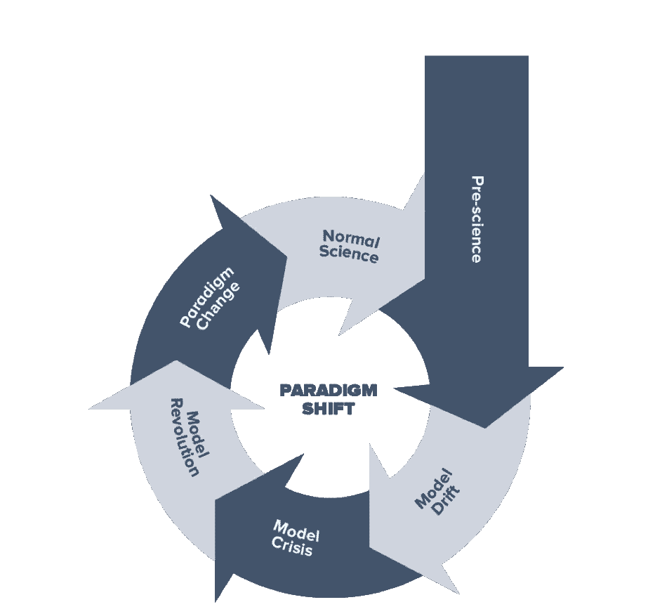
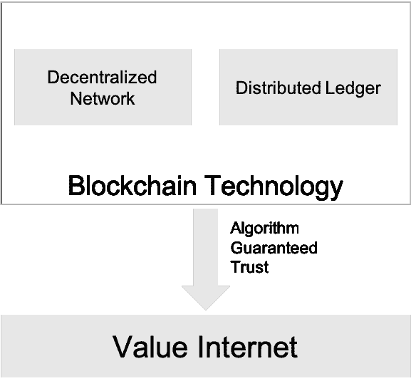
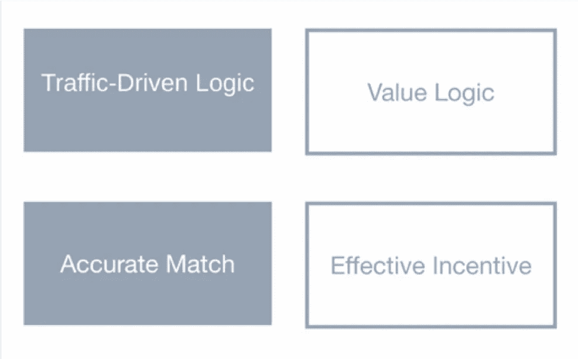
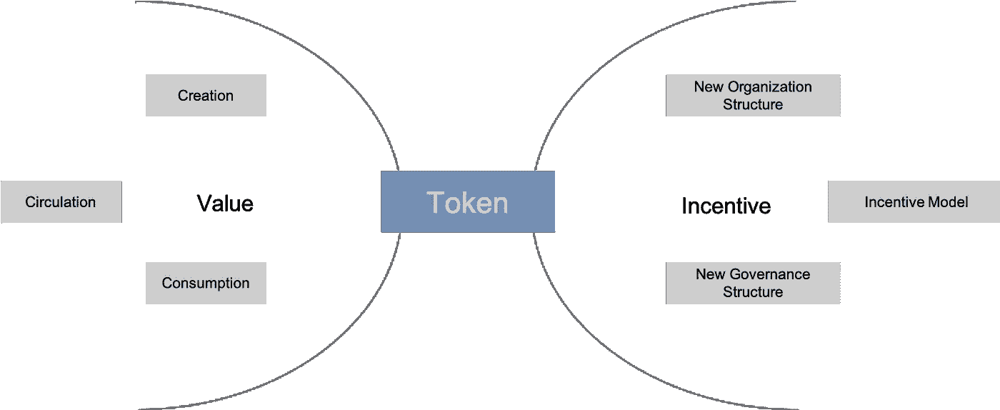
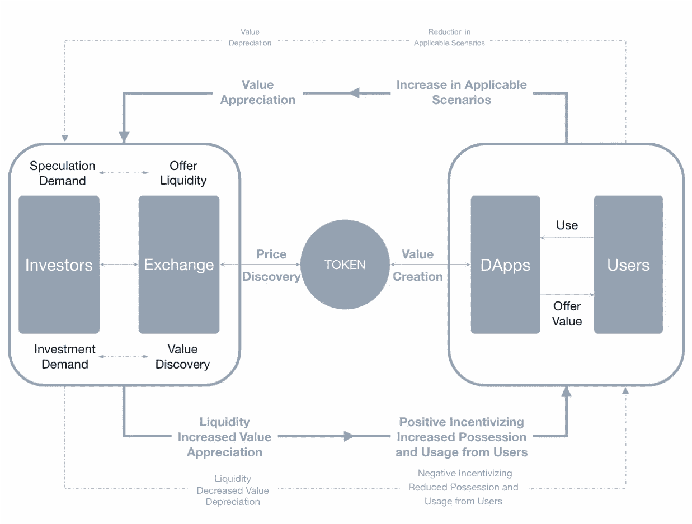

# 代币经济学#1:为什么我们仍然需要代币经济学？

> 原文：<https://medium.com/hackernoon/token-economics-1-why-do-we-need-token-economics-2c0006098aea>

## 供稿:[凯文·刘](https://www.linkedin.com/in/kevin-liu-bumo)

这是专注于**令牌经济学**研究、机制设计、用例研究等系列文章的第一篇，由一群来自金融、咨询、风险投资、基金、区块链项目和公共区块链等不同背景的专业人士撰写。

秉承上世纪 80 年代末成立的 ***圣达菲研究所*** 的精神，并利用多学科背景的人，通过结合各种角度的观点来解释非均衡情况下的经济，发展出一门新学科**复杂性经济学**，我们希望系统地定义什么是令牌经济学，它来自哪里，为什么它如此重要，如何设计一个令人信服的令牌经济学模型，有哪些好的和坏的例子，等等。

代币经济学不仅仅是为了 ICO 的衰落趋势，它也深深嵌入到你的项目的 DNA 中。开始前想清楚，因为这是决定一个项目能走多远的真正价值。尤其是在这个寒冷的冬天，你比以往任何时候都更需要它。

它来了#1。

混乱和噪音，不管你喜不喜欢，从大爆炸开始就一直存在，也是技术采用和市场进化的几个初级阶段之一。在这个严寒的冬天，尤其是对区块链来说，人们似乎已经习惯了目前的状况，并声称他们喜欢熊市，因为它将挤出泡沫。嗯，这种自我安慰的说法实际上无助于让市场再次飙升。真正有帮助的是重新思考、学习、研究和实践，在所有这些噪音中找到正确的信号，然后付诸行动。

那么，真正的信号是什么？

1.解决当前吞吐量、可伸缩性、安全性、隐私、开发人员易用性等问题的技术进步？是的，绝对的！然而，这还远远不够。

2.区块链不仅仅是一个技术工具，当你将区块链技术应用到你的业务中或开始一个新的区块链企业时，我相信，很快你就会发现，由于区块链和 token 的参与，业务运营的逻辑完全不同，你将需要一套规则来解释和指导如何释放区块链的力量。

这就是代币经济学发挥作用的地方。

# 代币经济学的起源

## 一个经济体不仅仅是从零开始，它从其底层技术中涌现出来，并且是技术的表现。经济学是一套指导技术开发和经济运行的原则、规则和方法。

Paradigm Shift

1962 年出版了一本名为*的书，作者是**托马斯·塞缪尔·库恩**。书中介绍了一个基本概念——**范式转变**，其主要思想是，当一种新的或颠覆性的技术出现时，无论是来自创新还是先前技术的组合，它最终都会遵循转变周期，并导致旧范式转变为新范式，或新的业务运营方式，以解释和支持新技术的发展。*

**

*Value Internet*

*对于区块链科技来说，它有两个关键要素，分散的网络和分布式账本，这些已经引起了一个非常根本的变化，即信任可以由机器通过算法来保证，所以你不必依赖第三方，如转让代理、托管人或托管银行来充当背书，区块链本身就是一个信任交付机器。这将打破公司、市场和治理结构的传统界限。以区块链为骨干，象征信任和价值的代币可以在没有中央机构参与的情况下从 A 地转移到 B 地，现在我们已经进入了一个名为**价值互联网的新时代。***

**

*Internet Economy vs. Token Economy*

*对于互联网经济来说，其核心运营逻辑是由用户流量驱动的。像谷歌、脸书、亚马逊或网飞这样的公司，他们都创造不同类型的内容来吸引用户，然后他们在寻找将这些流量货币化的方法，最理想的情况是向每个人提供他们想要的东西(精确匹配)，以最大限度地利用用户流量。*

*而对于代币经济，逻辑将完全不同，因为价值可以在区块链网络中流通，商业逻辑将改变为如何创造价值，如何做更大的馅饼，为了创造更大的馅饼，你需要更多地考虑如何创建一个令人信服的经济模型，以拥抱你的合作伙伴，供应商，客户，甚至你的竞争对手，为整个生态系统做出贡献。*

# *为什么我们需要代币经济学？*

**

*Token Economics*

*代币作为价值符号，是整个经济学模型的核心。如图表左侧所示，代币经济学关心的是如何创造价值，如何在社区成员中分配和流通价值，消费代币的机制是什么，实际上，你需要建立一个微妙的财务模型来使其工作。此外，代币被视为权利的确认，当你为社区做出贡献时，可以获得奖励和权利，所以这是正确的部分，激励模式。在这一部分，token economics 将研究什么样的组织是合适的，激励模式是什么，以及治理模式有哪些变化。*

*让我们举个例子，当纺织机器在 17 世纪被引进英国时，它极大地改变了人们的工作和生活方式。过去，他们在一个家庭小作坊里手工生产纺织品，而随着机器的引进，一种新的组织形式——***工厂*** 出现了，因此人们开始在工厂里工作，有固定的工作时间，根据他们的工作量获得报酬，并且相应地创造了各种不同的管理方法来促进整个过程。*

*区块链是新的纺织机器，我们需要新的组织结构、新的激励模式和治理模式来适应它。*

# *DAC——新的组织形式*

*那么新的组织是什么样子的呢？我们称之为分散自治公司(DAC)，Vitalik 有一篇关于定义的专门论文，你可以在这里查看。[https://blog . ether eum . org/2014/05/06/daos-DACs-das-and-more-an-complete-terminals-guide/](https://blog.ethereum.org/2014/05/06/daos-dacs-das-and-more-an-incomplete-terminology-guide/)*

*简而言之，DAC 是一个生活在互联网上并自主存在的实体，它由一群拥有相同共识并愿意贡献和分享 DAC 成功利益的人组成。它带来了一种新的协作和激励方式。*

**

*Traditional Industry Chain vs. DAC*

*在传统的产业链方法论中，公司是一个独立的实体，其主要目的是建立竞争优势并为自己创造利润，但你获得的利润越多，产业链中的其他成员获得的利润就越少，因此这是一个零和游戏。*

*而对于 DAC，人们考虑的是如何使整个生态系统的价值最大化，社区成员将通过贡献或交换资源来获得令牌，因此所有成员都成为利益相关者。令牌持有者可以参与社区的治理、运营和数据使用，区块链技术以公开、公平的方式实现了这一机制的自动化运行。所以是双赢，完全不一样。*

# *什么是理想的令牌经济学模型？*

*嗯，视情况而定，不同的业务可能有不同的模式，它也服务于不同的运营目的或战略，但设计它要遵循的一个总原则是 ***大生态系统。****

**

*The Grand Ecosystem*

*目前，大多数项目都集中在左边的部分，那里充满了投机者和投资者。有些项目只是发了一个代币，进行营销活动操纵价格，所以代币是飘在那边的，没有真正的商业联系和价值。当一些坏消息到来时，这些投机者只会出售令牌并逃跑，这就是加密货币市场波动如此剧烈的原因。*

*交易所是进行价格发现和提供流动性的好地方，这对业务运营非常重要，但你不能错过图表的正确部分，这些令牌应该在业务运营中具有实际意义，应该有助于为 Dapp 用户提供价值。当 token 创造了真正的价值，就会在交换中支撑价格，从而带动正价值流通。*

*在接下来的文章中，我们将讨论更多关于如何设计令牌经济学的实际用例。敬请期待！*

## *参考:*

**科学革命的结构，托马斯·塞缪尔·库恩，1962 年**

**复杂性与经济，W. Brian Arthur，2014 年**

**代币经济的模式与实践，代币经济实践联盟，2018**