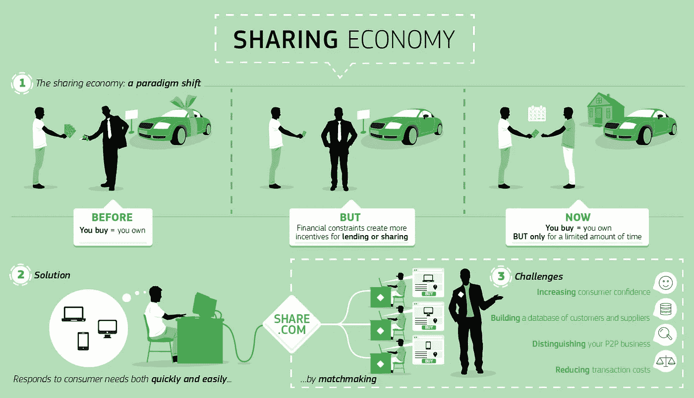
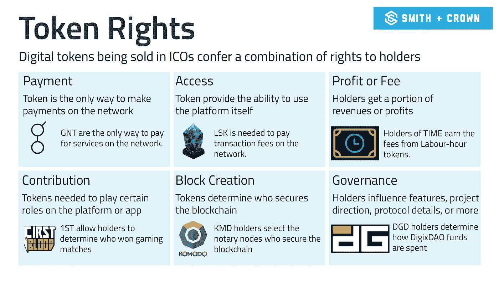
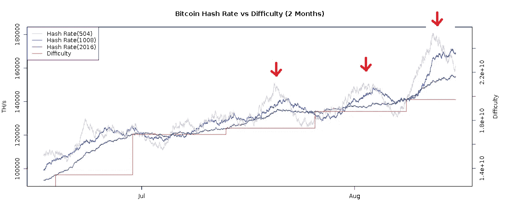
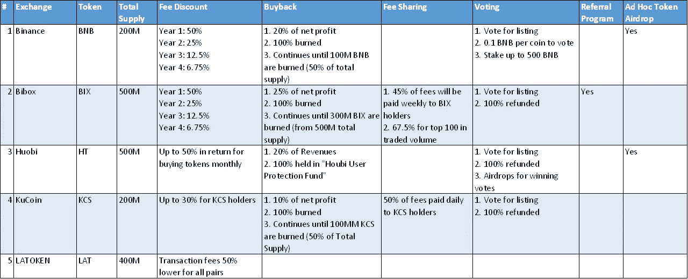
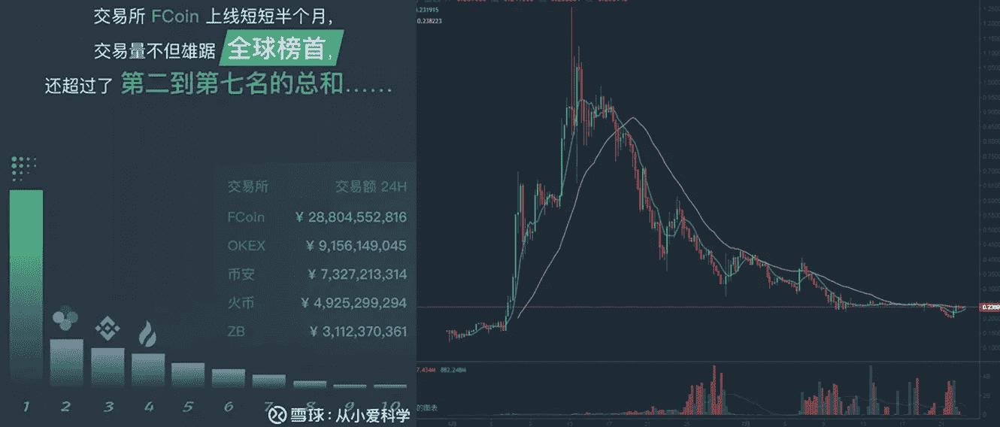

# 代币经济学#2:代币经济的比较评论

> 原文：<https://medium.com/hackernoon/token-economics-2-comparison-review-of-token-economy-8759dd70783>

## 互联网经济 vs 共享经济 vs 代币经济

供稿: [Dennis_Z](https://medium.com/u/a25c87f4ace2?source=post_page-----8759dd70783--------------------------------)

## 1.对比:互联网经济 vs 共享经济 vs 代币经济

**互联网经济**(又名数字经济)指的是基于数字计算技术的经济，通过基于互联网的市场开展业务，如亚马逊。

***主要特点:***

*   ***【数字化信息/工作流程】*** :交易相关信息已经数字化，包括产品/服务信息和支付方式等，交易可以完全由在线流程管理。
*   ***物流*** :互联网经济依靠精简的物流流程来交付产品/服务以完成交易。
*   ***基于轻资产:*** 由于互联网经济确实需要一个线下的场所来与客户互动，因此互联网经济是基于轻资产的，在定价上更具成本效益，有利于竞争。

**共享经济**(又名协作消费)是指基于互联网的点对点(P2P)交易。这种交易通常通过基于社区的在线服务来实现。它与互联网经济的不同之处在于，该平台仅促进产品/服务提供商和消费者的在线联系。平台不销售产品，也不直接提供服务。

***主要特点:***

*   ***点对点交易*** :共享经济中的交易是点对点的，可以是 B2C、C2C、B2B。
*   ***信任机构*** :平台作为信任机构为消费者和产品/服务提供者背书。
*   ***未使用的价值分享*** :分享经济很大程度上取决于分享未使用价值的意愿，未使用的价值可以回收或再利用。例如，汽车在 92%的时间里都不会被使用，未使用的价值对于共享经济型汽车解决方案(如优步和 Lyft)来说可能是一个重要的资源/机会。

**代币经济**指的是基于加密货币的激励系统，该系统在区块链生态系统中强化并建立了令人满意的行为。为了在区块链形成共识，它要求矿商为交易提供验证服务。代币经济学是一种激励矿工在网络上提供更好服务的机制。

例如:

*   区块链机制，在没有集中授权的情况下，使用加密算法创建和验证交易；
*   令牌经济学，激励在区块链网络上提供的服务(例如，挖掘和验证)。

打个比方，区块链机制是骨架，而象征经济学是为区块链技术注入活力的神经、肌肉和血管。 ***总之，代币经济学是保持系统长期可持续的核心。***

***主要特点:***

*   ***基于区块链的*** : Token 作为价值衡量和交换的中介，与区块链技术天然合作。它不需要信任机构来验证网络上的 P2P 交易。
*   *:令牌分为实用令牌和安全令牌。对于公用令牌，它可用于交易、投票和下注。*
*   **:根据应用场景的不同，可以定制令牌经济学机制，以解决应用场景的独特特征。**

****

**下面的比较总结了互联网经济、共享经济和代币经济的共同和不同特征。**

****

## **2.代币经济学示例**

**由于代币经济学主要基于机制设计，如果代币经济中存在可感知的价值损失，不适当的代币经济学可能导致死亡螺旋。**

**适当的令牌经济学不仅应该激励期望的行为，还应该能够稳定网络操作。因此，代币经济学应该在绝对水平(激励)和相对水平(稳定)上设计。下面的例子展示了一些好的和失败的代币经济学的例子**

## **令牌函数:**

*   **用于加密货币投资的安全令牌**
*   ***效用令牌* : 1)支付；2)投票；3)交易费用；4)单位度量；5)打桩治理**

****

## **好例子**

*   ****比特币**:比特币代币经济学决定了比特币和区块之间的奖励机制。奖励从每块 50 个比特币开始，每四年减半。目前每块奖励 12.5 比特币。比特币还被设计成大约每 10 分钟创建一个新的区块。随着区块挖掘者数量的增加，创建一个新区块的平均时间将会减少。在其他因素保持不变的情况下，计算能力的提高也会使生成新块的速度更快。**
*   **为了保持区块生成时间的一致性，比特币使用一种“难度算法”来调整需要解决的难题的难度，以成功生成新的区块。这两个特征——代币奖励机制和难度算法——构成了比特币的代币经济学。**

****

*   ****兑换令牌**:多个兑换加密货币已经使用自己的令牌支付交易费用。持续回购计划有助于稳定代币价值。**

****

## **坏榜样**

*   ****FCoin** : FCoin 拿出 PoT(交易凭证)，激励交易如采矿。如图所示，当交易量急剧增加时，硬币价格就会爆炸。由于没有稳定机制，当硬币价格下跌时，交易量也会减少。交易量的增强进一步压低了币价。**

****

**代币经济学是一个发展生态系统的机制设计系统，它对于发展区块链生态系统和应用，同时满足各种监管要求至关重要。**

## **参考:**

*   **【https://en.wikipedia.org/wiki/Digital_economy **
*   **[https://maxkanaskar . WordPress . com/2018/08/05/token-economics-101/](https://maxkanaskar.wordpress.com/2018/08/05/token-economics-101/)**
*   **[https://www . iedcevents . org/Downloads/Conferences/annual _ 16/telles . pdf](https://www.iedcevents.org/Downloads/Conferences/annual_16/telles.pdf)**
*   **[https://www . digitalistmag . com/digital-economy/2016/06/07/5-数字经济的特征及其对石油天然气的意义-04247790](https://www.digitalistmag.com/digital-economy/2016/06/07/5-characteristics-of-digital-economy-and-what-they-mean-for-oil-gas-04247790)**