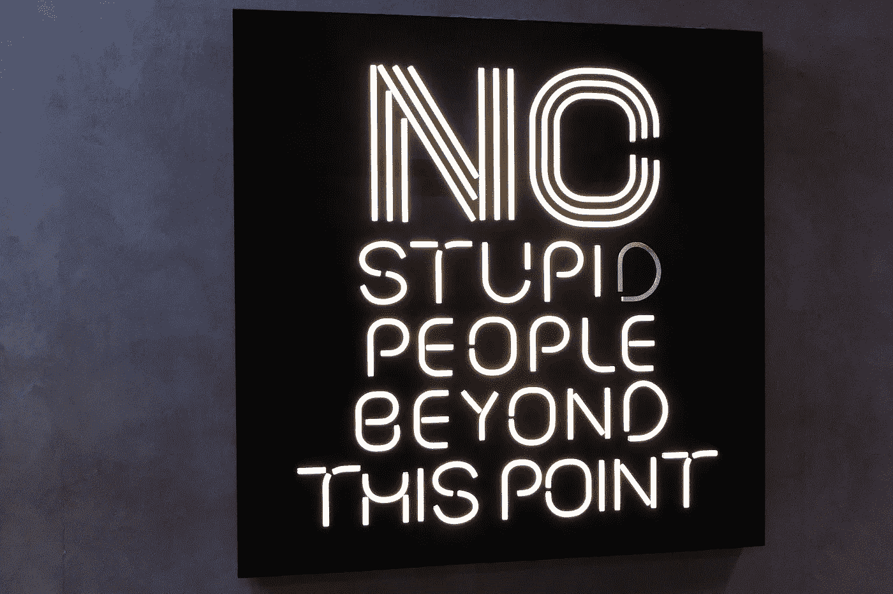
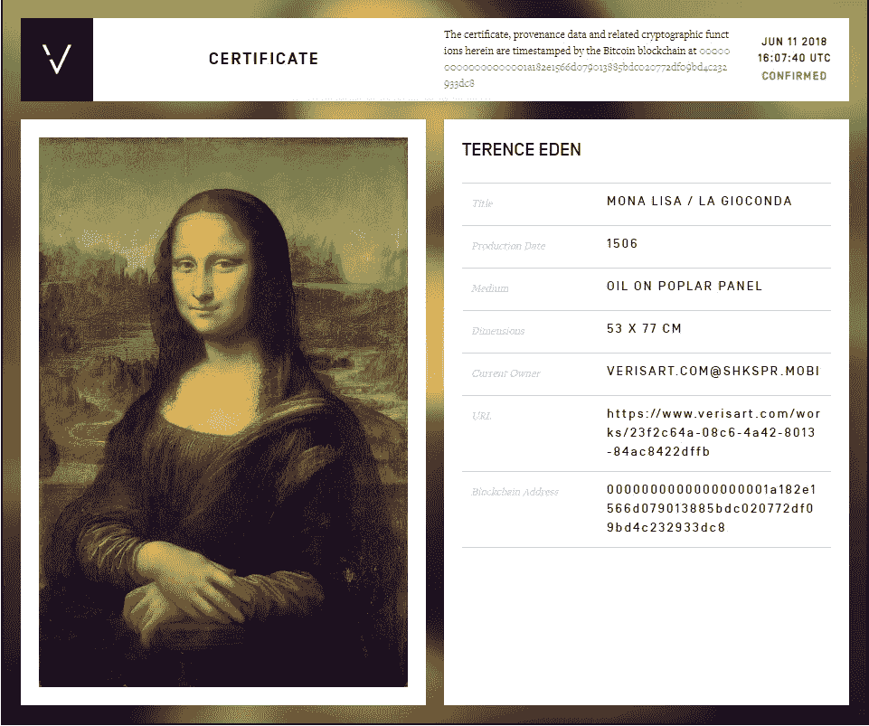
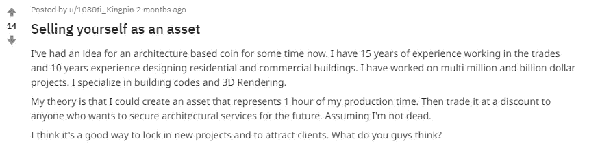
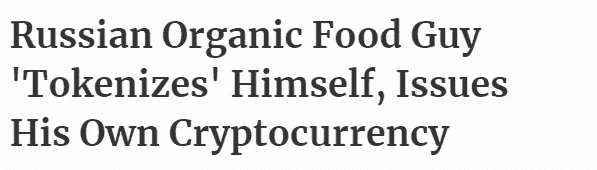
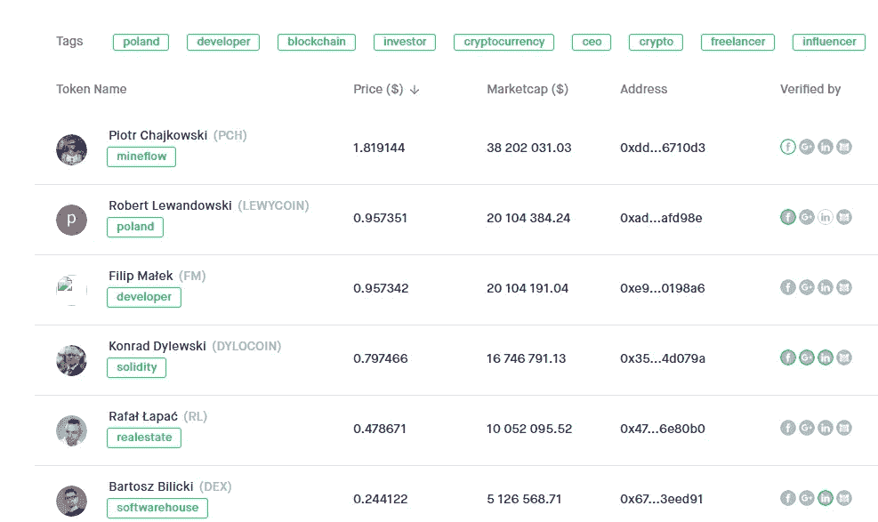

# 把自己符号化是愚蠢的最后边界。

> 原文：<https://medium.com/hackernoon/tokenising-yourself-is-the-final-frontier-of-stupidity-27ad059343be>

Photo by [Nick Fewings](https://unsplash.com/photos/1iesvNXsuZs?utm_source=unsplash&utm_medium=referral&utm_content=creditCopyText) on [Unsplash](https://unsplash.com/search/photos/stupid?utm_source=unsplash&utm_medium=referral&utm_content=creditCopyText)

在 [crypto](https://hackernoon.com/tagged/crypto) 中有一个声音运动来“标记一切”。支持者认为，通过一个更公平、更容易进入的市场，将房地产和艺术品等资产令牌化的行为将增加流动性。对越来越频繁出现的事物进行符号化的逻辑结论是什么？好吧，这是自我标记。

这也是极其愚蠢的。

让我们看看为什么我们有“代币”(我讨厌这个词，但它必须足够了)。BTC 作为一种货币存在，因为它作为一种支付机制来保护比特币网络。没有它，矿工就没有动力，最终导致网络不安全。

DApps 随后出现，建立在以太坊这样的协议之上。这些 DApps 开始使用自己的令牌来提供服务访问或充当支付机制。很少人需要，但很多人希望引入一个令牌，而不是简单地使用 ETH 或 BTC。例如，browser Brave 创造了自己的代币(BAT)，而不是使用 BTC 作为支付形式。

随着 ICO 市场达到饱和并遇到法律问题，注意力随后转向了安全令牌产品(sto)。这些产品提供了更大的监管确定性，因为它们的结构类似于证券，并将资产证券化，随后可以在分散的交易所进行交易。

France will be disappointed to hear they no longer own the Mona Lisa

虽然在初期，s to 引入了一个与之前的代币示例不同的新问题，因为固有的问题是，仅仅因为代币声称代表真实资产，并不意味着它[实际上代表](https://twitter.com/edent/status/1006248586395508737)。代币能消除一些市场低效吗？是的。他们能让一些资产的交易变得更容易吗？是的。他们能解决所有问题吗？号码

正如大多数 ico 通过需要代币引入了额外的摩擦层一样，sto 使用代币也忽略了比特币原本带来的好处。BTC 受到比特币网络的保护(例如矿工和节点)；它不依赖任何中央权威来赋予它价值，因为它的价值是由市场决定的。

然而，资产支持的令牌是不同的。虽然市场仍然可以用来确定支撑代币的资产的价值，但是如果没有中央权威机构来证明和执行资产的所有权，代币本身就毫无价值。

例如，如果我购买一所房子的象征性股份，我必须依靠土地注册处证明该房产尚未出售给其他人。如果没有更广泛的社会和法律体系的支持，声称持有某项资产份额的代币和确实持有某项资产份额的代币之间没有区别。不得不依赖这样的结构不可避免地降低了去中心化的区块链的吸引力。然而，如果你信任中央集权，他们确实使系统可行。

# **PCO**

个人硬币产品(我不知道是否有另一个术语，所以让我们用缺乏想象力的 PCO)解决了这些问题，并放大了它们，同时提供了比 sto 更少的好处。

让我们看几个 PCO 如何工作的例子。

**a)工人**

一个自由工作者出售代币，每个代币可以兑换一项服务(比如一小时的设计或写作工作)。

**b)企业家**

一个企业家出售自己的股份作为他们想法的资金。投资者有权从这些努力中获得 10%的利润.

**c)天赋**

体育明星出售未来收入的股份，以换取前期投资，为他们提供一个安全网，以防受伤或运动能力下降。

就其本身而言，这些都不是激进的想法；工人们出售他们的时间，无论是在正规的就业市场还是在 Fiverr 这样的平台上。企业家一直在向家人、朋友和风险资本出售他们未来企业的股份。虽然不太常见，但足球运动员已经提前出售了他们未来收入的权利，赛马通常由辛迪加和合伙企业所有。

但是令牌添加了什么呢？没什么。

更糟糕的是，它引入了额外的复杂性，极大地增加了投资者和个人的风险。

首先，让我们看看对工人的潜在好处，因为这是大多数人都会落入的类别。

1.  他们可以直接出售代币，并通过 Fiverr 之类的方式避免第三方费用
2.  营销曝光，至少在最初它仍然是一个非常小众的命题。这可以争取到一两个客户
3.  如果代币可以在 dex 上自由交易，他们可能会意识到市场对代币的估价高于他们对自己的估价

我在这里努力做到公平，但我真的想不出对工人有任何其他好处(而且这些好处微不足道)。将作为好处提出但未能通过审查的其他概念:

1.  自由市场意味着任何人都可以购买或出售他们的时间，从而降低做生意的成本。虽然集中式平台确实会收取一部分费用，但目前在 crypto 中还需要考虑上/下斜坡费用以及交易费用(尽管现在这些费用可以忽略不计)。它们还提供了访问权限，将买方/卖方聚集在一起，因此使用它们对双方都有好处。
2.  它提供了进入全球市场的途径——没错，但 gig 平台也是如此(而且它们有更多的用户)
3.  提供了一个更加透明的定价机制——这可能有些道理，但是 gig 平台有效地作为一个市场运作，因为它们显示了所有竞争的定价
4.  它在工作完成之前锁定费用——但这也有相应的负面影响，我们很快就会看到这一点

无可否认，可能会出现一些潜在的有趣动态。一是个人代币的自由市场可以提供一种在社交媒体上评估个人“品牌”的方式。它还可能为某种“劳动力期货”市场铺平道路，尽管很难想象这将采取何种形式。

虽然有一些潜在的优势，但它们(远远)被劣势所压倒。

# **为什么把自己符号化是愚蠢的**

多囊卵巢综合征的根本问题是困扰 sto 的问题的一个更明显的版本。除非我们能保证代币代表他们声称的东西，否则代币是没有用的。PCO 怎么能提供这种保证呢？在自由社会中，没有人能强迫一个人做某事。如果我在一个小时的时间内出售了一个令牌，但随后未能履行该义务，所有者可以做什么？如果有人购买了我的代币，并要求我为他们做一些我在意识形态上反对并拒绝做的工作，他们有什么追索权？如果我死了，然后呢？没什么。这个令牌 100%依赖于我实现它的持续能力或愿望。

更糟糕的是，那些在交易所购买他人时间的人将没有通常的能力试图通过争论合同纠纷来挽回损失。他们买了一个代币；他们没有与支持这些代币的人签订合同。任何以这种方式购买他人时间权利的人都将很难在法庭上获得支持。不像 sto 的例子，房地产可以由土地注册局支持，PCOs 不提供这样的保证。

当与自由市场机制相结合时，这就成了一个更大的问题。如果我把我的时间价值定为每小时 100 英镑，但是市场告诉我它只值每小时 10 英镑，我可能想要完成这项工作吗？我应该回购代币吗？因为我非常珍惜我的时间。在熊市或更大范围的衰退中呢？市场机制可以迅速将激励转化为抑制。

还有一大堆其他问题。大多数代用币的流动性很小，所以我们可以排除多年来拥有大量代币的可能性。但最紧迫的是，你如何为一个人可能要持续几十年的劳动创造供给？

这个供应问题很难解决。假设我 25 岁。我是一名平面设计师，我认为我的时间每小时 50 英镑。我一年的典型工作时间约为 2000 小时。我可能要工作到 75 岁。我现在要打印全部供货吗？如果我这样做了，我是自己持有这 100，000 个代币，然后逐渐卖掉，还是一开始就全部卖掉，承担一生的时间债务？

即使所有 100，000 个代币都能找到买家(这显然不会发生)，鉴于我无法同时履行所有义务，我如何限制兑换过程？更糟糕的是，即使几个买家同时出现，我也无法满足代币应该提供给买家的东西。这不同于某人由于先前的承诺而拒绝业务，因为业务已经被支付(当代币被购买时)。

显然，我将不得不抑制大部分供应。但这意味着我是做市商，假设我出售一年的供应量，我将持有 98%的供应量。当然，我可以把它锁定，在几年内进行分配，但当其他人知道我的最低售价(我的原价)时，它仍然限制了升值的潜力。为什么不直接来找我，而是在公开市场上支付更多？

显而易见的解决办法是创造少量供应，或者在我有客户排队等候工作时发放。例如，我提供 100 个小时的时间，每小时 1 个代币。你为什么要这么做？那没什么，那只是毫无意义。当人们把 crypto 说成是 Chuck E. Cheese 的凭证时，这正是他们所谈论的。没有理由拥有个人标志——接受菲亚特或 BTC 就行了。

不，PCO 只有在创造了大量供应，然后可以在没有挂钩的市场上浮动，赎回的代币被烧掉的情况下才有意义——但这也是不可救药的。

Good to see Robert Lewandowski, the Polish footballer, has had his Facebook verified on personaltokens.io

# **高位下行，低位上行**

有许多潜在的问题需要考虑，但如果有一件事是肯定的，那就是人们将不会考虑它们，直到它们总是出现。

如果你在智能合同中出错了怎么办？还是丢了钥匙？还是不能分发代币？如果你遭遇盗窃怎么办？或者是否有显著的事务延迟？或者你经营的连锁店遭受了 51%的攻击？如果你的代币被人偷了怎么办？这和失去 BTC 不一样。这些都是你可能已经建立了关系的客户。

还有其他问题，比如代币带来的摩擦和代币销售导致契约奴役的可能性(如果你提前出售大量供应，那么祝你好运，考虑到通货膨胀、其他经济变化和你自己工资潜在增长的可能性)，但当面临最大的问题时，这些问题都变得无足轻重；有什么意义？

最后，可能会有一些有意义的用例，可能更符合企业家出售未来投资的途径(但作为能够投资的权利或优先权，而不是所有投资的股权，可能会更好)。最直接的用途可能是社交媒体名人分发或出售代币，提供优质服务。但是，同样，如果没有基于区块链的令牌，这些都是可能的，而且目前我也想不出有什么令人信服的使用案例(尽管一如既往，我非常乐意被纠正)。

最糟糕的是，一个执行不力的 PCO 可能会导致一种契约奴役的形式，工人被锁定在长期低于市场水平的工资。然而，更有可能的结果是，PCO 复制了许多 ico，因为肆无忌惮的发行者意识到他们有能力筹集大量前期资金，然后背弃他们的义务，后果不堪设想。

更重要的是，这只是一个愚蠢的想法。

**全披露** [**此处**](https://flatoutcrypto.com/about/) **。可以关注我**[**@ flatoucrypto**](https://twitter.com/flatoutcrypto)