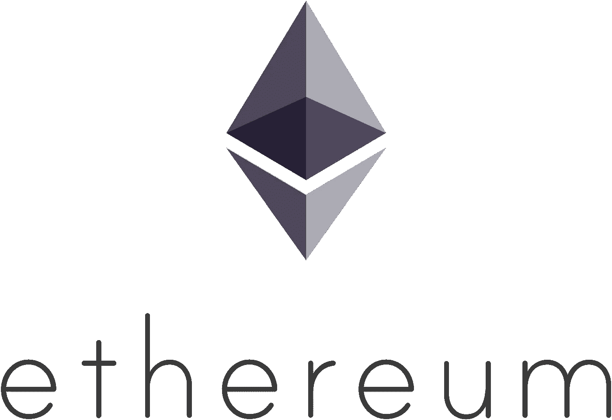
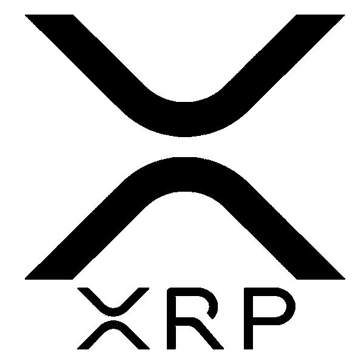
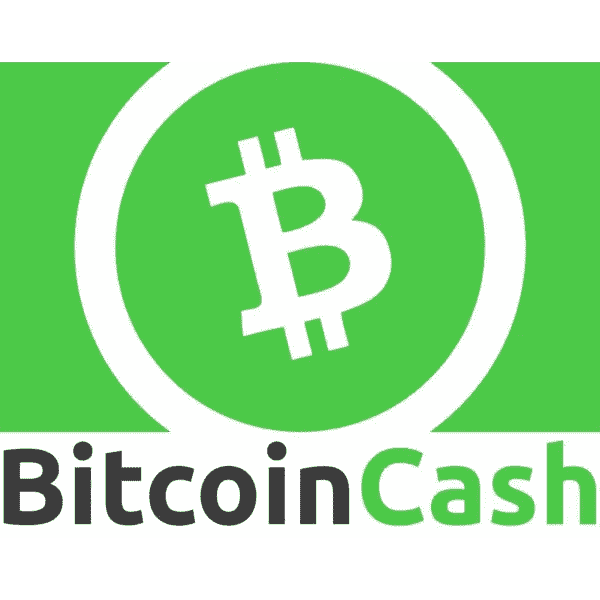
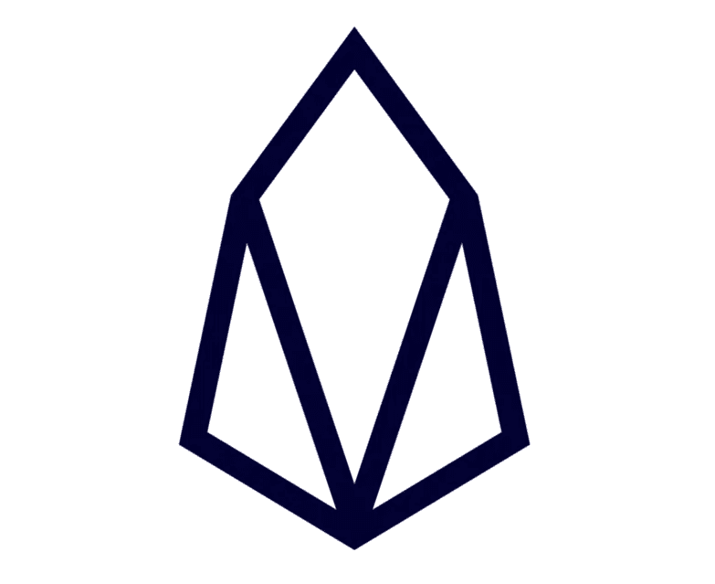
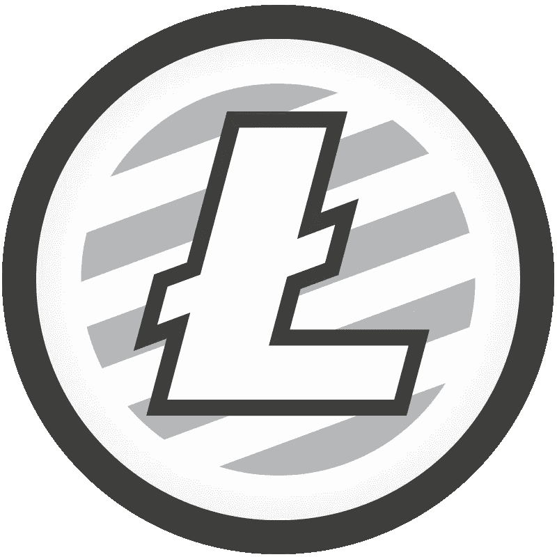
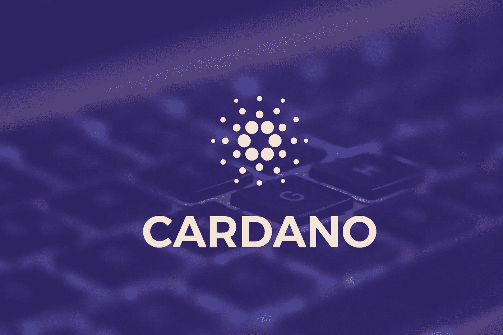
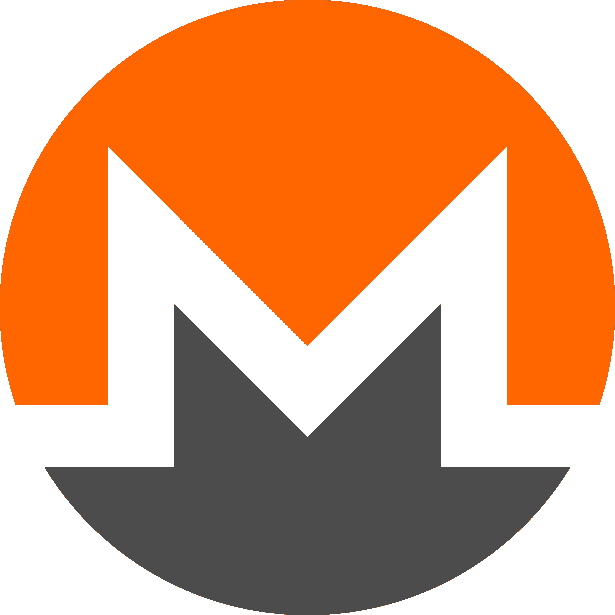
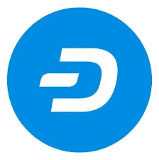
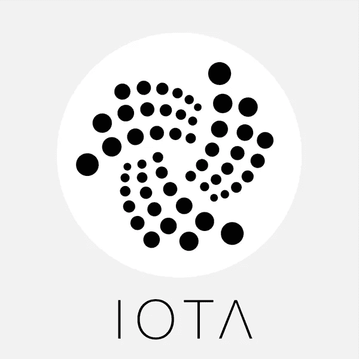

# 2019 年顶级替代硬币

> 原文：<https://medium.com/hackernoon/top-10-altcoins-for-2019-5debc64ebb37>

有超过 2000 种加密货币可供使用，很难知道哪些有前途，哪些注定要被扔进历史的垃圾堆。在这篇文章中，我试图找到一个平衡，并概述了 2019 年增长潜力最大、损失潜力最低的 10 个 altcoins。

## 以太坊

[以太坊](https://medium.com/u/d626b3859bc9?source=post_page-----5debc64ebb37--------------------------------)创建于 2015 年，并因两个原因而广受欢迎:1)智能合约技术；2)它提供的工具帮助开发者在它的网络上构建分散的应用程序。以太坊的[用例](https://coinsutra.com/ethereum-smart-contract-usecases/)也很重要(银行和金融服务合同、ico、预测市场、替代托管、身份管理)。与比特币相比，以太坊的交易时间很快(以太坊为 6 分钟，而比特币约为 78 分钟)，在过去的三年里，一些新的硬币试图“杀死”ETH，但失败了。

***注:****2017 年，以太坊炒作达到顶峰，人们开始怀疑它是否会超越比特币。这被称为“翻转”。然而，就目前而言，人们似乎已经放弃了翻转会发生的希望。*

*买 ETH 上* [*比特币基地*](https://bit.ly/2NN4c4H) *或* [*币安*](https://bit.ly/2EqGqdZ)

## [涟漪](https://medium.com/u/951c695df315?source=post_page-----5debc64ebb37--------------------------------) (XRP)

Ripple 拥有仅次于比特币和以太坊的第三大市值。许多人认为这是一项安全的投资，因为它从未持有过 ICO，因此不会被 SEC 宣布为证券。许多人也喜欢 Ripple 面向大型机构而不是个人用户的方式。Ripple 为银行提供金融结算服务，允许它们直接、即时地进行跨国交易。它已经与世界各地的大型金融机构建立了合作伙伴关系，更多的机构正在采用 Ripple 协议。然而，当谈到 Ripple 时，仍然存在争论，因为它的目标不是去中心化，而去中心化是许多区块链爱好者的核心价值观。

*买 XRP 上***或* [*【币安】*](https://bit.ly/2EqGqdZ)*

**

## *[恒星](https://medium.com/u/99518a49d085?source=post_page-----5debc64ebb37--------------------------------) (XLM)*

*Stellar 提供快速、廉价的跨境支付服务。然而，与 Ripple 不同，Stellar 面向个人用户。目前，大公司控制着在线支付领域，并收取高额费用(大约每笔交易 5%)。相比之下，Stellar 提供 5 秒的交易速度和象征性的费用(例如，在 Stellar 区块链上运行的 Tempo 汇款 dApp 可以以 0.01 美元的价格处理 [600，000 笔交易](https://www.chepicap.com/en/news/2185/stellar-on-the-rise-thanks-to-coinbase-listing-and-tempo-partnership-news.html))。Stellar 不使用工作证明验证，这意味着它不必处理困扰比特币的能耗问题。最后，Stellar 与包括 IBM 在内的一些大型科技公司建立了合作关系。这些都是为什么许多人认为恒星拥有光明未来的原因。*

**买 XLM 上* [*比特币基地*](https://bit.ly/2weUNLv) *或* [*币安*](https://bit.ly/2EqGqdZ)*

**

## *比特币现金(BCH)*

*比特币现金是 2017 年 8 月比特币分叉的结果。当时持有比特币的人以 1:1 的比例获得比特币现金。此后，比特币现金一直争议很大。值得注意的是，因为它的发起人之一(罗杰·弗)一直试图声称这种硬币是“真正的比特币”。比特币现金比比特币更快更便宜。BCH 交易的平均速度是 60 分钟。有趣的是，如果没有对 Ver 行为的负面反应，它是否会表现得更好。*

**买 BCH 上* [*比特币基地上*](https://bit.ly/2NN4c4H) *或者* [*币安上*](https://bit.ly/2EqGqdZ)*

**

## *黎明的女神*

*EOS ( [eosio](https://medium.com/u/628454c4bc31?source=post_page-----5debc64ebb37--------------------------------) )解决了以太坊网络的一些缺点。例如，要在以太坊上开发 dApp，你需要使用 Solidity，一种智能合约的编程语言。这对许多人来说是一个障碍。EOS 通过向开发者提供更多的服务克服了这一点，包括数据库和账户管理服务，这些服务不需要编程知识。*

*EOS 还有其他技术优势。例如，它比以太坊更快，更具 T2 扩展性。在以太坊网络要求用户支付燃气费的地方，EOS 区块链上的交易是免费的，平均耗时 1.5 秒。EOS 网络每秒还能处理高达 50，000 笔交易。EOS 也有大量热情的社区支持，这是有充分理由的。硬币没有被开采。相反，砌块生产商是由社区投票产生的。*

**购买 EOS 于* [*Kucoin*](https://bit.ly/2uhEX0V) *或* [*币安*](https://bit.ly/2EqGqdZ)*

**

## *莱特币([Litecoin.Com](https://medium.com/u/2f9638532d7d?source=post_page-----5debc64ebb37--------------------------------))*

*莱特币成立于 2011 年，已成为比特币的替代品，市值超过 30 亿美元。LTC 采用了比特币的重要特征，并对该技术进行了改进。两者之间的一些差异是总供应量，与比特币的 2100 万立特相比，总供应量为 8400 万立特。此外，LTC 区块链区块的平均开采时间为 2.5 分钟，而 BTC 为 10 分钟。LTC 也是比特币基地的四大银行之一。这也是它如此受欢迎的一个原因。这是比特币基地长期以来为数不多的硬币之一。它也很便宜，也许有些人认为它可以像比特币和以太坊一样牛市。*

**购买 LTC 于* [*比特币基地*](https://bit.ly/2NN4c4H) *或* [*币安*](https://bit.ly/2EqGqdZ)*

**

## *[卡尔达诺](https://medium.com/u/b1c6b32dcdb7?source=post_page-----5debc64ebb37--------------------------------)(阿达)*

*Cardano 是一个智能合约平台，很像以太坊。Cardano 的与众不同之处在于，它平衡了用户的需求和监管机构的要求。由于这个简单但可实现的目标，卡尔达诺很受欢迎。它的目标不是推翻银行和政府，而是与它们合作。Cardano 预计加密货币领域将不可避免地受到监管干预，这样用户就不会受到不利影响。*

*这个项目有潜力的一个迹象是它在比特币基地的雷达上，在增加任何硬币之前做广泛的研究。卡尔达诺也有创新。卡尔达诺没有创造另一个以太坊副本，而是为他们的用例开发了他们的加密货币网络。在加密货币领域，这一点被低估了。*

**买爱达上*[币安 ](https://bit.ly/2EqGqdZ)*

**

## *莫内罗(XMR)*

*Monero 是一种隐私令牌，也是暗网市场的首选硬币。它有坚实的交易示意图，涉及环签名和秘密地址，以保持交易的私密性。除非你亲自参与交易，否则不可能算出收货地址。这与比特币相反，比特币可以让任何人看到所有交易(发送和接收地址，以及交易的数量和价值)。Monero 运行在一个类似于比特币的工作证明验证标准上。这意味着 XMR 背后总会有一个价值，即使只是能源成本。最后，Monero 拥有强大的社区支持基础，因为它建立在隐私和权力下放的原则之上。这些价值是最初的加密货币愿景的核心。*

**购买 XMR 上* [*币安*](https://bit.ly/2EqGqdZ) *或* [*Kucoin*](https://bit.ly/2uhEX0V)*

**

## *破折号*

*Dash 建立在比特币代码的基础上，但增强了交易隐私和速度。Dash 每秒可以处理多达 56 笔交易，而比特币每秒可以处理 3 笔交易。Dash 还开发了一项名为 InstantX 的技术，可以在 4 秒内完成交易(没有这项设置的平均交易时间为 15 分钟)。*

*Dash 自成立以来一直在持续增长。它最近还因与大麻产业的关联而成为头条新闻。Dash 提供了一种银行解决方案，因为传统银行不会与大麻行业合作。Dash 也有一个热情的社区，这有助于将加密货币纳入主流。*

**买 DASH 上* [*比特币基地*](https://bit.ly/2NN4c4H) *或* [*币安*](https://bit.ly/2EqGqdZ)*

**

## *[IOTA](https://medium.com/u/23dd6fd8c899?source=post_page-----5debc64ebb37--------------------------------)*

*简单地说，IOTA 受欢迎是因为它的技术力量。其系统支持免费交易和离线处理交易的能力。它也没有可伸缩性问题。IOTA 不需要挖掘，因为它创建了一个系统，在该系统中处理一个交易时，您必须验证(至少)前两个交易。IOTA 也很快，平均交易时间只有 3 分钟。*

**买上一分* [*【币安】*](https://bit.ly/2EqGqdZ)*

## *结论*

*这就是了。我认为目前最安全的十大备用币。*

**订阅我的* [*中*](/@minadown) *和* [*推特*](https://twitter.com/minad21) *频道如果你想了解更多关于区块链和加密货币项目的信息，

如果您对本文有任何疑问，请在下面的栏目中发表评论。谢谢**