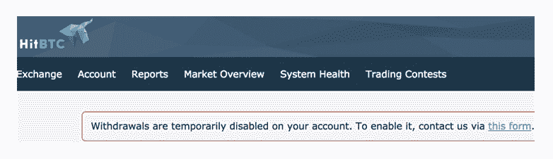
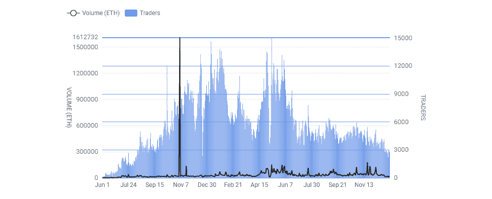
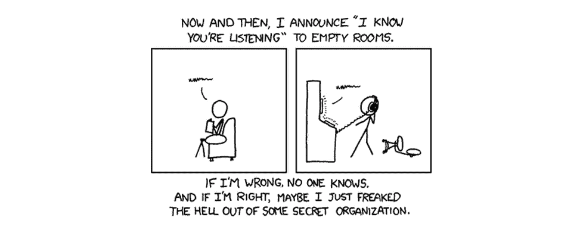

# 2019 年成功#ProofOfKeys 的十大分散加密交易所

> 原文：<https://medium.com/hackernoon/top-10-decentralized-crypto-exchanges-for-a-successful-proofofkeys-in-2019-478dc38cff7a>

对中央加密货币交易所被黑客攻击、腐败或非法运营的担忧多年来一直在交易员中蔓延。从 mt . Gox(2013 年最大的加密交易所)关闭大门，让用户失去约 85 万 BTC，到 FBI 最近查封的 1Broker exchange，当你把硬币留在这些公司手中时，你可以做最坏的打算。

今天，我们将讨论最近推出的#ProofOfKeys 运动，该运动可能会揭露集中式交易所中的骗子，以及为什么你应该在 2019 年考虑分散式交易所(DEX)。我们精心制作了一个最有利的指数列表，你可以作为一个交易者或只是简单的加密所有者使用。

# 反对集中交易的战争开始了

“[密钥证明](https://www.proofofkeys.com/)”是由著名比特币投资人 [Trace Mayer](https://twitter.com/TraceMayer) 创立的运动。今年是第一块比特币在 2009 年 1 月 3 日开采的[十周年纪念日。他建议，每一个在中央交易所拥有 BTC 的比特币持有者，都应该在这一天把它提取到自己的钱包里。](https://www.digitaltrends.com/computing/bitcoin-10-years-of-mining-from-genesis-block-to-asic-and-beyond/)

如你所知，第三方服务(即集中交易所)存储的所有硬币都不是真正属于你的。这更像是一种监管，他们为你保管它们。在这种关系中，你只是他们数据库中的一个数字，而他们才是区块链上真正硬币的私人密钥的真正所有者。

所以这让我们想知道，“这些集中的交易所真的拥有 BTC 在这个数据库中声称的 1:1 吗？我们的集体行动会证明情况恰恰相反吗？”

# 第一个倒下的

hit BTC 就是这种情况，这是一个日交易量超过 4 万 BTC 的集中交易所。当试图撤回他们本应属于他们的 BTC 时，一些用户意外地收到了[“您的账户暂时禁止撤回”消息](https://twitter.com/TraceMayer/status/1080287680804646918)。

为了让#ProofOfKeys 过时，并始终确保您是您资产的真正所有者，[分散加密交换](https://en.wikipedia.org/wiki/Decentralized_exchange)是目前可用的最佳解决方案:

*   由于没有注册要求或 KYC 过程，增加了隐私；
*   不需要存款或取款，所有的交易都是对等进行的，由编程安全的智能合约处理；
*   没有单点故障、控制或调节。

[https://dex.watch/](https://dex.watch/)

# 十大指数

如果你打算进一步支持你的货币独立性，我们将为你带来一份手工制作的 10 大分散加密变化(dex)列表，可以在 2019 年帮助你:

## 1) [IDEX](https://idex.market/)

IDEX 是一个交易以太坊(ERC-20)代币的分散式交易所。IDEX 结合了中央集权的速度和区块链定居点的安全。

*优势*:

*   实时
*   一次完成多个订单
*   天然气成本低
*   智能合同保护
*   访问分析工具
*   做市奖励
*   社会信托

## 2) [Paradex](https://paradex.io/)

Paradex 是一个中继平台，允许客户直接从自己的钱包中交易数百个以太坊(ERC-20)令牌。

*优点*:

*   完全分散
*   对等中继
*   混合解决方案，具有继电器的分散组件和用于其他所有组件的链外架构
*   不需要用户帐户或保管用户的资金
*   实时交易体验
*   通用价格发现
*   由比特币基地支持

## 3) [VDex](https://volentix.io/vdex-white-paper/)

VDex 是一个可交易的数字资产平台，集成了 Vespucci 分析界面和自己的 Verto wallet。即使在交易时，它的用户也保留着自己的 VTX 私钥和大量其他数字资产。

*优点*:

*   易于使用的界面
*   非托管交易
*   多币种钱包
*   具有订单簿“挖掘”功能的增强型钱包
*   用于访问跨链流动性池的灵活、兼容和开放的订单簿
*   多重签名、原子交换和循环交易
*   可交换的和附加的分散协议。根据网络状态由 AI 触发的 EOSIO dPOS 之上的 Tendermint BFT、parsec 和 raft
*   完全开源
*   不断发展的架构*

**vDEX 是更复杂的 DAE(数字资产生态系统)的一部分，由 DAO(分散自治组织)管理，由成员驱动的基金会和第三方合作伙伴结构代表，确保其能够自我监管、自我融资和自治。*

## 4) [0x(零 ex)](https://0x.org/portal)

0x 是一个开放的、无权限的协议，允许以太坊(ERC-20)令牌在以太坊区块链上交易。

*优点*:

*   支持所有以太坊标准
*   关闭区块链秩序和区块链定居点
*   无信任交易
*   0x 令牌持有者将能够通过分散的管理机制来升级协议
*   网络化流动性
*   非托管交易
*   灵活的订单类型
*   超过 30 个 dApps 和中继器建立在其协议之上

## 5) [班科尔](https://www.bancor.network/)

Bancor 允许其用户在没有交易对手的情况下以自动计算的价格转换网络上的任何令牌。

*优势*:

*   基于内部 CRR(固定准备金率)的即时转换
*   做市商，自动发现自己的价格，为其他加密货币提供流动性
*   跨链流动性
*   完全开源
*   透明定价

## 6) [凯伯](https://kyber.network/)

Kyber 提供了个体、dApps 和生态系统之间的无缝交易。

*优点*:

*   即时令牌交换
*   没有订单
*   代理支付服务
*   通过智能合约在链上发生的完全链上资产交易
*   个人用户、智能合约账户和来自网络的商家
*   储备实体为平台提供流动性
*   Kyber Swap 可以整合不同的钱包

## 7) [波动指数](https://client.wavesplatform.com/)

Waves DEX 是一个去中心化的市场，用户可以在这里交易基于 Waves 的资产，包括 Waves、Waves 资产、菲亚特代币和加密货币代币，如 wBTC 和 wETH。

*优点*:

*   基于 Waves 加密货币
*   点对点传输
*   Waves 钱包交易都发生在区块链
*   多币种钱包
*   收到利息
*   代币发行

## 8) [雷达继电器](https://radarrelay.com/)

Radar Relay 是一种分散式令牌交易，替代了当前流行的基于以太坊和 0x 协议的集中式交易。

*优点*:

*   不需要注册
*   充当订单中转者，操作订单簿并在同行之间转发订单，而无需保管其用户的资产
*   非连锁订单簿
*   详细的图表选项
*   直接钱包整合
*   提供响应迅速的客户支持
*   订单共享

## 9) [ForkDelta](https://forkdelta.app/)

ForkDelta 目前是一个开源的、更新的接口，用于 EtherDelta 与一个活跃的公共开发团队的智能合约。

*优势*:

*   无许可令牌列表系统
*   智能合同保护
*   完全开源
*   社区驱动

## 10) [Bisq 交换](https://bisq.network/)

Bisq 是一个开源的点对点应用程序，允许您购买和出售加密货币，以换取国家货币。

*优点*:

*   无需注册或中央机构的批准
*   对等网络
*   分散仲裁系统和保证金保护交易者
*   所有个人数据都存储在本地
*   通过 Tor 路由的端到端加密通信
*   Multisig 商务钱包
*   完全开源

2019 年会是密码交易员转向 dex 的一年吗？鉴于集中式交易所周围总是存在 FUD(恐惧、不确定性和怀疑),随着更多监管的到来，我们可以假设分散式交易所接管只是时间问题。在那之前，你可以见证趋势的转变，越来越多的交易者会跳槽，并考虑分散加密交易所带来的真正优势！

## 关于作者:

基里尔·希洛夫——geek forge . io 和 Howtotoken.com 的创始人。采访全球 10，000 名顶尖专家，他们揭示了通往技术奇点的道路上最大的问题。加入我的**# 10k QA challenge:**[geek forge 公式](https://formula.geekforge.io/)。