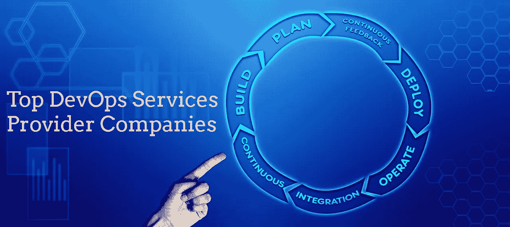

# 全球十大 DevOps 咨询和服务提供商

> 原文：<https://medium.com/hackernoon/top-10-devops-consulting-and-service-providers-globally-7f761632d7a>

DevOps 开足马力。

**看看知名机构的支持性预测:**

*   据 [**市场和市场**](https://www.marketsandmarkets.com/Market-Reports/devops-824.html?gclid=Cj0KCQiA14TjBRD_ARIsAOCmO9ZWlKOwLv1lvb0No2OMtdBQB1AzXThuxHrhzPc0io139uHMjeOh76YaAjcCEALw_wcB)**预测，DevOps 市场规模**预计将从 2017 年的*29 亿美元增长至 2023 年的*103.1 亿美元，预测期内的*年复合增长率(CAGR)为 24.7%* 。
*   根据本 [**IDC 社区**](https://www.idc-community.com/2018/11/16/top-10-worldwide-developer-devops-2019-predictions/) 的说法，到 2024 年，DevSecOps 将实现自动化，60%的新应用将在持续交付渠道中包含完整的安全性和合规性评估。
*   根据 [**大观研究**](https://www.grandviewresearch.com/press-release/global-development-to-operations-devops-market) 有限公司的一份新报告，全球 **DevOps 市场规模**预计到 2025 年将达到*128.5 亿美元，相当于预测期内 *18.60%的 CAGR* 。*

DevOps 的受欢迎程度并不隐藏。

科技巨头，如**亚马逊**、**网飞**、**塔吉特**、**沃尔玛**、**脸书**等，已经采用了 DevOps，并为他们的客户提供了卓越的体验。由于更快的软件开发和交付变得必不可少，像敏捷和 DevOps 这样的方法现在非常流行。

我相信成功的 DevOps 故事要比 DevOps 以辩论、峰会、帖子和图片的形式制造的炒作少得多。数字图中看不到 DevOps 的真实画面；它应该在许多受益于它的组织中被看到。

让我们言归正传。

在这里，我整理了全球顶级 DevOps 咨询和服务提供商公司的名单，以帮助您打造成功的 DevOps 故事。

***注*** *:这份不偏不倚的顶尖 DevOps 服务公司名单意在让你轻松选择 DevOps 外包公司的过程。这个全面的列表不是一夜之间的努力的结果。我得到了谷歌和 LinkedIn、Forbes、Clutch、GoodFirms、社交媒体和总体评分* ***等平台的帮助。***

我们都知道最好的定义是不存在的。最佳是主观的，取决于各种因素，如时间、成本、要求和适用性。

**为了缩小选择范围，我记住了以下因素:**

*   团队规模
*   成立年份
*   投资组合的多样性
*   全球存在
*   经验
*   费用
*   社交媒体存在

**重要提示:**

我不偏爱任何公司，也没有任何与他们合作的经验。我对搜索**‘十大 DevOps 服务提供商’**和**‘顶级 Devops 外包公司’**的人数感到惊讶，这就是为什么我最终创建了这个列表。

公司的命令在这里并不重要。我以一种随机的顺序保存了它，我请求读者们考虑同样的问题。

## 以下是十大 DevOps 咨询和服务提供商的快速列表

*   **索格提**
*   **TCS**
*   **埃森哲**
*   **CA 技术公司**
*   **SPEC 印度**
*   **SSW**
*   **数据通信**
*   **科技马恒达**
*   **微焦点**
*   **异种堆叠**

## **让我们进入每一个的细节:**

## 1.索格提:

[Sogeti](https://www.uk.sogeti.com/) 是领先的技术服务提供商，也是全球数字化转型领导者凯捷集团的一部分。他们拥有提供尖端解决方案的专业知识，包括云、网络安全、数字制造和新兴技术，并与强大的技术供应商建立了合作伙伴关系。

Sogeti 是一家总部位于英国的开发运维公司，借助一流的工具、经验丰富的开发运维团队和正确的开发运维实践，提供端到端的开发运维服务。为了确保 devops 成功转型，他们优先考虑 devops 带来的文化变革。

**公司规模:** 10000 以上

**成立年份:** 1967 年

**地点:**英国、美国和其他国家

**其他服务:**数字保证&测试、云服务、测试服务、技术产品工程等。

## 2.TCS:

TCS 是全球知名的 IT 服务和数字业务解决方案领导者。以简化和转变业务为目标，TCS 是全球顶级雇主之一，代表 46 个国家的 151 个国籍。

TCS 提供卓越的企业开发运维咨询和服务，包括利用优秀的工具和强大的合作伙伴关系进行咨询和实施。

TCS 是 IT 行业中一个值得信赖的名字，无论您选择哪种服务，它都能确保出色的客户体验。

**公司规模:** 30 万以上

**成立年份:** 1968 年

**地点:**印度、美国、阿联酋、英国和其他 40 多个国家

**其他服务:**应用开发和维护、业务流程外包、企业解决方案、IT 基础设施服务、工程和工业服务等。

## 3.埃森哲:

[埃森哲](https://www.accenture.com)是财富全球 500 强企业之一，也是帮助企业接受数字化工作和生活方式的全球技术服务提供商。它们涵盖了大多数行业和业务职能，提供战略、咨询、技术、运营和数字方面的服务。

埃森哲的 devops 服务帮助客户以质量驱动的方式更快地交付应用。埃森哲 DevOps 平台可帮助您将业务、部署和运营团队聚集在一起，实现流程自动化。

**公司规模:** 30 万以上

**成立年份:** 1989 年

**地点:**印度、美国、菲律宾和其他 52 个国家

**其他服务:**埃森哲战略、埃森哲咨询、埃森哲数字、埃森哲技术和埃森哲运营

## 4.CA 技术:

CA Technologies 是世界上最大的独立软件公司，是 Broadcom Inc .的子公司。该公司提供系统软件、应用软件和 B2B 软件，专注于敏捷软件开发和 DevOps。

CA Technologies 总部位于美国纽约，是一家 DevOps 公司，提供端到端 DevOps 流程，实现自动化软件开发，确保安全性、可伸缩性和连续交付。

凭借实践经验和熟练的 DevOps 专家团队，他们通过加速开发和交付来帮助客户实现新的业务高度。他们拥有敏捷管理、自动化测试和持续交付方面的专业知识，可以创建完全自动化的开发运维管道。

公司规模: 10，000+人

创建年份: 1976 年

地点:美国和其他 35 个国家

**其他服务:**高级分析、发布管理、API 管理、云解决方案、AIOps、API 开发、移动 App 开发、行业解决方案、产品、咨询等。

## 5.规格印度:

[SPEC INDIA](https://www.spec-india.com/) 是一家位于印度的 DevOps 咨询公司，提供涵盖广泛行业垂直领域的数字化解决方案和商业 IT 服务。30 多年来，他们一直通过可扩展、未来且功能丰富的解决方案帮助企业发展。他们的客户从大型企业、中小企业到财富 100 强公司。

SPEC INDIA 的 DevOps 服务旨在利用经验和专业知识实现卓越，被许多企业客户广泛使用，他们正在经历软件开发的文化和技术转变。不仅是 DevOps，他们还拥有 DevSecOps 方面的专业知识，这些知识在软件开发生命周期的初始阶段而不是最后阶段优先考虑安全性。

**公司规模:** 300+人

创立年份: 1987 年

**地点:**印度和美国

**其他服务:**企业移动性、定制软件开发、初创 IT 解决方案、云部署、商业智能解决方案、物联网解决方案、技术咨询

## 6.SSW:

[SSW](https://www.ssw.com.au/) 利用微软技术的核心专业知识，提供可扩展的定制软件解决方案。他们的客户从公共汽车公司、政府机构到大型会计公司。

SSW 是一家总部位于澳大利亚的 DevOps 公司，结合支持工具和文化，他们帮助公司在开发环境中集成 DevOps 以提高整体质量。

公司规模: 200 人以上

**成立年份:** 1990 年

**地点:**澳大利亚

**其他服务:**软件开发、Web &手机应用开发、商业智能、云服务

## 7.数据通信:

Datacom 是亚太地区领先的本土 IT 服务提供商，拥有 50 年的技术经验。他们的产品组合拥有大量不同的客户和解决方案。

作为新西兰领先的 DevOps 公司，Datacom 的 Devops 即服务旨在通过专家培训、咨询和实施带来敏捷性，从而提高整体性能。

公司规模:5000 人以上

创建年份: 1965 年

地点:新西兰、澳大利亚、马来西亚、菲律宾、越南、美国和英国

**其他服务:** IT 管理、云服务、定制软件开发

## 8.Tech Mahindra:

[Tech Mahindra](https://www.techmahindra.com/) 为包括财富 500 强企业在内的全球企业提供创新和以客户为中心的 IT 体验。Tech Mahindra 是福布斯全球数字 100 强(2018)和福布斯亚洲 50 强(2018)中排名最高的非美国公司。

他们经验丰富的团队专注于速度和连接，拥有帮助大型企业成功实施 devops 的专业知识。

**公司规模:** 10 万以上

创立年份: 1986 年

**地点:**印度、美国和其他 50 多个国家

**其他服务:**企业架构、业务流程服务、基础设施和云服务、下一代解决方案、集成工程解决方案

## 9.微焦点:

[Micro Focus](https://www.microfocus.com/) 是专注于构建、销售和支持软件的最大纯软件公司之一。从大型机到移动设备再到云，它们通过高质量的软件解决方案帮助公司实现投资回报最大化。

在混合 IT 领域，他们专注于核心业务系统的现代化，这有助于集成企业开发程序，从而快速构建软件。

**公司规模:** 1 万人以上

**成立年份:** 1976 年

**地点:**美国、英国和印度

**其他服务:**混合 IT 管理、安全&治理、预测分析

## 10.XenonStack:

XenonStack 是一家软件公司，致力于开发 DevOps、数据集成、分析和安全平台。他们还提供大数据解决方案、企业应用开发和决策科学。

他们是顶尖的 devops 咨询服务和解决方案公司之一，帮助企业实现跨平台的持续交付渠道，重点是提高效率。

公司规模: 50+人

**成立年份:** 2011 年

地点:印度和美国

**其他服务:**托管云服务、应用迁移解决方案、大数据工程、物联网平台和解决方案、机器学习&人工智能、商业智能

在研究过程中，我遇到了一些其他领先的 DevOps 外包公司，也值得添加到列表中:

# 其他顶级 DevOps 服务提供商公司:

## 11.创新:

[Appnovation](https://www.appnovation.com/) 是一家总部位于温哥华的全球数字解决方案和托管服务提供商，帮助许多知名品牌通过可扩展的数字解决方案推动增长。

Appnovation 的 DevOps 咨询服务帮助企业提高软件质量，自动化流程，采用正确的 DevOps 文化，并构建敏捷的软件发布周期。

**公司规模:** 200+人

**成立年份:** 2007 年

**地点:**加拿大、美国、英国、欧洲和印度

**其他服务:**数字战略、开发&工程、用户体验&设计、数据和分析解决方案、云服务、业务流程管理、移动解决方案

## 12.相扑逻辑:

[Sumo Logic](https://www.sumologic.com/) 是全球最强大的机器数据分析服务之一，在提供一流的云解决方案方面拥有专业知识。

他们提供了许多应用程序来加速任何环境中的连续交付管道，以简化复杂的流程和挑战。

公司规模: 300 人以上

**成立年份:** 2010 年

**地点:**美国和印度

**其他服务:**云管理、Sumo Logic 应用、监控和故障排除、云 SIEM、云迁移

## 13.ECS 数字:

ECS Digital 是一家总部位于伦敦的公司，自 2003 年以来专门提供企业解决方案来满足不断发展的业务需求。他们的重点是利用企业开发和敏捷测试，帮助他们的客户交付更快更好的产品。

凭借多年的经验和正确的技能，他们致力于通过在整个组织中采用 DevOps 文化，将传统的软件开发方法转变为 DevOps 管道。

公司规模:100 人以上

创建年份: 2003 年

**地点:**英国和新加坡

其他服务:企业开发、敏捷测试、培训

## 14.ANATAS:

ANATAS 是一家领先的 IT 服务咨询公司，在悉尼、墨尔本和布里斯班都设有办事处。他们提供从规划、实施、战略到维护的企业云转型。他们正在帮助企业采用企业云计算来协同工作。

作为澳大利亚领先的 DevOps 公司之一，ANATAS 顾问通过依赖管理、监控、自动化测试和基础设施自动化来帮助公司优化 DevOps 和自动化流程，从而快速构建软件。

**公司规模:** 50 以上

**成立年份:** 1996 年

**地点:**澳洲

**其他服务:**集成架构和测试、SOA、测试和质量保证、云原生应用开发和企业架构

## 15.第八盏灯:

[8th Light](https://8thlight.com/) 是一家领先的定制软件开发公司，致力于构建从移动到微服务的软件。

总部位于芝加哥的优质 DevOps 提供商，旨在以高速度构建软件，第八光通过简化和自动化具有 DevOps 文化的部署来帮助公司降低成本和时间。

**公司规模:** 100+人

**成立年份:** 2006 年

**地点:**美国、英国

**其他服务:**区块链、移动开发、Web 开发、咨询、托管服务

## 16.Aim 咨询:

[艾迪生集团旗下的 Aim 咨询公司](https://aimconsulting.com/)，是提供技术咨询和解决方案交付的行业领导者。

凭借在 DevOps 领域多年的咨询经验，他们正在帮助组织通过提高质量、缩短上市时间、自动化和现代化软件流程来实现 DevOps 的优势。

公司规模: 300+人

创建年份: 2006 年

**地点:**美国

**其他服务:**应用开发、云和运营、数据&分析、数字体验&移动

## 17.云技术合作伙伴:

惠普企业公司 [CTP](https://www.cloudtp.com/) 以云技术为核心，帮助客户设计、构建和实现跨行业的 IT 解决方案。

由于他们是美国首屈一指的云服务提供商，他们充分利用合适的工具集和人员来评估 devops 成熟度，并在 DevOps 专家的帮助下实现流程自动化。

公司规模: 200+人

**成立年份:** 2009 年

**地点:**美国、英国和欧洲

**其他服务:**云采用、应用迁移、物联网、合规性、数字创新

## 18.Eficode:

[Eficode](https://www.eficode.com/) 是一家总部位于北欧的软件开发公司，以客户为中心，通过 DevOps 提供设计、咨询、开发和自动化工程。

Eficode 是一家总部位于德国、荷兰、丹麦、瑞典和芬兰的欧洲 DevOps 公司，专门通过结合正确的工具、操作方法、培训和支持技术来创建 DevOps 文化，从而以敏捷和高效的方式构建软件。

**公司规模:** 200 人以上

**成立年份:** 2005 年

**地点:**欧洲和北欧地区

**其他服务:**云服务、UX 研究、设计、软件开发

## 19.Contino:

[Contino](https://www.contino.io/) 是一家全球技术咨询公司，帮助企业通过 DevOps 和云解决方案转变人员、流程和技术，以创建一种现代化的工作方式。

作为伦敦的一家顶级 DevOps 公司，他们帮助组织利用企业 DevOps 的战略、自动化和实施来实现敏捷性和效率。

**公司规模:** 250+人

**成立年份:** 2014 年

**地点:**美国、英国和澳大利亚

**其他服务:**云平台构建&迁移、云原生软件开发、数据平台和分析

## 20.发送:

[Versant](https://versent.com.au/) 是澳大利亚领先的技术解决方案提供商，为金融、电信、媒体、公共部门和公用事业行业的许多知名客户提供咨询服务。

他们提供最佳 devops 实践，通过协作文化实现更快、持续的交付渠道。

公司规模: 200+人

**成立年份:** 2014 年

**地点:**澳大利亚和新加坡

**其他服务:**云、API、托管服务、大数据解决方案、安全解决方案

你可以帮忙！我尽力为您提供顶级的 DevOps 咨询和服务公司。如果你觉得缺少了什么，你可以在下面的评论中提到这些名字来帮助完成这个列表！让我们让这篇文章成为一篇有价值的文章！