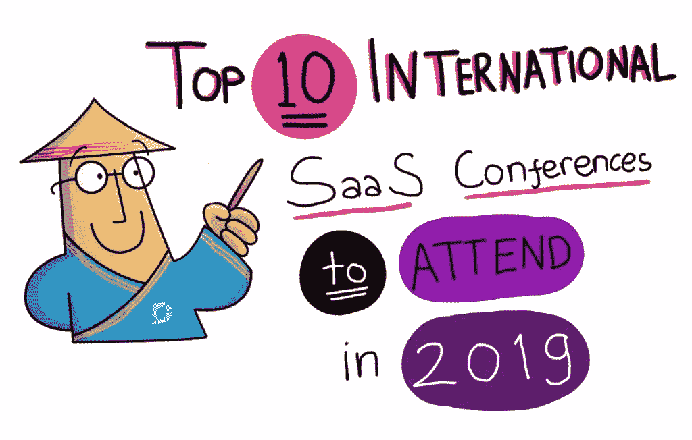
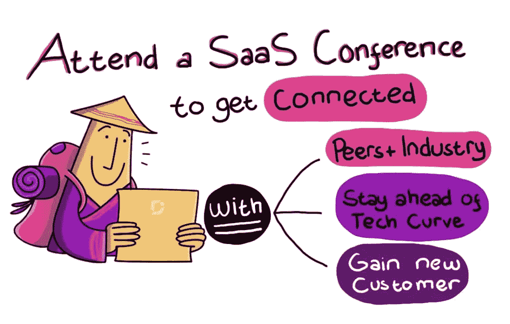
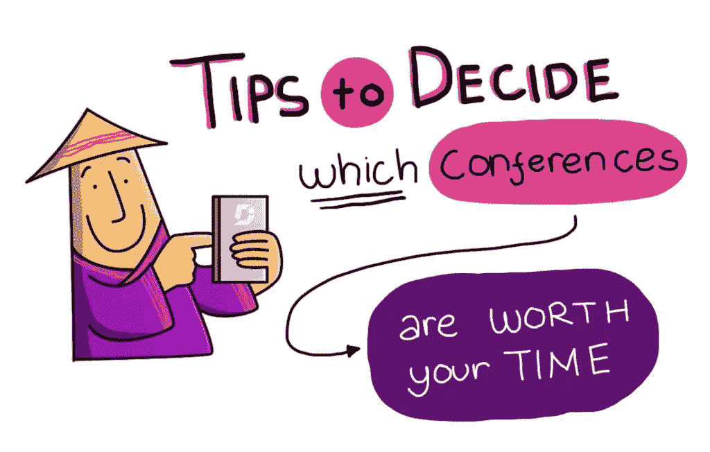
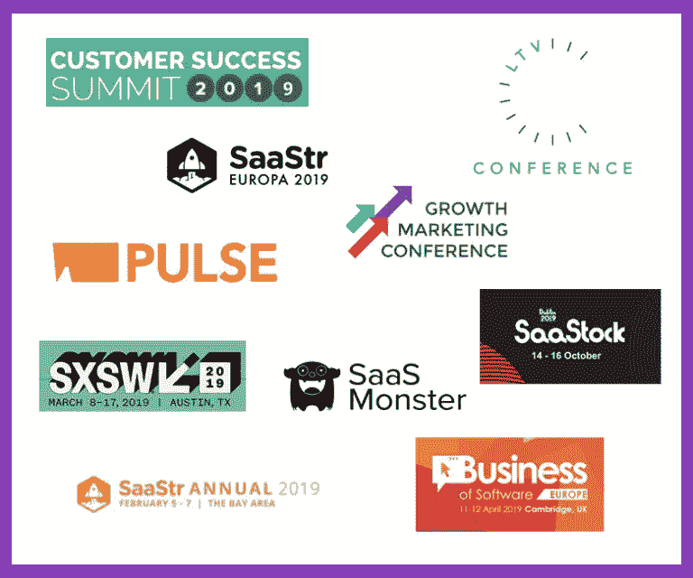

# 10 个最重要的 SaaS 国际会议

> 原文：<https://medium.com/hackernoon/top-10-international-saas-conferences-you-should-attend-in-2019-and-why-c7d5f3ea1151>

*最初发表于红杉布朗的* [*文档 360.io*](https://document360.io/blog/top-10-international-saas-conferences-you-should-attend-in-2019-and-why/)

**

*软件即服务(SaaS)是一个快速增长、竞争激烈的行业，预计到 2024 年将达到 1860 亿美元。随着 SaaS 市场的不断变化和扩张，第四季度是评估您过去几个月所取得成绩并为来年的发展做准备的绝佳时机。本着这种精神，我们发布了以下文章，让你在制定 2019 年旅行和费用预算时有一个良好的开端。在你的 SaaS 生意中，最好的投资之一就是参加一个执行良好的会议。下面，我们将深入探讨为什么您应该将 SaaS 会议添加到您的名单中，如何充分利用参加会议的机会，最后，我们挑选了 2019 年值得期待的最佳会议。*

# *为什么要参加 SaaS 会议*

*在我们这个数字互联的时代，似乎几乎任何重要的交易都可以通过电脑或移动设备处理。我们有各种各样的社交平台可以用来联系和建立关系网，那么为什么要花大价钱去参加会议呢？诚然，大多数商业活动都可以通过 SaaS 工业生产的产品来有效执行，但一些互动在人与人之间进行时会变得更有价值。以下是你参加 SaaS 会议的几个原因。*

**

# *你是创业公司吗？受到启发*

*参加一个会议会让你置身于一群志同道合的同行之中，他们和你有着相似的经历。倾听你所在行业中其他人的战争故事，让你明白，不仅是你，还有许多人都在这场战争中独自战斗，无论你现在面临什么挑战，都已经被其他人遇到并克服了。听听像你这样的企业和像你这样的人的证词也能让你了解自己在比较中的地位。你击中目标了吗？还是需要更加努力？找导师？参加社交活动还能让你获得宝贵的知名度，让你面对潜在的投资者、客户和合作伙伴。*

# *你是开发商吗？保持技术曲线的领先*

*在像 SaaS 这样快速发展的行业中，技术总是在不断变化。你和你的团队是否依赖于即将过时的技术？是否会有一种新的创新出现，有望打破目前的做事方式？在此类新闻登上行业博客之前，它通常始于网络活动中的未公开独家新闻。在独家信息传播之前获取这些信息，可以让你在后来者赶上来之前采取果断行动。*

*你是一个成熟的企业吗？建立重要的联系，成功度过扩展阶段*

*虽然努力工作和伟大的产品会让你走得更远，但与关键决策者或完美的客户联系可以推动你的公司走向成功。面对面交流有一种自然的力量，单靠技术是无法战胜的。获取客户保持方面的先进知识，与行业保持联系，微调您的营销策略，以领先于进入您行业的所有新参与者。*

# *如何判断 SaaS 会议是否值得参加*

*在这篇文章中，我们为您呈现了一份精心挑选的 2019 年最佳 SaaS 会议名单。然而，如果你有一个这里没有提到的会议，下面的建议将帮助你决定是否值得投资。*

**

# *出席人数是多少？*

*出席人数多的会议通常会在网站上公开发布，因为这是一个值得夸耀的重要指标。如果没有现成的数据，您可以联系活动组织者，询问以往活动的数据。你也可以请参加过的人分享他们的经验。活动大厅人多吗？还是一座鬼城？这里需要注意的是:大量的出席人数并不是最重要的因素——你还需要确保这个活动组织得很好，而不仅仅是一个号召。*

# *谁是合作伙伴、赞助商和演讲嘉宾*

*你可能不认识小组中的每个演讲者，但是他们的证书应该清楚地表明他们为活动带来了价值和经验。寻找首席执行官、创始人、副总裁、董事和高级经理。要了解更多信息，请访问演讲者的 LinkedIn 个人资料，了解他们的背景和专业知识。不是活动的赞助商和合作伙伴，他们应该与活动的使命保持一致，以进一步提高会议的价值。*

# *投资回报率是多少？*

*确定您将使用的价值指标，以确定参加培训的成本是否会为您带来实际回报。你会在会议上展示产品吗？你需要创造多少生意才能不仅收回成本，还能在活动结束后创造销售额？你的目标是获得教育吗？如果可以用金钱来衡量，你所获得的知识的价值是什么？那价值大于参加的成本吗？*

# *如何充分利用 SaaS 会议*

*一旦你确定一个会议值得参加，你就必须充分利用这个活动来确保你的钱花得值。提前几个月预订机票和酒店，缓解旅行和住宿的压力..在会议开始前建立联系，这将让你最大限度地利用会议时间，与你真正想交往的人见面。最后，练习你的电梯演讲；如果你真的打算充分利用这个机会，你很有可能会经常重复，所以最好把它做好——没有停顿，没有失误。*

*我们为 2019 年参加的**十大国际 SaaS 会议精选***

**

# *[SaaStr 年度](https://www.saastrannual.com/)*

***2 月 5 日至 7 日，加州圣何塞***

*SaaStr 称其使命是帮助像你们这样的 SaaS 企业更快发展。宣称自己是“世界上最大的 SaaS 创始人和企业家社区”，其年度北美会议当然有出席人数来支持这一说法。每年有超过 10，000 人参加这一活动，学习如何启动增长和改善 SaaS 业务的营销。如果你参加，你将有机会接触到 SaaS 行业最优秀的思想家和活动家。一定要做到。*

# *[萨斯特欧罗巴](https://www.saastreuropa.com/)*

***6 月 12 日至 13 日，法国巴黎***

*SaaStr 通过其年度会议的欧洲版本输出其高影响力的行业事件。在 2018 年的首届活动中，门票全部售罄，预计 2019 年的观众人数将超过 2，500 人。像北美会议一样，期待伟大的演讲者、难以置信的社交机会和全天会议，在那里你可以向成功的企业家学习，并与 SaaS 的风险投资家、有影响力的高管和企业家同行擦肩而过。*

# *[萨斯托克](https://www.saastock.com/)*

***10 月 14 日至 16 日，爱尔兰都柏林***

*SaaStock 不仅是欧洲最大的 SaaS 会议之一，也是业内人士的重要国际活动。大约有 1500 人(其中 15%是投资者)参加了 SaaStock，人们可以听到来自主要品牌和技术创始人的鼓舞人心的故事和合理的建议。如果你想学习如何发展你的业务，并建立联系帮助你做到这一点，一定要参加这个会议。*

# *[SaaS 怪兽](https://collisionconf.com/saas-monster)*

***5 月 20 日至 23 日，加拿大多伦多***

*另一个达到“世界上最大的 SaaS 事件”称号的伟大会议是 SaaS 怪物。每年吸引 5000 多名与会者，你可以期待与买家、卖家、投资者、初创公司和成功的大公司在一起。过去的演讲者包括来自亚马逊、英特尔、甲骨文和 Survey Monkey 的高管。*

# *[软件业务](https://businessofsoftware.org/)*

***9 月 16 日至 18 日，马萨诸塞州波士顿***

*软件会议的业务非常独特，因为它承诺如果你觉得你没有从活动中获得任何价值，它会退还你的门票费用。这一精心策划的会议的年度出席人数被故意限制在 400 人，以营造友好的氛围并促进交流。软件被宣传为专门面向 SaaS 理工大学的软件创始人和领导者，其业务目标是帮助参与者开发更好的产品并改善现有业务。*

# *[SXSW 大会](https://www.sxsw.com/conference/entrepreneurship-and-startups/)*

***3 月 8 日至 17 日，德克萨斯州奥斯汀***

*SXSW(西南偏南)被誉为美国最大的营销和技术“派对”。这个大型会议吸引了来自世界各地的主要参与者和名人，不仅来自技术和商业，也来自艺术和娱乐。这营造了一种交叉授粉的氛围，鼓励“打破常规”的思维和高度创新。SXSW 成立于 1987 年，是年度技术会议巡回赛中一颗受人尊敬的宝石，你应该把它加入到你至少必须去一次的名单中。*

# *[脉动客户成功大会](https://www.gainsight.com/pulse/)*

***5 月 21 日至 24 日，加利福尼亚州旧金山***

*Pulse 专注于通过培养客户成功和 SaaS 公司产品之间的关系来帮助 SaaS 公司发展。该活动每年有超过 5000 人参加，其使命是推动客户成功的采用*

# *[LTV 会议](https://ltvconf.com/)*

***4 月 3 日至 4 日，北美纽约***

*LTV 会议是北美领先的 SaaS 会议。预计这将是今年规模最大、专家最多的一次活动。这次会议汇集了来自世界各地志同道合的 SaaS 企业家、私营和上市公司以及活跃的投资者。参加这样的会议给你一个合作的机会，带走有意义的联系，让你走在技术曲线的前面。演讲和讨论的主题将围绕他们的增长领域，如营销，规模，技术和企业家精神。演讲者包括成功的创始人、连续创业者和其他行业领袖。*

# *[客户成功峰会](https://www.customersuccesssummit.com/)*

***加州三藩市***

*如果客户维系对您来说是一个非常重要的主题(应该如此)，本次会议承诺提供工具、知识和见解，帮助您更好地管理客户之旅。为期两天的活动包括演讲和分组活动，过去的演讲者来自 Monster、Planet Fitness、Glassdoor 和 Trustpilot 等大公司。*

# *[成长型营销大会](https://growthmarketingconf.com/)*

***12 月 10 日至 12 日，加利福尼亚州旧金山***

*在此次活动中，与商界领袖、连续创业者和行业投资者交流，重点分享现实世界的战略，为您的企业充电。每年吸引 1200 多名与会者，过去的演讲者来自 AirBnB、苹果、LinkedIn 和 Stripe 等行业巨头。*