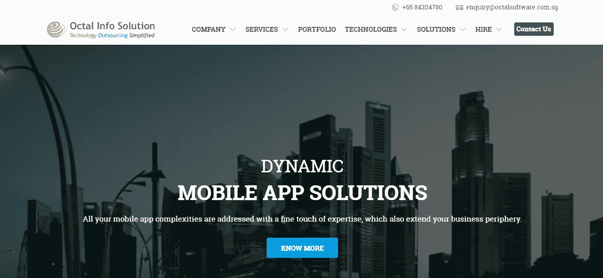
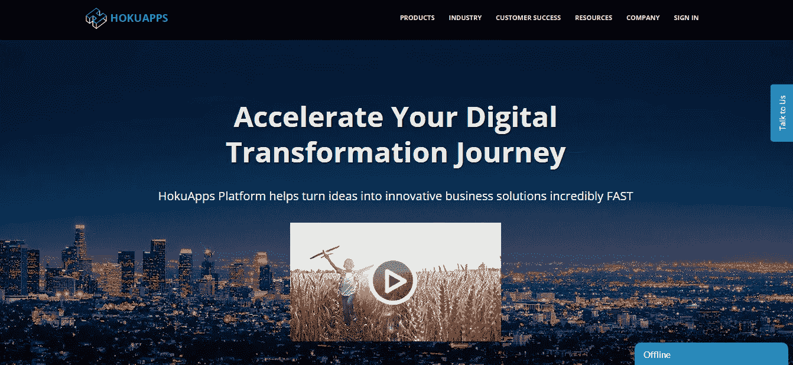
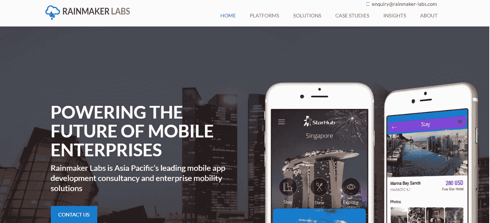
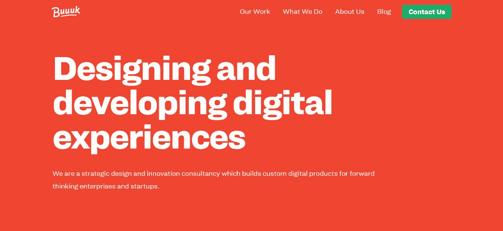
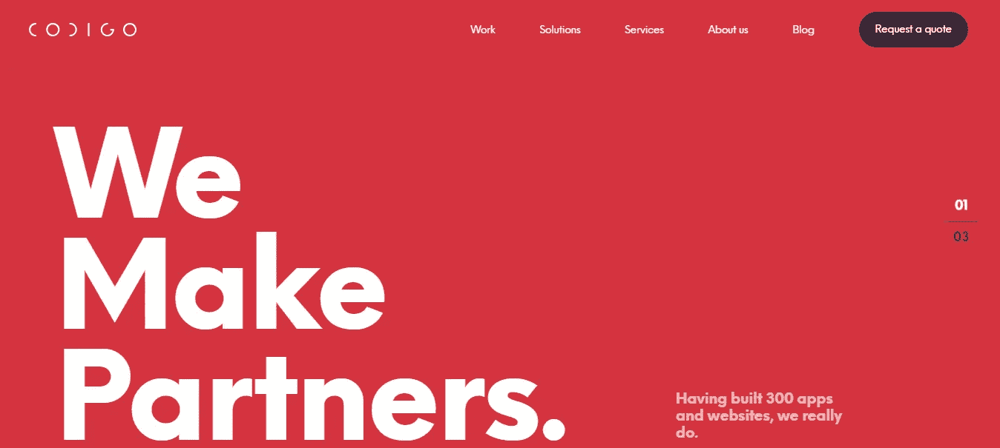
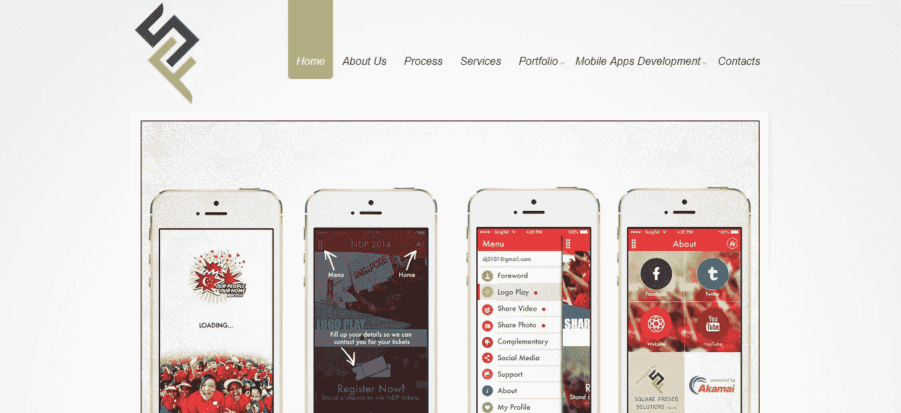
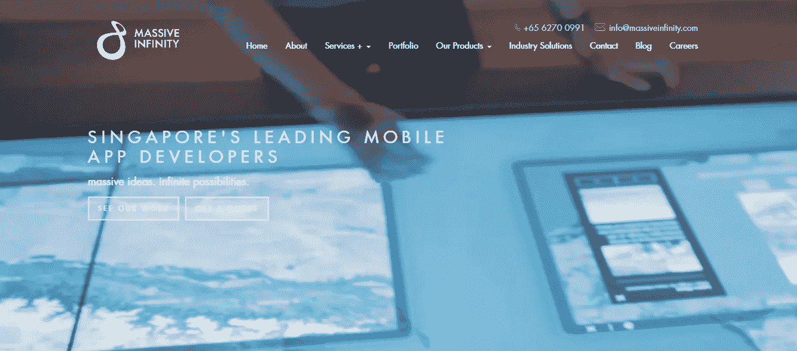
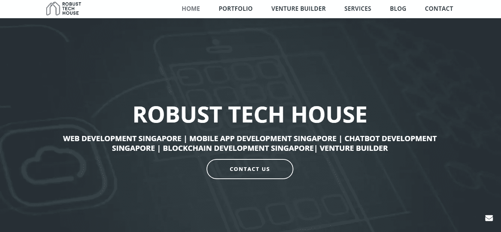
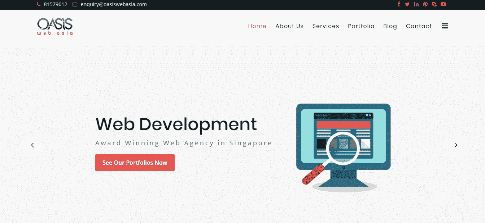

# 新加坡十大移动应用程序开发公司|雇佣专门的移动应用程序开发人员 2019

> 原文：<https://medium.com/hackernoon/top-10-mobile-app-development-companies-in-singapore-hire-dedicated-mobile-app-developers-2019-6947c3277c16>

随着时间的推移，人们比以往任何时候都更加依赖技术，因此，对于商业组织来说，如果他们想在激烈的竞争中生存下来，成为智能设备的一部分是非常重要的。进入客户的智能手机至关重要，新加坡 有许多顶级移动应用开发公司为您提供服务。由于我们已经进入了智能手机和设备的时代——一个似乎有着光明未来的领域，尤其是在商业领域——应用程序开发领域。

根据谷歌的说法——大约 90%的移动用户在执行任务时会寻找他们的智能手机，其中超过 80%的人会定期使用智能手机进行咨询。无论你是想买几件衣服，还是想翻新你的浴室，如今，手机用户确实会在网上查看一切。因此，未来几十年，移动应用的作用是不可避免的。

在当今时代，每个企业都需要 [**移动应用开发**](https://www.octalsoftware.com.sg/mobile-app-development?utm_source=medium&utm_medium=referral&utm_campaign=kanika) 服务。企业家不可能通过应用智能移动应用程序技术来使他们的业务足够快地适应不断变化的市场需求。这就是为什么专门从事应用程序开发的公司非常重要。

由于应用程序开发公司的作用如此巨大，因此在做出最终决定之前必须进行适当的调查和研究。你的应用将代表你公司的利益；因此，你必须挑选最好的公司来开发它。如果您无法决定哪家公司最适合您的下一个应用程序开发项目，那么您可以选择下面提到的 2019 年新加坡十大移动应用程序开发公司中的任何一家。该榜单包括年度十大最佳应用开发公司，第一名为最佳，以此类推。无论你选择哪家公司，你都可以确定你的应用程序开发项目是安全的。

**2019 新加坡十大领先移动应用开发公司如下**:

> **# 1。** [**八进制信息解决方案私人有限公司:**](https://www.octalsoftware.com.sg/?utm_source=99firms&utm_medium=referral&utm_campaign=kanika)

根据流行的搜索引擎调查，Octal Info Solution 是新加坡领先的移动应用开发公司之一。自 2004 年以来，该公司以向初创企业、中小企业和企业提供高质量的 [**web**](https://www.octalsoftware.com.sg/web-development-singapore?utm_source=medium&utm_medium=referral&utm_campaign=kanika) 和 [**移动开发服务而闻名。它最初是为小型企业提供应用程序开发工具，但今天它已经发展成为最受认可的应用程序开发公司之一。**](https://www.octalsoftware.com.sg/hire-mobile-app-developer?utm_source=medium&utm_medium=referral&utm_campaign=kanika)

**成立年份** —公司成立于 2004 年

**专业** —手机应用开发

**全职员工** — 150 名以上全职员工

> **# 2。** [**虚张声势**](https://swagsoft.com.sg/?utm_source=99firms&utm_medium=referral&utm_campaign=kanika)

AppFutura 将这家公司评为新加坡最好的公司之一。它为各种各样的客户提供服务，从初创企业到丰田、宝马等知名品牌，甚至是政府机构(新加坡空军和 MDA)。公司提供一整套 app 开发服务，包括 iBeacon 技术、游戏开发、虚拟开发、增强现实开发、 [**android**](https://www.octalsoftware.com.sg/android-app-development-singapore?utm_source=medium&utm_medium=referral&utm_campaign=kanika) app 开发、 [**iOS**](https://www.octalsoftware.com.sg/ios-app-development-singapore?utm_source=medium&utm_medium=referral&utm_campaign=kanika) app 开发等。

**成立年份** —公司成立于 2010 年

**专业** —手机应用开发

**全职员工** — 50 名以上全职员工

> **# 3。**[**HokuApps:**](https://www.hokuapps.com/?utm_source=99firms&utm_medium=referral&utm_campaign=kanika)

Clutch 称 HokuApps 是一家世界级的应用程序开发公司。作为一家技术机构，该公司专注于移动应用开发平台(MADPs)、低代码、数字化转型、业务流程管理和快速应用开发平台(RAD)。企业有权开发 web 和移动应用程序，这些应用程序可以根据他们的独特需求在短期内进行定制。该公司拥有可靠的内置工具，如安全模型、统一的通信平台、精细的用户访问和强大的报告，可在给定的期限内将您的想法转化为现实。

**成立年份** —公司成立于 2015 年

**特长**——**[**手机 App 开发**](https://www.octalsoftware.com.sg/mobile-app-development?utm_source=medium&utm_medium=referral&utm_campaign=kanika)**

****全职员工**–200 多名全职员工**

****

> ****# 4。** [**雨神实验室:**](http://rainmaker-labs.com/?utm_source=medium&utm_medium=referral&utm_campaign=kanika)**

**Rainmaker Labs 是一家顶级的移动应用开发机构，服务于企业和零售业务。该公司有自己的信标系统，并为营销活动提供经苹果认证的哔哔声 I beacon。这就是它最初作为一家应用程序开发公司的起家方式。他们的主要目标是通过使用移动技术拉近客户与客户的距离，从而提高收入增长。**

****成立年份** —公司成立于 2011 年**

****专业** —手机应用开发**

****全职员工** — 100 多名全职员工**

****

> ****# 5。** [**Buuuk:**](https://buuuk.com/?utm_source=medium&utm_medium=referral&utm_campaign=kanika)**

**另一个令人惊叹的成熟选项是 Buuuk，它可以满足您的应用程序开发需求。它最初是作为一个实验开始的，但在过去的十年里，它变成了一个伟大的商业理念。该公司专门开发 Android 和 iOS 应用程序。该公司认真对待其所有项目，他们主要关注应用程序的设计。除了应用程序开发服务，Buuuk 还可以部署强大的服务器，并与现有设置集成。**

****成立年份** —公司成立于 2008 年**

****专业** —手机应用开发**

****全职员工**–200 多名全职员工**

****

> ****# 6。** [**编码:**](https://www.codigo.co/?utm_source=medium&utm_medium=referral&utm_campaign=kanika)**

**Codigo 是一家数字应用程序开发机构，其主要业务是 UI 或 UX 开发技术。该公司专门设计顶级的移动应用程序、游戏、后端系统和网络应用程序。迄今为止，它已经成功推出了 300 多个移动应用。该公司是整个新加坡最著名的应用程序开发公司之一。它还共同孵化了 7 家初创企业，并管理着一所 UI / UX 发展学校。他们可以为您提供智能应用，为您的用户提供简单、可用且美观的体验。**

****成立年份** —公司成立于 2010 年**

****专业** —手机应用开发**

****全职员工** — 50 名以上全职员工**

****

> ****# 7。** [**广场壁画:**](http://www.squarefresco.com/?utm_source=medium&utm_medium=referral&utm_campaign=kanika)**

**这家公司配备了一个由新加坡最好的开发人员组成的专门团队。8 年来，它一直在为初创企业和企业开发独特的定制应用设计。该公司拥有强大的功能和工业专业知识，可以帮助您将想法转化为实际应用。Square Fresco 因其令人印象深刻的应用程序设计而闻名。**

****成立年份** —公司成立于 2011 年**

****专业** —手机应用开发**

****全职员工**–100 多名全职员工**

****

> ****# 8。** [**巨大无限:**](https://www.massiveinfinity.com/?utm_source=medium&utm_medium=referral&utm_campaign=kanika)**

**仅仅八年时间，Massive Infinity 已经跻身 2019 年十大移动应用开发公司。它配备了一个在新加坡移动应用程序开发领域拥有多年经验的互动媒体开发人员和制作人员团队。因此，您可以获得技能集，以设计一个有价值的，功能齐全，成本效益高的应用程序在巨大的无限。该公司可以为您提供端到端的解决方案，如区块链解决方案，电子商务，虚拟现实或增强现实开发服务和网页设计解决方案。它以根据客户要求、目标受众和最新工业参数创造高质量产品而闻名。**

****成立年份** —公司成立于 2011 年**

****专业** —手机应用开发**

****全职员工** — 50 多名全职员工**

****

> ****# 9。** [**乐百氏科技屋:**](https://robusttechhouse.com/?utm_source=medium&utm_medium=referral&utm_campaign=kanika)**

**如果你正在寻找一家负担得起的移动 [**电子商务**](https://www.octalsoftware.com.sg/ecommerce-solutions?utm_source=medium&utm_medium=referral&utm_campaign=kanika) 公司，那么 Robust Tech House 是最佳选择。它提供了一系列服务，可以为您的应用程序增加实质性的价值。它使您的业务应用程序能够应对不断发展的业务生态系统。**

****成立年份** —公司成立于 2014 年**

****专业** —手机应用开发**

****全职员工**–70 名以上全职员工**

****

> ****# 10。** [**绿洲网亚洲:**](https://www.oasiswebasia.com/?utm_source=medium&utm_medium=referral&utm_campaign=kanika)**

**Oasis prime 专注于网页设计、应用程序开发、CMS、托管服务和各类企业的电子商务解决方案。该公司创造了富有美感和完全创新的应用程序，为您的客户提供最佳的用户体验。**

****成立年份** —公司成立于 2009 年**

****专业** —手机应用开发**

****全职员工**–80 名以上全职员工**

> ****为客户提供 24 x 7 全天候服务非常重要，尤其是当客户试图通过智能手机联系您时。因此，选择正确的应用程序开发公司，帮助你击败竞争对手，并与客户保持密切联系，这对你的业务增长非常重要。****
> 
> ****希望上面列出的** [**新加坡最受认可的应用程序开发公司**](https://www.octalsoftware.com.sg/?utm_source=medium&utm_medium=referral&utm_campaign=kanika) **能够为您的企业提供招聘所需的清晰性。****

****也读:** [**在新加坡制作一个手机 App 要多少钱？**](https://www.octalsoftware.com.sg/blog/cost-mobile-app-development-singapore/?utm_source=medium&utm_medium=referral&utm_campaign=kanika)**