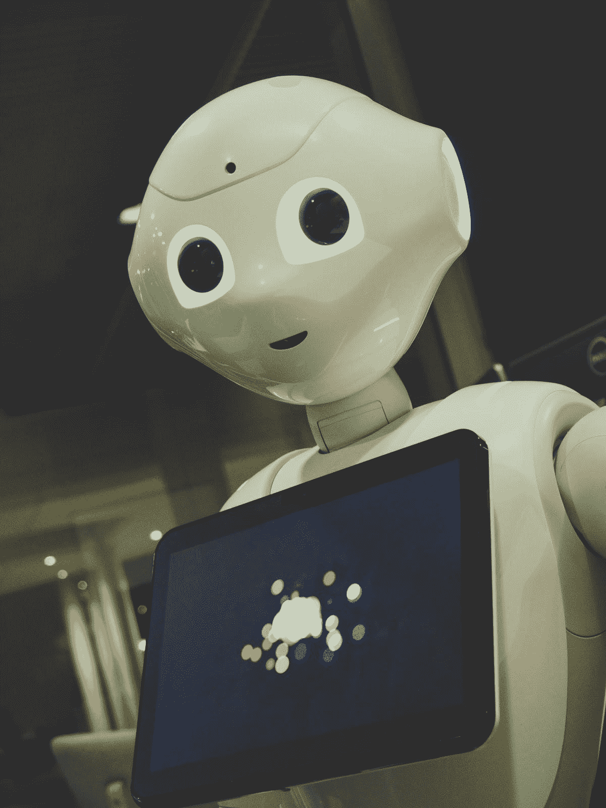
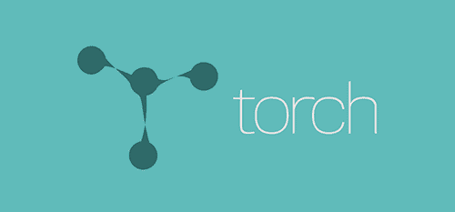
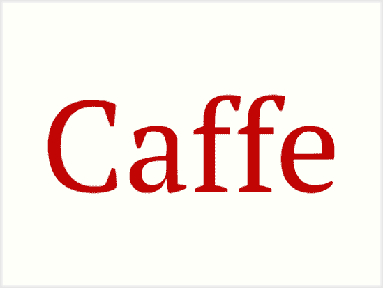
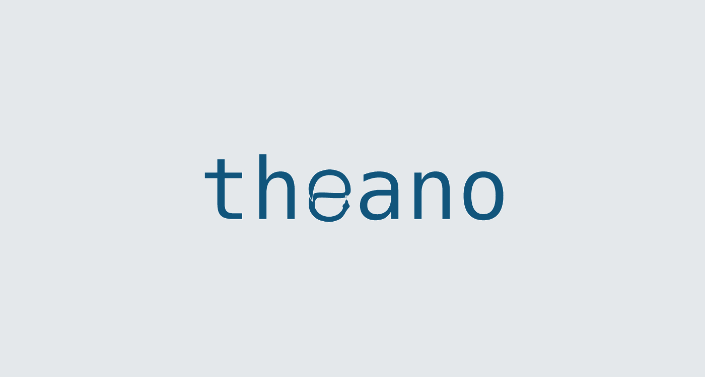
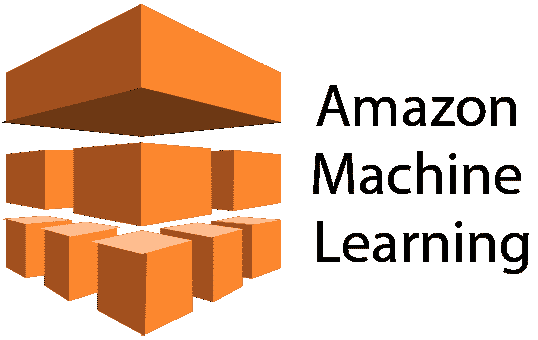
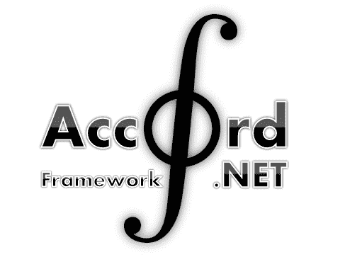
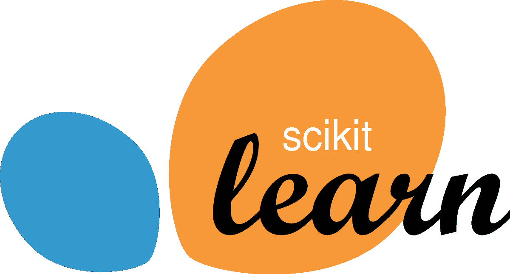
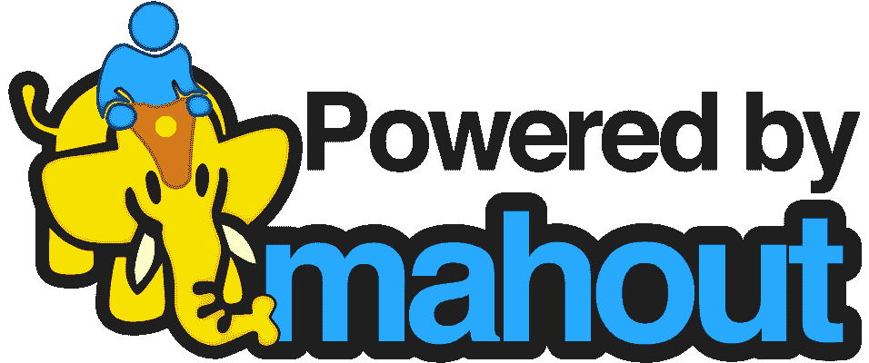
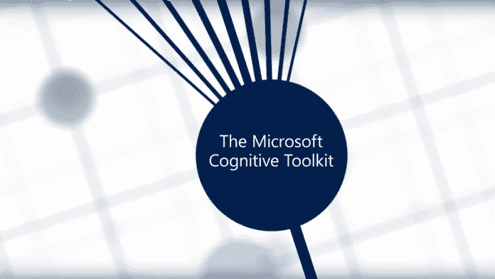
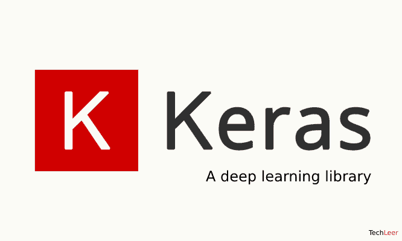

# 十大趋势人工智能框架和库

> 原文：<https://medium.com/hackernoon/top-10-trending-artificial-intelligence-frameworks-and-libraries-69ba59057a78>

人工智能是编程世界的未来。越来越多的开发人员看到了对人工智能技术日益增长的需求，开始熟悉这门科学。当你开始学习人工智能以及如何在编程中实现它时，首先想到的问题是“最好的语言/框架/库是什么？”这正是我们今天在这篇关于每个程序员都必须知道的 10 大人工智能框架和库的综述中要讨论的内容。

说实话，有些语言就是不太适合 AI。例如，许多对人工智能感兴趣的 Ruby 开发者放弃了他们最喜爱的语言，转而使用 Python，因为后者更适合这个目的。然而，对人工智能相当友好的语言，如 C++提供了丰富的框架和库。我们研究并选择了其中最好的。这是我们最终得到的名单:

*   张量流
*   火炬
*   咖啡
*   Theano
*   亚马逊机器学习
*   雅阁。网
*   sci kit-学习
*   阿帕奇看象人
*   微软认知工具包
*   克拉斯

让我们详细探讨一下它们，看看是什么让它们在我们的列表中占有一席之地。

# 张量流

[这个](https://www.tensorflow.org/)绝对配得上我们榜单的第一名，原因有二。首先，它是开源的。其次，它已经成为 AMD、SAP、Google、Intel、Nvidia 等顶级科技巨头最喜欢的人工智能工具。它由谷歌人工智能部门开发，非常适合大量复杂的数值计算，并被用于生物科学等众多领域。非常适合刚刚开始人工智能编程的人。

# 火炬

这是一个基于 LuaJIT 编程语言的面向 GPU 的[人工智能计算框架](http://torch.ch/)。它也是开源的，有足够多的文档和支持。此外，谷歌、脸书、普渡大学、NYU 大学和推特也在使用它。

# 咖啡

最初是作为一个博士项目由贾(他现在在工作)创建的，咖啡已经成为最受欢迎的机器学习框架之一。你绝对应该看看他们的[图像分类演示](http://demo.caffe.berkeleyvision.org/)。它还不完美，但至少它能够识别狗和猫:)

# Theano

正如我们已经说过的，Python 非常适合人工智能和深度学习。这种语言中已经存在许多著名的人工智能库。其中之一是很久以前——早在 2007 年——开发的 Theano。它的主要功能在于处理数学表达式:定义、优化和评估它们。

# 亚马逊机器学习

AWS 有一个庞大的机器学习平台，被全球数千家企业和机构使用。它的平台与主要的人工智能框架一起工作，并提供了许多现成的人工智能解决方案。

# 雅阁。网

这是一个[。基于. NET 的人工智能框架](http://accord-framework.net/)，它提供了大量现成的库，主要用于音频和图像处理。它处理一系列最流行的人工智能问题，如分类、回归、聚类、分布等。

# sci kit-学习

早在 2007 年开发，这是一个基于 Python 的[机器学习库](https://scikit-learn.org/)，用于处理主要的人工智能问题，以及数据挖掘和分析。它是开源的，构建在 matplotlib、NumPy、SciPy 之上。

# 阿帕奇看象人

[Apache 的 Mahout](https://mahout.apache.org/)是一个利用线性代数的机器学习框架。它也使用 Scala DSL，同样适用于主要的人工智能问题。

# 微软认知工具包

当然，不能不提微软的机器学习宝贝，[认知工具包](https://www.microsoft.com/en-us/cognitive-toolkit/)。它是开源的，适合各种人工智能应用。

# 克拉斯

这又是一个用 Python 写的[框架。它的一个特点是能够在其他人工智能框架上运行，如 Theano 或 TensorFlow。它的主要焦点在于快速实验。](http://keras.io/)

# 最后的想法

人工智能在编程界是一个非常有吸引力的领域。任何有自尊的[软件开发公司](https://cybercraftinc.com/)一定已经有了专门的 AI 开发团队。然而，成为一名成功的人工智能专家需要智慧、天赋、耐心和努力。如果你有这些，那么现在是进入这个领域的最佳时机。如果你已经知道一些基本的编程语言，如 Python 和机器学习的基础，你所要做的就是选择正确的人工智能框架并开始工作。