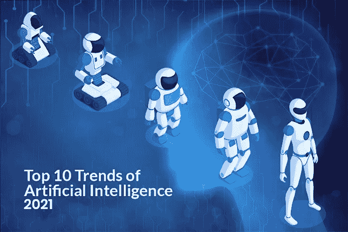
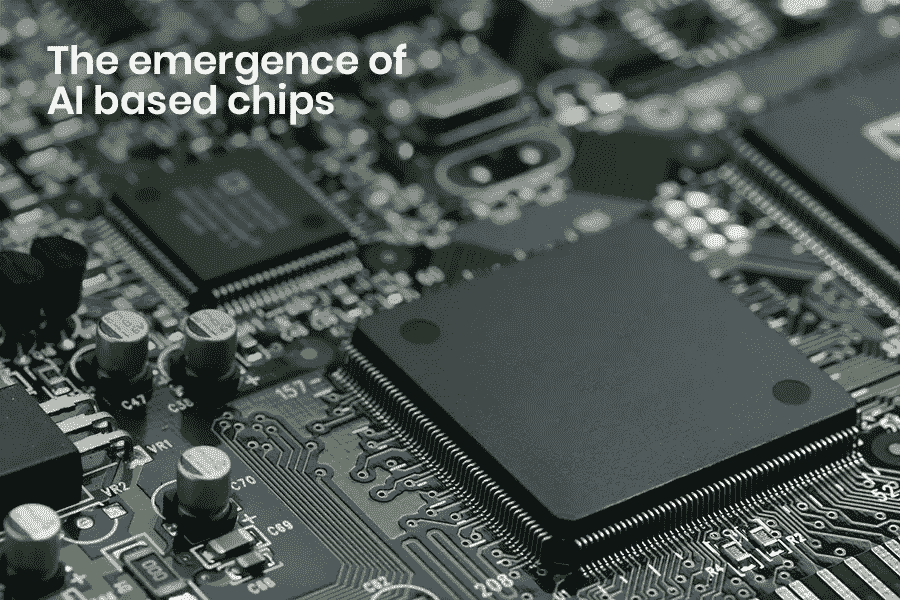
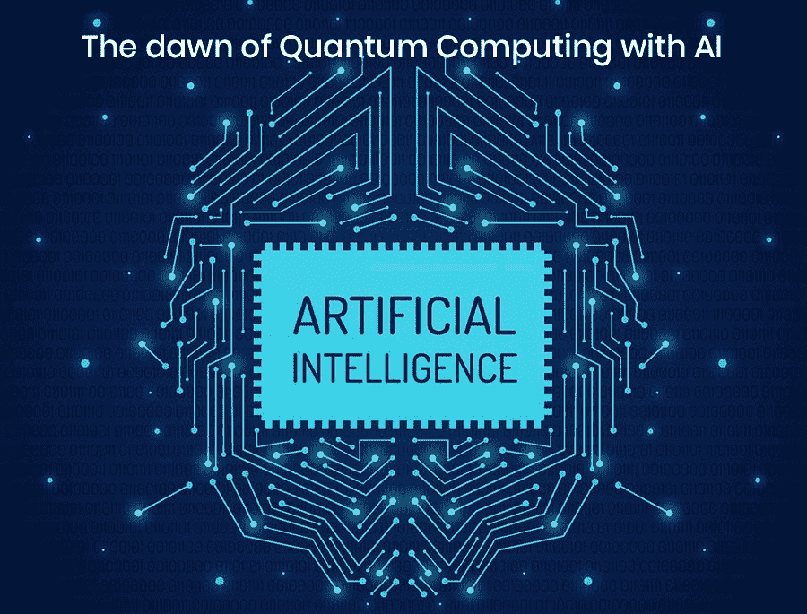
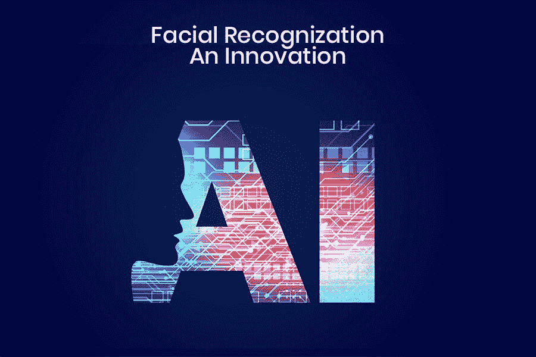

# 将在 2021 年占据主导地位的人工智能的主要趋势

> 原文：<https://medium.com/hackernoon/top-10-trends-in-artificial-intelligence-that-will-dominate-2019-48a07e0f5fe6>

每个人都在谈论“人工智能”的最新**趋势——新常态，这几乎是每个行业每个工作流程的一部分。在整个 2018 年，你已经观察到基于人工智能和机器学习技术的应用程序、工具和平台呈指数级上升。这些技术不仅给软件或互联网贸易留下了深刻印象，也给医疗保健、农业、制造业等其他领域留下了深刻印象。**

所以，你们大多数人可能会对**感到好奇，“人工智能在 2021 年的未来会是怎样的？”**然而，有些人可能会坚持人工智能的“独特性”。其他人仍然在想“人工智能只是建立而不是工作”。

> **思考所有无法回答的问题。**

随着新技术的出现，人工智能在 2018 年取得了重大突破。如果你不相信我，看看你周围，见证人工智能为你提供的微妙便利。Gmail 中的响应推广器，你中间桌子上的 Alexa，自动语音电话来安排你在“自我时间”的沙龙约会，以及你怎么能忘记路上的自动驾驶汽车。

除了上面提到的场景，还有很多其他行业利用应用人工智能的兴起。根据来自 [**Statista**](https://www.statista.com/statistics/607716/worldwide-artificial-intelligence-market-revenues/) 的最新报告，来自人工智能最新趋势的收入预计将在未来几年大幅增长。因此，清楚地表明“早期接受者正在增加他们的人工智能投资，发起更多的风险投资，并获得正回报”。

对人工智能新兴技术的投资进一步加速了这一增长，投资比例高达 21%，预计未来几年还会进一步增长。可以说，2021 年也会有一个上升的轨迹。

# **是时候看看 2021 年**人工智能的顶级趋势了 **:**

## **1。AI 中的约定**

人工智能伦理是技术伦理的重要组成部分。相反，这是一个广泛的话题，同时也是一些人的个人追求。

正如本大叔在《蜘蛛侠》中所说的“伴随着巨大的力量而来的是巨大的责任”，这个公理适用于最新的 [**人工智能应用**](https://www.xicom.biz/latest-thinking/artificial-intelligence/?utm_source=KC01) 。在人工智能取代人类的辩论和讨论中，需要回答的底线是

> **"** 自主和智能系统的开发方式是否包含个人和社会伦理价值观"？

2018 年见证了大量的演示、视频、白皮书，以及关于这个主题的其他内容。这个话题与日俱增，甚至在 2021 年。

你可能会想，为了确保基于人工智能的应用程序的道德设计，应该做些什么呢？

遵循 **IEEE 关于自主智能系统的全球伦理倡议**，必须制定政策和指南，牢记以下方面:

> ***透明:*** 这不仅是为了执行数据使用政策，也是为了验证对系统中灌输的规则的访问，除了审计跟踪之外。
> 
> *******管理框架:*** 不违背基本人权的指导方针、流程和程序。****
> 
> *******策略:*** 围绕此应用程序的影响和关联的策略应该放在适当的位置。****

## ******2。基于人工智能的芯片的出现******

********

****与其他软件不同，人工智能领域的最新发展依靠专门设计的处理器来补充 CPU。此外，最快和最新的 CPU 可能无法提高训练基于人工智能的模型的速度。在假设的同时，该模型需要额外的硬件来进行复杂的数学计算，以加速面部识别或物体检测等任务。****

****2021 年，英特尔、英伟达、AMD、高通、ARM 等芯片巨头将发布定制芯片，加快基于人工智能的应用程序的执行速度。这些芯片将专门针对与计算机视觉、自然语言处理和语音识别相关的特定情况和场景进行优化。****

****此外，他们将在医疗保健和汽车领域的下一代应用中巩固足迹。一些芯片将帮助下一代数据库加速查询处理和预测分析。****

## ******3。物联网、区块链和人工智能在边缘的融合******

****2021 年将见证区块链与人工智能、物联网与人工智能融合的例子。****

****事实上，没有物联网与人工智能的合作，自动驾驶汽车不是一个理性的想法。建立在汽车上用于收集实时数据的传感器由物联网启用和访问，而人工智能模型的最新创新使车辆用于决策的程序变得习惯。****

****为了更好地理解，深度学习人工智能算法会根据这些数据采取必要的行动并做出决策。有些包括路径规划、具有眼球跟踪功能的驾驶员监控、理解语音命令的自然语言处理，或者当燃料不足时，您可以假设开始对加油站进行自我直接控制。****

****这还不是全部；这些自动驾驶汽车的另一个新增功能是通信能力，因此交通整体上是流线型的。****

****等等！还有另一个巨大的整合——区块链和人工智能。大家都知道 [**区块链技术**](https://www.xicom.biz/latest-thinking/blockchain/?utm_source=KC01) 在安全性和可扩展性方面有一些异议，而 AI 则面临隐私和信任问题。但是，当两者结合起来解决这些问题时，区块链适应了分散的数据市场，人工智能变得更加可信和透明。****

## ******4。自动机器学习将是下一个高点:“强化学习”******

****强化学习是 [**人工智能**](https://www.xicom.biz/latest-thinking/artificial-intelligence/?utm_source=KC01) 领域最新发展的下一件大事。是的，它不同于监督和非监督方法。监督学习包括使用描述性数据集进行学习，并给出该特定数据集的通用输出(在给定特定位置的土地价值的情况下，找出特定地块的价格)。然而，无监督学习包括寻找未标记数据之间的关联或排列这些数据。(想象一组没有标签但有颜色、大小、阴影等参数的照片。并且，无论图像是花还是动物，程序都将产生输出)。****

****强化学习是一种与上述方法不同的方法。这是一种由行为主义心理学家启发的机器学习方法，类似于儿童如何学习执行任务。用技术语言来说，它是一个不使用数据识别技术的框架。相反，它使用经验驱动的决策。****

****在人工智能趋势的背景下，它是一种动态学习编程，根据奖惩系统准备算法。****

****强化学习的使用仍在考虑中，但行业正在探索其应用，并将在未来几年继续进行实验。****

## ****注意一些正在考虑的工业案例的使用:****

*   *******高等教育*** —强化学习的有用目的为**定制学习和教学体验。******
*   *******健康维护—*** 对慢性病如糖尿病、妄想和许多其他疾病的**治疗政策做出健康的决定。******

## ******5。人工智能量子计算的曙光******

********

****人工智能和量子计算机是两个非常迷人的前沿领域。每天似乎都是用最 [**先进的量子计算机**](https://ai.google/research/pubs?area=QuantumAI) 进行创新。因此，在你消除任何关于新人工智能技术将使量子计算在 2021 年变得更好的神话之前，在创造更好的量子计算设备的正确方向上有点进取心是有好处的。然而，这将是一个小的增量，但仍然是人工智能领域的一个巨大的焦点。****

****量子计算机只在量子物理上工作，计算速度比超级计算机快得多。你必须配备使用位和字节的计算机系统。与传统系统不同，量子计算机使用量子位来存储信息。****

****然而，在处理量子计算的异议方面，还有很长的路要走，这涉及到保持量子比特的相干性或驱逐有噪声和不需要的计算。****

****然而，最期待的解决方案将是解决几乎无法解决的问题，如追踪银河系中的其他行星，如地球，气候变化，或我们的身体有能力摧毁癌细胞。****

## ******6。社会经济模型******

****在参加任何人工智能活动时，每个人嘴里最突出的问题是“人工智能的未来趋势会夺走工作吗？”。一个提纲里的答案是“看情况”。****

****虽然人工智能正在接管资源稀缺的日常任务，但它也在瞬间提供具有独特技能的新工作。主要原因是存在扩大技能差距的风险，并有可能造成两极分化的社会。****

****如你所知，当前人工智能的趋势是吸引新的技能和工作；必须用创造价值来补充它。例如，自动化可能会消除对特定工作的需求，但同样会有对高接触性工作的追求。****

## ****7。神经网络的数字漂移****

****“人工智能中的神经网络”的一个自然假设是复制大脑的能力和功能，包括智能。它们以数字形式存储所有数据——文本、时间或感官数据，进一步用于信息分类。****

****对神经网络日益增长的需求不再是一个意外，它可以即兴预测股票市场，诊断特定的健康问题，甚至作曲。此外，它们还充当了“深度学习”中必不可少的垫脚石。神经网络创建了用于处理自然语言、语音识别的强大算法。它充当自动驾驶汽车的助手，检测癌症的痕迹，或欺诈检测。****

****毫无疑问，2021 年将被证明是增加深入研究的一年，这样你就可以利用最新人工智能应用的力量来实时改变解决方案。****

## ****8.面部识别:一项创新****

********

****脸是个体的独特身份。它在与社会中其他人的交流中起着重要的作用。考虑到这些事实，面部识别已经在现实世界中建立起来，并且正在展现人工智能未来趋势的好处。****

****面部识别被定义为使用数字图像或面部特征模式来帮助识别一个人的技术。2021 年将见证这种应用在精度和可靠性方面的转变。****

****你一定熟悉脸书的 [**Deepface**](https://research.fb.com/publications/beyond-frontal-faces-improving-person-recognition-using-multiple-cues/) 程序，它让在照片中标记你的朋友和家人变得更加容易。****

****然而，个性化一切的蓬勃发展——从更新你的衣柜到市场营销，这项技术正在巩固它对每一个生物识别的足迹。****

## ******9。有偏数据******

****随着机器学习模型被用于决策，如社会福利规范、抵押贷款、招聘等，人工智能主题中这种有偏见的数据趋势变得越来越势在必行。****

****为了更好地理解，考虑一个提升女性的决策的虚构案例。传统的就业数据显示，女性获得的晋升比男性少，因此产生了歧视性的人工智能应用程序。****

****因此，随着最新人工智能应用的使用增加，学习如何处理有偏见的数据将会逐渐增加。苦恼在于企业要考虑采取积极主动的步骤来接受非歧视性数据的原则。****

****防止这种方法的一些方法是对潜在风险的检查、来自多样化输入的主动包含，以及速度和性能之间的完美平衡。****

## ****10。隐私和政策****

****GDPR 的介绍是 2018 年的热门话题。此外，2021 年还经历了人工智能领域最新发展的隐私和政策对话问题。这是为了保护隐私并确保组织认真处理数据隐私问题。****

****你们中的许多人可能不知道你们的数字信息是如何被使用的。有时它会消失在印刷品中，有时甚至不知道它的用途。脸书最近的隐私危机只是冰山一角。****

****围绕人工智能的法律仍然是新的，也需要进一步了解。鉴于此，全球各国也在继续制定战略和计划，以指导人工智能法规的发展。****

*****人工智能的趋势正在塑造今天和明天。这种技术使现代社会受益匪浅，它让我们看到了一个更加美好的世界，这种美好的世界不仅仅是现在的景象，而是一幅改善了的、幸福的世界的重要而清晰的画面。*****

*****因此，如果你想为你的下一个人工智能项目聘请 [**最优秀的人工智能应用程序开发人员**](https://www.xicom.biz/latest-thinking/artificial-intelligence/?utm_source=KC01) ，你应该依靠外包高技能和合格专家的公司，他们了解你的梦想的价值，并预示着技术会变得更好。*****