# java 中的 100+数据结构和算法面试问题

> 原文：<https://medium.com/hackernoon/top-100-data-structure-and-algorithms-interview-questions-for-practice-d5071e92321e>


Photo by [Helloquence](https://unsplash.com/@helloquence?utm_source=medium&utm_medium=referral) on [Unsplash](https://unsplash.com?utm_source=medium&utm_medium=referral)

我一直在贴[数组、队列、堆栈、二叉树、LinkedList、String、Number、ArrayList 等各种主题的数据结构](https://java2blog.com/data-structures-java/)和算法面试问题。所以我整合了一系列程序来创建一个索引帖子。每当我添加新的程序时，我将继续添加链接到这个帖子。这些都是数据结构和算法面试常问的问题。

如果你想练习和提高数据结构和算法程序，这个帖子会对你很有帮助。推荐你先自己试一下，再查解决方案。

我知道这些问题可能不会在面试中直接被问到，而且可能很老了，但它们仍然有助于提高编码、算法和解决问题的技能。

# 堆

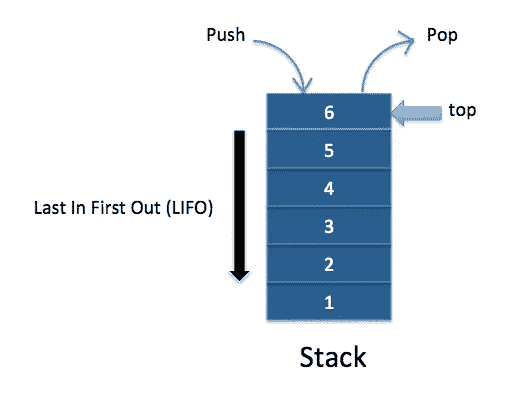

## **问题 1:使用数组实现堆栈**

编写 push 和 pop 方法来演示堆栈行为(后进先出)。

**解决方案:** [Java 程序使用数组实现堆栈。](http://www.java2blog.com/implement-stack-using-array-in-java.html)

## 问题 2:使用链表实现堆栈

编写 push 和 pop 方法来演示堆栈行为(后进先出)。

**解决方案:** [Java 程序使用链表实现堆栈](http://www.java2blog.com/implement-stack-using-linked-list-in-java.html)

## 问题 3:使用两个队列实现堆栈

您需要使用两个队列来实现堆栈行为。编写 push 和 pop 方法来演示堆栈行为(后进先出)。

**解决方案:** [Java 程序使用两个队列实现堆栈](http://www.java2blog.com/implement-stack-using-two-queues-in-java.html)

## 问题 4:使用另一个堆栈对一个堆栈进行排序

您需要使用另一个堆栈对一个堆栈进行排序。你可以使用栈的 push 和 pop 操作来实现。

**解决方法:** [使用另一个堆栈对一个堆栈进行排序。](http://www.java2blog.com/sort-stack-using-another-stack.html)

# 长队

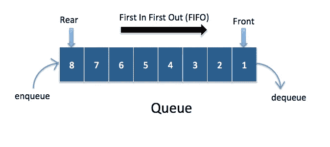

## 问题 5:在 java 中使用数组实现队列

你需要使用数组来实现队列。

**解决方案:** [在 java 中使用数组实现队列](https://java2blog.com/implement-queue-using-array-in-java/)

## 问题 6:使用两个队列实现堆栈

你需要使用链表来实现队列。

**解决方案:** [Java 程序使用链表实现队列](https://java2blog.com/implement-queue-using-linked-list-in-java/)

# 链表

## 问题 7:用 java 实现单链表


你需要实现单链表数据结构。写一个简单的程序来演示插入、删除操作。

**解决方案:** [Java 程序用 Java 实现单链表。](http://www.java2blog.com/implement-singly-linked-list-in-java.html)

**解决方案:** [Java 程序用 Java 实现单链表。](http://www.java2blog.com/implement-singly-linked-list-in-java.html)

## 问题 8:如何在 java 中反转链表？

你需要写一个迭代递归的解来反向链表。

**解决方案:** [Java 程序在 Java 中逆向链表。](http://www.java2blog.com/how-to-reverse-linked-list-in-java.html)

## 问题 9:如何找到链表的中间元素？

你需要写一个 [java](https://java2blog.com/core-java-tutorial-for-beginners-experienced/) 程序，以最优化的方式找到链表的中间元素。


**解决方法:** [Java 程序寻找链表中间元素](http://www.java2blog.com/find-middle-element-of-linkedlist-in.html)。

## 问题 10:如何从链表的末尾找到第 n 个元素？

你需要写一个 java 程序，以最优化的方式找到链表的第 n 个元素。
在问题 6 中，节点 7 是链表倒数第三个。
**解法:** [如何从链表的末尾找到第 n 个元素。](http://www.java2blog.com/find-nth-element-from-end-of-linked-list.html)

## 问题 11:如何检测链表中的循环？如果链表有循环，找到循环的开始节点。

你需要写一个 java 程序来检测链表中是否存在循环，如果存在循环，你需要找到链表的开始节点。
**解决方案:** [如何检测链表中的循环](http://www.java2blog.com/how-to-detect-loop-in-linkedlist-in.html)。
[如何在链表中找到循环的开始节点。](http://www.java2blog.com/find-start-node-of-loop-in-linkedlist.html)

## 问题 12:如何检查链表是否为回文？

回文是一个单词、短语、数字或其他符号或元素的序列，向前或向后读都一样。例如:12121 是回文，因为它向前或向后读都一样。madam 也是回文。所以我们需要编写 java 程序来检查链表是否是回文。
**解决方法:** [Java 程序检查链表是否回文。](http://www.java2blog.com/how-to-check-if-linked-list-is.html)

## 问题 13:寻找两个链表的交集？

给定两个[单链表](https://java2blog.com/implement-singly-linked-list-in-java/)，求两个链表是否相交。如果它们相交，找到交点。

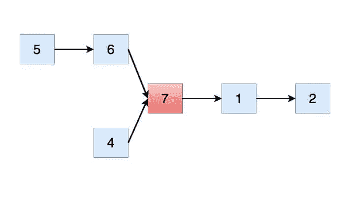

**求解:** [两个链表的交集](https://java2blog.com/intersection-two-linked-lists/)

## 问题 14:如何成对反转一个链表？

你需要写一个 java 程序来成对反转链表。

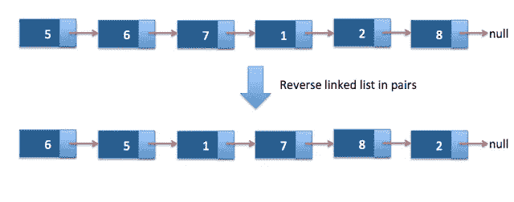

**解决方法:** [Java 程序成对反转链表。](http://www.java2blog.com/java-program-to-reverse-linked-list-in.html)

## 问题 15:用 java 实现双向链表？

你需要写一个 java 程序，用 java 实现双向链表。

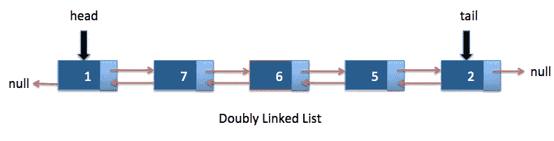

**解决方案:**[Java 中的双向链表](https://java2blog.com/doubly-linked-list-java/)

# 排列

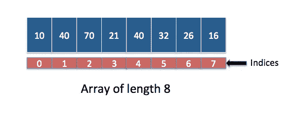

## 问题 16:编写 java 程序，找出数组中最小和最大的元素。

给定一个包含 1 到 n 的整数数组，但数组中 1 到 n 的数字中有一个缺失。您需要提供一个最佳解决方案来找到丢失的数字。数组中的数字不能重复。
例如:

```
int[] arr1={7,5,6,1,4,2};
Missing number: 3
int[] arr2={5,3,1,2};
Missing number: 4
```

**求解:** [Java 程序寻找数组中最小和最大的元素](https://java2blog.com/java-program-to-find-smallest-and-largest-number-in-array/)

## 问题 17:找出数组中缺失的数字。

给定一个包含 1 到 n 的整数数组，但数组中 1 到 n 的数字中有一个缺失。您需要提供一个最佳解决方案来找到丢失的数字。数组中的数字不能重复。
例如:

```
int[] arr1={7,5,6,1,4,2};
Missing number: 3
int[] arr2={5,3,1,2};
Missing number: 4
```

**求解:** [在数组中寻找缺失的数字。](http://www.java2blog.com/java-program-to-find-missing-number-in-array.html)

## 问题 18:在旋转排序后的数组中搜索元素。

给你一个排序和旋转的数组，如下所示:

```
int arr[]={16,19,21,25,3,5,8,10};
```

如果你注意到数组被排序和旋转。你需要在 o(log n)时间复杂度下搜索上述数组中的一个元素。
**解:** [在旋转排序后的数组中搜索元素](http://www.java2blog.com/search-element-in-sorted-and-rotated-array-java.html)

## 问题 19:在一个排序和旋转的数组中找到最小元素。

给你一个排序和旋转的数组，如下所示:

```
int arr[]={16,19,21,25,3,5,8,10};
Minimum element in the array: 3
```

如果你注意到数组被排序和旋转。你需要在 o(log n)的时间复杂度下在上述数组中加入一个元素。
**解法:** [在排序旋转后的数组中寻找最小元素](https://java2blog.com/find-minimum-element-in-sorted-and-rotated-array-java/)

## 问题 20:找出数组中第二大的数字

给你一个排序和旋转的数组，如下所示:

**例如:**

```
int[] arr1={7,5,6,1,4,2};
Second largest element in the array: 6
```

**解法:** [java 程序寻找数组中第二大的数](http://www.java2blog.com/find-second-largest-number-in-array-java.html)。

## 问题 21:找出在数组中出现奇数次的数字

给你一个整数数组。除了一个以外，所有的数字都出现偶数次。你需要找到出现次数为奇数的数字。你需要以 o(n)的时间复杂度和 o(1)的空间复杂度来求解。
例如:

```
int array[] = new int[]{20, 40, 50, 40, 50, 20, 30, 30, 50, 20, 40, 40, 20};
Number which occurs odd number of times is: 50
```

**解决方法:** [java 程序寻找数组中出现奇数次的数字](http://www.java2blog.com/find-number-occurring-odd-number-of-times-in-array.html)。

## 问题 22:找出火车站所需的最少站台数量

你被告知到达某一特定车站的火车的到达和离开时间。你需要找到在任何时间点容纳列车所需的最少站台数。

**比如:**

```
arrival[] = {1:00, 1:40, 1:50, 2:00, 2:15, 4:00} 
departure[] = {1:10, 3:00, 2:20, 2:30, 3:15, 6:00}
No. of platforms required in above scenario = 4
```

请注意到达时间是按时间顺序排列的。

**解法:** [求火车站所需最少站台数](http://www.java2blog.com/minimum-number-of-platforms-required-for-railway-station.html)。

## 问题 23:找出数组中和最接近零的一对

给定一个+ve 和-ve 整数的数组，我们需要在数组中找到一个和接近于零的对。

**例如:**

```
array[]={1,3,-5,7,8,20,-40,6};
The pair whose sum is closest to zero:  -5 and 6
```

**解法:** [在 java](http://www.java2blog.com/find-pair-whose-sum-is-closest-to-zero-in-array.html) 中寻找数组中和最接近零的一对。

## 问题 24:给定一个排序数组和一个数字 x，找出数组中和最接近 x 的一对

给定一个排序数组，我们需要找到一个和接近数组中数字 X 的对。

**例如:**

```
array[]={-40,-5,1,3,6,7,8,20};
The pair whose sum is closest to 5:  1 and 3
```

**解法:** [在 java](http://www.java2blog.com/given-sorted-array-number-x-find-pair-closest-to-x-array.html) 中找到数组中和最接近 X 的一对。

## 问题 25:从一个数组中找出所有和等于给定数字的元素对

给定一个数组，我们需要找到所有和等于数 x 的对。

**例如:**

```
array[]={ -40, -5, 1, 3, 6, 7, 8, 20 };
Pair of elements whose sum is equal to 15:  7, 8 and -5, 20
```

**求解:** [从一个数组中找出所有元素对，其和等于给定的数字](http://www.java2blog.com/find-all-pairs-elements-from-array-sum-equals-given-number-java.html)。

## 问题 26:给定一个随机排列的 0 和 1 的数组，你需要在数组中分开 0 和 1。

**例如:**

```
arr[] = {0,1,0,0,1,1,1,0,1}
Array after separating 0 and 1 numbers:
{0,0,0,0,1,1,1,1,1}
```

**解决方法:** [将数组中的 0 和 1 分开](https://java2blog.com/separate-0s-and-1s-in-array/)。

## 问题 27:在一个数组中分开奇数和偶数

给定一个整数数组，你需要在数组中分离奇数和偶数。
请注意:元素的顺序可以改变。

**例如:**

```
arr[] = {12, 17, 70, 15, 22, 65, 21, 90}
Array after separating odd and even numbers:
{12, 90, 70, 22, 15, 65, 21, 17}
```

**解法:** [将数组中的 0 和 1 分开](https://java2blog.com/separate-odd-and-even-numbers-in-array/)。

## 问题 28:给定一个只包含 0、1 和 2 的数组。写一个函数以 O(n)的时间复杂度对给定的数组进行排序。

**例如:**

```
Input:
[1, 2, 2, 0, 0, 1, 2, 2, 1]

Output:
[0, 0, 1, 1, 1, 2, 2, 2, 2]
```

**解法:** [对一个 0、1、2 的数组进行排序](https://java2blog.com/sort-array-of-0s-1s-and-2s/)。

## 问题 29:寻找数组中的局部最小值

局部极小值小于它的邻居

**例如:**

```
Input:int [] arr = {10, 5, 3, 6, 13, 16, 7};
Output: 2

int []arr = {11,12,13,14};
Output: 11

int []arr = {10};
Output: 10

int []arr = {8,6};
Output: 6
```

## 问题 30:Java 中的滑动窗口最大化

给定一个整数数组和一个整数 k，从所有相邻的 k 大小的子数组中找出的最大元素。

**例如:**

```
Input:
Input: int[] arr = {2,6,-1,2,4,1,-6,5}
int k = 3
output: 6,6,4,4,4,5
```

**解法:** [寻找数组](https://java2blog.com/sliding-window-maximum-java/)中的局部极小值。

## 问题 31:计算排序数组中每个元素出现的次数(或频率)

给定一个包含重复项的整数排序数组。找出数组中每个唯一元素的频率。
频率被定义为数组中任何元素出现的次数。

**例如:**

```
Input:
Input:
int[] arr = {1, 1, 1, 3, 3, 4, 5, 5, 6, 6};
Output:
Frequency of 1 is: 3
Frequency of 3 is: 2
Frequency of 4 is: 1
Frequency of 5 is: 2
Frequency of 6 is: 2
```

**解:** [统计一个排序数组中每个元素出现的次数(或频率)](https://java2blog.com/count-occurences-frequency-each-element-sorted-array/)。

## 问题 32:在一个数组中找到给定和的子数组。

给定非负整数数组和一个数字。您需要打印子数组的所有起始和结束索引，它们的总和等于给定的整数。
**例如:**

```
Input:
Input-int[] arr = {2, 3, 6, 4, 9, 0, 11};
int num = 9
Output-
starting index: 1, Ending index: 2
starting index: 5, Ending index: 5
starting index: 5, Ending index: 6
```

**解法:** [在一个数组中寻找给定和的子数组](https://java2blog.com/find-subarrays-given-sum-array/)。

## 问题 33:在数组中寻找峰值元素。

Peak 元素是数组中大于/等于其相邻元素的元素，也就是说，对于索引中 I 处的元素，索引 i-1 & i+1 处的相邻元素必须大于等于第 I 个位置的元素。

**求解:** [在数组](https://java2blog.com/find-subarrays-given-sum-array/)中寻找峰值元素。

## 问题 34:寻找数组中的领导者。

我们需要打印数组中所有的领导者。如果元素大于元素的右侧，则该元素是前导元素。

```
arr[]={14, 12, 70, 15, 99, 65, 21, 90}
Here 99 and 90 are leader elements
```

**例如:**

**解法:** [寻找一个数组中的领袖](https://java2blog.com/find-leaders-in-array/)。

## 问题 35:在排序的二进制数组中计数 1。

打印给定排序二进制数组中 1 的个数。
**例如:**

```
Input:
int[] arr = {0,0,0,1,1,1,1};
output: 4
int[] arr = {0,0,1};
output: 1
```

**解法:** [对排序后的二进制数组中的 1 计数](https://java2blog.com/count-1s-sorted-binary-array/)。

## 问题 36:寻找整数数组中的第一个重复元素。

查找整数数组中的第一个重复元素。
**例如:**

```
Input:
Input: array[] = {10, 7, 8, 1, 8, 7, 6}
Output: 7 [7 is the first element actually repeats]
```

**求解:** [在整数数组中找到第一个重复元素](https://java2blog.com/find-first-repeating-element-array-integers/)。

## 问题 37:检查数组元素是否连续。

给定一个数组，我们需要检查数组是否包含连续的元素。
**例如:**

```
Input: array[] = {5, 3, 4, 1, 2}
Output: true
As array contains consecutive elements from 1 to 5Input: array[] = {47, 43, 45, 44, 46}
Output: true
As array contains consecutive elements from 43 to 47Input: array[] = {6, 7, 5, 6}
Output: false
As array does not contain consecutive elements.
```

**解决方法:** [检查数组元素是否连续](https://java2blog.com/check-array-elements-consecutive/)。

## 问题 38:Java 中数组的排列。

给定不同整数的数组，打印该数组的所有排列。
**例如:**

```
array: [10, 20, 30]Permuations are:[10, 20, 30]
[10, 30, 20]
[20, 10, 30]
[20, 30, 10]
[30, 10, 20]
[30, 20, 10]
```

**解法:**[Java 中数组的排列](https://java2blog.com/permutations-array-java/)。

## 问题 39:将数组旋转 K 个位置。

**比如:**

```
N=6 and k=2
If Arr[] = {1, 2, 3, 4, 5, 6} and k=2
then rotated array will be  {5, 6, 1, 2,  3,  4}
```

**解法:** [将一个数组旋转 K 个位置](https://java2blog.com/rotate-array-by-k-positions/)。

## 问题 40:股票买卖使利润最大化。

给定一个表示单日股票价格的整数数组，找出一次交易可以获得的最大利润。
所以你需要找到一对(buyDay，sellDay)，其中 buyDay < = sellDay，它应该使利润最大化。
**例如:**

```
int arr[]={14, 12, 70, 15, 99, 65, 21, 90};
Max profit can be gain by buying at 1th day(0 based indexing) and sell at 4th day.
Max profit = 99-12 =87
```

**解法:** [股票买入卖出利润最大化](https://java2blog.com/stock-buy-sell-to-maximize-profit/)。

## 问题 41:找出两个元素之间的最大差异，使得较大的元素出现在较小的数字之后。

给定整数数组，找出两个元素之间的最大差值，使得较大的元素出现在较小的数字之后
**例如:**

```
int arr[]={14, 12, 70, 15, 95, 65, 22, 30};
Max Difference =95-12 = 83
```

**解法:** [两个元素之间的最大差值，使得较大的元素出现在较小的数字之后](https://java2blog.com/maximum-difference-between-two-elements-in-array/)。

## 问题 42:在行和列排序的矩阵中搜索。

给定按行和按列排序的矩阵，我们需要以最小的时间复杂度搜索元素。

**解决方案:** [在行和列排序的矩阵中搜索](https://java2blog.com/search-in-row-wise-and-column-wise-sorted-matrix/)。

## 问题 43:相邻子阵列的最大和。

最大和连续子阵列的任务是在一维数字阵列中找到具有最大和的连续子阵列。
**例如:**

```
for the sequence of values −2, 1, −3, 4, −1, 2, 1, −5, 4; the contiguous subarray with the largest sum is 4, −1, 2, 1, with sum 6
```

**解:** [最大和连续子阵列](https://java2blog.com/largest-sum-contiguous-subarray/)。

## 问题 44:在一个数组中找出和为给定值的连续子数组。

给定一个正整数数组和给定值 X，求其和等于 X 的连续子数组
**例如:**

```
arr[]={14, 12, 70, 15, 99, 65, 21, 90}; 
X =97.
Sum found between index 1 to 3
Elements are 12, 17 and 15
```

**解法:** [在一个数组](https://java2blog.com/find-contiguous-subarray-with-sum-to-given-value-array/)中找到和为给定值的连续子数组。

## 问题 45:Java 字符串数组中最长的公共前缀。

给定一个正整数数组，给定值 X，求其和等于 X 的连续子数组
**例如:**

```
String[] strArr={"java2blog","javaworld","javabean","javatemp"};
So Longest common prefix in above String array will be “java” as all above string starts with “java”.
```

**解决方案:**Java 中字符串数组中最长的常用前缀。

## 问题 46:在 java 中求集合(幂集)的所有子集。

给定一组不同的整数，arr，返回所有可能的子集(幂集)。
**例如:**

```
Input: nums = [1,2,3]
Output:
[
[3],
[1],
[2],
[1,2,3],
[1,3],
[2,3],
[1,2],
[]
]
```

**解法:** [在 java 中找到集合的所有子集](https://java2blog.com/longest-common-prefix-in-array-of-strings-java/)。

# 线

## 问题 47:如何在 java 中反转一个字符串？你能不使用任何 java 内置方法写一个程序吗？

**解决方案:**有很多方法可以做到，其中一些是:

*   使用 for 循环
*   使用递归
*   使用字符串缓冲区

请参考[Java 中的解决方案](http://www.java2blog.com/java-program-to-reverse-string.html)

## 问题 48:写一个 java 程序，检查两个字符串是不是 java 里的变位词？

**解法:**两个字符串如果有相同的字符，但顺序不同，则为变位词。例如:Angel 和 Angle 是变位词
有几种方法可以检查字符串是否是变位词。其中一些是:

1.  使用字符串方法
2.  使用数组排序

在[检查解决方案检查两个字符串是否是 java 中的变位词。](http://www.java2blog.com/check-if-two-strings-are-anagrams-in-java-example-program.html)

## 问题 49:写一个程序检查 String 在 java 中是否全部是唯一字符？

**解决方案:**以下是一些检查字符串是否包含所有唯一字符的方法

*   通过使用 HashSet
*   使用 String 的 indexOf 和 lastIndexOf 方法
*   通过使用字符的 ascii 值。

请参考[处的完整解决方案，检查字符串是否包含所有唯一字符](http://www.java2blog.com/check-if-string-has-all-unique-characters-in-java.html)。

## 问题 50:如何在 java 中检查一个字符串是否是另一个字符串的旋转？

**解:假设**你想检查 str1 和 str2 是否是彼此的旋转。

1.  用 str3= str1 + str1 创建一个新字符串
2.  检查 str3 [是否包含](http://www.java2blog.com/2016/05/java-string-contains-example.html) str2。
3.  如果 str3 [包含](http://www.java2blog.com/2016/05/java-string-contains-example.html) str2，那么 str2 是 str1 的旋转，否则不是

你可以在[找到完整的解决方案，在 java](http://www.java2blog.com/check-if-one-string-is-rotation-of-another-java.html) 中检查一个字符串是否是另一个字符串的旋转。

## 问题 51:如何在 java 中查找字符串中的重复字符？

**解决方法:**下面是一个在字符串中查找重复字符的解决方法。

1.  创建一个[散列表](http://www.java2blog.com/hashmap-in-java-with-examples.html)，字符串的字符将作为键被插入，其计数作为值被插入。
2.  如果[HashMap](http://www.java2blog.com/hashmap-in-java-with-examples.html)已经包含 char，则将其计数加 1，否则将 char 放入 HashMap。
3.  如果 Char 值大于 1，这意味着它是字符串中的重复字符。

请参考[程序的解决方案，查找字符串](http://www.java2blog.com/2016/05/find-duplicate-characters-in-string-java.html)中的重复字符。

## 问题 52:在 java 中找到字符串中第一个不重复的字符？

**解决方法:**有很多方法可以找到。
其中一些是:

*   使用 [LinkedHashMap](https://java2blog.com/linkedhashmap-in-java-with-example/)
*   使用 indexOf 和 lastIndexOf 方法。

请在[找到完整的解决方案，在字符串中找到第一个不重复的字符](http://www.java2blog.com/find-first-non-repeated-character-in.html)。

## 问题 53:在 java 中查找 String 的所有子串？

**解决方案:** Java 程序查找一个字符串的所有[子字符串](https://java2blog.com/find-all-substrings-of-string-in-java/)。
例如:如果输入是“abb”，那么输出应该是“a”、“b”、“b”、“ab”、“bb”、“abb”

我们将使用 String 类的 subString 方法来查找所有子串。
请参考[中的完整解决方案，查找字符串的所有子字符串。](http://www.java2blog.com/2015/08/find-all-substrings-of-string-in-java.html)

## 问题 54:在不使用 java 内置方法的情况下找到字符串的长度？

**解决方案:**您可以使用 try catch 块来捕获 StringIndexOutOfBoundException，当这个异常变化时，您可以简单地返回 I(您将获得异常的索引)
请参考[查找字符串长度而不使用内置方法](http://www.java2blog.com/find-length-of-string-without-using.html)中的完整解决方案。

## 问题 55:用 java 写一个程序打印字符串的所有排列？

**解决方法:**取出字符串的第一个字符，递归插入到剩余字符串排列的不同位置。请在[中找到完整的解决方案:如何在 java](http://www.java2blog.com/find-all-permutations-of-string-in-java.html) 中找到字符串的所有排列。

# 二叉树

## 问题 56:如何遍历二叉树？

有三种方法可以遍历二叉树。

*   [预购](http://www.java2blog.com/binary-tree-preorder-traversal-in-java.html)
*   [为了](http://www.java2blog.com/binary-tree-inorder-traversal-in-java.html)
*   [后序](http://www.java2blog.com/binary-tree-postorder-traversal-in-java.html)。

## 问题 57:写一个算法做二叉树的层次顺序遍历？

你需要写 java 程序来做二叉树的层次顺序遍历。您可以使用队列数据结构来进行层次顺序遍历。

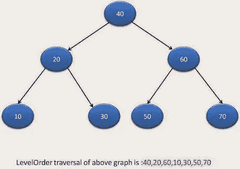

**解法:** [二叉树的层次顺序遍历。](http://www.java2blog.com/binary-tree-level-order-traversal-in.html)

## 问题 58:写一个算法做二叉树的螺旋顺序遍历？

你需要写 java 程序来做二叉树的螺旋层次顺序遍历

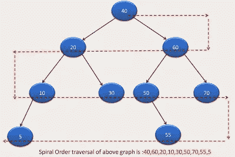

**解法:** [二叉树的螺旋顺序或之字形遍历。](http://www.java2blog.com/spiralzigzag-level-order-traversal-of.html)

## 问题 59:如何打印二叉树的叶节点？

你需要编写 java 程序来打印二叉树的所有叶节点。

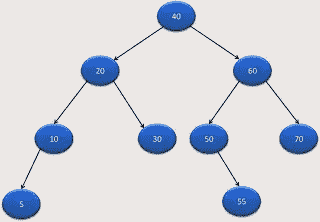

以上二叉树的叶节点将为 5、30、55、70
**解:** [打印二叉树的叶节点。](http://www.java2blog.com/how-to-print-leaf-nodes-of-binary-tree.html)

## 问题 60:如何统计二叉树的叶节点？

你需要写 java 程序来计算二叉树的叶子节点。
问题 15 中使用的二叉树的叶节点数为 **5** 。
**解法:** [统计二叉树的叶节点。](http://www.java2blog.com/program-to-count-leaf-nodes-in-binary.html)

## 问题 61:如何打印二叉树中从根到叶的所有路径？

你需要写一个程序来打印从根到叶的所有路径。

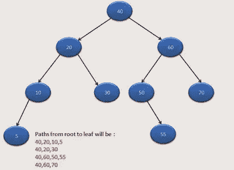

**解法:** [打印二叉树中从根到叶的所有路径。](http://www.java2blog.com/print-all-paths-from-root-to-leaf-in.html)

## 问题 62:如何找到二叉树中节点的层次

给定一个节点，你需要找到节点的级别。例如:对于问题 14 中使用的节点 70，节点的级别将为 3。
**解** : [查找二叉树中节点的级别。](http://www.java2blog.com/get-level-of-node-in-binary-tree-in-java.html)

## 问题 63:如何在二叉树中找到最大元素？

你需要写一个 java 程序来寻找二叉树中的最大元素。
**解法:** [在二叉树中寻找最大元素。](https://java2blog.com/find-maximum-element-binary-tree-java/)

## 问题 64:如何在二叉树中找到最低共同祖先(LCA)。

你需要写一个程序在二叉树中寻找 LCA。

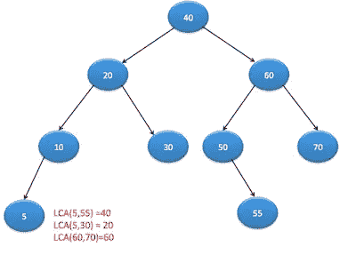

**解法** : [程序在二叉树中寻找 LCA。](http://www.java2blog.com/lowest-common-ancestor-of-binary-tree.html)

## 问题 65:如何做二叉树的边界遍历？

编写一个 java 程序来遍历二叉树的边界，如下图所示。

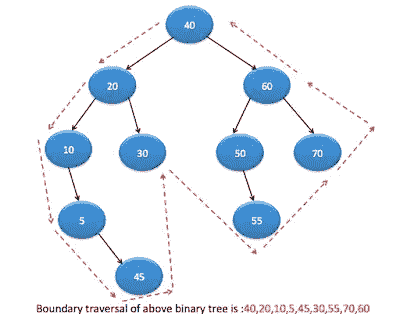

解决方法:[二叉树的边界遍历。](http://www.java2blog.com/boundary-traversal-of-binary-tree-in.html)

## 问题 66:如何打印二叉树的垂直和？

你需要找到位于同一列的节点的总和。

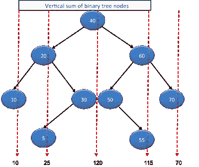

解决方法:[如何打印二叉树的垂直和](http://www.java2blog.com/vertical-sum-of-binary-tree-in-java.html)。

## 问题 67:在二叉树中计数和等于目标的子树？

给定一棵[二叉树](https://java2blog.com/binary-tree-in-java/)和一个整数。您需要找到所有节点的总和等于给定整数的子树的数量，即目标总和。

解决方法:[在二叉树](http://www.java2blog.com/vertical-sum-of-binary-tree-in-java.html)中统计和等于目标的子树。

# 二叉查找树

## 问题 68:什么是二叉查找树？

二叉查找树是一种特殊类型的[二叉树](http://www.java2blog.com/binary-tree-in-java.html)，它具有以下性质。

*   比根更小的节点将在左边的子树中。
*   大于根的节点将是右子树。
*   它不应有重复的节点
*   左右子树都应该是二叉查找树。

## 问题 69:你能写出在二叉查找树插入一个节点的算法吗？

**解决方案:** [在二叉查找树插入节点](https://java2blog.com/binary-search-tree-in-java/)

## 问题 70:你能写算法删除二叉查找树的一个节点吗？

**解决方案:** [删除二叉查找树节点](https://java2blog.com/how-to-delete-node-from-binary-search-tree-java/)

## 问题 71:你如何找到二叉查找树的最小值和最大值？

**解:**二叉查找树最左边和最右边的节点分别是最小和最大节点

[二叉查找树中的最小和最大元素](https://java2blog.com/find-minimum-and-maximum-elements-binary-search-tree-java/)。

## 问题 72:如何在二叉查找树找到最低的共同祖先？

你需要写一个程序在二叉查找树找到 LCA。


**解决方案** : [在二叉查找树中寻找 LCA 的程序。](http://www.java2blog.com/lowest-common-ancestor-of-binary-search.html)

## 问题 73:在二分搜索法树中寻找有序的后继者

你需要写一个程序在二叉查找树中寻找有序的继承者。

**解决方案** : [为了二叉查找树的继承人](https://java2blog.com/inorder-successor-binary-search-tree/)

## 问题 74:将排序数组转换为平衡 BST

**解决方案** : [将排序后的数组转换为平衡 BST](https://java2blog.com/convert-sorted-array-to-balanced-binary-search-tree/)

## 问题 75:将排序链表转换为平衡 BST

**解决方案** : [将排序链表转换为平衡 BST](https://java2blog.com/convert-sorted-linkedlist-to-balanced-bst/)

## 问题 76:在 java 中检查一棵二叉树是否是二叉查找树

**解法** : [在 java 中检查一棵二叉树是否是二叉查找树](https://java2blog.com/check-if-binary-tree-is-binary-search-tree-java/)

# 整理

## 问题 77:写一个算法实现冒泡排序？

**解决方案:**[Java 中的冒泡排序](https://java2blog.com/implement-bubble-sort-in-java/)

## 问题 78:写一个算法实现插入排序 sort？

**解决方案:** [在 java 中插入排序](https://java2blog.com/implement-insertion-sort-in-java/)

## 问题 79:写一个算法实现选择排序 sort？

**解决方案:** [在 java 中选择排序](https://java2blog.com/selection-sort-in-java/)

## 问题 80:你能写出合并排序的算法吗？你知道合并排序的复杂性吗？

**解决方案:** [在 java 中合并排序](https://java2blog.com/implement-merge-sort-in-java/)

## 问题 81:你知道如何实现堆排序吗？

**解决方案:** [在 java 中实现堆排序](https://java2blog.com/heap-sort-in-java/)

## 问题 82:用 java 实现快速排序？

**解决方案:** [用 java 实现快速排序](https://java2blog.com/quick-sort-in-java/)

## 问题 83:用 java 实现 shell 排序？

**解决方案:** [在 java 中实现 Shell 排序](https://java2blog.com/shell-sort-in-java/)

## 问题 84:用 java 实现计数排序？

**解决方案:**在 java 中实现计数排序

## 问题 85:什么是二分搜索法？你能写一个算法在排序数组中使用二分搜索法找到一个元素吗？

**解决方案:**[Java 中的二进制搜索算法](https://java2blog.com/binary-search-java/)

# 图表

## 问题 86:写一个算法在图中做深度优先搜索。

**解决方案:** [深度优先在 java 中搜索](http://www.java2blog.com/depth-first-search-in-java.html)

## 问题 87:编写算法在图中进行广度优先搜索。

解决方案:[Java 中的广度优先搜索](http://www.java2blog.com/breadth-first-search-in-java.html)

## 问题 88:解释从源到所有其他顶点的 Dijkstra 算法。

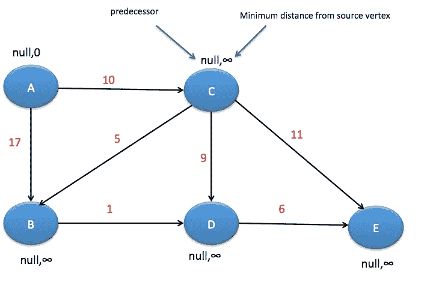

解答: [Dijkstra 在 java 中的算法](https://java2blog.com/dijkstra-java/)

## 问题 89:解释贝尔曼·福特算法找出最短距离

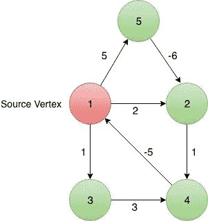

解答:[Java 中的贝尔曼福特算法](https://java2blog.com/bellman-ford-algorithm-java/)

## 问题 90:解释克鲁斯卡尔寻找最小生成树的算法

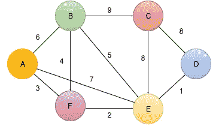

解:[克鲁斯卡尔算法](https://java2blog.com/kruskals-algorithm-minimum-spanning-tree/)

# 动态规划

## 问题 91:给定两个字符串，找出最长公共子字符串。

解决方法:[Java 中最长的公共子串](https://java2blog.com/longest-common-substring-java/)。

## 问题 92:给定两个字符串 A 和 b。找出给定字符串的最长公共子序列(LCS)的长度。

## 解决方案:java 中的[最长公共子序列](https://java2blog.com/longest-common-subsequence-java/)

## 问题 93:给定一个矩阵，我们需要计算 MxN 矩阵从左上到右下的所有路径。你可以向下或向右移动。

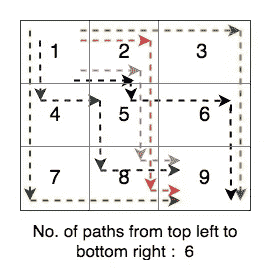

解答:[统计矩阵中的所有路径](https://java2blog.com/count-paths-top-left-bottom-right-mxn-matrix/)

## 问题 94:在 java 中编辑距离问题

给定两个字符串 string1 和 string2，String1 将被转换为 String2，给定的操作在最少的步骤中可用。使用任何一个给定的操作都有助于将步长增加 1。

允许的操作有:
(I)**删除:该操作允许从字符串中删除任意一个字符。
(ii) **插入**:该操作允许在字符串的任意位置插入一个字符。
(iii) **替换**:该操作允许用
任何其他字符替换字符串中的任何一个字符。**

**解决方法:[Java 中的编辑距离问题](https://java2blog.com/edit-distance-problem/)。**

## **问题 95:Java 中的硬币兑换问题**

**给定要支付的金额和支付货币。每种货币的组合都有无限的供给，要支付给定的金额。打印付款方式的数量。**

**解决方案:[Java 中的硬币找零问题](https://java2blog.com/coin-change-problem-java/)**

## **问题 96:到达最后一个索引的最小跳跃次数**

**解决方案:[到达最后一个步进](https://java2blog.com/minimum-number-jumps-reach-last-index/)的最小跳跃次数。**

# **多方面的**

## **问题 97:什么是算法，如何计算算法的复杂度？**

**解答:[如何计算算法的复杂度](http://www.java2blog.com/introduction-to-complexity-of-algorithm.html)**

## **问题 98:用 java 实现 trie 数据结构。**

**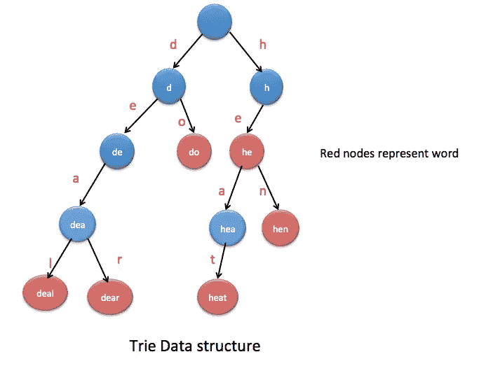**

**解决方案:[用 java 实现 trie 数据结构。](https://java2blog.com/trie-data-structure-in-java/)**

## **问题 99:在 java 中计算阶乘尾随零。**

**解决方案:[在 java 中计算阶乘尾随零](https://java2blog.com/count-factorial-trailing-zeroes-java/)**

## **问题 100:直方图中最大的矩形区域。**

**解答:[计算直方图中最大的矩形区域](https://java2blog.com/largest-rectangular-area-histogram/)**

## **问题 101:检查 java 表达式中的平衡括号。**

**解决方案:[在 java 中检查表达式中的平衡括号。](https://java2blog.com/check-for-balanced-parentheses-in-expression-java/)**

## **问题 102:什么是记忆化。**

**解决方案:
内存化通过将结果存储在数据结构(通常是 Hashtable 或 HashMap 或 Array)中，确保方法不会对相同的输入执行超过一次。
[Java 中的记忆示例](https://java2blog.com/memoization-example-java/)**

**这都是关于数据结构和算法面试题的问题。如果你想在上面的列表中添加任何新的问题，请评论。**

**原载于 Java2blog，标题为[Java 中的数据结构与算法面试问题](https://java2blog.com/data-structure-and-algorithm-interview-questions-in-java/)。**

**您可能还喜欢:**

*   **[核心 java 面试问题](http://www.java2blog.com/core-java-interview-questions-and-answers.html)**
*   **[Java 集合面试问题](http://www.java2blog.com/java-collections-interview-questions.html)**
*   **[Java 字符串面试问题](http://www.java2blog.com/java-string-interview-questions-and-answers.html)**
*   **[Java 中的哎呀面试问题](http://www.java2blog.com/oops-interview-questions-answers-java.html)**
*   **[Java 多线程面试问题](http://www.java2blog.com/java-multithreading-interview-questions-and-answers.html)**
*   **[Java 中异常处理面试问题](http://www.java2blog.com/java-exception-handling-interview-questions-and-answers.html)**
*   **[Java 序列化面试 Java 中的问题](http://www.java2blog.com/java-serialization-interview-questions-and-answers.html)**
*   **[web 服务面试问题](http://www.java2blog.com/web-services-interview-questions.html)**
*   **[restful web 服务面试问题](http://www.java2blog.com/restful-web-services-interview-questions.html)**
*   **[春季面试问题](http://www.java2blog.com/spring-interview-questions-and-answers.html)**
*   **[冬眠面试问题](http://www.java2blog.com/hibernate-interview-questions-and-answers.html)**