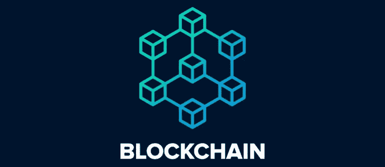
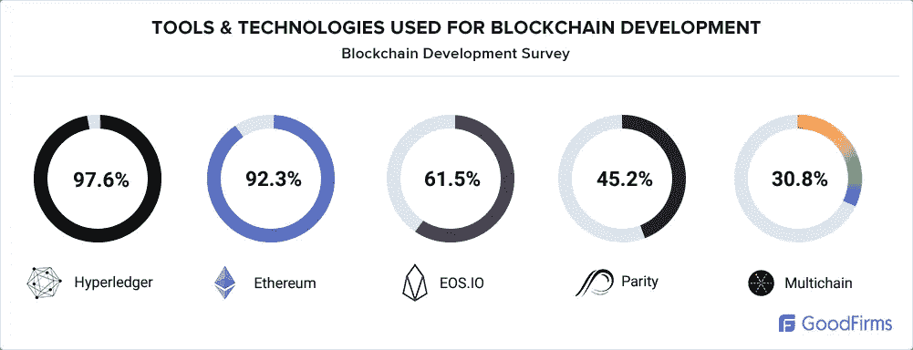
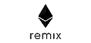
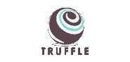
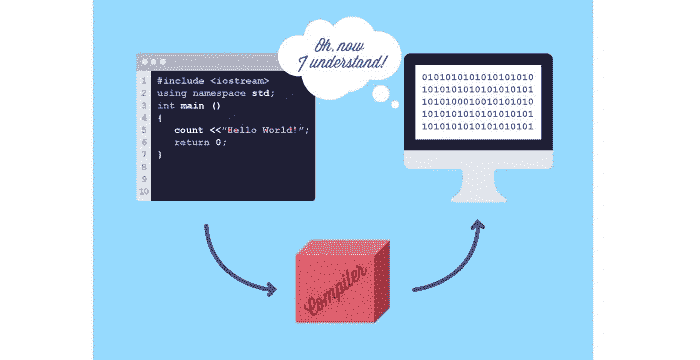
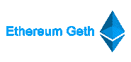
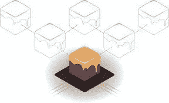
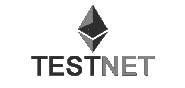

# 构建区块链生态系统的 12 大区块链开发工具

> 原文：<https://medium.com/hackernoon/top-12-blockchain-development-tools-to-build-blockchain-ecosystem-371a1b587248>

区块链因支撑以太坊和比特币等加密货币而闻名，但它有可能改变各种行业，包括医疗保健、物流和供应链、保险、金融等。三星和 IBM 等知名公司也在采用区块链技术，为企业和初创公司提供创新的解决方案和方式。

Source: GoodFirms

Upwork 准备的一份报告称，区块链似乎是该平台上增长最快的技能，落后于机器学习和张量流等技能。这导致对区块链开发商的需求越来越大。

已经引入了各种区块链开发工具来简化区块链应用程序的开发过程。如果您有兴趣了解更多关于区块链的信息或开始一个区块链项目，您应该了解区块链开发人员使用的区块链开发工具。

# 以下是一些广泛使用的区块链开发工具:

# **1。混音 IDE**

Source LeewayHertz

以太坊平台使用许多工具在区块链上创建和部署智能合约。Remix 是用于创建和部署智能合约的最简单的基于浏览器的工具之一。它可以使用一种叫做 Solidity 的编程语言来编写、调试、测试和部署智能合同。

# **2。块菌框架**

Truffle 是以太坊的一个框架，为构建基于以太坊的应用程序提供了一个开发环境。它包括对库的支持，该库为编码新契约和链接以太坊应用程序提供定制部署。它提供了使用 Chai 和 Mocha 执行自动化契约测试的能力。

# **3。Solc**

Source: karl.tech

Solidity 是一种松散类型的编程语言，其语法类似于用于在以太坊平台上创建智能合约的 ECMA 脚本(JavaScript)。然而，你需要一些东西将 Solidity 脚本转换成 EVM(以太坊虚拟机)可读的格式。Solc (Solidity 编译器)就是为此服务的。

Solidity 编译器可以分为两类，用 C++编写的 solc 和 solc-js，solc-js 使用 Emscripten 进行从 solc C++代码到 JS 的交叉编译。

# **4。Solium**

在开发区块链应用程序时，安全性扮演着至关重要的角色。确保可靠性代码没有安全漏洞是至关重要的。Solium tool 旨在格式化 solidity 代码并解决代码中的安全问题。它确保代码被格式化并检查漏洞。通过将 Solium 与 npm 一起安装来使用它。

# **5。Geth**

Source: LeewayHertz

Geth 是一个以太坊客户端，用于运行 Go 编程语言中的以太坊节点。Geth 基本上是一个程序，它作为以太坊平台的一个节点工作，可用于挖掘以太令牌、创建智能合约、转移令牌和探索块历史。

# **6。登船**

Embark 是一个基于以太坊的 dApps 开发框架。它允许开发者开发和部署基于分散技术的 dApps。它使您能够创建可以用 javascript 代码实现的智能契约。

如果应用程序有多个合同，它还可以管理智能合同迁移。通过用 JS 支持智能合约的测试驱动开发，开发者可以在不同的区块链上处理合约，比如 testnet、live network 和 private net。

# **7。加纳切**

Source: Ganache

Ganache 是 Truffle Suite 中的一个工具，允许开发人员创建自己的私人以太坊区块链来测试 dApps。直接在以太坊上部署 dApp 会让你耗费大量的气体来验证交易。

另一方面，Ganache 允许你不用付任何汽油就可以做测试。它还使您能够在测试环境中管理开采速度和天然气成本，以测试智能合同的不同场景。

## **8。以太脚本**

对于新开发人员来说，编写脚本可能是一项复杂的任务。然而，Ether Scripter 提供了一个易于使用的接口，可用于编写基本合同。它有一个简单的拖放界面，开发者可以通过这个界面连接拼图来构建合同。Ether Scripter 只能与 Serpent 编程语言一起使用。

## **9。区块链即服务(BaaS)**

BaaS 是一种产品，它允许其用户使用基于云的解决方案在区块链上构建、托管和使用他们的区块链应用程序、功能和智能合同，同时云服务提供商处理活动以使基础设施敏捷和可操作。

该服务可使那些希望采用区块链技术但由于技术复杂性和运营开销而无法实施的公司受益。要使用区块链服务，用户需要向 BaaS 服务提供商支付特定费用，以维护和设置区块链基础设施。

## **10。元掩码**

Metamask 是一个钱包，通过作为浏览器扩展来充当以太坊区块链和 Chrome 或 Firefox 之间的桥梁。它可用于保存 ERC20 令牌和以太网的密钥。

它可以与 Shapeshift 和比特币基地链接，以出售和购买 ETH 和 ERC20 令牌。它还可以与不同的以太坊测试网络进行交互，使其成为开发者的理想钱包。

## **11。薄雾**

在使用以太坊构建 dApps 之前，您应该知道一个可以保存以太令牌和运行智能合约的地方。它适用于 Linux、Mac 和 Windows，是为智能合约部署而构建的官方以太坊钱包。

安装 Mist 时，请记住一旦设置了密码，就不能再更改。确保您设置了一个强密码，并且永远不要忘记它。此外，每次发送以太网时，您都必须输入密码。

## **12。区块链测试网**

Source: LeewayHertz

在编写以太坊虚拟机程序的同时，你要支付气体使用和启动应用的费用。此外，未经测试的程序可能会导致高成本，因为以太坊区块链是不可变的，并且添加到其中的交易无法撤消。

因此，在主网络上部署 dApp 之前，需要对其进行测试。使用区块链测试网，这是以太坊区块链的副本，除了他们的以太是没有价值的。

上面提到的区块链开发工具可以帮助开发者以更好、更简单的方式测试和开发 dApps。 ***在 LeewayHertz，我们有一个区块链开发人员团队*** *，他们使用不同类型的区块链工具和技术来构建健壮且无风险的 dApps。*

请访问 [**LeewayHertz**](https://www.leewayhertz.com/?utm_source=hackernoon_leewayhertz) 了解更多关于我们区块链的工作和我们所了解的技术。在[脸书](https://www.facebook.com/LeewayHertz/)、 [LinkedIn](https://www.linkedin.com/company/leewayhertz-technologies/) 和 [Twitter](https://twitter.com/LeewayHertz) 上关注我们，了解区块链的最新发展。