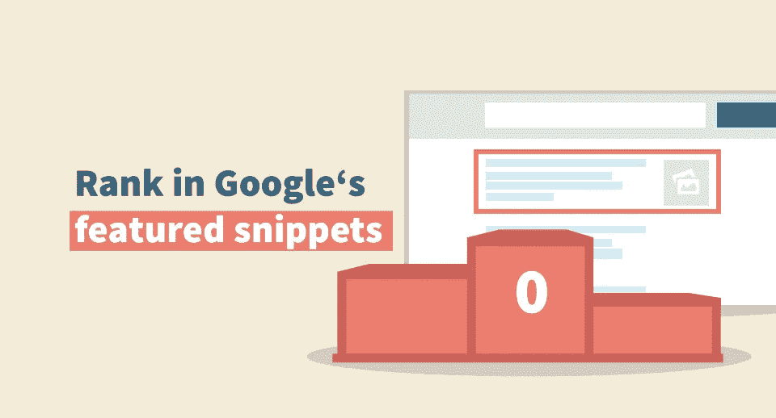
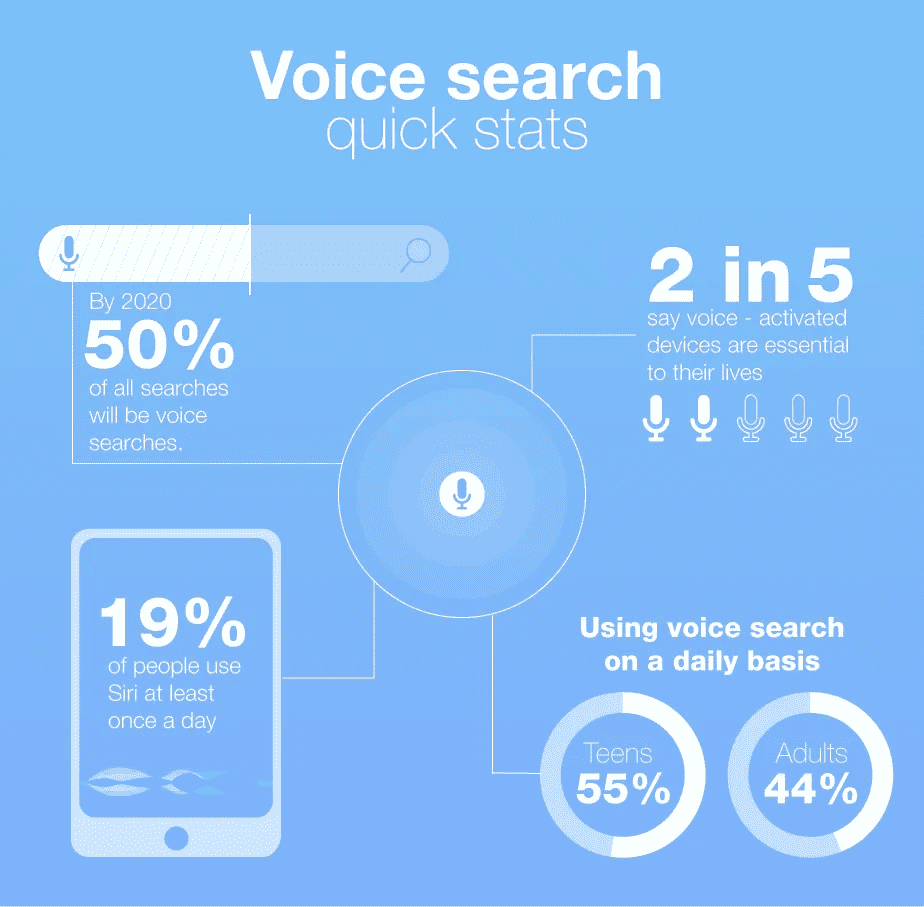
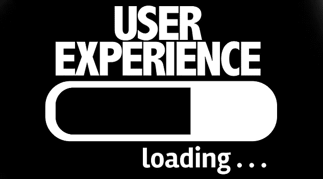

# 2019 年你的网站五大新 SEO 趋势

> 原文：<https://medium.com/hackernoon/top-5-new-seo-trends-for-your-website-in-2019-da84c3ac3a45>

SEO Trends 2019

G oogle 已经在移动响应和[网站速度](https://www.hackerminded.com/improve-site-speed-performance.html)相关方面做出了改变，以确保他们提供最佳的搜索结果。现在，让我们马上进入这些变化的本质。

# **移动优先索引**

从去年的移动搜索趋势出发，谷歌仍然在努力寻找你的网站的移动版本，以达到排名和索引的目的。这与你的网站上是否有手机版无关。如果没有，谷歌仍然会用桌面版来给你的页面排名。但是，使用移动设备的用户将无法导航和阅读您的页面。不会向他们显示此页面。在这种情况下，你需要更新你的网站，以便移动浏览。这样，谷歌将能够使用[响应式网站设计](https://dev.to/sandeepsinghmehta/5-ways-to-have-a-more-appealing-website-design-2a5h)，用相同的代码为所有设备提供服务。

Mobile First Index

# **特色片段排名**

今天，特色片段出现在页面顶部，其中显示了排名内容。现在，你如何在特色片段中排列你的内容？在你有这个想法之前，你需要在它自己的页面上给它排名。根据研究，特色片段来自高排名的内容。所有这些都是因为写出了高质量和吸引人的内容，并且选择了正确的关键词。对于有疑问的关键词，确保你包括段落特色片段。保持你的特色片段简短，在提供权威答案时使用简洁的段落。你可以雇佣[负担得起的搜索引擎优化服务](https://www.sandeepmehta.co.in/affordable-seo-services-india/)来对你的网站进行排名，并为你的网站带来 80%的流量。

Google Featured Snippets

# **创建高质量的内容**

高质量的内容非常重要。谷歌做了一个推广，以确认低企业，权威和可信度的网站。根据调查结果，包括卫生和医疗场所在内的 300 多个场所受到影响。他证实了这些网站上直接影响人们生活的低质量内容。谷歌现在承诺提供高质量的服务。如果没有，你最终会被排到第 3、4、5 页…

Create High-Quality Content

# **语音搜索优化**

如今，语音搜索越来越受欢迎，很多人都可以轻松使用。根据语音使用调查，今天有大量的人在使用他们的移动设备的同时使用语音搜索和语音命令技术。谷歌的研究显示，分别有大约 55%和 41%的成年人每天使用语音搜索。如果您不喜欢[语音搜索，请针对语音搜索快速优化](https://hashnode.com/post/how-to-optimize-your-mobile-website-for-voice-search-in-2019-cjttr5cw20008cis1i1g4m64z)您的内容。你可以优化本地搜索，常见问题，并创建移动友好的网页。

# **提高你的 UX**

RankBrain 是 2019 年的一大趋势。基于用户的搜索意图，谷歌将使用机器学习在网络上搜索其用户。 [RankBrain](https://searchengineland.com/library/google/google-rankbrain) 是一种高级搜索信号，能够解释复杂的多词查询并进行翻译。它能够收集大量信息，并在不相关的复杂搜索中发现模式。

User Experience

遵循以上策略，让你不断前进，不断更新。这些策略都是 2019 年的趋势，你应该在 SEO 服务提供商的帮助下照顾这些点。