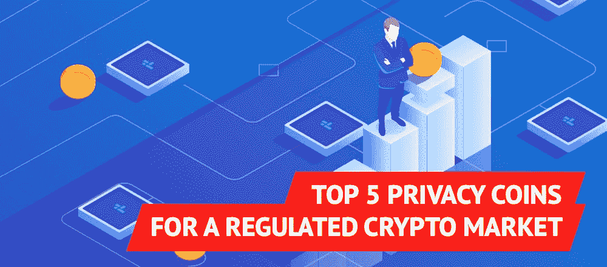
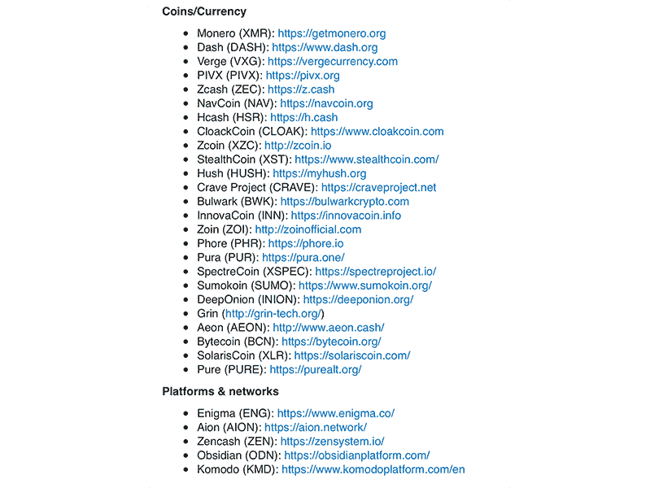
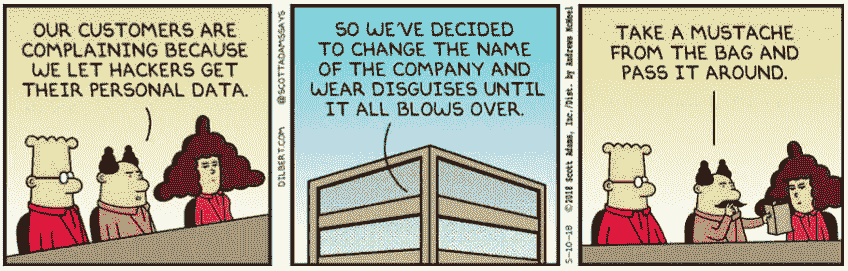

# 受监管的加密市场的五大隐私硬币

> 原文：<https://medium.com/hackernoon/top-5-privacy-coins-for-a-regulated-crypto-market-b126062f0293>

来自政府、地方央行和专门执法机构的监管压力正在推动加密货币采用注重隐私的功能。这正是 TeleCoin 发现自己如何建立起引领潮流的平台的原因，也是 Litecoin 的创始人查理·李和 T2 宣布秘密交易 lite coin 的原因。

鉴于最近所有的法律行动，加密交易所被[关闭](https://www.newsbtc.com/2019/01/28/crypto-exchanges-begin-to-shutdown-bear-market-in-full-force/)，比特币基地[强迫](https://cointelegraph.com/news/coinbase-former-provider-sold-user-data-to-third-parties-prompting-neutrino-acquisition)提供用户记录，印度[完全禁止](https://www.ccn.com/breaking-india-is-considering-a-ban-on-the-use-of-cryptocurrencies)加密货币的使用，硬币所有者现在过得并不愉快。几年前，成为早期采用者意味着成为极客俱乐部的一员，而这个俱乐部带来了可观的利润。但在 2018 年之后，尽管市场仍处于早期阶段，但成为早期采用者既不酷也不再有利可图。这可能会带来很多法律障碍。

这就是采用高度加密技术和[混合技术](https://www.worldcryptoindex.com/what-is-a-coin-mixer/)的私人硬币发挥作用的地方，帮助加密货币用户进行匿名交易。市场需求鼓励许多团队利用他们的知识制作一个独特的令牌，具有注重隐私的功能，给我们留下了一长串可供选择的选项。

[https://twitter.com/LegendOfCrypto/status/946077698262052864](https://twitter.com/LegendOfCrypto/status/946077698262052864)

有这么多选择，做出选择似乎很难。无论使用 XMR 这样的环签名，TELE 这样的 masternode 功能，还是 ZEC 这样的屏蔽地址，它们都有一个目的:确保加密货币的生存和成功。下面，我精心挑选了一些最先进的项目，暂时可以帮助你。

1)[TELE in—TELE](https://www.telecoin.info/)

TeleCoin 的 TELE 是一个社区项目，目标是建立一个匿名的点对点网络。它构建在 Dash 和 PivX 项目的基础上，本文稍后将对此进行介绍。TeleCoin 的特别之处在于它能够在一个网络中实现所有其他项目的功能。

在引擎盖下，TELE network 基于股权证明、私人交易、masternode 功能和分散的区块链投票系统。除了网络本身，TELE 还通过开发趋势引领者平台(一个针对企业和个人的附属网络奖励平台)将其用例扩展到微交易。虽然大多数隐私币用户都在抱怨不能真正消费他们的代币，但手机用户可以马上从这种能力中受益。当您可以创建自己的架构时，为什么要等待采用呢？这正是 TeleCoin 所做的。

2) [Monero — XMR](https://www.getmonero.org/)

也许是现存的最受欢迎的私人硬币，Monero 的交易来源和目的地是无法追查的。其背后的技术被称为 CryptoNight Proof-of-Work 协议，该协议使用环签名来混淆交易的分类账，该分类账在默认情况下对区块链是公开的。这也意味着不可能知道特定节点持有的 XMR 硬币总数。

WannaCry 黑客选择将他们藏匿的勒索软件转换成 Monero，以逃避当局的审查。Monero 是最受欢迎的加密货币，用于暗网上最大的市场 AlphaBay 的交易。事实上，即使在当局关闭之后，他们也无法估计交易金额。不管它在网络毒贩和黑客中的受欢迎程度，这些都是相当令人印象深刻的成就。然而，最近一项由一组研究人员完成的[研究](https://www.wired.com/story/monero-privacy/)显示，提取单个交易是可能的。没有你想象的那么私密。

[https://weandthecolor.com/designer-illustrator-craig-frazier/37964](https://weandthecolor.com/designer-illustrator-craig-frazier/37964)

3)[Zcash——ZEC](https://z.cash/)

当谈到隐私硬币时，人们认为大多数人都在使用它们进行非法活动。正如 Zcash 的营销总监 Josh Swihart 所言，[声明](https://cryptobriefing.com/privacy-coins-under-threat-regulation/)，“私有和合法不是反义词”。这就是为什么 Zcash 有两种类型的交易选项:一种是发生在公共账本上的，另一种是保持个人地址屏蔽，允许匿名交易。

即使实际交易数据被加密，Zcash 在加密货币交易层面仍与监管机构保持[合规](https://z.cash/blog/zcash-company-response-to-secret-service-recommendation/)，在菲亚特和 ZEC 之间的交易点实施反洗钱/KYC 控制。他们不愿意帮助罪犯，他们为守法的公民提供保护，并保护他们免受坏人的伤害。

4) [破折号—破折号](https://www.dash.org/)

Dash 是最古老的隐私币之一，自 2014 年以来经历了两次更名。起初它被称为 Xcoin，然后是 Darkcoin，现在是 Dash。这种硬币是比特币的一个分支，它的隐私部分被完全视为一个附加功能。叫做 PrivateSend。它是可选的，并且能够在其混合机制中隐藏所选的事务数据。

它使得跟踪分类账和交易金额变得容易，而单个交易却不容易被跟踪。正如 Dash 首席执行官赖安·泰勒所言，“[隐私]对用户来说也是一个安全问题，可能会成为犯罪分子的目标，他们会通过跟踪用户的交易来了解用户的资产。”

5) [PivX — PIVX](https://pivx.org/)

PivX 公司向那些需要交易隐私的人更进了一步。正如 PIVX 课程 FusedHelios 的创始人西蒙·菲舍尔(Simon Fischer)解释的那样，“PIVX 试图创造公平的竞争环境，让隐私成为每个人的权利和政策——不仅仅是富人或腐败者。”他们的目标是一个 onchain 解决方案；基于 PIVX 网络的分散市场。

在这种情况下，它的运行网络没有中心点。没有人可以逮捕或起诉来扳倒它。只要有 PIVX 用户，网络就会保持活动状态。正如 PIVX 的社区领袖吉姆哈格蒂(Jim Haggerty)告诉其用户的那样，随着隐私硬币似乎成为监管机构的目标，它成为了他们的最高优先事项。

私人硬币引起了犯罪分子的注意，而加密货币是可以获得的，合法的，不受监管的。由于政府试图引入更严格的监管，市场受到了冲击，主流消费者发现了自己的好处。关于匿名功能的技术发展的加速已经满足了需求的增长。政府和监管者已经意识到了这一点，因为印度宣布私人硬币是他们的首要任务。鉴于像 TeleCoin 和 PIVX 这样的项目正在取得重大的技术进步来对抗当局，我们可以期待一个有更多以隐私为重点的选择的加密空间，以及随后的价格上涨！