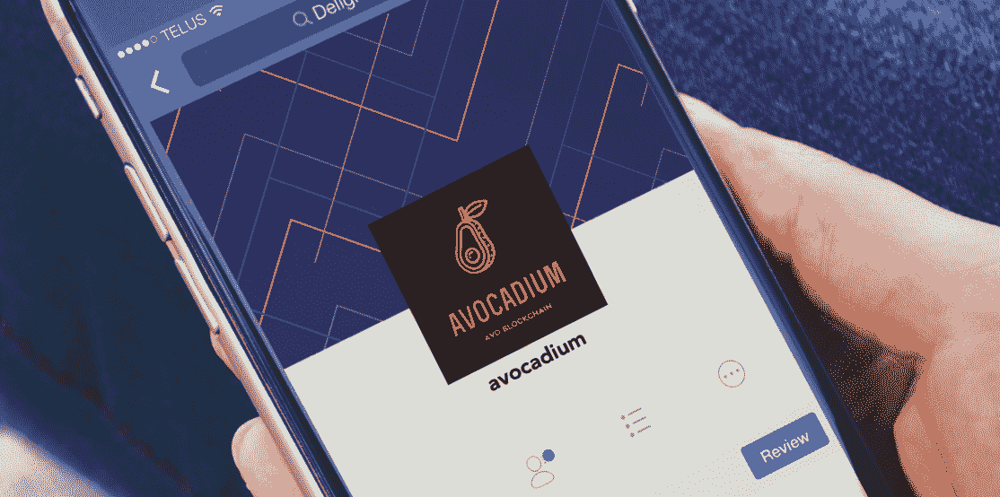
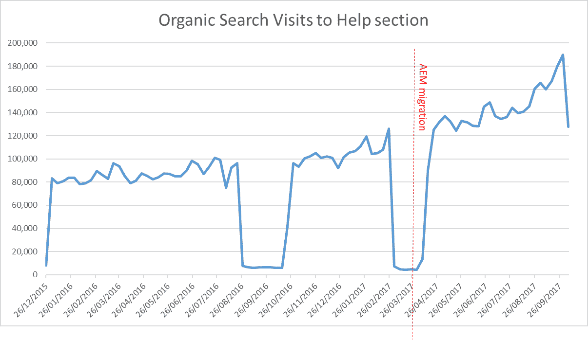
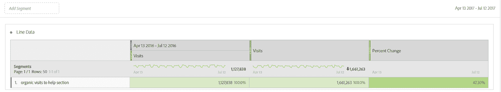
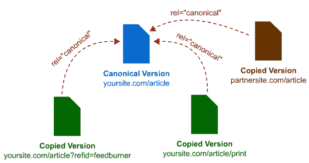

# 区块链和密码行业的 5 大 SEO 错误(和修复)

> 原文：<https://medium.com/hackernoon/top-5-seo-mistakes-and-fixes-in-the-blockchain-and-crypto-industry-254f197d2493>

我有一个个人的理论，区块链和加密领域的许多开发者非常不喜欢谷歌的集中的全能力量，以至于他们已经简单地放弃了让他们的网站在上面排名的任务。

虽然我尊重坚定的政治观点，但我想知道，如果所有承诺让去中心化奥德赛成为主流的有前途的初创公司都不出现在谷歌上，我们将如何推动区块链革命，并让我的母亲玛丽娜(Marina)能够在阿根廷一个迷失的小镇上支付她的以太食品杂货。或任何其他搜索引擎。

我在数字营销和 SEO 行业工作了将近 10 年。在优化了区块链和加密领域的几十个网站 6 个月后，我遇到了 5 个常见的加密 SEO 错误。他们在这里:

# 狂妄:我太特别了，不能用 CMS。

希腊悲剧中的傲慢代表对神的过度骄傲或蔑视，导致复仇女神。在现代，我们将体现傲慢的一代称为千禧一代，他们是实用的对立面。

大多数 Web3 开发者觉得他们的项目或服务太独特了，以至于不能在像 WordPress、Joomla 或 Drupal 这样的预打包 CMS 网站解决方案中展示。这些平台[被这个星球上超过 40%的网站](https://websitesetup.org/popular-cms/)使用，并被证明是模块化、可扩展、功能强大的，是中小型公司的有力选择。

在 Web3 倡导者的眼中，这些 CMS 平台是 Web 2.0 古老的基础技术，显然，区块链革命不能在 WordPress 上运行。所以他们试图重新发明网络，因为一个小小的项目。

现实检查:如果 TechCrunch 和《纽约客》使用 Wordpress，你这个勉强称得上 MVP 的人也可以。

到目前为止，我看到的大多数网站都是非常早期的项目。这些轻量级登录页面在最坏的情况下由一个长页面组成(参见下面的一页)，在最好的情况下由三到五个 HTML 页面组成。

寥寥几行文字，瘦瘦的斯堪的纳维亚风格的剪影图标，从 YouTube 嵌入的动画视频，以及他们时事通讯的注册表格。

这些是普通的 Dapp-in-making 网站的基本组成部分，该网站可能有一个希腊名字，如 Avocadium，旨在通过向全球每一个饥饿的儿童提供 avo 吐司，修复破碎的经济体系，促进金融包容性。

老实说，我不认为你需要为 Avocadium.io 重新发明网络，你也不会这么做。最有可能的结果是一个定制的 HTML 网站，它需要前端设计师的帮助来进行任何艰苦和无关紧要的更改，如纠正打字错误、更改元数据或创建新页面，因为核心价值主张在同一周内第二次发生了变化。

这些变更将会搁置在您的前端设计师的季度待办事项中。或者你可以使用 CMS..除非你用 CMS。

CMS 的缺失对 SEO 有什么影响？傲慢揭开了搜索引擎优化启示录的下三个项目。

# 2.一页纸

Avocadium.io 还没有 MVP，正在寻找投资人。该计划是建立一个最简单的可能没有 CMS 的网站(因为 WordPress 和 Joomla 是*所以* Web2.0)，包含以下项目:

*   它提供两种产品:面向大众的鳄梨区块链(p2p)和鳄梨企业。
*   社会影响的一页展示了 Avocadium.io 如何帮助解决非洲的饥饿问题。
*   团队:一位来自鳄梨行业的资深人士，他决定退出贪婪的奖金驱动的大公司，以使世界变得正确(我们实际上仍然不知道他的真实动机)，三位 18 岁的开发人员，都是白人男性，其中一位是象征性的女性设计师，另外还有一位象征性的商业开发亚洲人。
*   文档/白皮书。
*   联系方式。

搜索引擎优化友好的方式来处理这个项目是创建一个主页，描述了主要的价值主张与链接到一个新的网页，每个主题解决。为什么？因为每个页面都针对一组特定的关键字进行了优化。

例如，在这种情况下:

*   主页目标关键词“鳄梨区块链解决方案”
*   定位于“区块链企业牛油果”的企业价值主张页面
*   开发者文档页面的目标是“如何在 avocado um 上构建”和“avocado um 开发”

取而代之的是，通常有一个不足 400 字的短小精悍的单页纸，把所有部分的信息都塞了进去。这样的话，你只能指望只对一个关键词进行排名，当然也不能推动 Web3 的去中心化革命。谷歌，你妈妈版本的互联网，不喜欢它。

黄金法则是每页一个关键词，每个主题一页。

如果你提供 3 种产品或服务，那么每一种都有一个专门的页面。除非你只是想为一个关键词排名。例如，如果你唯一的关键词是“区块链鳄梨”，我不推荐使用单页的。

到目前为止，我从未见过任何一家区块链初创公司只需要一页纸。下一点会有更多的例子。

面向未来:越早越好，你的单页纸需要从 1 页扩展到 5 页、10 页、25 页、100 页。如果没有 CMS 或适当的前端开发团队，这根本无法以可持续的方式实现。

第一个选项是最实用和最具成本效益的，直到 Avocadium 代币达到 300 美元的价值，这可能永远不会发生。

# 3.标题中没有关键词，只有品牌。

狂妄自大(或 SEO 无能)的另一个证据。除非你是可口可乐，否则你必须告诉谷歌和你的观众你做什么，你卖什么，你必须用你的目标观众正在使用的关键词来做到这一点。鳄梨还不是可口可乐，悲伤的长号。

关键词是网络的基础。人们用关键词向谷歌描述问题。如何找到你的关键词？从描述你的产品/服务价值主张开始，例如，如果不使用你的品牌名称，人们将如何在谷歌上搜索你？

在我们的例子中，对于 avocado 来说，关键字可能是“区块链鳄梨”

现在用这些免费工具查一下有没有需求吧:[关键词无处不在](https://keywordseverywhere.com/)，K [eyword 工具](https://keywordtool.io/)， [Google 关键词规划师](https://ads.google.com/intl/en_uk/home/tools/keyword-planner/)， [Ubersuggest](https://neilpatel.com/ubersuggest/) 。

> 我在总部位于以太坊的公司 ConsenSys 工作，最能描述我们的关键词是“区块链技术解决方案”和“以太坊解决方案”。所以我们首页的标题是:“区块链技术解决方案|以太坊解决方案| ConsenSys。”

我们的每个页面都以代表我们产品的独特关键词为目标，例如:

“区块链风险投资和代币销售咨询”、“区块链社会影响”、“智能合同审计”、“企业区块链解决方案”等。

# 4.子域

Avocadium.io 只有一个很长的页面，由于没有 CMS，该团队缺乏轻松创建新页面的能力。因此，该网站不断扩展的功能现在将位于一个子域上。这意味着开发者文档、API、博客和任何需要放在主页之外的东西，现在都将放在一个子域上。

很多热门服务如 Github，HubSpot，(原 Medium)等。，提供付费订阅以在他们的平台上定制 URL。如果购买的话，位于“medium.com/Avocadium”上的 avocadium 博客现在可以成为“Avocadium.io”网站的一部分，如下所示:

" blog.avocadium.io "

然而，这种方法对于 SEO 来说是有问题的。每创建一个子域，你就分割了原域的 SEO 权益。为什么这样因为 Google 把每个子域都当成一个新的网站，所以你辛辛苦苦用汗水和泪水获得的反向链接果汁不会传到新的子域里。

股权稀释，梦想破灭。

在谷歌看来，“avocadium.io”和“dev.avocadium.io”是两个不同的网站。

另一方面，如果你有“avocadium.io/blog”(而不是“blog.avocadium.io”)，你就把每个页面整合到一个域中。这对 SEO 有好处。

糟糕的 SEO，浪费时间，分割你网站的 SEO 股权看起来是这样的:

[https://api.avocadium.io](https://api.avocadium.io)

[https://docs . avocadium . io](https://docs.avocadium.io)

[https://blog . avocadium . io](https://blog.avocadium.io)

好的搜索引擎优化、时间的合理利用、搜索引擎优化权益的巩固以及永远的幸福看起来就像这样:

[https://avocadium.io/api](https://avocadium.io/api)

[https://avocadium.io/docs](https://avocadium.io/docs)

[https://avocadium.io/blog](https://avocadium.io/blog)

带有插件和扩展的模块化 CMS 使得扩展 Avocadium.io 的功能变得非常容易。

现在请注意，谷歌已经声明他们本能地对待子文件夹和子域，然而，许多 SEO 专家不同意([并在 Twitter 上为这个](https://www.seroundtable.com/seo-google-fight-subdomains-subdirectories-25126.html)争论)。以我个人的经验，在英国第二大银行的前一份工作中，通过将子域转移到子文件夹，流量增加了 47%。(没错，我就是从银行转行做加密的人之一)。它所需要的只是改变:

help.banksname.co.uk

到

banksname.co.uk/help

车流开始滚滚而来。

除了 SEO 的缺点，跨子域跟踪意味着在各种健康测量和分析平台上的重复工作，如:Google Analytics、Semrush、Google Search Console 等。

# 5.作为博客平台的媒体。

这是非 cms 修补实验中的佼佼者。

Web3 开发者鄙视脸书和谷歌这样的中央集权的大型科技巨头，因为他们滥用人们的数据和隐私来把钱装进自己的口袋。媒体对你的内容也是如此。这可能不是他们的初衷，我们都是出于好意，就像 2007 年的脸书，他的目的是联系朋友和家人。但这个最初为作家提供的实用、开放、友好和无障碍的平台，现在已经变成了内容的脸书。

你的开发团队在 Medium 上发布的所有耗时的文章都属于 Medium，就像它是一个脸书页面一样(除非你有一个自定义域，这是 Medium 在 2017 年推出的一个功能)。如果你的内容属于中等，所有你可以从反向链接和提及中获得的 SEO 权益也是如此。

[Hackernoon 已经标记这些问题](https://www.youtube.com/watch?v=Hy4Lduu9CKg&feature=youtu.be)有一段时间了，并且已经决定转移到另一个平台。

避免媒体陷阱的唯一方法是[使用“导入故事”功能](https://help.medium.com/hc/en-us/articles/214550207-Import-a-post)，它从文章中添加一个规范标签到你的网站。**注:该功能已被** [**在 Twitter 上报道为目前无法使用**](https://twitter.com/search?f=tweets&vertical=default&q=medium%20import%20story&src=typd) **。**

canonical 标签告诉 Google 你的内容的几个版本中的哪一个是他们应该排序的，并且把所有的 SEO 资产发送给它。要用 Medium 玩游戏，发表文章“鳄梨将如何改变世界饥饿地图。”先放在你的网站上。“那就把故事导入媒介。这样，媒体上的规范标签将指向你的网站。所有的反向链接都是你的。

例如，原始 URL:

avocado . io/blog/how-will-avocado-change-the-map of-world-hunger

中等 URL:

medium . com/avocadium/how-will-avocadium-change-the-map of world-hunger

指向原始 URL 的规范:

avocado . io/blog/how-will-avocado-change-the-map of-world-hunger

使用规范标签法，Medium 不会因为你的内容而获得好评，你的网站会因为你的辛勤工作而获得 SEO 汁液，而你会得到 Medium 的掌声，这是区块链生态系统中的一种认可形式。

你可以在我借用这张图片的地方阅读这些精彩的 Moz 的文章。

Medium 提供的其他无法解释的 SEO 限制包括:

*   标题标签和 H1 是相同的(文章的名称)他们不能被定制。
*   标题标签发布后不能更改。
*   不能写自定义的元描述，总是文章的前两行。
*   URL 附加难看的字母数字代码作为默认后缀。
*   除了搞砸你的 SEO，每当你在手机上打开一篇 Medium 文章时被要求下载该应用程序，或者只是在没有登录 Medium 的情况下根本无法阅读桌面上的任何内容，这有多烦人？跨平台影响 UX，糟糕的体验会导致排名下降。

这里的教训是:不要使用介质。换个博客吧，它将永远属于你。显然，要做到这一点，你需要一个网站，允许你有一个以上的网页，你可以有博客功能。没有 CMS 的话，祝你好运。

制作完美的网站不仅仅是简单地理解和擅长区块链的行业工作。有许多上面概述的技术因素可以使你的有机搜索成功或失败。当你考虑制作一个网站时，考虑所有这些简单的 SEO 技巧。统治区块链世界，解决非洲的饥饿问题，还有我妈妈在联邦理工学院支付食品杂货都依赖于此。